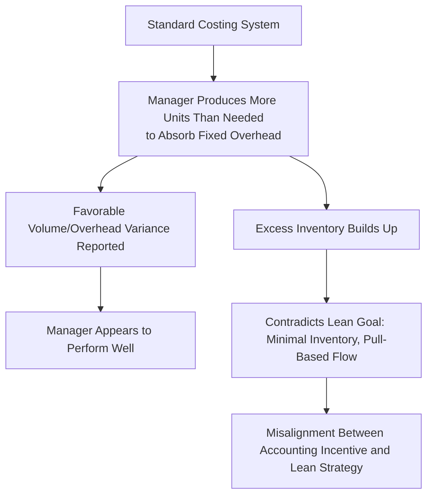
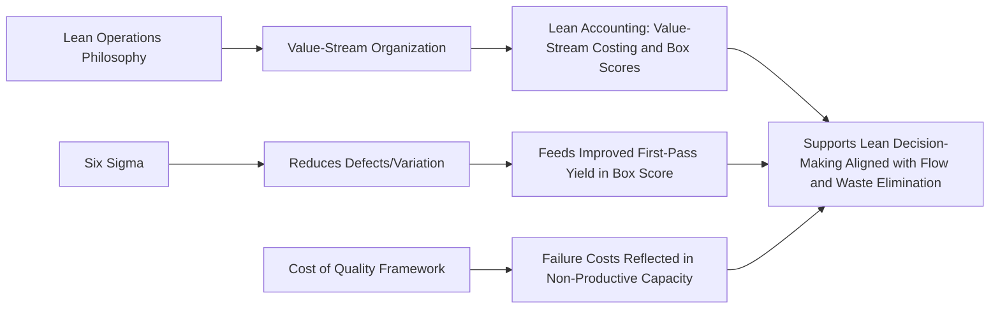

## Lean Accounting Principles

### Definition and Purpose

Lean accounting is an alternative approach to managerial accounting designed to support and measure organizations that have implemented Lean manufacturing/operations principles — an operating philosophy centered on eliminating waste (muda), maximizing customer value, and organizing production around continuous flow. Traditional standard costing and variance analysis were designed for mass-production, batch-oriented environments and can generate metrics (e.g., favorable labor efficiency variances from overproduction) that actively conflict with Lean objectives. Lean accounting replaces or supplements these traditional tools with methods aligned to value-stream thinking, simplified transaction recording, and visual, easily understood performance measures.

**Key Points**

- Lean accounting exists because traditional cost accounting can generate perverse incentives in a Lean environment — for example, rewarding managers for building inventory to absorb fixed overhead, which directly contradicts Lean's goal of minimizing inventory.
- The core unit of analysis shifts from individual products/departments to the **value stream** — the end-to-end set of activities required to deliver a product or service family to the customer.
- Lean accounting emphasizes simplicity, visual management, and decision-relevant information over precise but complex traditional cost allocations.

### The Seven (or Eight) Wastes (Muda) Targeted by Lean

| Waste Category | Description | Accounting Relevance |
| --- | --- | --- |
| Overproduction | Producing more than immediately needed | Traditional costing can reward this via favorable overhead absorption |
| Waiting | Idle time between process steps | Captured in cycle time / Manufacturing Cycle Efficiency (MCE) measures |
| Transportation | Unnecessary movement of materials | Adds non-value-added time without adding customer value |
| Overprocessing | Doing more work than the customer requires or values | Reflected in excess labor/overhead cost per unit |
| Inventory | Excess raw materials, WIP, or finished goods | Traditional costing can favor inventory buildup; Lean accounting discourages it |
| Motion | Unnecessary movement by workers | Affects labor cost and cycle time |
| Defects | Errors requiring rework or scrap | Directly linked to Internal/External Failure costs (Cost of Quality) |
| Underutilized talent (8th waste, modern addition) | Failure to use employee skills/ideas | Related to Learning and Growth measures in the Balanced Scorecard |

### Why Traditional Standard Costing Conflicts with Lean

This dynamic — sometimes summarized as "the paradox of standard costing under Lean" — is a central motivation for adopting Lean accounting: traditional variance analysis (see Variance Analysis in prior chapters) can reward exactly the overproduction behavior that Lean seeks to eliminate.

### Core Principles of Lean Accounting

#### 1. Value-Stream Costing (Replaces Product/Job Costing)

Costs are accumulated at the **value-stream** level rather than allocated to individual products using traditional overhead allocation bases (direct labor hours, machine hours). A value stream typically includes all the people, equipment, and processes needed to take a product family from order to delivery.

$$\text{Value-Stream Cost per Unit} = \frac{\text{Total Value-Stream Costs for the Period}}{\text{Units Shipped in the Period}}$$

Most costs within a value stream — including labor and many overhead items — are treated as **directly traceable** to that value stream rather than allocated using arbitrary bases, sharply reducing the complexity (and arbitrariness) of overhead allocation compared to traditional absorption costing.

#### 2. Elimination of Complex Transaction Tracking

Lean accounting minimizes detailed labor time-tracking, work-order tracking, and standard cost variance reporting for routine, repetitive Lean processes, since these transactions add cost (Appraisal/administrative-type cost) without adding customer value — consistent with waste-elimination philosophy applied to the accounting function itself.

#### 3. Decision-Making Based on Value-Stream Profitability

Instead of unit product-level gross margin, Lean accounting emphasizes value-stream-level profit and loss statements, reported frequently (often weekly) and in a format understandable to non-accountants on the shop floor.

**Example — Simplified Value-Stream Income Statement**

| Line Item | Amount |
| --- | --- |
| Sales Revenue | $850,000 |
| Materials Cost | $310,000 |
| Value-Stream Labor (all employees in the stream) | $220,000 |
| Machine/Equipment Costs | $60,000 |
| Other Value-Stream Overhead (directly traceable) | $45,000 |
| **Value-Stream Profit** | **$215,000** |
| Value-Stream Return on Sales | 25.3% |

$$\text{Value-Stream Return on Sales} = \frac{\$215{,}000}{\$850{,}000} \times 100 = 25.3\%$$

Note: no attempt is made to further allocate this profit down to individual product SKUs within the value stream — a deliberate simplification, since Lean accounting treats such allocation as adding complexity without decision value when the value stream operates as a single flow.

#### 4. Visual, Non-Financial Performance Measurement (Box Scores)

Lean accounting commonly uses a **Box Score** — a single-page report combining operational, capacity, and financial measures for a value stream — updated frequently and displayed visually (often on the shop floor itself).

| Measure Type | Example Metrics |
| --- | --- |
| Operational | On-time delivery %, first-pass yield, dock-to-dock time (cycle time from raw material receipt to shipment) |
| Capacity | % productive capacity, % non-productive (waste) capacity, % available capacity |
| Financial | Value-stream revenue, value-stream cost, value-stream profit, ROS |

#### 5. Inventory Valuation Simplification

Because Lean environments maintain minimal inventory (pull-based, just-in-time production), Lean accounting often uses simplified inventory valuation approaches rather than complex standard costing with detailed variance layers, since the dollar magnitude of inventory — and therefore the materiality of precise valuation — is much smaller than in traditional batch-and-queue environments.

#### 6. Decision-Making Uses Relevant, Incremental Costs

Consistent with the broader managerial accounting principle of relevant costing, Lean accounting emphasizes the actual, traceable incremental cost impact of decisions (e.g., capacity-related trade-offs) rather than fully allocated unit costs, which can be misleading for short-term decisions such as accepting a special order.

### Capacity Measurement in Lean Accounting

A distinguishing Lean accounting practice is decomposing total available capacity into three categories on the Box Score:

$$\text{Total Capacity} = \text{Productive Capacity} + \text{Non-Productive Capacity} + \text{Available Capacity}$$

- **Productive Capacity**: Time/resources actually adding value the customer pays for.
- **Non-Productive Capacity**: Time/resources consumed by waste (rework, waiting, excess motion, etc.).
- **Available Capacity**: Unused capacity that could absorb additional sales volume without further investment.

**Example**

A value stream has 10,000 available labor hours per month.

| Category | Hours | % of Total |
| --- | --- | --- |
| Productive | 6,500 | 65% |
| Non-Productive (waste) | 2,000 | 20% |
| Available (unused) | 1,500 | 15% |

This decomposition directly informs management: the 1,500 available hours (15%) represent capacity that could absorb new sales at no incremental fixed cost, while the 2,000 non-productive hours (20%) represent a Lean/waste-reduction opportunity — distinct types of managerial action, made visible by the capacity measure itself.

### Comparing Traditional Costing and Lean Accounting

| Dimension | Traditional Standard Costing | Lean Accounting |
| --- | --- | --- |
| Cost object | Individual product/job | Value stream |
| Overhead allocation | Allocated via predetermined rates and cost drivers | Mostly directly traced; minimal allocation |
| Reporting frequency | Monthly | Often weekly, sometimes daily |
| Inventory valuation | Detailed standard costing with variances | Simplified, since inventory levels are minimal |
| Transaction tracking | Detailed labor/job time tracking | Minimized; tracking itself viewed as non-value-added waste |
| Performance measures | Financial variances (materials, labor, overhead) | Combined financial + nonfinancial Box Score |
| Incentive risk | May reward overproduction/inventory buildup | Designed to align with flow and waste elimination |

### Limitations and Cautions

- **Transition complexity**: [Inference] Organizations transitioning from traditional standard costing to Lean accounting often face a difficult period where both systems must run in parallel — for external financial reporting (which still generally requires GAAP-compliant inventory valuation) and for internal Lean decision-making — increasing near-term administrative cost before the simplification benefits are realized.
- **GAAP/external reporting reconciliation**: Value-stream costing and simplified inventory valuation are internal management tools; external financial statements still generally require inventory to be valued under applicable financial reporting standards, so a reconciliation process between Lean accounting figures and externally reported figures is typically necessary.
- **Applicability**: Lean accounting principles are most directly applicable to environments that have genuinely restructured operations around value streams and pull-based flow; applying Lean accounting metrics to an organization that has not implemented the underlying Lean operational changes may reduce its practical relevance.
- **Loss of product-level cost detail**: Because costs are not allocated to individual SKUs, Lean accounting can make it harder to answer certain traditional questions (e.g., "what is the cost of this specific product variant?") — a trade-off Lean accounting proponents consider acceptable given the reduced decision value of that level of precision in a flow environment, but a genuine limitation for organizations that need SKU-level cost detail for pricing or profitability analysis.

### Lean Accounting's Relationship to Other Frameworks

**Related Topics**

- Manufacturing Cycle Efficiency and cycle-time measurement
- Categories of Quality Costs and Cost of Quality Trade-offs
- Six Sigma Fundamentals for Cost Management
- Just-in-Time (JIT) production systems
- Activity-Based Costing (ABC) as a contrasting overhead allocation method
- Relevant costing for short-term decision-making
- Standard costing and variance analysis (traditional comparison basis)