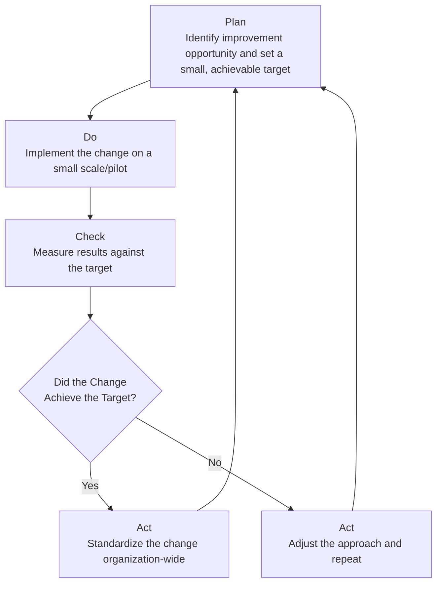
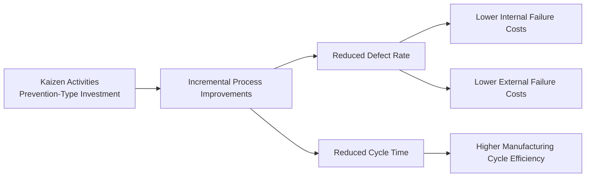

## Continuous Improvement and Kaizen Practices

### Definition and Purpose

Continuous improvement refers to an ongoing, incremental effort to enhance products, processes, and services rather than pursuing large, infrequent overhauls. **Kaizen** (Japanese for "change for the better," commonly translated as "continuous improvement") is the specific management philosophy and set of practices — originating from Japanese manufacturing, particularly the Toyota Production System — that institutionalizes this incremental improvement as an ongoing organizational discipline involving every employee, not just management or specialists. From a managerial accounting perspective, Kaizen has a direct costing counterpart: **Kaizen costing**, a technique for setting and tracking continuous, incremental cost-reduction targets during a product's ongoing production phase.

**Key Points**

- Kaizen is fundamentally different from one-time process reengineering: it assumes small, frequent, employee-driven improvements compound into large gains over time, rather than relying on occasional dramatic redesigns.
- Kaizen costing complements (and follows) target costing: target costing sets the cost objective *before* production begins (at the design stage), while Kaizen costing drives further cost reduction *during* the ongoing production/manufacturing phase.
- Continuous improvement links directly to the Cost of Quality framework, since Kaizen activities are themselves a form of Prevention-category investment aimed at reducing Internal and External Failure costs over time.

### Kaizen Costing vs. Target Costing vs. Standard Costing

| Technique | Timing | Cost Objective | Primary Use |
| --- | --- | --- | --- |
| **Target Costing** | Pre-production (design phase) | Set an initial allowable cost based on market price minus desired margin | New product design |
| **Kaizen Costing** | During ongoing production | Continuously reduce actual costs below the prior period's achieved cost | Existing products in production |
| **Standard Costing** | During production, but static within the period | Maintain a fixed benchmark cost for variance analysis | Control and performance evaluation against a fixed standard |

**Key Points**

- A critical distinction: standard costing asks "did we meet the standard?" (a static benchmark), whereas Kaizen costing asks "how much lower can we drive cost this period compared to last period?" (a continuously moving, always-decreasing target).
- [Inference] Because Kaizen costing targets are typically set as a percentage reduction from the prior period's actual cost rather than from an engineered ideal, they are generally considered easier for operational teams to understand and act on directly, though the specific reduction percentage chosen still requires managerial judgment about feasibility.

### The Kaizen Costing Formula

$$\text{Kaizen Cost Reduction Target} = \text{Prior Period Actual Cost} \times \text{Kaizen Reduction Rate}$$

$$\text{Target Cost for Current Period} = \text{Prior Period Actual Cost} - \text{Kaizen Cost Reduction Target}$$

**Example**

A product's actual manufacturing cost per unit last period was $50. Management sets a Kaizen reduction rate of 3% for the upcoming period.

$$\text{Kaizen Cost Reduction Target} = \$50 \times 3\% = \$1.50$$

$$\text{New Target Cost} = \$50 - \$1.50 = \$48.50$$

If actual cost for the current period comes in at $48.20, the **Kaizen variance** is:

$$\text{Kaizen Variance} = \text{Target Cost} - \text{Actual Cost} = \$48.50 - \$48.20 = \$0.30 \text{ favorable per unit}$$

This $0.30 favorable variance becomes the new baseline: next period's target is calculated by applying the Kaizen reduction rate to $48.20 (this period's actual), not to the original $50, reflecting the continuously ratcheting nature of Kaizen targets.

### The PDCA Cycle (Plan-Do-Check-Act)

Kaizen activities are commonly structured using the PDCA cycle, a foundational continuous-improvement framework.

**Key Points**

- The cycle repeats continuously — once one improvement is standardized (Act), the team returns to Plan for the next incremental opportunity, creating a self-sustaining loop rather than a one-time project.
- PDCA operates at a smaller, more frequent scale than DMAIC (used in Six Sigma), consistent with Kaizen's philosophy of small, continuous steps rather than large, statistically rigorous projects.

### Kaizen Events (Rapid Improvement Workshops)

While Kaizen is philosophically about continuous, everyday improvement, organizations also run structured **Kaizen events** (also called "Kaizen blitzes") — short, intensive, cross-functional workshops (typically 3–5 days) focused on rapidly improving a specific process.

| Kaizen Event Element | Description |
| --- | --- |
| Scope definition | A specific, narrowly defined process or work area (e.g., one production cell) |
| Cross-functional team | Includes frontline workers, supervisors, and sometimes suppliers/customers |
| Current-state mapping | Documenting the existing process, often using value-stream mapping |
| Root-cause identification | Using tools such as fishbone diagrams and the "5 Whys" |
| Rapid implementation | Physical/process changes implemented during the event itself, not deferred |
| Follow-up measurement | Tracking whether gains are sustained in subsequent weeks |

### Cost Management Applications of Kaizen

#### 1. Linking Kaizen to the Cost of Quality Framework

Kaizen activities generally function as Prevention-category spending, with the expectation of measurable payback through Internal and External Failure cost reduction (see Cost of Quality Trade-offs).

#### 2. Kaizen and Lean Accounting Box Scores

Kaizen improvements are commonly tracked directly in the operational section of a Lean accounting Box Score (see Lean Accounting Principles), since metrics such as first-pass yield, on-time delivery, and dock-to-dock time are the natural indicators of whether Kaizen activity is producing results.

#### 3. Employee Suggestion Systems

A hallmark of Kaizen culture is formalized employee suggestion programs, where frontline workers — considered the people closest to and most knowledgeable about the process — submit and often personally implement small improvement ideas. Common associated metrics include:

- Number of suggestions submitted per employee per period
- Percentage of suggestions implemented
- Estimated dollar savings per implemented suggestion

**Example**

A plant tracks 240 employee suggestions submitted in a quarter, of which 96 were implemented, generating estimated annual savings of $185,000.

$$\text{Suggestion Implementation Rate} = \frac{96}{240} \times 100 = 40\%$$

$$\text{Average Savings per Implemented Suggestion} = \frac{\$185{,}000}{96} \approx \$1{,}927$$

These figures can be tracked as Learning and Growth perspective measures within a Balanced Scorecard, directly linking employee-driven Kaizen activity to the broader strategic performance measurement system.

### Kaizen Costing Illustration Over Multiple Periods (svg_diagram)

<svg xmlns="http://www.w3.org/2000/svg" viewBox="0 0 680 280">
<text x="340" y="25" text-anchor="middle" font-size="16" font-weight="bold" fill="#1a1a1a">Kaizen Costing: Declining Target Cost (svg_diagram)</text>
<line x1="70" y1="230" x2="620" y2="230" stroke="#374151" stroke-width="1.5" />
<line x1="70" y1="50" x2="70" y2="230" stroke="#374151" stroke-width="1.5" />
<text x="345" y="260" text-anchor="middle" font-size="12" fill="#374151">Period</text>
<circle cx="130" cy="80" r="4" fill="#2563eb" />
<text x="130" y="65" text-anchor="middle" font-size="10" fill="#1e3a8a">\$50.00</text>
<text x="130" y="245" text-anchor="middle" font-size="10" fill="#374151">P0</text>
<circle cx="240" cy="105" r="4" fill="#2563eb" />
<text x="240" y="90" text-anchor="middle" font-size="10" fill="#1e3a8a">\$48.20</text>
<text x="240" y="245" text-anchor="middle" font-size="10" fill="#374151">P1</text>
<circle cx="350" cy="128" r="4" fill="#2563eb" />
<text x="350" y="113" text-anchor="middle" font-size="10" fill="#1e3a8a">\$46.75</text>
<text x="350" y="245" text-anchor="middle" font-size="10" fill="#374151">P2</text>
<circle cx="460" cy="148" r="4" fill="#2563eb" />
<text x="460" y="133" text-anchor="middle" font-size="10" fill="#1e3a8a">\$45.35</text>
<text x="460" y="245" text-anchor="middle" font-size="10" fill="#374151">P3</text>
<circle cx="570" cy="165" r="4" fill="#2563eb" />
<text x="570" y="150" text-anchor="middle" font-size="10" fill="#1e3a8a">\$44.02</text>
<text x="570" y="245" text-anchor="middle" font-size="10" fill="#374151">P4</text>
<polyline points="130,80 240,105 350,128 460,148 570,165" fill="none" stroke="#2563eb" stroke-width="2" />
</svg>

### Kaizen vs. Business Process Reengineering (BPR) — Contrasting Approach

| Dimension | Kaizen (Continuous Improvement) | Business Process Reengineering |
| --- | --- | --- |
| Scale of change | Small, incremental | Large, radical, fundamental redesign |
| Frequency | Continuous/ongoing | Episodic, infrequent |
| Risk level | Low per change | Higher — significant disruption risk |
| Investment per initiative | Low | Often substantial (new systems, restructuring) |
| Employee involvement | High — frontline-driven | Often top-down/consultant-driven |
| Typical cost accounting tool | Kaizen costing | Capital budgeting techniques (NPV/IRR) for reengineering investment |

### Limitations and Cautions

- **Diminishing returns on reduction rate**: [Inference] As a process approaches its practical efficiency limit, sustaining a constant percentage Kaizen reduction rate period after period becomes progressively more difficult, and rigidly enforcing a fixed reduction percentage without periodic reassessment risks setting infeasible targets or incentivizing corner-cutting on quality.
- **Risk of quality trade-offs**: Aggressive cost-reduction targets, if not balanced against quality metrics, can create pressure to cut corners — reinforcing the importance of monitoring Kaizen cost variances alongside quality cost and defect-rate measures, not in isolation.
- **Sustainability of gains**: Without the "Act" (standardization) phase of PDCA and ongoing Control-type monitoring (similar to the Control phase in Six Sigma's DMAIC), improvements achieved during a Kaizen event can erode over time as processes drift back toward prior habits.
- **Cultural prerequisite**: [Inference] Kaizen's effectiveness is often considered dependent on genuine employee engagement and psychological safety to suggest changes without fear of blame; imposing Kaizen cost targets without the accompanying participative culture may reduce it to a top-down cost-cutting mandate rather than the collaborative improvement process it is intended to be.

**Related Topics**

- Target Costing (pre-production cost-setting counterpart to Kaizen costing)
- Categories of Quality Costs and Cost of Quality Trade-offs
- Lean Accounting Principles and Box Score reporting
- Six Sigma Fundamentals for Cost Management (DMAIC vs. PDCA)
- Value-stream mapping
- Standard costing and variance analysis (contrasting static-benchmark approach)