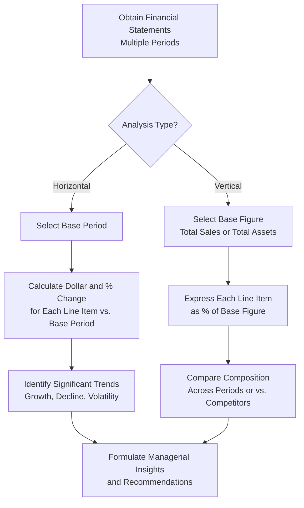

## Horizontal and Vertical Common Size Analysis

### Definition and Purpose

Common size analysis is a financial statement analysis technique that converts absolute dollar figures into percentages, enabling meaningful comparison across periods, companies of different sizes, or industry benchmarks. It has two primary forms: **horizontal analysis**, which compares the same line item across multiple periods to identify trends, and **vertical analysis** (also called common size analysis in the strictest sense), which expresses each line item as a percentage of a base figure within a single period, revealing the internal composition of a financial statement.

**Key Points**

- Horizontal analysis answers: "How has this line item changed *over time*?"
- Vertical analysis answers: "What proportion does this line item represent *within the current statement*?"
- Both techniques remove the distortion of absolute dollar scale, making the analysis directly comparable across time periods or between companies of very different sizes.

### Horizontal Analysis

Horizontal analysis calculates the dollar and percentage change in each financial statement line item from one period to a base (comparison) period.

**Formulas**

$$\text{Dollar Change} = \text{Current Year Amount} - \text{Base Year Amount}$$

$$\text{Percentage Change} = \frac{\text{Current Year Amount} - \text{Base Year Amount}}{\text{Base Year Amount}} \times 100$$

**Example — Horizontal Analysis of an Income Statement**

| Line Item | Year 1 | Year 2 | Dollar Change | % Change |
| --- | --- | --- | --- | --- |
| Sales Revenue | $2,000,000 | $2,300,000 | $300,000 | 15.0% |
| Cost of Goods Sold | $1,200,000 | $1,357,000 | $157,000 | 13.1% |
| Gross Profit | $800,000 | $943,000 | $143,000 | 17.9% |
| Operating Expenses | $500,000 | $540,000 | $40,000 | 8.0% |
| Operating Income | $300,000 | $403,000 | $103,000 | 34.3% |
| Net Income | $210,000 | $285,000 | $75,000 | 35.7% |

**Interpretation**: Sales grew 15.0%, but Gross Profit grew faster at 17.9%, indicating the cost of goods sold grew more slowly (13.1%) than revenue — a favorable sign of improving gross margin. Operating Income and Net Income grew substantially faster than sales (34.3% and 35.7% respectively) because Operating Expenses grew only 8.0%, well below the revenue growth rate, demonstrating operating leverage: fixed and semi-fixed operating costs did not increase proportionally with sales, magnifying the bottom-line percentage gain.

### Multi-Year Horizontal Analysis (Trend Percentages)

When more than two periods are analyzed, a single base year (typically the earliest period) is indexed at 100%, and subsequent years are expressed relative to that base.

$$\text{Trend Percentage} = \frac{\text{Current Year Amount}}{\text{Base Year Amount}} \times 100$$

**Example**

| Line Item | Year 1 (Base) | Year 2 | Year 3 | Year 4 |
| --- | --- | --- | --- | --- |
| Sales Revenue ($) | $1,800,000 | $1,980,000 | $2,142,000 | $2,320,000 |
| Trend % | 100% | 110% | 119% | 129% |

$$\text{Year 4 Trend \%} = \frac{\$2{,}320{,}000}{\$1{,}800{,}000} \times 100 = 128.9\% \approx 129\%$$

This format makes multi-year growth trajectories immediately visible without requiring the reader to compute percentage changes between each consecutive pair of years.

### Vertical (Common Size) Analysis

Vertical analysis expresses each line item as a percentage of a designated base figure *within the same period's statement*: typically total sales/revenue for the income statement, and total assets for the balance sheet.

**Formulas**

$$\text{Common Size \% (Income Statement)} = \frac{\text{Line Item Amount}}{\text{Total Sales Revenue}} \times 100$$

$$\text{Common Size \% (Balance Sheet)} = \frac{\text{Line Item Amount}}{\text{Total Assets}} \times 100$$

**Example — Vertical Analysis of an Income Statement**

| Line Item | Amount | % of Sales |
| --- | --- | --- |
| Sales Revenue | $2,300,000 | 100.0% |
| Cost of Goods Sold | $1,357,000 | 59.0% |
| Gross Profit | $943,000 | 41.0% |
| Operating Expenses | $540,000 | 23.5% |
| Operating Income | $403,000 | 17.5% |
| Net Income | $285,000 | 12.4% |

$$\text{COGS \%} = \frac{\$1{,}357{,}000}{\$2{,}300{,}000} \times 100 = 59.0\%$$

**Example — Vertical Analysis of a Balance Sheet**

| Line Item | Amount | % of Total Assets |
| --- | --- | --- |
| Cash | $180,000 | 9.0% |
| Accounts Receivable | $320,000 | 16.0% |
| Inventory | $450,000 | 22.5% |
| Property, Plant & Equipment (net) | $1,050,000 | 52.5% |
| **Total Assets** | **$2,000,000** | **100.0%** |
| Current Liabilities | $300,000 | 15.0% |
| Long-Term Debt | $700,000 | 35.0% |
| Stockholders' Equity | $1,000,000 | 50.0% |
| **Total Liabilities & Equity** | **$2,000,000** | **100.0%** |

**Interpretation**: This company finances 50.0% of its assets through equity and 50.0% through liabilities (15.0% current + 35.0% long-term), and holds 52.5% of total assets in fixed assets (PP&E), which may be typical or notable depending on the industry (e.g., high for a service firm, potentially low for a capital-intensive manufacturer) — a judgment that requires industry-specific benchmarking.

### Comparative Summary

| Dimension | Horizontal Analysis | Vertical Analysis |
| --- | --- | --- |
| Comparison direction | Across time (multiple periods) | Within one period (statement composition) |
| Base figure | Prior/base period amount for each line item | Total sales (income statement) or total assets (balance sheet), same period |
| Primary use | Trend identification | Structural/composition analysis, cross-company comparison |
| Best suited for | Identifying growth or decline patterns | Comparing companies of different sizes; identifying disproportionate cost items |

### Process Flow for Conducting Common Size Analysis

### Using Common Size Analysis for Cross-Company Comparison

**Key Points**

- Because vertical analysis expresses figures as percentages rather than absolute dollars, it enables direct comparison between companies of vastly different sizes (e.g., a $5 million revenue company vs. a $500 million revenue competitor) on a common basis.
- This makes vertical analysis particularly useful for benchmarking (see Benchmarking Practices) against industry averages published by trade associations or financial data providers.

**Example**

| Line Item | Company A (% of Sales) | Industry Average (% of Sales) |
| --- | --- | --- |
| Cost of Goods Sold | 59.0% | 54.0% |
| Gross Profit | 41.0% | 46.0% |
| Operating Expenses | 23.5% | 21.0% |
| Operating Income | 17.5% | 25.0% |

**Interpretation**: Company A's gross margin (41.0%) trails the industry average (46.0%) by 5 percentage points, and its operating income margin (17.5%) trails by 7.5 percentage points — signaling a potential competitive disadvantage in either cost structure or pricing power that warrants further investigation into cost drivers (see Categories of Quality Costs, Cost of Quality Trade-offs) or pricing strategy.

### Visual Illustration — Vertical Analysis Composition (svg_diagram)

<svg xmlns="http://www.w3.org/2000/svg" viewBox="0 0 620 300">
<text x="310" y="25" text-anchor="middle" font-size="16" font-weight="bold" fill="#1a1a1a">Income Statement Common Size Composition (svg_diagram)</text>

<text x="150" y="55" text-anchor="middle" font-size="12" font-weight="bold" fill="`#374151`">Sales = 100%</text>

<rect x="80" y="65" width="140" height="140" fill="`#fbbf24`" />

<text x="150" y="140" text-anchor="middle" font-size="11" fill="`#78350f`">COGS 59.0%</text>

<rect x="80" y="205" width="140" height="97" fill="#60a5fa" />
<text x="150" y="250" text-anchor="middle" font-size="11" fill="#1e3a8a">Gross Profit 41.0%</text>

<text x="420" y="55" text-anchor="middle" font-size="12" font-weight="bold" fill="`#374151`">Gross Profit Breakdown</text>

<rect x="350" y="205" width="140" height="56" fill="`#34d399`" />

<text x="420" y="236" text-anchor="middle" font-size="10" fill="`#064e3b`">Op. Expenses 23.5%</text>

<rect x="350" y="65" width="140" height="140" fill="#a78bfa" />
<text x="420" y="138" text-anchor="middle" font-size="11" fill="#3730a3">Operating Income 17.5%</text>
</svg>

### Applications in Managerial Decision-Making

- **Trend monitoring**: Horizontal analysis flags emerging problems early — e.g., an expense category growing faster than sales for several consecutive periods signals a cost-control issue before it significantly erodes profitability.
- **Cost structure diagnosis**: Vertical analysis pinpoints which specific cost category (COGS, SG&A, etc.) is disproportionately large relative to sales, directing management's attention to the highest-leverage area for cost management effort.
- **Capital structure assessment**: Balance sheet vertical analysis reveals the relative reliance on debt vs. equity financing, informing risk assessment and financing strategy discussions.
- **Merger/acquisition and competitor analysis**: Since percentages are scale-independent, common size statements allow direct structural comparison between an acquisition target and the acquiring company, or between direct competitors of different sizes.

### Limitations and Cautions

- **Masking absolute dollar significance**: A large percentage change in a small line item (e.g., a 50% increase in a minor expense category) may be immaterial in dollar terms, while a small percentage change in a large item (e.g., a 2% increase in COGS) may be highly material — percentages should always be read alongside the underlying dollar amounts.
- **Distorted base-year comparisons**: If the base year in horizontal analysis was itself unusual (e.g., a recession year or one-time event), percentage changes calculated from it can overstate or understate the true underlying trend.
- **Accounting policy differences**: [Inference] Cross-company vertical analysis comparisons can be distorted by differing accounting policy choices (e.g., inventory costing method, depreciation method, lease treatment), meaning apparent structural differences may partly reflect accounting choices rather than genuine operational differences, and comparisons should be interpreted with this caveat in mind.
- **Loss of granularity**: Common size percentages describe aggregate line items and do not by themselves reveal underlying root causes (e.g., a rising COGS percentage could stem from input price inflation, production inefficiency, or product mix shift) — deeper variance or ratio analysis is typically needed to diagnose the specific driver.

**Related Topics**

- Financial Ratio Analysis (liquidity, profitability, solvency, activity ratios)
- Benchmarking Practices
- DuPont Analysis and Return on Equity decomposition
- Trend analysis in budgeting and forecasting
- Cost structure and operating leverage analysis