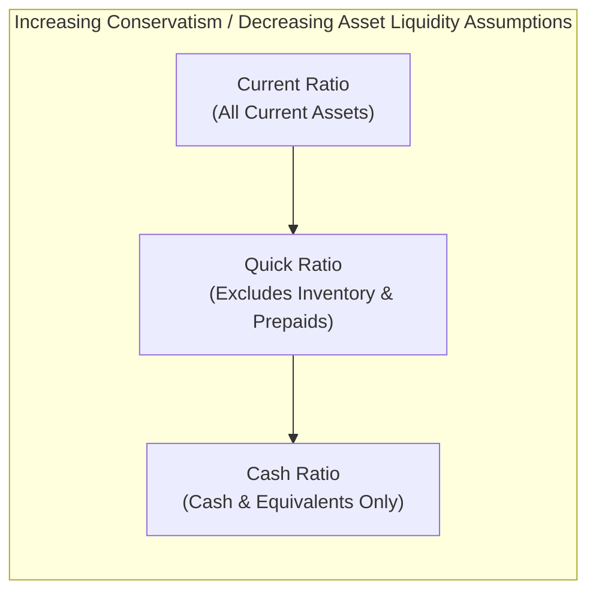

## Liquidity Ratios

### Overview

Liquidity ratios measure a company's ability to meet its short-term obligations (typically due within one year) using its short-term (current) assets. For managers, liquidity ratios provide an early-warning system for cash flow problems and inform decisions about working capital management, credit policy, and short-term financing needs.

### Purpose in Managerial Decision-Making

- Assess whether the organization can pay upcoming bills, payroll, and short-term debt without needing emergency financing
- Support working capital management decisions (inventory levels, receivables collection policy, payables timing)
- Inform lenders' and creditors' risk assessments, which indirectly affects the company's borrowing costs and terms
- Signal potential operational or financial distress before it becomes a solvency crisis

**Key Points**

- Liquidity ratios focus specifically on the **short term** — they say little about a company's ability to meet long-term obligations, which is the domain of solvency/leverage ratios
- A high liquidity ratio is not unambiguously "good" — excessively high liquidity can indicate underutilized assets (e.g., excess cash or inventory not being deployed productively), which may drag down profitability metrics like ROI

### Current Ratio

**Formula**

$$\text{Current Ratio} = \frac{\text{Current Assets}}{\text{Current Liabilities}}$$

**What It Measures**

The number of dollars of current assets available to cover each dollar of current liabilities. It is the broadest liquidity measure, including all current assets regardless of how quickly they can be converted to cash.

**Example**

A company has current assets of $450,000 (cash $50,000, accounts receivable $150,000, inventory $200,000, prepaid expenses $50,000) and current liabilities of $300,000.

$$\text{Current Ratio} = \frac{\$450{,}000}{\$300{,}000} = 1.5$$

This means the company has $1.50 of current assets for every $1.00 of current liabilities.

**Interpretation**

- A ratio above 1.0 generally suggests the company has sufficient current assets to cover current liabilities
- What counts as a "healthy" ratio varies significantly by industry — capital-intensive or inventory-heavy industries often maintain higher current ratios than service industries with minimal inventory [Inference — industry norms vary and require external benchmarking, not a fixed universal standard]
- A very high current ratio may indicate inefficient use of assets (e.g., excess unsold inventory or slow-collecting receivables), rather than genuine financial strength

### Quick Ratio (Acid-Test Ratio)

**Formula**

$$\text{Quick Ratio} = \frac{\text{Cash} + \text{Marketable Securities} + \text{Accounts Receivable}}{\text{Current Liabilities}}$$

Equivalently:

$$\text{Quick Ratio} = \frac{\text{Current Assets} - \text{Inventory} - \text{Prepaid Expenses}}{\text{Current Liabilities}}$$

**What It Measures**

A more conservative liquidity measure than the current ratio, since it excludes inventory and prepaid expenses — assets that are less readily convertible to cash and, in the case of inventory, subject to obsolescence and valuation uncertainty.

**Example**

Using the same figures as above:

$$\text{Quick Ratio} = \frac{\$50{,}000 + \$150{,}000}{\$300{,}000} = \frac{\$200{,}000}{\$300{,}000} = 0.67$$

**Interpretation**

- The quick ratio here (0.67) is notably lower than the current ratio (1.5), revealing that a substantial portion of this company's current assets are tied up in inventory
- A quick ratio below 1.0 does not necessarily indicate distress, but it does mean the company would need to sell inventory or raise cash through other means to fully cover current liabilities on short notice
- This ratio is especially relevant for evaluating companies where inventory is illiquid, slow-moving, or difficult to value reliably

### Cash Ratio

**Formula**

$$\text{Cash Ratio} = \frac{\text{Cash} + \text{Cash Equivalents} + \text{Marketable Securities}}{\text{Current Liabilities}}$$

**What It Measures**

The most conservative liquidity measure, considering only the assets that are already cash or can be converted to cash essentially immediately.

**Example**

$$\text{Cash Ratio} = \frac{\$50{,}000}{\$300{,}000} = 0.17$$

**Interpretation**

- Reflects the company's ability to pay off current liabilities using only its most liquid resources, without relying on collecting receivables or selling any assets
- Rarely expected to exceed 1.0 in normal operations, since most companies do not hold cash equal to or greater than all current liabilities — doing so would generally be seen as an inefficient use of capital [Inference — reflects standard capital-efficiency reasoning, not a specific regulatory benchmark]

### Working Capital

**Formula**

$$\text{Working Capital} = \text{Current Assets} - \text{Current Liabilities}$$

**What It Measures**

An absolute-dollar (rather than ratio) measure of the cushion between short-term resources and short-term obligations.

**Example**

$$\text{Working Capital} = \$450{,}000 - \$300{,}000 = \$150{,}000$$

**Key Points**

- Because it is expressed in dollars rather than as a ratio, working capital is not directly comparable across companies of different sizes — a large corporation and a small business could have identical current ratios but vastly different working capital amounts
- Still a useful internal management metric for tracking the trend of liquidity cushion over time within the same organization

### Diagram: Liquidity Ratio Spectrum by Asset Conservatism

### Additional Liquidity-Related Ratios

**Accounts Receivable Turnover**

$$\text{AR Turnover} = \frac{\text{Net Credit Sales}}{\text{Average Accounts Receivable}}$$

Measures how many times, on average, receivables are collected during a period. A higher turnover generally indicates faster collection, improving actual (not just reported) liquidity.

**Days Sales Outstanding (DSO)**

$$DSO = \frac{365}{\text{AR Turnover}}$$

Converts the turnover ratio into an average number of days to collect receivables — often more intuitive for operational discussions with sales and credit management teams.

**Inventory Turnover**

$$\text{Inventory Turnover} = \frac{\text{Cost of Goods Sold}}{\text{Average Inventory}}$$

Measures how many times inventory is sold and replaced over a period. Low turnover can signal slow-moving inventory that inflates the current ratio without representing genuine liquidity.

**Days Inventory Outstanding (DIO)**

$$DIO = \frac{365}{\text{Inventory Turnover}}$$

**Key Points**

- These turnover ratios contextualize the current and quick ratios: a company might show an adequate current ratio while actually facing a liquidity problem if its receivables and inventory turn over very slowly (i.e., those "current" assets aren't converting to cash quickly enough to meet obligations as they come due)
- Combining static liquidity ratios (current, quick, cash) with turnover/velocity ratios (AR turnover, inventory turnover) gives a fuller picture than any single ratio alone

### Worked Example: Comprehensive Liquidity Analysis

A company reports the following year-end balances:

| Item | Amount |
| --- | --- |
| Cash | $80,000 |
| Marketable Securities | $20,000 |
| Accounts Receivable | $180,000 |
| Inventory | $220,000 |
| Prepaid Expenses | $30,000 |
| **Total Current Assets** | **$530,000** |
| Current Liabilities | $350,000 |

**Current Ratio:**

$$\frac{\$530{,}000}{\$350{,}000} = 1.51$$

**Quick Ratio:**

$$\frac{\$80{,}000 + \$20{,}000 + \$180{,}000}{\$350{,}000} = \frac{\$280{,}000}{\$350{,}000} = 0.80$$

**Cash Ratio:**

$$\frac{\$80{,}000 + \$20{,}000}{\$350{,}000} = \frac{\$100{,}000}{\$350{,}000} = 0.29$$

**Working Capital:**

$$\$530{,}000 - \$350{,}000 = \$180{,}000$$

**Interpretation**: The current ratio of 1.51 appears reasonably healthy at first glance. However, the quick ratio of 0.80 reveals that without selling inventory, the company would fall short of covering current liabilities. The cash ratio of 0.29 further shows that immediate cash resources cover less than a third of current obligations. This progression illustrates why relying on a single liquidity ratio can be misleading — a manager should examine the full spectrum, and further investigate accounts receivable and inventory turnover ratios to assess how quickly those balances are likely to convert to cash before obligations come due.

### Common Pitfalls

- **Using the current ratio alone**: it can mask illiquid components (e.g., obsolete inventory, slow-collecting receivables) that inflate apparent liquidity without providing genuine short-term cash-paying capacity
- **Ignoring industry context**: comparing liquidity ratios across companies in different industries without adjustment can lead to incorrect conclusions, since "normal" liquidity levels vary substantially by business model and operating cycle
- **Treating high liquidity as always favorable**: excess idle cash or overstocked inventory improves liquidity ratios but can simultaneously depress profitability and return metrics (e.g., ROI), representing a trade-off management must balance
- **Overlooking the timing mismatch** between when current liabilities come due and when current assets (especially receivables and inventory) actually convert to cash — the ratios themselves don't capture this timing directly, which is why turnover ratios are a necessary complement

### Managerial Implications

- Liquidity ratios directly inform working capital policy decisions: credit and collection policies (affecting receivables), inventory management practices (affecting inventory levels and turnover), and payables management (affecting current liabilities)
- Because liquidity and profitability often involve trade-offs (e.g., holding more cash improves liquidity but may reduce ROI), managers must balance liquidity ratio targets against overall return objectives rather than optimizing liquidity in isolation
- Liquidity ratio trends over time are often more informative to internal managers than a single-period snapshot, since a declining trend can serve as an early warning sign of emerging cash flow problems well before a crisis develops

**Related Topics**

- Solvency and Leverage Ratios (Debt-to-Equity, Times Interest Earned)
- Working Capital Management (Cash Conversion Cycle)
- Accounts Receivable and Inventory Turnover Analysis
- Return on Investment (ROI) and the Liquidity-Profitability Trade-off
- DuPont Analysis and Profitability Ratio Decomposition
- Cash Budgeting and Short-Term Financial Planning