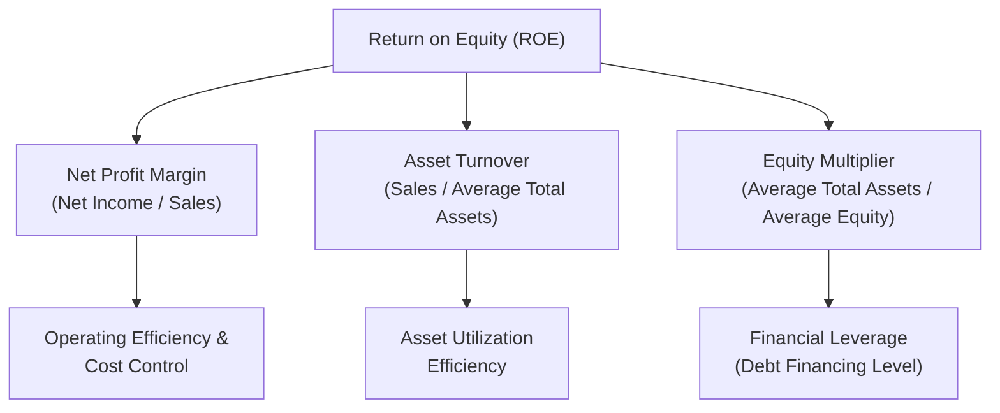

## Profitability Ratios

### Overview

Profitability ratios measure a company's ability to generate earnings relative to its revenue, assets, equity, or operating costs. For managers, these ratios translate raw income statement and balance sheet figures into standardized measures that support performance evaluation, resource allocation decisions, and comparisons across time periods, business units, and competitors.

### Purpose in Managerial Decision-Making

- Evaluate how efficiently the organization converts sales into profit at various stages of the income statement
- Assess how effectively invested capital (assets, equity) is being used to generate returns
- Support internal benchmarking across divisions, product lines, or time periods
- Inform strategic decisions such as pricing, cost control initiatives, capital investment, and business unit performance evaluation
- Serve as inputs into external analyses by investors and creditors assessing overall company performance

**Key Points**

- Profitability ratios are generally expressed as percentages, enabling comparison across companies or units of different sizes
- Different profitability ratios isolate different stages of value creation — from gross profitability on sales, down through operating efficiency, to overall returns on invested capital

### Margin Ratios (Income Statement-Based)

**Gross Margin (Gross Profit Percentage)**

$$\text{Gross Margin} = \frac{\text{Sales} - \text{Cost of Goods Sold}}{\text{Sales}} \times 100$$

Measures the percentage of sales revenue remaining after covering the direct costs of producing goods or services sold, before considering operating expenses.

**Operating Margin**

$$\text{Operating Margin} = \frac{\text{Operating Income}}{\text{Sales}} \times 100$$

Measures profitability from core business operations, after covering both cost of goods sold and operating expenses (selling, general, and administrative expenses), but before interest and taxes.

**Net Profit Margin**

$$\text{Net Profit Margin} = \frac{\text{Net Income}}{\text{Sales}} \times 100$$

Measures the percentage of each sales dollar that ultimately becomes profit after all expenses, including interest and taxes.

**Example**

A company reports: Sales $1,000,000; COGS $600,000; Operating Expenses $250,000; Interest Expense $20,000; Tax Expense $32,500 (assume already computed); Net Income $97,500.

$$\text{Gross Margin} = \frac{\$1{,}000{,}000 - \$600{,}000}{\$1{,}000{,}000} \times 100 = 40\%$$

$$\text{Operating Income} = \$1{,}000{,}000 - \$600{,}000 - \$250{,}000 = \$150{,}000$$

$$\text{Operating Margin} = \frac{\$150{,}000}{\$1{,}000{,}000} \times 100 = 15\%$$

$$\text{Net Profit Margin} = \frac{\$97{,}500}{\$1{,}000{,}000} \times 100 = 9.75\%$$

**Interpretation**

- The gradual decline from 40% (gross margin) to 15% (operating margin) to 9.75% (net margin) shows how each layer of cost — production costs, operating expenses, then interest and taxes — progressively consumes the sales dollar
- Comparing these margins over time or against competitors helps managers identify at which stage of the income statement profitability is eroding or improving

### Return-Based Ratios (Combining Income Statement and Balance Sheet)

**Return on Assets (ROA)**

$$ROA = \frac{\text{Net Income}}{\text{Average Total Assets}} \times 100$$

Measures how efficiently the company uses its total asset base to generate profit, regardless of how those assets are financed (debt vs. equity).

**Return on Equity (ROE)**

$$ROE = \frac{\text{Net Income}}{\text{Average Stockholders' Equity}} \times 100$$

Measures the return generated specifically for equity shareholders, reflecting both operating performance and the effect of financial leverage.

**Return on Investment (ROI)** — the central profitability measure for divisional performance evaluation in managerial accounting

$$ROI = \frac{\text{Operating Income}}{\text{Average Total Assets (or Average Invested Capital)}}$$

**Example**

Using average total assets of $800,000 and average stockholders' equity of $500,000, with net income of $97,500 and operating income of $150,000:

$$ROA = \frac{\$97{,}500}{\$800{,}000} \times 100 = 12.19\%$$

$$ROE = \frac{\$97{,}500}{\$500{,}000} \times 100 = 19.5\%$$

$$ROI = \frac{\$150{,}000}{\$800{,}000} \times 100 = 18.75\%$$

**Interpretation**: ROE (19.5%) exceeds ROA (12.19%) here because the company uses debt financing — this gap reflects **financial leverage**: equity holders earn a higher return than the overall asset base generates, because some of that asset base is financed by creditors rather than shareholders, and the company is earning more on those borrowed funds than their cost.

### DuPont Analysis: Decomposing ROE

The **DuPont framework** breaks ROE into three component drivers, revealing *why* a given ROE level was achieved:

$$ROE = \text{Net Profit Margin} \times \text{Asset Turnover} \times \text{Equity Multiplier}$$

$$ROE = \frac{\text{Net Income}}{\text{Sales}} \times \frac{\text{Sales}}{\text{Average Total Assets}} \times \frac{\text{Average Total Assets}}{\text{Average Stockholders' Equity}}$$

**Example (continued)**

Asset Turnover = $\frac{\$1{,}000{,}000}{\$800{,}000} = 1.25$

Equity Multiplier = $\frac{\$800{,}000}{\$500{,}000} = 1.6$

$$ROE = 9.75\% \times 1.25 \times 1.6 = 19.5\%$$

**Interpretation**: This confirms the ROE of 19.5% and reveals its three drivers — profitability per sales dollar (net profit margin), efficiency in generating sales from assets (asset turnover), and the degree of financial leverage (equity multiplier). Two companies can have identical ROE but achieve it through very different combinations of margin, efficiency, and leverage — the DuPont decomposition surfaces this for managerial diagnosis.

### Diagram: DuPont Decomposition of ROE

### The ROI Decomposition (DuPont for Divisional Performance)

In managerial accounting specifically, ROI is often decomposed for divisional performance evaluation:

$$ROI = \text{Return on Sales (Operating Margin)} \times \text{Investment Turnover}$$

$$ROI = \frac{\text{Operating Income}}{\text{Sales}} \times \frac{\text{Sales}}{\text{Average Invested Capital}}$$

**Example (continued)**

Return on Sales = $\frac{\$150{,}000}{\$1{,}000{,}000} = 15\%$

Investment Turnover = $\frac{\$1{,}000{,}000}{\$800{,}000} = 1.25$

$$ROI = 15\% \times 1.25 = 18.75\%$$

**Key Points**

- This decomposition is particularly valuable in divisional performance evaluation because it separates **margin management** (pricing, cost control) from **asset utilization** (how efficiently invested capital generates sales), letting managers diagnose whether a low ROI stems from thin margins, poor asset turnover, or both
- A division manager might improve ROI either by increasing margin (e.g., raising prices, cutting costs) or by increasing turnover (e.g., generating more sales per dollar of invested assets, or reducing idle/underutilized assets) — these are different strategic levers requiring different actions

### Earnings Per Share (EPS)

$$EPS = \frac{\text{Net Income} - \text{Preferred Dividends}}{\text{Weighted-Average Common Shares Outstanding}}$$

Widely used externally by investors, though less central to internal managerial decision-making compared to margin, ROA, ROE, and ROI, since it is heavily influenced by share count and capital structure decisions outside the direct control of operating managers.

### Comparison Table: Profitability Ratios at a Glance

| Ratio | Formula | Focus |
| --- | --- | --- |
| Gross Margin | (Sales − COGS) / Sales | Production cost efficiency |
| Operating Margin | Operating Income / Sales | Core operating efficiency |
| Net Profit Margin | Net Income / Sales | Overall bottom-line profitability |
| ROA | Net Income / Average Total Assets | Efficiency of total asset base |
| ROE | Net Income / Average Equity | Return to shareholders (leverage-inclusive) |
| ROI | Operating Income / Average Invested Capital | Divisional/segment performance |
| EPS | (Net Income − Preferred Dividends) / Shares Outstanding | Per-share earnings (external investor focus) |

### Common Pitfalls

- **Comparing margins across industries without adjustment**: capital-intensive industries (e.g., manufacturing) typically show different margin structures than service or technology industries, making cross-industry comparisons potentially misleading without context
- **Using ending balances instead of averages** for balance sheet figures (total assets, equity) in return ratios, which can distort the ratio if the balance changed significantly during the period — average balances are the more defensible standard practice
- **Ignoring the effect of financial leverage** when comparing ROE across companies with different capital structures — a higher ROE driven purely by higher debt levels reflects greater financial risk, not necessarily superior operating performance
- **Treating ROI as a complete performance measure** without considering its potential to create **suboptimal investment incentives** — a division manager evaluated solely on ROI might reject a project with a return above the company's cost of capital but below the division's *current* ROI, even though accepting it would benefit the company overall (this is a key motivation for using Residual Income or EVA as complementary or alternative measures)

### Managerial Implications

- Margin ratios help managers pinpoint *where* in the income statement profitability is being gained or lost, supporting targeted cost-control or pricing initiatives
- The DuPont and ROI decompositions are essential diagnostic tools for divisional performance evaluation, since they reveal whether performance issues stem from margin problems, asset-utilization problems, or (in the ROE case) leverage decisions
- Because ROI-based evaluation can create goal-incongruent incentives (as noted in the ROI suboptimization pitfall), many organizations supplement or replace ROI with Residual Income or Economic Value Added (EVA) for internal divisional performance measurement and capital investment decisions

**Related Topics**

- Return on Investment (ROI), Residual Income, and Economic Value Added (EVA)
- DuPont Analysis and Ratio Decomposition
- Liquidity Ratios and the Liquidity-Profitability Trade-off
- Solvency and Leverage Ratios
- Segment Reporting and Divisional Performance Evaluation
- Cost of Capital and Investment Decision Criteria