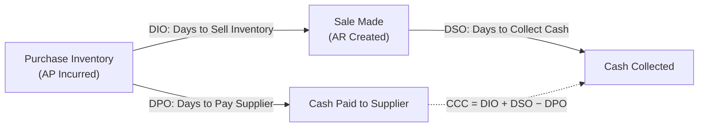

## Efficiency and Activity Ratios

### Overview

Efficiency ratios (also called activity ratios or turnover ratios) measure how effectively a company utilizes its assets and manages its operating cycle to generate sales and cash flow. For managers, these ratios reveal how well resources — inventory, receivables, payables, fixed assets, and total assets — are being deployed, providing a bridge between the balance sheet and operational performance.

### Purpose in Managerial Decision-Making

- Assess how efficiently the organization converts investments in assets into sales and cash
- Diagnose working capital management effectiveness (inventory, receivables, payables)
- Identify underutilized assets that may be dragging down overall return measures like ROI or ROA
- Support decisions on inventory policy, credit and collection terms, supplier payment terms, and capital asset investment
- Complement liquidity ratios by revealing the *speed* at which current assets convert to cash, rather than just the *static amount* available

**Key Points**

- Efficiency ratios are typically expressed either as a **turnover** (number of times per period) or as **days** (average number of days for a cycle to complete) — the two are mathematically related and interchangeable
- These ratios connect directly to the DuPont/ROI decomposition (asset turnover component), since better asset efficiency directly improves ROI and ROA even without any change in profit margin

### Inventory Turnover

**Formula**

$$\text{Inventory Turnover} = \frac{\text{Cost of Goods Sold}}{\text{Average Inventory}}$$

**Days Inventory Outstanding (DIO)**

$$DIO = \frac{365}{\text{Inventory Turnover}}$$

**What It Measures**

How many times inventory is sold and replaced during a period, or equivalently, the average number of days inventory sits before being sold.

**Example**

COGS = $1,200,000; Beginning Inventory = $180,000; Ending Inventory = $220,000

$$\text{Average Inventory} = \frac{\$180{,}000 + \$220{,}000}{2} = \$200{,}000$$

$$\text{Inventory Turnover} = \frac{\$1{,}200{,}000}{\$200{,}000} = 6.0 \text{ times}$$

$$DIO = \frac{365}{6.0} = 60.8 \text{ days}$$

**Interpretation**

- Inventory turns over 6 times per year, or sits in inventory for approximately 61 days on average before sale
- Higher turnover generally indicates efficient inventory management and reduces the risk of obsolescence and carrying costs
- Turnover that is too low may signal overstocking, slow-moving or obsolete inventory, or declining demand
- Turnover that is unusually high, however, can indicate insufficient inventory levels, risking stockouts and lost sales [Inference — reflects standard trade-off reasoning in inventory management, not a specific numeric threshold]

### Accounts Receivable Turnover

**Formula**

$$\text{AR Turnover} = \frac{\text{Net Credit Sales}}{\text{Average Accounts Receivable}}$$

**Days Sales Outstanding (DSO)**

$$DSO = \frac{365}{\text{AR Turnover}}$$

**What It Measures**

How many times receivables are collected during a period, or the average number of days it takes to collect from customers after a sale.

**Example**

Net Credit Sales = $2,400,000; Beginning AR = $180,000; Ending AR = $220,000

$$\text{Average AR} = \frac{\$180{,}000 + \$220{,}000}{2} = \$200{,}000$$

$$\text{AR Turnover} = \frac{\$2{,}400{,}000}{\$200{,}000} = 12.0 \text{ times}$$

$$DSO = \frac{365}{12.0} = 30.4 \text{ days}$$

**Interpretation**

- On average, the company collects receivables in about 30 days
- Comparing DSO to the company's stated credit terms (e.g., "net 30") reveals whether customers are generally paying on time, or whether collections are lagging behind stated policy
- Rising DSO trends over time often signal deteriorating credit and collection practices, or financial distress among customers, and are a key leading indicator for potential bad debt issues

### Accounts Payable Turnover

**Formula**

$$\text{AP Turnover} = \frac{\text{Net Credit Purchases (or COGS)}}{\text{Average Accounts Payable}}$$

**Days Payable Outstanding (DPO)**

$$DPO = \frac{365}{\text{AP Turnover}}$$

**What It Measures**

How quickly the company pays its own suppliers, expressed as a turnover rate or average days to pay.

**Example**

Net Credit Purchases (approximated using COGS) = $1,200,000; Beginning AP = $100,000; Ending AP = $140,000

$$\text{Average AP} = \frac{\$100{,}000 + \$140{,}000}{2} = \$120{,}000$$

$$\text{AP Turnover} = \frac{\$1{,}200{,}000}{\$120{,}000} = 10.0 \text{ times}$$

$$DPO = \frac{365}{10.0} = 36.5 \text{ days}$$

**Interpretation**

- The company takes about 36.5 days on average to pay its suppliers
- A longer DPO can improve short-term cash flow by delaying cash outflows, but excessively long payment periods risk straining supplier relationships or losing early-payment discounts
- DPO should be evaluated in the context of stated supplier terms, similar to how DSO is evaluated against stated customer credit terms

### The Cash Conversion Cycle (CCC)

The **Cash Conversion Cycle** integrates DIO, DSO, and DPO into a single measure of how long cash is tied up in the operating cycle.

**Formula**

$$CCC = DIO + DSO - DPO$$

**Example (using figures above)**

$$CCC = 60.8 + 30.4 - 36.5 = 54.7 \text{ days}$$

**Interpretation**

- The company's cash is tied up for approximately 54.7 days between paying for inventory/production inputs and collecting cash from customers
- A shorter CCC is generally favorable, since it means the company needs to fund fewer days of operations with external working capital
- Management can shorten the CCC by reducing DIO (faster inventory turnover), reducing DSO (faster collections), or increasing DPO (slower payments to suppliers) — though each lever carries potential trade-offs (e.g., aggressive collection policies can harm customer relationships; excessively stretching payables can harm supplier relationships)

### Diagram: The Cash Conversion Cycle

### Total Asset Turnover

**Formula**

$$\text{Total Asset Turnover} = \frac{\text{Net Sales}}{\text{Average Total Assets}}$$

**What It Measures**

How efficiently the company uses its entire asset base to generate sales revenue — a broader efficiency measure than the working-capital-specific ratios above.

**Example**

Net Sales = $2,400,000; Average Total Assets = $1,600,000

$$\text{Total Asset Turnover} = \frac{\$2{,}400{,}000}{\$1{,}600{,}000} = 1.5 \text{ times}$$

**Interpretation**

- Each dollar of assets generates $1.50 of sales
- This ratio is a direct component of the DuPont and ROI decompositions, meaning improvements in total asset turnover flow through directly to improved ROI/ROA, even without any change in profit margin
- Capital-intensive industries (e.g., utilities, manufacturing with heavy fixed-asset investment) typically show lower total asset turnover than asset-light industries (e.g., consulting, software) [Inference — general industry pattern based on typical asset intensity, not a fixed universal rule]

### Fixed Asset Turnover

**Formula**

$$\text{Fixed Asset Turnover} = \frac{\text{Net Sales}}{\text{Average Net Fixed Assets}}$$

**What It Measures**

Specifically isolates how efficiently the company's property, plant, and equipment generate sales — useful for capital-intensive businesses where fixed asset utilization is a critical performance driver.

### Comparison Table: Efficiency Ratios at a Glance

| Ratio | Formula | Focus |
| --- | --- | --- |
| Inventory Turnover | COGS / Average Inventory | Speed of inventory sale |
| Days Inventory Outstanding | 365 / Inventory Turnover | Days inventory held before sale |
| AR Turnover | Net Credit Sales / Average AR | Speed of receivables collection |
| Days Sales Outstanding | 365 / AR Turnover | Days to collect from customers |
| AP Turnover | Credit Purchases / Average AP | Speed of paying suppliers |
| Days Payable Outstanding | 365 / AP Turnover | Days taken to pay suppliers |
| Cash Conversion Cycle | DIO + DSO − DPO | Net days cash is tied up in operations |
| Total Asset Turnover | Net Sales / Average Total Assets | Overall asset utilization efficiency |
| Fixed Asset Turnover | Net Sales / Average Net Fixed Assets | Fixed asset utilization efficiency |

### Common Pitfalls

- **Using ending balances instead of averages** for balance sheet figures — since these ratios relate a flow measure (sales, COGS) to a stock measure (inventory, receivables), using average balances better matches the timing of the flow over the period
- **Comparing turnover ratios across industries without adjustment**: businesses with fundamentally different operating cycles (e.g., a grocery retailer vs. an aircraft manufacturer) will naturally show very different "normal" turnover levels
- **Interpreting high turnover as unambiguously positive**: while generally favorable, unusually high inventory turnover, for example, may indicate insufficient safety stock and elevated stockout risk rather than pure efficiency gains
- **Approximating credit purchases with COGS** for AP turnover when actual credit purchase data isn't available introduces some imprecision, since COGS reflects goods sold rather than goods purchased during the period — a reasonable approximation, but one that should be flagged when precision matters [Inference — a commonly noted limitation of this substitution in ratio analysis]
- **Overlooking the interconnection between ratios**: analyzing DIO, DSO, and DPO in isolation misses how they jointly determine the cash conversion cycle and, ultimately, the company's working capital financing needs

### Managerial Implications

- Efficiency ratios directly inform working capital policy: inventory management practices, credit and collection policies for customers, and payment timing strategy with suppliers
- Because these ratios are core components of the DuPont and ROI decompositions, improving asset efficiency is a lever managers can use to boost overall return measures independent of margin improvements — often making efficiency initiatives (e.g., reducing excess inventory, tightening receivables collection) a faster path to ROI improvement than price increases or cost cuts alone [Inference — a strategic implication drawn from the mathematical relationship between turnover and ROI, not a universal prescription for every business context]
- The Cash Conversion Cycle is a particularly useful single-number summary for communicating overall working capital efficiency to non-financial stakeholders, and for benchmarking trends over time or against competitors

**Related Topics**

- Liquidity Ratios and the Cash Conversion Cycle
- DuPont Analysis and ROI Decomposition
- Working Capital Management and Short-Term Financing
- Credit Policy and Accounts Receivable Management
- Inventory Management Models (EOQ, JIT, Safety Stock)
- Profitability Ratios and Asset Utilization Trade-offs