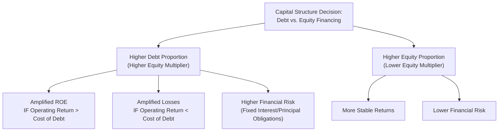

## Leverage and Solvency Ratios

### Overview

Leverage and solvency ratios measure a company's ability to meet its long-term obligations and assess the extent to which the company relies on debt financing relative to equity. For managers, these ratios inform capital structure decisions, borrowing capacity assessments, and long-term financial risk management, complementing the short-term focus of liquidity ratios.

### Purpose in Managerial Decision-Making

- Assess the company's ability to meet long-term debt obligations, including principal repayments and interest
- Evaluate the degree of **financial leverage** — the extent to which debt financing is used relative to equity — and its associated risks and benefits
- Inform capital structure decisions: how much additional debt the company can prudently take on for expansion, acquisitions, or capital investment
- Support lenders' and creditors' assessments of default risk, which directly affects the company's cost of borrowing
- Provide insight into the sustainability of interest and fixed-charge obligations, especially during periods of declining earnings

**Key Points**

- Solvency ratios focus on the **long term**, complementing liquidity ratios (short-term focus); a company can be liquid in the short run but insolvent in the long run, or vice versa
- Leverage is a double-edged sword: debt financing can amplify returns to equity holders when operating returns exceed the cost of debt (favorable leverage), but it also amplifies losses and increases financial risk when the reverse is true

### Debt-to-Equity Ratio

**Formula**

$$\text{Debt-to-Equity Ratio} = \frac{\text{Total Liabilities}}{\text{Total Stockholders' Equity}}$$

**What It Measures**

The proportion of the company financed by creditors relative to owners. A higher ratio indicates greater reliance on debt financing.

**Example**

Total Liabilities = $600,000; Total Stockholders' Equity = $400,000

$$\text{Debt-to-Equity Ratio} = \frac{\$600{,}000}{\$400{,}000} = 1.5$$

**Interpretation**

- The company has $1.50 of debt for every $1.00 of equity
- A higher ratio indicates greater financial risk, since debt obligations (principal and interest) must be paid regardless of profitability, unlike dividends to equity holders which are discretionary
- Acceptable debt-to-equity levels vary substantially by industry — capital-intensive industries with stable cash flows (e.g., utilities) often sustain higher leverage than industries with volatile earnings (e.g., technology startups) [Inference — reflects general capital structure theory regarding cash flow stability and debt capacity, not a specific universal benchmark]

### Debt Ratio (Debt-to-Assets)

**Formula**

$$\text{Debt Ratio} = \frac{\text{Total Liabilities}}{\text{Total Assets}}$$

**What It Measures**

The percentage of total assets financed by debt rather than equity.

**Example**

Total Liabilities = $600,000; Total Assets = $1,000,000

$$\text{Debt Ratio} = \frac{\$600{,}000}{\$1{,}000{,}000} = 0.60 \text{ or } 60\%$$

**Interpretation**

- 60% of the company's assets are financed through debt, with the remaining 40% financed through equity
- This ratio and the debt-to-equity ratio convey similar information but in different forms; both are commonly used and easily converted between each other

### Equity Multiplier

**Formula**

$$\text{Equity Multiplier} = \frac{\text{Total Assets}}{\text{Total Stockholders' Equity}}$$

**What It Measures**

The degree to which assets are financed by equity versus debt — a core component of the DuPont ROE decomposition, directly linking capital structure to shareholder returns.

**Example**

$$\text{Equity Multiplier} = \frac{\$1{,}000{,}000}{\$400{,}000} = 2.5$$

**Interpretation**

- For every $1 of equity, the company controls $2.50 of total assets, with the remaining $1.50 financed by debt
- A higher equity multiplier amplifies ROE (as shown in the DuPont framework) but also amplifies financial risk

### Times Interest Earned (Interest Coverage Ratio)

**Formula**

$$\text{Times Interest Earned} = \frac{\text{Earnings Before Interest and Taxes (EBIT)}}{\text{Interest Expense}}$$

**What It Measures**

How many times over the company's operating earnings could cover its interest obligations — a direct measure of the margin of safety for meeting interest payments.

**Example**

EBIT = $300,000; Interest Expense = $50,000

$$\text{Times Interest Earned} = \frac{\$300{,}000}{\$50{,}000} = 6.0 \text{ times}$$

**Interpretation**

- The company's operating earnings could cover its interest expense 6 times over, indicating a substantial margin of safety
- A ratio approaching 1.0 signals the company is generating barely enough operating earnings to cover interest obligations, a warning sign of potential default risk if earnings decline further
- Lenders often specify minimum times-interest-earned covenants in loan agreements, making this ratio directly relevant to the company's ongoing compliance with debt agreements

### Fixed-Charge Coverage Ratio

**Formula**

$$\text{Fixed-Charge Coverage} = \frac{\text{EBIT} + \text{Lease Payments}}{\text{Interest Expense} + \text{Lease Payments}}$$

**What It Measures**

A broader coverage measure than times interest earned, incorporating other fixed obligations (such as lease payments) that function similarly to debt service in requiring regular, non-discretionary cash outflows.

**Key Points**

- More comprehensive than times interest earned for companies with significant operating lease obligations or other fixed contractual payments, since these obligations carry similar default risk implications to interest payments even though they are not technically "debt" on the balance sheet

### Diagram: Leverage's Amplifying Effect on Returns and Risk

### Worked Example: Comprehensive Leverage Analysis

A company reports: Total Assets $2,000,000; Total Liabilities $1,200,000; Total Stockholders' Equity $800,000; EBIT $400,000; Interest Expense $80,000.

**Debt-to-Equity Ratio:**

$$\frac{\$1{,}200{,}000}{\$800{,}000} = 1.5$$

**Debt Ratio:**

$$\frac{\$1{,}200{,}000}{\$2{,}000{,}000} = 0.60 \text{ or } 60\%$$

**Equity Multiplier:**

$$\frac{\$2{,}000{,}000}{\$800{,}000} = 2.5$$

**Times Interest Earned:**

$$\frac{\$400{,}000}{\$80{,}000} = 5.0 \text{ times}$$

**Interpretation**: The company finances 60% of its assets through debt, resulting in a debt-to-equity ratio of 1.5 and an equity multiplier of 2.5. Its operating earnings cover interest expense five times over, suggesting a reasonably comfortable margin of safety despite the relatively high reliance on debt financing. A manager evaluating this position would want to consider whether the return generated on assets exceeds the after-tax cost of debt — if so, the leverage is working favorably for shareholders (positive financial leverage); if not, the high debt ratio poses a growing risk to solvency, especially if earnings become more volatile.

### The Concept of Financial Leverage: Favorable vs. Unfavorable

**Favorable Financial Leverage**

Occurs when the return earned on borrowed funds (i.e., the return on assets or return on the investment financed by debt) exceeds the after-tax cost of that debt. In this case, using debt increases ROE beyond what would be achieved with all-equity financing.

**Unfavorable Financial Leverage**

Occurs when the return on assets falls below the cost of debt. In this case, debt financing reduces ROE below what would be achieved with all-equity financing, and the fixed interest obligations become an increasing burden relative to operating performance.

**Key Points**

- This is the same underlying mechanism that explains why ROE can exceed ROA in the DuPont framework (see Profitability Ratios) — but it is a double-edged mechanism: it amplifies gains during profitable periods and amplifies losses during downturns
- Because interest obligations are fixed regardless of operating performance, high leverage increases the volatility of returns to equity holders, which is why leverage is fundamentally a risk measure as well as a returns-enhancement tool

### Comparison Table: Leverage and Solvency Ratios at a Glance

| Ratio | Formula | Focus |
| --- | --- | --- |
| Debt-to-Equity | Total Liabilities / Total Equity | Relative reliance on debt vs. equity |
| Debt Ratio | Total Liabilities / Total Assets | Percentage of assets financed by debt |
| Equity Multiplier | Total Assets / Total Equity | Degree of asset financing via equity (leverage driver of ROE) |
| Times Interest Earned | EBIT / Interest Expense | Margin of safety for covering interest |
| Fixed-Charge Coverage | (EBIT + Lease Pmts) / (Interest + Lease Pmts) | Broader coverage including lease obligations |

### Common Pitfalls

- **Viewing high leverage as inherently negative**: leverage is a risk-return trade-off, not an unambiguous negative — favorable leverage can meaningfully enhance shareholder returns when used prudently
- **Comparing leverage ratios across industries without adjustment**: industries with stable, predictable cash flows can typically sustain higher leverage than industries with volatile earnings, so cross-industry comparisons require context
- **Focusing only on the debt-to-equity ratio while ignoring coverage ratios**: a company could have a moderate debt-to-equity ratio but still face solvency risk if earnings are insufficient to cover interest payments (low times interest earned) — the two types of ratios (structural leverage vs. earnings coverage) answer different questions and are both necessary
- **Ignoring the interaction with liquidity**: a company can appear solvent on a long-term leverage basis while still facing near-term liquidity problems (or vice versa) — leverage/solvency ratios and liquidity ratios must be considered together for a complete risk picture

### Managerial Implications

- Leverage ratios directly inform capital structure policy: how much of future investment (expansion, acquisitions, capital expenditures) should be funded with debt versus equity
- Coverage ratios like Times Interest Earned are frequently tied to loan covenants; breaching a covenant threshold can trigger technical default, accelerated repayment demands, or renegotiated (less favorable) loan terms, making ongoing monitoring of these ratios a practical necessity, not just an analytical exercise
- Because leverage directly affects ROE (via the equity multiplier in the DuPont framework), capital structure decisions are intertwined with profitability performance evaluation — a division or company's ROE performance cannot be fully understood without also examining its leverage position

**Related Topics**

- DuPont Analysis and the Equity Multiplier's Role in ROE
- Liquidity Ratios and Short-Term vs. Long-Term Risk
- Cost of Capital (WACC) and Capital Structure Theory
- Debt Covenants and Loan Agreement Compliance
- Bond Ratings and Creditworthiness Assessment
- Capital Budgeting and Financing Decisions