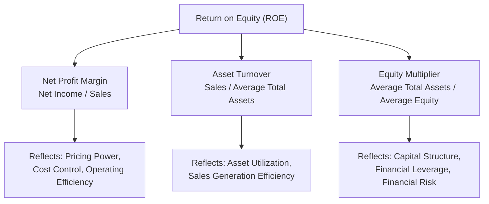

## DuPont Analysis

### Overview

DuPont Analysis is a framework for decomposing Return on Equity (ROE) — and, in an extended form, Return on Assets (ROA) — into its underlying component drivers. Rather than treating ROE as a single opaque number, the DuPont approach reveals *why* a company achieved a given return by separating the contributions of operating profitability, asset efficiency, and financial leverage. Developed originally at the DuPont Corporation in the early 20th century, it remains a foundational diagnostic tool in financial statement analysis for managers.

### Purpose in Managerial Decision-Making

- Diagnose the specific drivers behind a company's or division's ROE, rather than relying on the headline number alone
- Distinguish between performance improvements driven by genuine operating efficiency versus those driven by increased financial risk (leverage)
- Support trend analysis over time, isolating which component (margin, turnover, or leverage) is responsible for changes in overall return
- Enable meaningful comparison between companies or divisions that may achieve similar ROE through very different combinations of margin, efficiency, and leverage
- Inform strategic decision-making by clarifying which specific lever (pricing/cost control, asset utilization, or capital structure) would most effectively improve returns

**Key Points**

- Two companies can report identical ROE while having fundamentally different risk and operating profiles — DuPont analysis is the tool that reveals this difference
- The framework directly links three separate areas of financial statement analysis (profitability, efficiency, and leverage ratios) into a single, unified equation

### The Three-Step (Classic) DuPont Formula

$$ROE = \text{Net Profit Margin} \times \text{Asset Turnover} \times \text{Equity Multiplier}$$

Expressed in full ratio form:

$$ROE = \frac{\text{Net Income}}{\text{Sales}} \times \frac{\text{Sales}}{\text{Average Total Assets}} \times \frac{\text{Average Total Assets}}{\text{Average Stockholders' Equity}}$$

Note that Sales and Average Total Assets cancel algebraically, confirming the identity reduces to the standard ROE formula:

$$ROE = \frac{\text{Net Income}}{\text{Average Stockholders' Equity}}$$

**The Three Components**

| Component | Formula | What It Reveals |
| --- | --- | --- |
| Net Profit Margin | Net Income / Sales | Operating efficiency — how much profit is earned per sales dollar |
| Asset Turnover | Sales / Average Total Assets | Asset utilization efficiency — how much sales are generated per dollar of assets |
| Equity Multiplier | Average Total Assets / Average Equity | Financial leverage — the degree to which assets are financed by debt vs. equity |

### Diagram: The Three-Step DuPont Decomposition

### Worked Example: Three-Step DuPont Analysis

A company reports: Net Income $120,000; Sales $1,500,000; Average Total Assets $1,000,000; Average Stockholders' Equity $500,000.

**Step 1 — Net Profit Margin:**

$$\frac{\$120{,}000}{\$1{,}500{,}000} = 8\%$$

**Step 2 — Asset Turnover:**

$$\frac{\$1{,}500{,}000}{\$1{,}000{,}000} = 1.5 \text{ times}$$

**Step 3 — Equity Multiplier:**

$$\frac{\$1{,}000{,}000}{\$500{,}000} = 2.0$$

**Step 4 — Combine:**

$$ROE = 8\% \times 1.5 \times 2.0 = 24\%$$

**Verification (direct calculation):**

$$ROE = \frac{\$120{,}000}{\$500{,}000} = 24\% \checkmark$$

**Interpretation**: The company's 24% ROE is being driven by a moderate 8% profit margin, reasonably efficient asset utilization (1.5x turnover), and meaningful financial leverage (a 2.0 equity multiplier means half of assets are financed by debt). A manager comparing this to a competitor with the same 24% ROE but a profit margin of 16%, asset turnover of 1.0, and an equity multiplier of 1.5 would recognize these are fundamentally different businesses — the first relies more heavily on leverage and volume, the second on pricing power and margin, despite an identical headline ROE.

### Comparative Scenario: Same ROE, Different Risk Profiles

| Company | Net Profit Margin | Asset Turnover | Equity Multiplier | ROE |
| --- | --- | --- | --- | --- |
| Company A | 8% | 1.5 | 2.0 | 24% |
| Company B | 16% | 1.0 | 1.5 | 24% |
| Company C | 4% | 2.0 | 3.0 | 24% |

**Interpretation**

- All three companies report identical 24% ROE, but Company C achieves this with the thinnest margin (4%) and the highest leverage (3.0 equity multiplier) — indicating a low-margin, high-volume, highly leveraged business model carrying substantially more financial risk than Company B, which achieves the same ROE with strong margins and conservative leverage
- This comparison is the central value proposition of DuPont analysis: it prevents a superficial conclusion that all three companies are "equally good" simply because they share the same ROE

### The Extended (Five-Step) DuPont Formula

The extended DuPont model further decomposes net profit margin into components that isolate the effects of taxes and interest, providing more granular diagnostic power:

$$ROE = \text{Tax Burden} \times \text{Interest Burden} \times \text{Operating Margin} \times \text{Asset Turnover} \times \text{Equity Multiplier}$$

$$ROE = \frac{\text{Net Income}}{\text{Pretax Income}} \times \frac{\text{Pretax Income}}{\text{EBIT}} \times \frac{\text{EBIT}}{\text{Sales}} \times \frac{\text{Sales}}{\text{Average Total Assets}} \times \frac{\text{Average Total Assets}}{\text{Average Equity}}$$

**The Five Components**

| Component | Formula | What It Reveals |
| --- | --- | --- |
| Tax Burden | Net Income / Pretax Income | Effect of taxes on profitability (1 − effective tax rate) |
| Interest Burden | Pretax Income / EBIT | Effect of interest expense on profitability |
| Operating Margin | EBIT / Sales | Core operating profitability, before interest and taxes |
| Asset Turnover | Sales / Average Total Assets | Asset utilization efficiency |
| Equity Multiplier | Average Total Assets / Average Equity | Financial leverage |

**Key Points**

- The extended model separates the effects of financing decisions (interest burden, captured in the interest burden ratio) from the effects of core operations (operating margin), whereas the three-step model bundles both into a single net profit margin figure
- This separation is particularly useful when comparing companies with different capital structures or tax situations, since it isolates *operating* performance from *financing and tax* effects

### Worked Example: Extended Five-Step DuPont Analysis

Using: EBIT $200,000; Interest Expense $40,000; Pretax Income $160,000; Tax Expense $40,000; Net Income $120,000; Sales $1,500,000; Average Total Assets $1,000,000; Average Equity $500,000.

**Tax Burden:**

$$\frac{\$120{,}000}{\$160{,}000} = 0.75$$

**Interest Burden:**

$$\frac{\$160{,}000}{\$200{,}000} = 0.80$$

**Operating Margin:**

$$\frac{\$200{,}000}{\$1{,}500{,}000} = 13.33\%$$

**Asset Turnover:**

$$\frac{\$1{,}500{,}000}{\$1{,}000{,}000} = 1.5$$

**Equity Multiplier:**

$$\frac{\$1{,}000{,}000}{\$500{,}000} = 2.0$$

**Combine:**

$$ROE = 0.75 \times 0.80 \times 13.33\% \times 1.5 \times 2.0 = 24\%$$

**Interpretation**: This matches the three-step result (24%) but now reveals that the company retains 75% of pretax income after taxes (tax burden of 0.75) and 80% of EBIT after interest (interest burden of 0.80). If interest expense were to rise, the interest burden ratio would fall, immediately isolating that effect from the core operating margin — a distinction the three-step model cannot make on its own.

### DuPont Analysis and ROA

A simplified two-component version of DuPont applies directly to Return on Assets:

$$ROA = \text{Net Profit Margin} \times \text{Asset Turnover}$$

$$ROA = \frac{\text{Net Income}}{\text{Sales}} \times \frac{\text{Sales}}{\text{Average Total Assets}} = \frac{\text{Net Income}}{\text{Average Total Assets}}$$

**Key Points**

- This is essentially the ROE formula with the equity multiplier (leverage component) removed, isolating pure operating and asset-utilization performance from the effects of financing decisions
- Useful for comparing the underlying operating efficiency of companies or divisions independent of how they are financed

### Using DuPont Analysis for Divisional Performance Evaluation

In managerial accounting specifically, a parallel decomposition applies to **Return on Investment (ROI)** for evaluating divisions or business segments:

$$ROI = \text{Return on Sales} \times \text{Investment Turnover} = \frac{\text{Operating Income}}{\text{Sales}} \times \frac{\text{Sales}}{\text{Average Invested Capital}}$$

**Key Points**

- This divisional application follows the same underlying logic as DuPont ROE analysis — decomposing an overall return measure into a margin component and a turnover/efficiency component — but uses operating income and invested capital rather than net income and equity, making it more directly relevant to evaluating a division's core operating performance
- A division manager seeking to improve ROI can use this decomposition to identify whether the more effective lever is improving margin (pricing, cost control) or improving asset turnover (reducing idle assets, increasing sales per dollar invested)

### Trend Analysis Using DuPont

**Key Points**

- Tracking each DuPont component over multiple periods reveals *which* driver is responsible for a change in overall ROE — for example, a declining ROE trend might be traced specifically to eroding profit margins (competitive pricing pressure) rather than declining asset turnover or reduced leverage, directing management attention to the correct area for corrective action
- This period-over-period decomposition is often more actionable for management than the trend in ROE alone, since it identifies a specific operational or financial area to investigate rather than leaving the cause ambiguous

### Common Pitfalls

- **Treating a high ROE as unambiguously positive without decomposing it**: a high ROE driven primarily by high leverage (a large equity multiplier) reflects elevated financial risk, not necessarily superior operating performance
- **Ignoring average balances**: using ending balance sheet figures instead of period averages for total assets and equity can distort the turnover and leverage components, especially when balances change significantly during the period
- **Overlooking industry context when comparing components**: "normal" levels for profit margin and asset turnover vary substantially by industry (e.g., grocery retailers typically show low margin/high turnover, while luxury goods often show the reverse), so component-level comparisons require industry-adjusted context
- **Using the three-step model when the extended model would reveal more**: when interest expense or tax rates differ meaningfully between compared entities or over time, the three-step model's bundled net profit margin can mask which specific factor (operations, interest burden, or tax burden) is driving a change

### Managerial Implications

- DuPont analysis operationalizes the principle that "ROE is not a single lever" — it directs managers toward the specific operational or financial area (margin, efficiency, or leverage) most responsible for current performance and most promising for future improvement
- Because the equity multiplier component directly reflects capital structure choices, DuPont analysis links profitability analysis to capital structure and financing decisions, making it a natural bridge between the Profitability Ratios and Leverage/Solvency Ratios topics in financial statement analysis
- The divisional ROI-based parallel to DuPont supports responsibility accounting by clarifying to a division manager exactly which component of performance (margin or turnover) they should focus on to improve their evaluated return measure

**Related Topics**

- Profitability Ratios (Margins, ROA, ROE, ROI)
- Leverage and Solvency Ratios (Equity Multiplier, Debt Ratios)
- Efficiency and Activity Ratios (Asset Turnover Components)
- Return on Investment, Residual Income, and Economic Value Added (EVA)
- Responsibility Accounting and Divisional Performance Evaluation
- Trend and Comparative Financial Statement Analysis