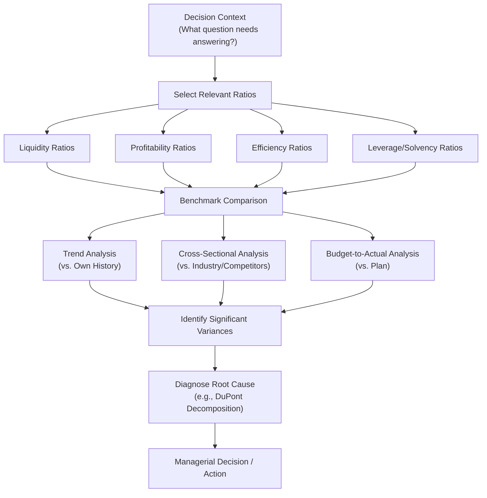

## Using Financial Analysis in Managerial Decision Making

### Overview

Financial statement analysis is not an end in itself — its value to managers lies in how ratios, trends, and comparative data translate into actionable decisions. This topic synthesizes the individual ratio categories (liquidity, profitability, efficiency, leverage) covered elsewhere in this chapter into an integrated framework for applying financial analysis to real managerial decisions: performance evaluation, capital allocation, operational improvement, and strategic planning.

### The Analytical Process: From Ratios to Decisions

Effective use of financial analysis in management follows a structured process rather than calculating ratios in isolation:

1. **Establish the decision context** — identify the specific question the analysis must answer (e.g., "Should we expand this product line?" "Is Division X underperforming?" "Can we take on additional debt?")
2. **Select relevant ratios** — choose the specific liquidity, profitability, efficiency, or leverage ratios that speak directly to the decision context, rather than calculating every possible ratio
3. **Establish a benchmark** — compare the ratios against a meaningful reference point (see Benchmarking Approaches below)
4. **Identify significant variances** — determine which differences from the benchmark are large enough to warrant investigation (materiality and management by exception)
5. **Diagnose root causes** — use ratio decomposition (e.g., DuPont analysis) and cross-ratio analysis to identify the underlying driver of any significant variance
6. **Translate into action** — connect the diagnosis to a specific managerial decision or corrective action

**Key Points**

- Ratios by themselves are descriptive, not prescriptive — the same ratio value can call for different management responses depending on context, strategy, and the underlying cause
- Skipping the "diagnose root causes" step is a common failure mode: reacting to a ratio's surface-level movement without understanding why it moved often leads to ineffective or even counterproductive corrective actions

### Benchmarking Approaches

**Trend (Time-Series) Analysis**

Comparing a company's own ratios across multiple periods to identify improving or deteriorating patterns.

- Strength: controls for company-specific factors (business model, industry norms) since the company is compared only to itself
- Limitation: does not reveal whether the company's *absolute* performance level is competitive, only whether it is improving or declining relative to its own history

**Cross-Sectional (Industry/Competitor) Analysis**

Comparing a company's ratios to industry averages or specific competitors at a point in time.

- Strength: reveals competitive positioning and whether performance is strong or weak relative to peers facing similar market conditions
- Limitation: requires careful selection of genuinely comparable companies (similar size, business model, accounting policies); differences in accounting methods (e.g., FIFO vs. LIFO inventory, depreciation methods) can distort cross-company comparisons if not adjusted for

**Budget-to-Actual Analysis**

Comparing actual ratios or financial results to budgeted/planned figures.

- Strength: directly ties financial analysis to the organization's own strategic and operational plans, and supports the flexible-budget-based variance analysis covered elsewhere in this course
- Limitation: only as useful as the quality and realism of the budget itself; an unrealistic budget produces misleading variances

**Key Points**

- The three approaches are complementary rather than mutually exclusive; a robust managerial analysis typically triangulates using more than one benchmarking method, since each addresses a different limitation of the others

### Diagram: Integrated Financial Analysis Framework

### Applying Ratio Categories to Specific Managerial Decisions

**Liquidity Ratios → Working Capital and Financing Decisions**

- A declining current or quick ratio may prompt a manager to tighten credit and collection policies, negotiate extended payment terms with suppliers, or arrange a short-term line of credit before a cash shortfall becomes acute
- Rising Days Sales Outstanding alongside stable liquidity ratios might mask an emerging collections problem that hasn't yet shown up in the aggregate liquidity numbers, prompting proactive review of the accounts receivable aging schedule

**Profitability Ratios → Pricing, Cost Control, and Investment Decisions**

- Declining gross margin, isolated through margin-ratio trend analysis, directs attention specifically to production cost control or pricing strategy, rather than broader operating expense management
- A DuPont decomposition showing declining ROE driven by falling asset turnover (rather than margin or leverage) would direct management toward asset utilization initiatives — such as divesting underperforming assets or increasing sales volume — rather than cost-cutting or pricing initiatives that would not address the actual driver

**Efficiency Ratios → Working Capital and Operational Improvement Decisions**

- A lengthening Cash Conversion Cycle prompts investigation into whether the cause is slower inventory turnover, slower collections, or faster payments to suppliers — each pointing to a different corrective action (inventory management, credit policy, or payables strategy, respectively)
- Low fixed asset turnover in a capital-intensive division might inform a capital budgeting decision to delay or reconsider additional fixed asset investment until existing capacity is better utilized

**Leverage/Solvency Ratios → Capital Structure and Financing Decisions**

- A declining Times Interest Earned ratio, even with stable or growing net income, may signal that recent debt-financed expansion is straining the company's interest coverage margin, informing a more conservative approach to future debt financing
- Comparing the debt-to-equity ratio against loan covenant requirements is a direct, ongoing managerial monitoring task to avoid technical default

### Worked Example: Integrated Decision-Making Scenario

A division reports declining ROI over three years: Year 1: 18%, Year 2: 15%, Year 3: 11%. Management must decide whether to approve a requested capital investment for the division or reallocate capital elsewhere.

**Step 1 — Decompose ROI (Return on Sales × Investment Turnover):**

| Year | Return on Sales | Investment Turnover | ROI |
| --- | --- | --- | --- |
| Year 1 | 12% | 1.5 | 18% |
| Year 2 | 12% | 1.25 | 15% |
| Year 3 | 11% | 1.0 | 11% |

**Step 2 — Diagnose**: Return on Sales has remained relatively stable (12% → 12% → 11%), but Investment Turnover has declined sharply (1.5 → 1.25 → 1.0). This isolates the cause of declining ROI to **asset utilization**, not pricing or cost control.

**Step 3 — Investigate further using efficiency ratios**: Suppose further analysis reveals the division's fixed asset base grew substantially over the three years (new equipment purchases) while sales grew only modestly — indicating underutilized capacity rather than a demand problem or cost problem.

**Step 4 — Decision**: Approving *additional* capital investment before addressing the existing underutilized capacity would likely worsen the Investment Turnover component further, continuing the ROI decline. A more appropriate managerial response would be to first focus on increasing sales volume to better utilize existing capacity — through marketing, capacity-sharing, or reconsidering underperforming assets for divestiture — before approving further capital investment in the division.

**Interpretation**: This example demonstrates the core value proposition of the integrated analytical process: a surface-level ROI trend alone might have prompted either an uninformed capital investment decision or an uninformed blanket cost-cutting response. The DuPont-style decomposition redirected the decision toward the actual underlying driver.

### Qualitative Considerations Alongside Quantitative Analysis

**Key Points**

- Ratios are calculated from historical, backward-looking financial statement data and should be interpreted alongside qualitative factors: competitive dynamics, regulatory changes, macroeconomic conditions, management quality, and strategic initiatives not yet reflected in financial results
- Non-financial and leading indicators (customer satisfaction, employee turnover, order backlog) often provide earlier signals than financial ratios, which are inherently lagging — this is a central reason organizations increasingly supplement ratio analysis with the Balanced Scorecard and broader Key Performance Indicator frameworks
- One-time or non-recurring items (asset write-offs, litigation settlements, restructuring charges) can distort ratios in a single period; managers should adjust for or separately flag these items to avoid drawing incorrect conclusions about ongoing operating performance

### Common Pitfalls

- **Analyzing ratios in isolation** rather than as an interconnected system — for example, evaluating profitability without considering the leverage that helped produce it, or evaluating liquidity without considering the efficiency ratios that explain *why* current assets aren't converting to cash as quickly as expected
- **Failing to establish a clear decision context before selecting ratios** — calculating a comprehensive set of ratios without a specific question in mind often produces information overload without actionable insight
- **Relying on a single benchmarking approach**: trend analysis alone can miss weak absolute performance if the company is simply improving from a poor starting point; industry comparison alone can miss genuine company-specific deterioration if the whole industry is declining together
- **Ignoring accounting policy differences** when benchmarking against competitors — differences in depreciation methods, inventory costing (FIFO/LIFO), or lease accounting treatment can create ratio differences that reflect accounting choices rather than genuine operating differences
- **Treating financial ratios as sufficient on their own** without incorporating qualitative context or forward-looking non-financial indicators, especially in fast-changing competitive or technological environments

### Managerial Implications

- Effective managers use financial analysis as a **diagnostic tool that directs attention**, not as a mechanical scorecard — the goal is to identify *where* to look further and *what specific action* is warranted, not merely to report whether a ratio moved up or down
- Because different ratio categories often interact (e.g., improving efficiency ratios can directly improve profitability ratios like ROI through the turnover component), a decision informed by only one ratio category risks missing more effective levers available in another category
- Integrating financial ratio analysis with the Balanced Scorecard and non-financial KPIs (covered under Strategic Performance Measurement) provides a more complete and forward-looking basis for managerial decision-making than financial ratios alone

**Related Topics**

- Liquidity Ratios
- Profitability Ratios
- Efficiency and Activity Ratios
- Leverage and Solvency Ratios
- DuPont Analysis
- Key Performance Indicators and the Balanced Scorecard
- Flexible Budgets and Variance Analysis