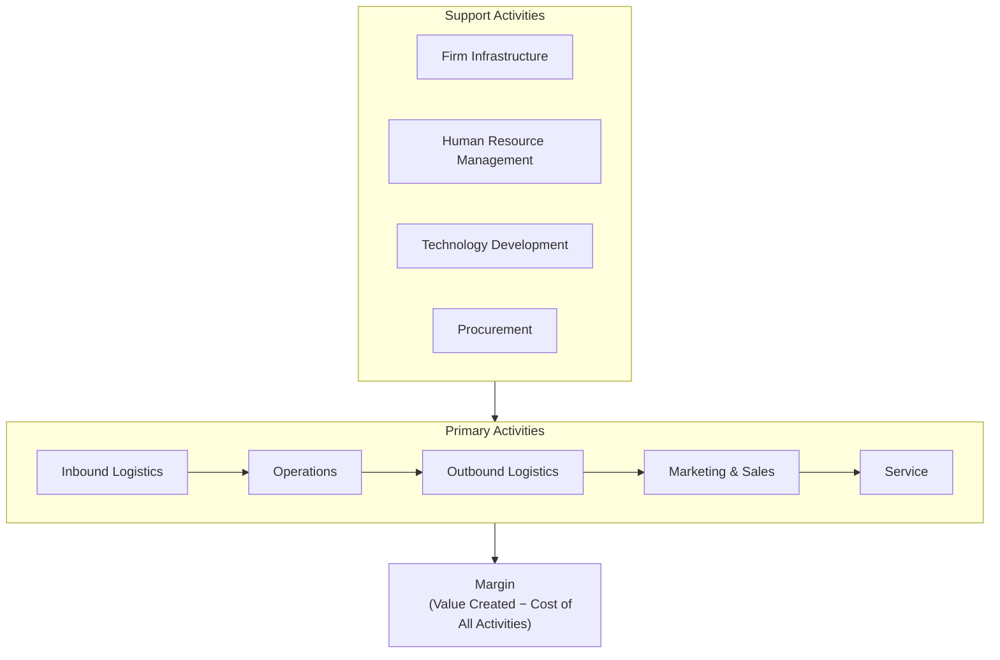
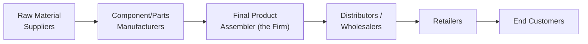

## Value Chain Analysis

### Overview

Value Chain Analysis is a strategic cost management framework that examines the full sequence of activities a company performs — from raw materials through to after-sales support — to identify where value is created for customers and where costs are incurred. Originally popularized by Michael Porter, the value chain concept has become a central tool in managerial accounting for understanding cost drivers, competitive advantage, and opportunities for cost reduction or differentiation across the entire chain of activities, not just within the company's own factory walls.

### Purpose in Strategic Cost Management

- Identify which activities create the most value for customers and which activities merely add cost without corresponding value
- Reveal opportunities to reduce costs or enhance differentiation at each stage of the chain
- Extend cost analysis beyond the boundaries of the individual firm to include suppliers, distribution channels, and customers — recognizing that competitive advantage often depends on how well a company manages linkages across this extended chain
- Support strategic decisions about which activities to perform in-house versus outsource, based on where the company can create the most value relative to cost
- Provide the analytical foundation for target costing, activity-based costing, and other strategic cost management tools covered elsewhere in this chapter

**Key Points**

- Value chain analysis takes an **external, customer-focused perspective** — an activity is evaluated based on the value it creates for the end customer, not merely on internal efficiency metrics
- The value chain extends beyond the individual company to include upstream suppliers and downstream distributors/customers — this broader view is sometimes called the **industry value chain**, distinguishing it from the internal, firm-specific value chain

### Porter's Generic Value Chain Model

Porter's original framework divides a firm's activities into two categories:

**Primary Activities** (directly involved in creating and delivering the product/service)

1. **Inbound Logistics** — receiving, storing, and internally distributing inputs (e.g., raw materials handling, warehousing)
2. **Operations** — transforming inputs into the final product or service (e.g., manufacturing, assembly, machining)
3. **Outbound Logistics** — collecting, storing, and distributing the finished product to customers (e.g., order fulfillment, warehousing of finished goods, transportation)
4. **Marketing and Sales** — activities that inform customers about the product and induce them to purchase (e.g., advertising, sales force, pricing, channel selection)
5. **Service** — activities that maintain or enhance product value after sale (e.g., installation, repair, customer support, training)

**Support Activities** (enable primary activities and each other)

1. **Firm Infrastructure** — general management, planning, finance, accounting, legal, quality management
2. **Human Resource Management** — recruiting, hiring, training, development, and compensation of personnel
3. **Technology Development** — R&D, process automation, product design, IT systems
4. **Procurement** — purchasing of inputs used throughout the value chain (raw materials, equipment, supplies)

**Key Points**

- Support activities are not confined to supporting a single primary activity — each support activity, particularly Firm Infrastructure, typically supports the entire chain
- **Margin** in Porter's model represents the difference between total value created and the collective cost of performing all value activities — the ultimate measure of value-chain-generated value the firm has managed to capture

### Diagram: Porter's Generic Value Chain

### Cost and Differentiation Analysis Using the Value Chain

Value chain analysis supports two complementary strategic lenses:

**Cost Analysis**

- Assign costs to each value chain activity to identify which activities consume the most resources
- Compare the cost of each activity against competitors' costs for the same activity (where data is available) to identify relative cost advantages or disadvantages
- Identify **cost drivers** — the factors that cause costs to be incurred within each activity — to understand *why* an activity costs what it does, not merely *how much* it costs

**Differentiation Analysis**

- Identify which activities most influence the customer's perception of value (e.g., product quality, brand reputation, service responsiveness, delivery reliability)
- Assess whether the cost of enhancing a given activity is justified by the additional value (and price premium or volume) it generates for customers
- Recognize that differentiation and cost leadership are not always mutually exclusive at the individual activity level — a company might pursue cost efficiency in some activities (e.g., procurement, inbound logistics) while investing more heavily in differentiation in others (e.g., R&D, service)

**Key Points**

- These two lenses correspond to Porter's two generic competitive strategies (cost leadership and differentiation); value chain analysis provides the activity-level detail needed to pursue either strategy deliberately, rather than by default

### Linkages Within and Across the Value Chain

**Internal Linkages**

Relationships between activities within the firm's own value chain, where the way one activity is performed affects the cost or performance of another.

**Example**: Investing more in supplier quality inspection (Procurement) may reduce defect rates in Operations, lowering rework and scrap costs — illustrating how activities are interdependent rather than independent cost centers.

**Vertical Linkages (Supplier and Customer Linkages)**

Relationships between the firm's value chain and the value chains of its suppliers and customers.

**Example**: A supplier that delivers just-in-time, pre-inspected components can reduce the buyer's Inbound Logistics and quality-inspection costs — meaning cost reduction opportunities exist not just within the firm, but in how the firm coordinates with its suppliers.

**Key Points**

- Managing linkages effectively often requires **cross-functional and cross-organizational coordination**, since optimizing a single activity in isolation (e.g., minimizing procurement cost alone) can increase total costs elsewhere in the chain (e.g., higher defect rates and rework in Operations) if the linkage effect is ignored
- This linkage perspective is a key reason strategic cost management looks beyond simple department-level cost minimization toward whole-chain (and whole-industry-chain) cost optimization

### The Industry Value Chain: Extending Beyond the Firm

The **industry value chain** encompasses the full sequence of value-creating activities from raw material extraction through to final consumer use and disposal, spanning multiple firms:

**Key Points**

- A firm's competitive position depends not only on how efficiently it manages its own internal value chain, but on how well it positions itself and coordinates within this broader industry value chain
- Strategic decisions about **vertical integration** (whether to perform upstream or downstream activities in-house or rely on external firms) are directly informed by industry value chain analysis — a firm may choose to integrate backward (e.g., acquiring a key supplier) or forward (e.g., acquiring a distributor) when doing so captures more value or reduces coordination costs relative to relying on external firms

### Worked Example: Applying Value Chain Analysis

A furniture manufacturer conducts a value chain analysis and finds:

| Activity | Annual Cost | % of Total Cost | Customer Value Impact |
| --- | --- | --- | --- |
| Inbound Logistics | $400,000 | 8% | Low |
| Operations | $2,000,000 | 40% | Medium |
| Outbound Logistics | $600,000 | 12% | Medium |
| Marketing & Sales | $800,000 | 16% | High |
| Service | $300,000 | 6% | High |
| Support Activities (combined) | $900,000 | 18% | Low-Medium |

**Analysis**:

- Operations represents the largest cost category (40%) but only medium customer value impact, suggesting this is the primary target for cost-efficiency initiatives (e.g., process improvement, automation, waste reduction) since cost reductions here are unlikely to harm customer-perceived value significantly
- Marketing & Sales and Service together represent 22% of cost but are rated as having high customer value impact — these activities may be better candidates for continued or even increased investment, since they directly drive customer perception and retention, rather than targets for cost-cutting
- Inbound Logistics, at only 8% of cost with low customer value impact, might be evaluated for outsourcing or supplier-linkage improvements (e.g., vendor-managed inventory) rather than internal cost-cutting programs, since the potential savings are modest relative to other activities

**Interpretation**: This activity-by-activity breakdown, cross-referenced against customer value impact, gives management a structured basis for allocating cost-reduction and investment effort — avoiding an across-the-board cost-cutting approach that might inadvertently damage high-value activities (like Service) while leaving genuinely inefficient, lower-value activities (like Operations, relative to its cost share) under-addressed.

### Value Chain Analysis and Make-or-Buy / Outsourcing Decisions

**Key Points**

- Activities that are high-cost but low in customer-perceived value, and where external providers can perform the activity more efficiently, are natural candidates for outsourcing
- Activities that are central to the firm's competitive differentiation (high customer value impact) are generally better retained in-house, even if a lower-cost external alternative exists, because control over quality and consistency is often critical to the value being created
- This reasoning connects value chain analysis directly to make-or-buy decision frameworks and relevant costing analysis covered in short-term decision-making topics — the value chain provides the strategic context, while relevant cost analysis provides the quantitative decision mechanics

### Comparison Table: Value Chain Analysis vs. Traditional Cost Analysis

| Aspect | Traditional Cost Analysis | Value Chain Analysis |
| --- | --- | --- |
| Scope | Internal, often department/product-focused | Full chain: internal activities plus supplier and customer linkages |
| Perspective | Cost minimization | Value creation relative to cost, from the customer's perspective |
| Boundary | Firm-level | Industry-level (extends to suppliers and distribution/customers) |
| Focus | "How much does this cost?" | "Does this activity's cost match the value it creates for the customer?" |
| Strategic Use | Operational efficiency, budgeting | Competitive positioning, vertical integration, outsourcing, differentiation strategy |

### Common Pitfalls

- **Treating value chain analysis as purely a cost-cutting exercise**: the framework's core value lies in relating cost to customer-perceived value — cutting cost in a high-value activity to hit a cost target can damage competitive position even while improving short-term reported cost metrics
- **Confining analysis to internal activities only**: ignoring supplier and customer linkages misses significant opportunities for cost reduction or value enhancement that arise specifically from cross-organizational coordination
- **Applying Porter's generic categories too rigidly**: the specific activities relevant to a given company may not map perfectly onto the generic model, especially for service businesses or digital/platform business models; the framework should be adapted to the specific business context rather than mechanically applied [Inference — a widely recognized practical caveat regarding the origin of the framework in traditional manufacturing/physical-product contexts, not a specific documented limitation from a single source]
- **Failing to quantify customer value impact rigorously**: without reasonably objective measures (customer surveys, willingness-to-pay studies, competitive benchmarking) qualitative "value impact" ratings can become subjective or biased toward activities that are simply easier to defend internally

### Managerial Implications

- Value chain analysis directs strategic cost management attention toward the *relationship* between cost and customer value at each stage of the chain, rather than pursuing uniform cost reduction across all activities
- Understanding vertical linkages with suppliers and customers supports more sophisticated sourcing, partnership, and vertical integration decisions than internal-only cost analysis would reveal
- The framework provides essential strategic context for related tools covered later in this chapter, including target costing (which uses value chain cost breakdowns to identify where cost reduction must occur to hit a target cost) and activity-based costing (which provides the more granular cost driver data needed to cost individual value chain activities accurately)

**Related Topics**

- Target Costing and Cost Reduction Strategies
- Activity-Based Costing and Cost Driver Analysis
- Make-or-Buy and Outsourcing Decisions
- Competitive Strategy: Cost Leadership vs. Differentiation
- Supply Chain Management and Vendor Relationships
- Life-Cycle Costing