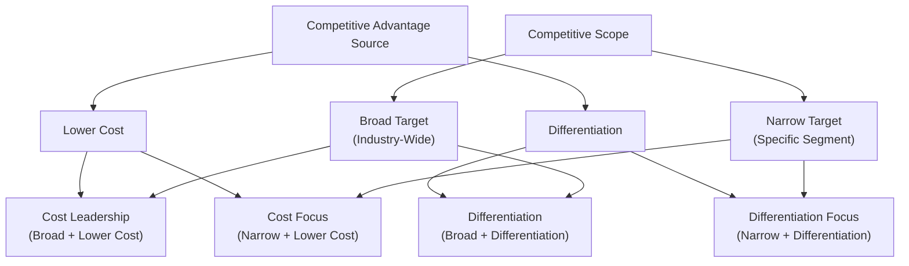

## Cost Leadership and Differentiation Strategies

### Overview

Cost leadership and differentiation are two of Michael Porter's generic competitive strategies, representing fundamentally different approaches a firm can take to achieve competitive advantage. In strategic cost management, these strategies shape how a company designs its cost structure, allocates resources across the value chain, and uses managerial accounting tools to support its chosen strategic direction. The choice between these strategies (or a combination) drives which costs matter most, which performance metrics are prioritized, and how cost management systems should be designed.

### The Two Generic Strategies

**Cost Leadership**

A strategy of becoming the lowest-cost producer in an industry, enabling the firm to either underprice competitors while maintaining acceptable margins, or match competitor prices while earning higher margins.

**Differentiation**

A strategy of offering products or services with unique attributes that customers value highly enough to pay a premium price, reducing direct price competition and building customer loyalty around distinctive features.

**Key Points**

- Porter's framework also identifies **focus strategies** (cost focus and differentiation focus), which apply either generic strategy to a narrow market segment rather than an entire industry
- A firm that fails to clearly commit to either strategy risks becoming "stuck in the middle" — lacking the cost structure to compete on price and lacking the differentiation to command a premium, typically resulting in below-average profitability [Inference — this is Porter's original theoretical claim about the risks of an unclear strategic position, not an empirically universal outcome in every industry context]

### Diagram: Porter's Generic Competitive Strategies

### Cost Leadership Strategy in Detail

**Key Characteristics**

- Relentless focus on cost reduction across all value chain activities, particularly Operations, Procurement, and Inbound/Outbound Logistics
- Standardized products with limited customization, enabling economies of scale and manufacturing efficiency
- Aggressive pursuit of experience-curve effects, economies of scale, and process efficiencies
- Tight cost control systems, including detailed variance analysis and continuous cost monitoring

**Supporting Managerial Accounting Tools**

- **Standard costing and variance analysis** — critical for monitoring and controlling costs against tight targets
- **Activity-based costing (ABC)** — helps identify and eliminate non-value-added activities and cost drivers that inflate cost without corresponding value
- **Target costing** — used aggressively to ensure new products are designed from the outset to meet strict cost targets
- **Economies of scale and capacity utilization analysis** — since spreading fixed costs over higher volume is often central to achieving a cost advantage

**Sources of Cost Advantage**

- Economies of scale (lower per-unit fixed costs at higher volume)
- Experience curve effects (cost reductions from cumulative production experience and process learning)
- Efficient, often proprietary, process technology
- Favorable access to raw materials or lower input costs
- Simplified product design that reduces manufacturing complexity and cost

**Example**

A generic pharmaceutical manufacturer pursues cost leadership by producing off-patent drugs at massive scale, using highly standardized manufacturing processes, aggressively negotiating raw material contracts, and monitoring cost variances closely through standard costing systems. Its competitive advantage rests entirely on being able to profitably sell at lower prices than differentiated, branded competitors, since its products are otherwise chemically identical.

### Differentiation Strategy in Detail

**Key Characteristics**

- Investment in unique product features, quality, brand image, customer service, innovation, or design that customers value and are willing to pay a premium for
- Willingness to incur higher costs in specific value chain activities (e.g., R&D, marketing, service) if the resulting price premium or volume increase exceeds the additional cost
- Less emphasis on being the lowest-cost producer; cost management still matters, but the primary competitive lever is perceived value, not price

**Supporting Managerial Accounting Tools**

- **Value chain analysis** — used to identify which specific activities most influence customer-perceived differentiation, directing investment accordingly
- **Life-cycle costing** — supports investment decisions in R&D and product development, since differentiation often requires understanding total costs and revenues across a product's entire life, not just current-period costs
- **Customer profitability analysis** — helps assess whether the premium captured from differentiated customer segments justifies the added cost of serving them
- **Quality costing** — since differentiation often relies on superior quality, tracking prevention, appraisal, and failure costs supports the investment case for quality-related differentiation

**Sources of Differentiation Advantage**

- Superior product quality or performance
- Strong brand reputation and image
- Innovative features or technology
- Superior customer service and support
- Reliable, fast delivery and availability
- Customization and flexibility to meet specific customer needs

**Example**

A specialty consumer electronics company pursues differentiation by investing heavily in R&D for distinctive design and features, premium materials, an extensive retail service and support network, and marketing that builds strong brand loyalty. Its cost structure is higher than cost-leadership competitors, but its pricing power — driven by customers' willingness to pay a premium for the differentiated experience — supports strong margins despite the higher costs.

### Comparison Table: Cost Leadership vs. Differentiation

| Dimension | Cost Leadership | Differentiation |
| --- | --- | --- |
| Primary competitive lever | Lowest cost in the industry | Unique, valued product/service attributes |
| Pricing approach | Match or undercut competitor prices | Premium pricing supported by perceived value |
| Product strategy | Standardized, limited variation | Customized or distinctively featured |
| Key cost management focus | Tight cost control, standard costing, variance analysis | Value chain and customer profitability analysis, quality costing |
| Risk of imitation | Vulnerable to a lower-cost entrant or new technology | Vulnerable to erosion of the differentiating feature's perceived value |
| Typical cost structure | Lower cost base, often high fixed-cost/high-volume model | Higher cost base, offset by premium pricing/margins |
| Customer sensitivity | Price-sensitive customers | Customers valuing quality, brand, or unique features over price |

### Costing System Design Implications by Strategy

**Key Points**

- A firm pursuing **cost leadership** typically benefits from a costing system emphasizing precision in cost measurement, tight standard-setting, and frequent variance reporting, since even small cost overruns can erode the thin margin advantage the strategy depends on
- A firm pursuing **differentiation** typically benefits from a costing system that captures the *value impact* of specific activities (value chain analysis, customer profitability analysis) alongside cost, since decisions center on whether additional spending is justified by additional customer value captured, not on minimizing cost per se
- Applying a cost-leadership-oriented costing system (rigid standard costing, aggressive cost-cutting incentives) to a differentiation-strategy business risks undermining the very features that create the firm's competitive advantage — for example, cutting R&D or customer service costs to hit a variance target could directly erode the differentiation the strategy depends on [Inference — a strategic alignment principle widely discussed in strategic cost management literature, illustrating the risk of a costing-system/strategy mismatch rather than a specific documented case]

### Hybrid and Combined Strategies

**Key Points**

- Some firms pursue elements of both strategies simultaneously — sometimes called "best-cost" or hybrid strategies — offering differentiated features at a cost structure that still supports competitive pricing
- This is generally considered difficult to sustain, since cost leadership and differentiation often require different organizational cultures, cost structures, and resource allocation priorities; firms straddling both risk falling into the "stuck in the middle" position described above if neither capability is developed to a genuinely competitive level [Inference — reflects Porter's original caution about combined strategies, presented here as a widely cited theoretical caveat rather than an absolute rule precluding successful hybrid strategies in every case]
- Where hybrid strategies succeed, they often rely on operational innovations (e.g., lean manufacturing, platform-based product design allowing customization at scale) that reduce the traditional trade-off between cost and differentiation, rather than simply attempting both approaches with conventional cost structures

### Worked Example: Strategic Cost Management Alignment

Two companies in the same industry (furniture manufacturing) illustrate contrasting strategic and cost management choices:

**Company A — Cost Leadership**

- Standardized flat-pack furniture designs, minimal SKU variety
- Single large manufacturing facility maximizing economies of scale
- Uses standard costing with tight variance thresholds (investigating any variance over 3%) [Inference — illustrative threshold for the example, not a universal standard]
- Procurement focused on lowest-cost suppliers meeting minimum quality specifications
- Minimal after-sale service; customers self-install

**Company B — Differentiation**

- Custom and semi-custom furniture with extensive material and design options
- Smaller, flexible manufacturing cells supporting customization
- Uses activity-based costing to understand the true cost of customization options, informing premium pricing for high-complexity choices
- Procurement focused on premium, sustainably sourced materials supporting brand positioning
- Extensive white-glove delivery and installation service, contributing to brand loyalty

**Interpretation**: Each company's costing system is deliberately aligned with its chosen strategy. Company A's tight standard-cost variance monitoring supports its need for cost discipline at scale; Company B's activity-based costing supports pricing decisions for customization options central to its differentiation strategy. A costing system swap between the two companies would poorly serve either — Company A does not need granular activity-based cost data for options it does not offer, while Company B's competitive advantage would be undermined by an overly rigid standard-cost variance system that might pressure it to reduce the very customization and service investments that create its differentiation.

### Common Pitfalls

- **Failing to align the costing system with the chosen strategy**: using detailed, differentiation-oriented cost analysis (e.g., extensive customer profitability analysis) in a cost-leadership business can create unnecessary administrative cost without supporting the actual strategic decision needs; conversely, using rigid, cost-leadership-style variance analysis in a differentiation business risks undermining differentiating investments
- **Pursuing an unclear or shifting strategic position**: attempting to be simultaneously the lowest-cost and most differentiated option without a clear resource-allocation priority increases the risk of the "stuck in the middle" outcome
- **Treating cost leadership as synonymous with "cutting costs everywhere"**: genuine cost leadership requires strategic cost reduction focused on activities that do not undermine the minimum quality or features customers require, not indiscriminate cost cutting
- **Assuming differentiation justifies unlimited cost increases**: a differentiation strategy still requires rigorous analysis (e.g., customer profitability analysis) to confirm that premium pricing or volume gains actually exceed the additional costs incurred — differentiation without disciplined cost-benefit analysis can erode profitability just as easily as an unfocused cost strategy

### Managerial Implications

- The choice between cost leadership and differentiation should directly shape the design of the organization's cost management and performance measurement systems — there is no single "best" costing approach independent of strategic context
- Managers should periodically reassess whether the firm's actual resource allocation and costing system priorities remain aligned with its intended strategic position, since organizational drift toward an unclear or contradictory strategic position can occur gradually
- Understanding which generic strategy a firm (or a specific business unit within a diversified firm) is pursuing is a prerequisite for correctly interpreting the profitability and cost ratios covered elsewhere in this course — the same financial ratio pattern can represent success under one strategy and concerning weakness under the other

**Related Topics**

- Value Chain Analysis
- Target Costing and Cost Reduction Strategies
- Activity-Based Costing and Cost Driver Analysis
- Customer Profitability Analysis
- Life-Cycle Costing
- Quality Costing (Cost of Quality Framework)