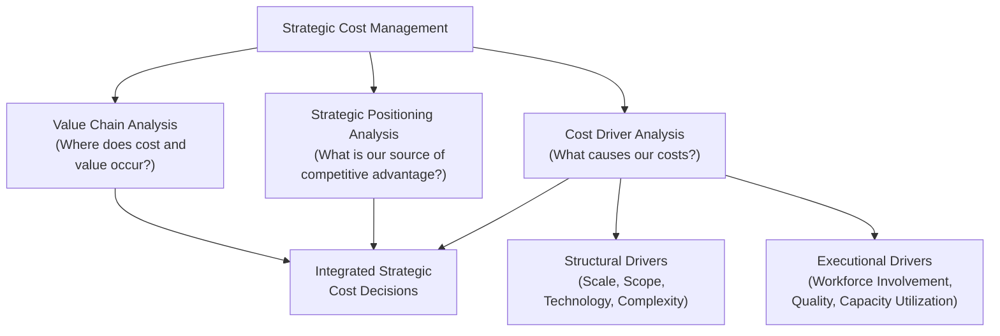

## Strategic Positioning and Cost Management

### Overview

Strategic positioning refers to the deliberate choices a firm makes about which activities to perform, how to perform them, and which customers and markets to serve, in order to establish a sustainable competitive advantage. In strategic cost management, positioning analysis provides the overarching frame that determines which costs matter most, how cost information should be structured, and which cost management tools are most relevant to a given firm's chosen path. This topic synthesizes the strategic frameworks covered elsewhere in this chapter (value chain analysis, cost leadership vs. differentiation) into a broader view of how strategy and cost management are interdependent.

### Strategic Cost Management Defined

**Strategic Cost Management (SCM)** is the deliberate use of cost information explicitly directed at supporting an organization's overall strategy, as distinct from traditional cost accounting, which primarily focuses on tracking and controlling costs for financial reporting and operational efficiency purposes.

**Key Points**

- Traditional cost management asks: "How do we minimize this cost?" Strategic cost management asks: "Is this cost consistent with, and does it support, our chosen strategic position?"
- SCM integrates three interrelated concepts covered in this chapter: **value chain analysis** (where value and cost occur across the full chain), **strategic positioning analysis** (what competitive strategy the firm is pursuing), and **cost driver analysis** (what factors cause costs to be incurred, and how they align with strategic priorities)

### The Three Pillars of Strategic Cost Management

**1. Value Chain Analysis**

Examining the full set of value-creating activities from raw materials to after-sales support, both within the firm and across the industry, to identify where cost and value are generated (covered in depth in the Value Chain Analysis topic of this chapter).

**2. Strategic Positioning Analysis**

Determining the firm's chosen source of competitive advantage — cost leadership, differentiation, or a focus variant of either — and using that determination to guide cost management priorities (covered in depth in the Cost Leadership and Differentiation Strategies topic).

**3. Cost Driver Analysis**

Identifying the factors that cause costs to be incurred, distinguishing between:

- **Structural cost drivers** — strategic choices about the underlying economic structure of the business (e.g., scale, scope, experience, technology, complexity)
- **Executional cost drivers** — operational choices about how effectively activities are managed and executed within a given structure (e.g., workforce involvement, quality management practices, capacity utilization, plant layout efficiency)

**Key Points**

- Structural cost drivers are typically decided at a strategic level and are costly or slow to change once committed (e.g., choosing a highly automated versus labor-intensive production technology)
- Executional cost drivers are more operational and can often be improved through management action within an existing structural framework (e.g., improving capacity utilization within an existing facility)
- Distinguishing between the two types matters because strategic cost management decisions (structural) require a fundamentally different analytical approach and time horizon than operational cost control decisions (executional)

### Diagram: The Three Pillars of Strategic Cost Management

### Structural Cost Drivers in Detail

| Driver | Description |
| --- | --- |
| Scale | The size of investment in manufacturing, R&D, or marketing resources |
| Scope | The degree of vertical integration; more integration generally lowers coordination cost but increases fixed investment |
| Experience | The number of times a firm has previously performed an activity, generally reducing unit cost through learning effects |
| Technology | The process technologies used at each stage of the value chain |
| Complexity | The breadth of the product/service line offered to customers |

**Key Points**

- Structural drivers are not necessarily controlled by simply "doing more" of them — for example, more scale does not always reduce cost per unit if it is not matched by demand, and more complexity (product variety) often increases cost even though it may serve a differentiation strategy — the relationship between each structural driver and cost is not universally linear or always cost-reducing [Inference — this qualifies a common misconception that structural drivers always move cost in one direction, based on general strategic cost management theory]
- Structural driver choices directly reflect the strategic positioning decision — a cost-leadership strategy typically favors driving scale and experience while minimizing complexity, whereas a differentiation strategy may deliberately accept higher complexity in exchange for the variety that supports customer-perceived value

### Executional Cost Drivers in Detail

| Driver | Description |
| --- | --- |
| Workforce Involvement | The degree to which the workforce is engaged in continuous improvement and cost reduction |
| Total Quality Management | Commitment to product and process quality throughout the organization |
| Capacity Utilization | The degree to which existing plant/equipment scale is used |
| Plant Layout Efficiency | How efficiently the physical layout of operations supports workflow |
| Product Configuration | How effectively product design supports efficient manufacture |
| Linkages with Suppliers/Customers | How well the firm's activities are coordinated with the value chains of suppliers and customers |

**Key Points**

- Unlike structural drivers, executional drivers are generally believed to have a more straightforward relationship with cost: better execution on these dimensions typically reduces cost, all else equal [Inference — reflects the general theoretical distinction drawn in strategic cost management literature between structural and executional drivers, not an empirical guarantee in every operational context]
- Executional driver improvement is often the domain of continuous improvement programs, lean management, and total quality management initiatives, complementing the more strategic, longer-horizon structural driver decisions

### Strategic Positioning and the Relevance of Cost Management Tools

**Key Points**

- The specific cost management tools most valuable to a firm depend directly on its strategic position — this reinforces and extends the alignment principle discussed under Cost Leadership and Differentiation Strategies
- A firm pursuing cost leadership with a stable, well-understood structural cost driver profile (e.g., mature manufacturing technology, established scale) benefits most from tools emphasizing precise, ongoing cost control: standard costing, variance analysis, and continuous cost driver monitoring
- A firm pursuing differentiation, particularly one investing in new structural drivers (e.g., new technology, expanding product line complexity to serve niche segments), benefits more from tools emphasizing strategic cost trade-off analysis: target costing (to ensure differentiation investments remain economically justified), life-cycle costing (to evaluate total costs and revenues of new offerings over their full life), and customer profitability analysis (to confirm that differentiation efforts translate into captured value)

### Worked Example: Structural vs. Executional Driver Diagnosis

A mid-sized appliance manufacturer's unit costs have been rising for two consecutive years relative to its primary competitor. Management commissions a strategic cost analysis to diagnose the cause.

**Investigation findings:**

- Scale (structural): The company's plant scale has remained roughly constant, while the competitor recently expanded capacity, achieving greater economies of scale — a **structural** driver difference
- Complexity (structural): The company has expanded its product line from 12 to 22 SKUs over the same period to pursue new market segments, increasing changeover costs and inventory complexity — another **structural** driver shift
- Capacity utilization (executional): The company's capacity utilization has declined from 85% to 72%, partly due to the added complexity of frequent product changeovers — an **executional** consequence connected to the structural complexity decision
- Workforce involvement (executional): Employee-submitted cost-improvement suggestions have declined significantly over the same period, coinciding with a period of higher turnover in production supervision roles

**Diagnosis**: The rising unit cost is driven by a combination of a structural decision (increased product complexity, pursued deliberately to support a broader market/differentiation strategy) and its executional consequences (declining capacity utilization due to more frequent changeovers), compounded by a separate executional issue (reduced workforce engagement in cost improvement).

**Strategic Implication**: Simply directing operations management to "cut costs" would likely target the wrong lever. If the increased SKU complexity is a deliberate and successful differentiation strategy (e.g., it has driven meaningful revenue growth in new segments), the appropriate response may be executional — improving changeover efficiency (e.g., through better production scheduling or modular product design) and re-engaging the workforce in continuous improvement — rather than reversing the strategic complexity decision itself. Conversely, if the added complexity has not generated sufficient incremental revenue or differentiation value, a structural reassessment (SKU rationalization) may be warranted. Distinguishing structural from executional drivers is essential to choosing the correct response.

### Comparison Table: Traditional Cost Accounting vs. Strategic Cost Management

| Aspect | Traditional Cost Accounting | Strategic Cost Management |
| --- | --- | --- |
| Primary question | "What did this cost?" / "How do we reduce this cost?" | "Is this cost aligned with our strategic position?" |
| Time horizon | Often short-term, period-focused | Explicitly considers long-term structural choices alongside short-term execution |
| Scope | Typically internal, firm-level | Extends to industry value chain, competitors, and strategic context |
| View of cost drivers | Often volume-based (units, labor hours) | Explicitly distinguishes structural and executional, non-volume-based drivers |
| Relationship to strategy | Often implicit or absent | Explicit and central — cost decisions are evaluated for strategic fit |

### Common Pitfalls

- **Treating all cost increases as inherently negative**: an increase in cost driven by a deliberate structural decision supporting the firm's strategic position (e.g., added complexity for differentiation) may be entirely justified if it generates sufficient offsetting value — the strategic cost management lens requires evaluating cost changes against strategic fit, not against cost minimization alone
- **Applying operational (executional) fixes to structural problems**: attempting to solve a scale-driven cost disadvantage through workforce engagement programs alone, without addressing the underlying structural scale gap, is unlikely to close a substantial cost gap driven by fundamentally different capacity investment
- **Ignoring the interaction between structural decisions and their executional consequences**: as illustrated in the worked example, a structural decision (increased complexity) often creates downstream executional effects (declining capacity utilization) that must be addressed together rather than treated as unrelated issues
- **Failing to revisit strategic positioning periodically**: markets, technology, and competitive dynamics change; a cost management approach well-suited to a firm's strategic position five years ago may no longer align with its current or intended position

### Managerial Implications

- Strategic cost management requires senior managers to explicitly connect cost data to the firm's chosen competitive strategy, rather than treating cost control as a purely operational, strategy-independent function
- Distinguishing structural from executional cost drivers helps managers correctly diagnose the *type* of response required — a structural cost disadvantage generally requires a strategic-level decision (investment, divestment, restructuring), while an executional cost issue can often be addressed through operational management and continuous improvement
- Because structural driver decisions (scale, scope, technology, complexity) are costly and slow to reverse, they warrant particularly rigorous analysis before commitment — errors in structural positioning are far more difficult and expensive to correct than errors in operational execution

**Related Topics**

- Value Chain Analysis
- Cost Leadership and Differentiation Strategies
- Target Costing and Cost Reduction Strategies
- Activity-Based Costing and Cost Driver Analysis
- Life-Cycle Costing
- Continuous Improvement and Total Quality Management