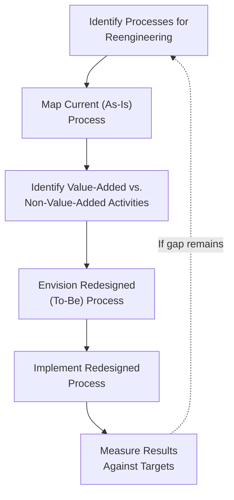

## Business Process Reengineering

### Overview

Business Process Reengineering (BPR) is a strategic cost management approach involving the fundamental rethinking and radical redesign of business processes to achieve dramatic improvements in critical performance measures such as cost, quality, service, and speed. Unlike incremental continuous improvement approaches, BPR deliberately discards existing process assumptions and organizational structures, starting from a "clean sheet" to redesign how work is performed around desired outcomes rather than existing functional boundaries.

### Defining Characteristics

Popularized by Michael Hammer and James Champy in the early 1990s, BPR is distinguished from other process improvement approaches by four key words in its classic definition:

- **Fundamental** — asking basic questions about why the organization does what it does and why it does it the way it does, without assuming existing practices are necessary
- **Radical** — redesigning from the ground up, disregarding existing structures and procedures, rather than making superficial changes
- **Dramatic** — targeting quantum-leap improvements in performance (often cited as improvements of 50% or more), not marginal or incremental gains [Inference — this magnitude is commonly cited in BPR literature as characteristic of the approach's ambition, not a required or guaranteed outcome of every BPR initiative]
- **Process** — organizing the redesign around end-to-end business processes (a collection of activities that create value for a customer) rather than around traditional functional departments or organizational silos

**Key Points**

- BPR fundamentally challenges the traditional functional/departmental organization of work, arguing that many inefficiencies arise specifically from handoffs, delays, and misaligned incentives that occur *between* departments as a process crosses functional boundaries
- BPR is a distinct concept from continuous improvement (e.g., Kaizen, Total Quality Management): BPR seeks episodic, transformational change, whereas continuous improvement seeks ongoing, incremental change

### BPR vs. Continuous Improvement: A Comparison

| Aspect | Business Process Reengineering | Continuous Improvement (e.g., Kaizen) |
| --- | --- | --- |
| Scope of change | Radical, clean-sheet redesign | Incremental, ongoing refinement |
| Frequency | Episodic, project-based initiatives | Continuous, ongoing activity |
| Risk level | Higher — significant organizational disruption | Lower — smaller, more manageable changes |
| Typical improvement magnitude | Large, transformational (order-of-magnitude) | Smaller, cumulative gains over time |
| Organizational approach | Often top-down, cross-functional redesign | Often bottom-up, involves front-line employee input |
| Typical trigger | Major competitive threat, technology shift, or performance crisis | Ongoing operational management philosophy |

**Key Points**

- These approaches are not mutually exclusive; an organization might use BPR to achieve a step-change improvement and then rely on continuous improvement to sustain and further refine performance afterward
- The choice between approaches often depends on the severity of the performance gap: incremental improvement may be insufficient when a fundamental competitive or technological shift requires an entirely different process design

### The BPR Methodology

While specific methodologies vary, BPR initiatives typically follow a structured sequence:

1. **Identify processes for reengineering** — select processes that are strategically significant and/or exhibit significant performance problems (high cost, poor quality, excessive cycle time)
2. **Understand and map the current (as-is) process** — document the current process flow, including all handoffs, approvals, and activities, often revealing significant redundancy or non-value-added steps
3. **Identify value-added and non-value-added activities** — evaluate each process step against whether it contributes to customer-perceived value (an important link to value chain analysis and activity-based costing)
4. **Envision the redesigned (to-be) process** — redesign the process from a clean-sheet perspective, often leveraging information technology to enable new ways of organizing work (e.g., parallel rather than sequential processing, self-service capabilities, integrated data systems)
5. **Implement the redesigned process** — includes significant organizational change management, given the scale of disruption typically involved
6. **Measure results against targets** — assess whether the dramatic performance improvements targeted were actually achieved

### Diagram: BPR Methodology Flow

### Common Themes in Reengineered Processes

- **Elimination of non-value-added activities** — particularly handoffs, approvals, and inspections that exist primarily to compensate for a fragmented, siloed process design rather than genuinely adding customer value
- **Case management / single point of contact** — replacing multiple specialized handoffs with a single employee or small team empowered to manage a customer's entire request end-to-end
- **Parallel rather than sequential processing** — performing activities simultaneously where possible, rather than in a strict sequence, to reduce total cycle time
- **Empowerment of front-line employees** — decentralizing decision-making authority to the point of process execution, reducing delays caused by escalation to management for routine decisions
- **Leveraging information technology** — using integrated information systems to enable process redesigns that would be impractical with prior, less-integrated technology (e.g., shared databases eliminating redundant data entry across departments)

### Worked Example: Reengineering an Order Fulfillment Process

**Current (As-Is) Process**: A customer order passes sequentially through Sales (order entry) → Credit Department (credit check) → Inventory (stock verification) → Production Scheduling → Manufacturing → Quality Inspection → Shipping. Each department maintains its own paperwork and periodically batches work for the next department, creating delays and requiring the order to be re-explained or re-verified at each handoff. Total average cycle time: 18 days.

**BPR Analysis**:

- Value-added activities: actual manufacturing and quality inspection directly create the product the customer is paying for
- Non-value-added activities: the sequential handoffs themselves, redundant data entry at each department, and waiting time between departments, account for the majority of the 18-day cycle time — actual value-added processing time might total only 3-4 days [Inference — illustrative estimate for the example, consistent with commonly cited BPR findings that non-value-added time often dominates total cycle time in unreengineered processes, not a specific measured figure]

**Redesigned (To-Be) Process**: A single integrated order-management system allows Sales, Credit, and Inventory checks to occur simultaneously (in parallel) rather than sequentially at order entry. A single "order coordinator" role, empowered with decision authority for routine orders, manages the order end-to-end rather than passing it through department silos. Production scheduling is integrated directly with the order system, eliminating a separate scheduling handoff.

**Result**: Cycle time reduced from 18 days to 5 days — a dramatic (72%) improvement consistent with BPR's characteristic ambition, achieved through parallel processing, elimination of redundant handoffs, and empowered case management, rather than through incremental efficiency improvements within the existing sequential structure.

### BPR and Activity-Based Costing / Cost Management

**Key Points**

- BPR and activity-based costing (ABC) are natural complements: ABC's activity-level cost visibility helps identify which activities in a process are high-cost and/or non-value-added, providing the analytical foundation for deciding which processes most warrant reengineering effort
- After a BPR initiative, ABC can help quantify the actual cost savings achieved by comparing the activity cost structure of the redesigned process against the prior (as-is) structure
- BPR often eliminates entire activities (and their associated cost drivers) rather than merely making existing activities more efficient — this distinguishes BPR's cost impact from incremental cost reduction, which typically reduces the cost of existing activities without eliminating them outright

### Risks and Criticisms of BPR

**Key Points**

- BPR initiatives carry substantial implementation risk: the radical nature of the change, combined with significant organizational disruption (job elimination, role redefinition, cultural change), has historically led to a meaningful proportion of BPR initiatives failing to achieve their targeted dramatic improvements [Inference — high failure rates for BPR initiatives are widely cited in management literature from the years following BPR's popularization, though specific failure-rate statistics vary by source and study methodology, so a specific percentage figure is not stated here]
- Critics have noted that BPR, in some implementations, became closely associated with downsizing and workforce reduction, generating employee resistance and morale concerns that undermined the broader organizational buy-in needed for successful radical change
- Because BPR requires abandoning existing processes and organizational structures, it demands strong, sustained executive sponsorship; initiatives that lose leadership commitment partway through implementation are particularly vulnerable to reverting toward prior practices or stalling before achieving targeted results

### Common Pitfalls

- **Treating BPR as simply "automating" the existing process**: applying new technology to an unchanged, fundamentally flawed process design typically fails to achieve the dramatic improvements BPR targets — genuine BPR requires rethinking the process itself, not merely computerizing existing steps
- **Underestimating change management requirements**: the radical, cross-functional nature of BPR requires significant organizational change management; treating it as a purely technical or process-mapping exercise, without addressing the human and cultural dimensions, is a commonly cited cause of BPR failure
- **Confusing BPR with incremental process improvement**: applying BPR's "clean sheet, radical redesign" mindset to a situation that would be better served by ongoing continuous improvement can create unnecessary organizational disruption relative to the improvement actually needed
- **Reengineering low-priority processes**: without first using tools like value chain and activity-based cost analysis to identify which processes are genuinely high-impact (strategically significant and/or high-cost), BPR effort risks being directed at processes where the potential improvement does not justify the organizational disruption involved

### Managerial Implications

- BPR is best reserved for situations where incremental improvement is insufficient to close a significant competitive, cost, or performance gap — it is a high-risk, high-reward strategic tool rather than a routine cost management technique
- Successful BPR requires integrating cost management analysis (value chain analysis, activity-based costing) with organizational and change management considerations, since the technical process redesign is often less challenging than achieving the organizational buy-in and behavioral change required for successful implementation
- Because BPR fundamentally reorganizes work around end-to-end processes rather than functional departments, it often has direct implications for how a company's responsibility accounting and performance measurement systems should be structured following implementation

**Related Topics**

- Value Chain Analysis
- Activity-Based Costing and Cost Driver Analysis
- Continuous Improvement and Total Quality Management (Kaizen)
- Non-Value-Added Activity Analysis
- Change Management in Cost System Implementation
- Cost of Quality Framework