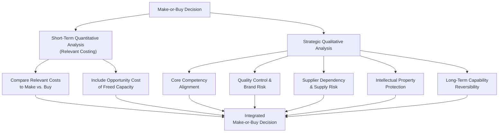

## Outsourcing and Make or Buy Strategy

### Overview

The make-or-buy decision determines whether a company should produce a component, product, or service internally ("make") or purchase it from an external supplier ("buy"/outsource). While the short-term mechanics of this decision rely on relevant costing analysis, strategic cost management extends the analysis beyond immediate cost comparison to consider strategic capability, competitive positioning, value chain fit, and long-term organizational implications.

### The Make-or-Buy Decision: Short-Term Relevant Costing Foundation

**Relevant Cost Framework**

The core quantitative comparison relies on identifying relevant costs — future costs that differ between the make and buy alternatives.

$$\text{Relevant Cost to Make} = \text{Avoidable Variable Costs} + \text{Avoidable Fixed Costs} + \text{Opportunity Cost of Capacity Used}$$

$$\text{Relevant Cost to Buy} = \text{Purchase Price} + \text{Any Additional Costs of Buying (e.g., incoming inspection, ordering costs)}$$

**Key Points**

- **Unavoidable fixed costs** (costs that continue regardless of the decision, such as facility costs already committed under a long-term lease) are irrelevant to the decision and must be excluded from the comparison — including them can lead to an incorrect "buy" decision even when making the product would truly be cheaper
- **Opportunity cost** is critical when internal capacity used for making the component has an alternative profitable use — if freed capacity could be used for another profitable product, the forgone contribution margin from that alternative use must be included as a cost of the "make" option

**Worked Example**

A company currently makes a component internally at a cost of $25 per unit (Direct Materials $10, Direct Labor $8, Variable Overhead $4, Allocated Fixed Overhead $3). An outside supplier offers to supply the component at $21 per unit. The allocated fixed overhead includes $2 per unit of costs that would continue regardless of the decision (unavoidable) and $1 per unit of costs that would be eliminated if production stopped (avoidable, e.g., a supervisor whose role would be eliminated).

**Relevant Cost to Make** (per unit):

$$\$10 + \$8 + \$4 + \$1 \text{ (avoidable fixed OH)} = \$23$$

**Relevant Cost to Buy** (per unit):

$$\$21$$

**Conclusion**: Buying is preferable by $2 per unit, since the relevant cost to make ($23) exceeds the purchase price ($21). Note that the $2 of unavoidable fixed overhead is excluded from the comparison entirely, since it does not differ between the two alternatives.

**Incorporating Opportunity Cost**

If the freed manufacturing capacity (from buying instead of making) could be used to produce another product generating $5 per unit of contribution margin, this opportunity cost must be added to the cost of the "make" alternative (since choosing to make means forgoing this opportunity):

$$\text{Relevant Cost to Make (with opportunity cost)} = \$23 + \$5 = \$28$$

This strengthens the case for buying, now favorable by $7 per unit ($28 vs. $21) rather than just $2.

### Extending Beyond Short-Term Cost: The Strategic Perspective

While relevant costing provides the immediate quantitative answer, strategic cost management emphasizes that make-or-buy decisions carry longer-term strategic implications that a single-period cost comparison does not capture.

**Strategic Factors Beyond Immediate Cost**

1. **Core Competency Alignment** — Is the activity central to the firm's competitive advantage and differentiation, or is it a peripheral, commodity-like activity?
2. **Quality Control and Consistency** — Does outsourcing risk quality variability that could damage brand reputation or customer trust, particularly for activities central to a differentiation strategy?
3. **Supplier Dependency and Risk** — Does outsourcing create dangerous dependency on a single or limited set of suppliers, exposing the firm to supply disruption, price escalation after the relationship is established, or loss of proprietary knowledge?
4. **Flexibility and Responsiveness** — Does internal production provide flexibility to respond quickly to demand changes or custom requirements that an external supplier might not match?
5. **Long-Term Capacity and Capability Loss** — Once an internal capability is dismantled (equipment sold, skilled workforce dispersed), rebuilding it later — if outsourcing proves unsatisfactory — can be costly, slow, or in some cases impossible
6. **Intellectual Property and Competitive Risk** — Does outsourcing expose proprietary processes, designs, or technology to a supplier who might become a future competitor or share knowledge with competitors?

**Key Points**

- This strategic perspective directly connects to Value Chain Analysis: activities that are high in customer-perceived value and central to differentiation are generally poor candidates for outsourcing even when a short-term cost comparison favors buying, whereas activities that are low in customer-perceived value are natural candidates for outsourcing consideration
- The core competency lens draws directly on Cost Leadership and Differentiation Strategy: outsourcing peripheral activities allows the firm to focus internal resources and management attention on the activities that most directly drive its chosen competitive advantage

### Diagram: Integrated Make-or-Buy Decision Framework

### Types of Outsourcing Arrangements

**Tactical Outsourcing**

Outsourcing a specific, well-defined activity primarily to reduce cost or free management attention, typically for non-core, commodity-like activities (e.g., payroll processing, basic janitorial services, standardized component manufacturing).

**Strategic Outsourcing**

Outsourcing an activity as part of a broader strategic repositioning, often involving a longer-term partnership relationship, shared risk/reward arrangements, and closer integration with the firm's own value chain (e.g., a technology company outsourcing manufacturing to a contract manufacturer while retaining design and R&D in-house).

**Key Points**

- Strategic outsourcing arrangements often require more sophisticated vertical linkage management (see Value Chain Analysis) since the outsourced activity remains closely coupled to the firm's own processes and quality standards, even though it is performed externally

### Worked Example: Strategic Override of a Short-Term Cost Signal

A specialty food company currently manufactures its signature sauce in-house at a relevant cost of $3.20 per unit. An external co-packer offers to produce an identical formulation at $2.75 per unit — a cost savings of $0.45 per unit that would favor outsourcing on a purely short-term cost basis.

**Strategic Considerations**:

- The sauce recipe and production process are proprietary and central to the brand's differentiated market position; outsourcing would require sharing the formulation with an external party, creating intellectual property risk
- Quality consistency in the current in-house process has been a key driver of the brand's premium positioning and customer loyalty; the co-packer's quality track record with other clients is unproven for this specific, delicate formulation
- The company currently has no meaningful alternative use for the freed production capacity (no opportunity cost to include)

**Decision**: Despite a positive short-term cost signal favoring outsourcing, management decides to continue in-house production, judging that the intellectual property risk and potential quality/brand risk outweigh the $0.45 per-unit cost savings. This illustrates the central lesson of strategic cost management: the relevant costing analysis correctly identifies the short-term cost-minimizing choice, but the strategic analysis can appropriately override that choice when core competency, differentiation, and risk factors are significant enough.

### Common Pitfalls

- **Relying on relevant costing analysis alone**: treating the quantitative make-or-buy comparison as the complete decision, without considering strategic factors like core competency alignment, quality risk, and supplier dependency, can lead to decisions that appear cost-optimal in the short term but undermine long-term competitive position
- **Including unavoidable (sunk or continuing) fixed costs** in the relevant cost comparison, which biases the analysis away from the make alternative even when it is genuinely more cost-effective
- **Ignoring opportunity cost** when internal capacity has a genuine alternative profitable use, understating the true cost of the "make" alternative
- **Underestimating the difficulty of reversing an outsourcing decision**: once internal capability (equipment, skilled workforce, institutional knowledge) is dismantled, restoring it if the outsourcing relationship proves unsatisfactory can be far more costly and time-consuming than the original decision analysis anticipated
- **Outsourcing activities central to differentiation purely for short-term cost savings**, risking erosion of the very competitive advantage the firm depends on, as illustrated in the worked example above

### Managerial Implications

- Make-or-buy decisions should combine rigorous short-term relevant costing analysis with an explicit strategic assessment grounded in value chain analysis and the firm's chosen competitive strategy (cost leadership vs. differentiation) — neither the quantitative nor the qualitative analysis alone is sufficient
- Activities that are low-cost-impact and low in customer-perceived value (per value chain analysis) are the strongest candidates for outsourcing; activities central to differentiation or competitive advantage warrant much greater caution even when short-term cost analysis favors outsourcing
- Because reversing an outsourcing decision can be costly and slow, make-or-buy decisions — particularly strategic outsourcing arrangements — warrant a longer decision time horizon and more rigorous strategic risk assessment than typical short-term operational decisions

**Related Topics**

- Value Chain Analysis
- Cost Leadership and Differentiation Strategies
- Relevant Costing and Short-Term Decision Making
- Opportunity Cost Analysis in Capacity-Constrained Decisions
- Supplier Relationship Management and Vertical Linkages
- Vertical Integration Strategy