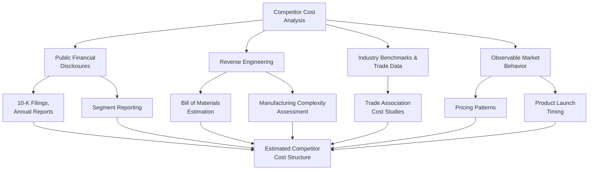

## Competitor Cost Analysis

### Overview

Competitor cost analysis is the process of estimating a rival firm's cost structure, using publicly available and inferred information, in order to understand its likely cost position, pricing flexibility, and strategic options. Since a firm rarely has direct access to a competitor's internal cost records, this analysis relies on systematic estimation techniques applied to indirect evidence. In strategic cost management, competitor cost analysis complements internal cost analysis by situating the firm's own cost position within the competitive landscape.

### Purpose in Strategic Cost Management

- Assess whether the firm has a cost advantage or disadvantage relative to key competitors, informing pricing, investment, and strategic positioning decisions
- Anticipate a competitor's likely strategic moves (e.g., price cuts, capacity expansion) based on inferred cost structure and profitability
- Identify structural or executional cost driver differences (see Strategic Positioning and Cost Management) that explain observed cost or pricing differences between the firm and its competitors
- Support strategic decisions such as entering or exiting a market segment, adjusting pricing strategy, or pursuing cost reduction initiatives targeted at closing an identified cost gap

**Key Points**

- Competitor cost analysis is inherently based on **estimation and inference**, not direct access to a competitor's actual cost records — the reliability of any specific estimate should be treated with appropriate caution and triangulated using multiple independent methods where possible
- The purpose is not perfect precision, but a reasonably reliable directional understanding sufficient to inform strategic decisions

### Sources of Information for Competitor Cost Estimation

**Public Financial Disclosures**

- Annual reports, 10-K filings (for publicly traded competitors), investor presentations, and earnings call transcripts
- Segment reporting requirements can reveal cost and profitability information at a more granular level than consolidated totals alone
- Industry-specific regulatory filings (e.g., utility rate filings, insurance filings) can reveal detailed cost information in regulated industries

**Indirect and Inferential Sources**

- **Reverse engineering** — physically disassembling a competitor's product to estimate its bill of materials, component costs, and manufacturing complexity
- **Published industry cost studies and trade association data** — industry-wide benchmarks on typical cost structures, though these represent averages rather than a specific competitor's actual costs
- **Supplier and distributor intelligence** — information gathered (through legitimate, ethical channels) from shared suppliers or distributors about pricing terms or order volumes
- **Job postings and hiring patterns** — can reveal information about a competitor's capacity expansion plans, technology investments, or organizational structure changes
- **Patent filings and trade publications** — can reveal technology and process choices that inform cost structure inferences
- **Observable market behavior** — pricing patterns, product launch timing, and promotional activity can be used to infer likely cost positions (e.g., sustained low pricing suggests either a genuine cost advantage or a deliberate loss-leader strategy, requiring further investigation to distinguish)

**Key Points**

- All competitor intelligence gathering must be conducted through **legal and ethical means** — obtaining a competitor's actual cost data through industrial espionage, misrepresentation, or breach of confidentiality agreements (e.g., by hiring away employees specifically to extract confidential cost information) raises serious legal and ethical concerns and is inconsistent with professional standards of conduct
- Reverse engineering a competitor's product is a widely accepted and legal practice (assuming no patent or intellectual property infringement occurs in the process), distinguishing it from improper acquisition of confidential internal cost information

### Diagram: Competitor Cost Analysis Information Sources

### Reverse Engineering: A Closer Look

**Process**

1. Acquire the competitor's product through normal market channels (purchase)
2. Physically disassemble the product to identify its components, materials, and construction methods
3. Estimate the cost of each component based on known material prices, estimated manufacturing complexity, and typical labor/overhead rates for the processes involved
4. Aggregate component-level cost estimates into an overall estimated product cost
5. Compare the estimated cost structure to the firm's own cost structure for a comparable product, highlighting areas of potential cost advantage or disadvantage

**Key Points**

- Reverse engineering is most informative for physical, durable products where disassembly is feasible; it is far less applicable to services or to products whose cost structure is dominated by non-physical inputs like software development or brand-building marketing spend
- The resulting cost estimate reflects the *manufacturing* cost structure specifically — it typically cannot reveal a competitor's overhead allocation practices, SG&A cost structure, or overall profitability without combining it with financial disclosure analysis

### Worked Example: Estimating a Competitor's Cost Position

A consumer electronics company wants to understand why a competitor's flagship product is priced 15% below its own comparable model.

**Step 1 — Reverse engineer the competitor's product**: Disassembly reveals the competitor uses a simpler, single-board electronic architecture (versus the firm's own multi-board design), fewer distinct fastener types (reducing assembly labor complexity), and a lower-cost display technology. Estimated bill-of-materials cost: $42, versus the firm's own known bill-of-materials cost of $51 for its comparable product.

**Step 2 — Review public financial disclosures**: The competitor's most recent annual report segment disclosure shows an overall gross margin for its consumer electronics segment of 28%, compared to the firm's own gross margin of 35% for the same product category — consistent with, though not fully explained by, the bill-of-materials cost difference alone.

**Step 3 — Assess industry benchmark data**: Trade publication data suggests the competitor has invested heavily in a more automated assembly process at its primary manufacturing facility, which industry sources estimate reduces assembly labor cost per unit substantially compared to firms using more manual assembly processes. [Inference — the specific magnitude of automation-driven labor savings is not independently verified here, since it derives from third-party industry sourcing rather than direct measurement]

**Diagnosis**: The competitor's lower price appears to stem from a combination of a genuinely simpler and lower-cost product architecture (a structural cost driver difference in complexity and technology) and a more automated manufacturing process (a structural cost driver difference in technology), rather than from unsustainable underpricing or a differing accounting treatment.

**Strategic Implication**: If the firm wishes to compete more directly on price in this segment, closing the cost gap would likely require either simplifying its own product architecture (potentially at some cost to its differentiated feature set) or investing in comparable manufacturing automation — a structural decision requiring significant capital investment and lead time, not a short-term operational fix.

### Limitations and Caveats of Competitor Cost Analysis

**Key Points**

- Estimates derived from reverse engineering and inferential methods carry inherent uncertainty; treating a point estimate as precisely accurate, rather than a directional approximation, risks overconfidence in subsequent strategic decisions
- Public financial disclosures, particularly segment reporting, are prepared according to the disclosing company's own accounting policies and allocation methods, which may differ materially from the analyzing firm's own conventions — direct ratio comparisons should account for this potential inconsistency
- A competitor's observed pricing does not necessarily reflect its true cost position — a competitor might price below its full cost temporarily (e.g., a promotional strategy, a loss-leader approach, or a deliberate market-share-building strategy funded by other, more profitable product lines) [Inference — this caveat reflects a general risk of inferring cost from price alone, a widely recognized limitation in competitive cost analysis, not evidence of any specific competitor's actual pricing strategy]
- Cost structures change over time; competitor cost analysis represents a snapshot that requires periodic updating, particularly following observable competitor investments in new technology, capacity, or process changes

### Ethical and Legal Considerations

**Key Points**

- Legitimate competitor cost analysis relies exclusively on publicly available information, legally obtained products (for reverse engineering), and properly conducted market research and industry analysis
- Acquiring a competitor's confidential cost information through improper means — including through employees under confidentiality obligations to their former employer, through misrepresentation to gain access to non-public information, or through corporate espionage — raises significant legal exposure (including potential trade secret misappropriation claims) and ethical concerns inconsistent with professional standards
- Firms should establish clear internal guidelines distinguishing acceptable competitive intelligence gathering from methods that cross ethical or legal boundaries, particularly when hiring employees from competitors who may possess confidential information

### Common Pitfalls

- **Treating a single estimation method as sufficient**: relying solely on reverse engineering (which reveals manufacturing cost but not overhead or SG&A structure) or solely on financial disclosure analysis (which may not reveal product-level cost detail) provides an incomplete picture; triangulating multiple methods produces a more reliable estimate
- **Inferring cost position directly from observed price** without considering alternative explanations (promotional pricing, cross-subsidization from other product lines, different profit margin targets)
- **Ignoring accounting policy differences** when comparing margin or cost ratios derived from a competitor's public financial disclosures against the firm's own internally consistent figures
- **Failing to update estimates over time**: treating a competitor cost analysis as a one-time exercise, rather than periodically refreshing it as competitor investments and market conditions evolve, risks strategic decisions based on outdated cost intelligence
- **Crossing ethical or legal boundaries** in the pursuit of more precise cost information, exposing the firm to legal and reputational risk that typically far outweighs the incremental value of the additional information gained

### Managerial Implications

- Competitor cost analysis provides essential external context for the firm's own strategic cost management decisions — understanding whether an internal cost position is a genuine competitive disadvantage (relative to actual competitor costs) or simply appears elevated relative to an unrealistic internal benchmark
- Findings from competitor cost analysis should inform structural cost driver decisions (see Strategic Positioning and Cost Management) — a persistent cost disadvantage traced to a competitor's investment in automation or scale, for example, may require a comparable structural investment decision rather than an executional efficiency program
- Because competitor cost analysis is inherently estimative, findings should be used to inform strategic direction and prioritize further investigation, rather than to drive precise, high-stakes decisions on their own — combining this analysis with the firm's own robust internal cost data (value chain analysis, activity-based costing) produces a more reliable overall strategic cost picture

**Related Topics**

- Value Chain Analysis
- Strategic Positioning and Cost Management
- Target Costing and Cost Reduction Strategies
- Cost Leadership and Differentiation Strategies
- Benchmarking Approaches in Financial Analysis
- Business Ethics in Managerial Accounting