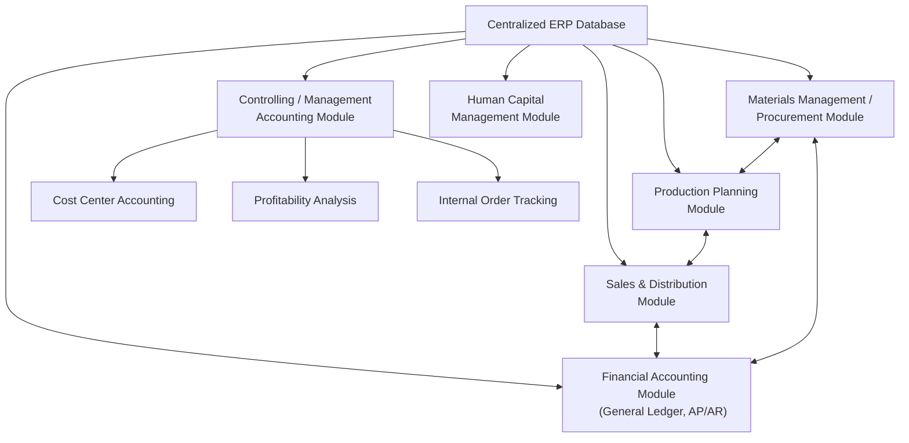

## Enterprise Resource Planning Systems

### Overview

Enterprise Resource Planning (ERP) systems are integrated software platforms that consolidate core business processes — finance and accounting, manufacturing, procurement, inventory, human resources, sales, and customer relationship management — into a single, unified database and application architecture. For managerial accounting, ERP systems represent the primary technological infrastructure through which cost data, budgeting information, and performance metrics are captured, processed, and reported across the organization.

### Purpose and Role in Management Accounting

- Provide a single source of truth for financial and operational data, eliminating the reconciliation problems that arise when separate departmental systems maintain independent, potentially inconsistent records
- Enable real-time (or near-real-time) visibility into costs, inventory levels, production status, and financial performance across the organization
- Support the data requirements of advanced costing methods (activity-based costing, standard costing, process costing) by capturing detailed transactional data at the level of granularity these methods require
- Automate routine transaction processing (order-to-cash, procure-to-pay, record-to-report) reducing manual data entry and the associated errors and reconciliation effort
- Provide the underlying data infrastructure that feeds budgeting, forecasting, variance analysis, and management reporting

**Key Points**

- Before ERP systems became widespread, many organizations relied on separate, often incompatible systems for different functions (e.g., a separate manufacturing system, a separate general ledger system, a separate inventory system), requiring significant manual reconciliation effort and creating risk of inconsistent data across departments
- ERP's core value proposition for management accounting is **data integration**: a transaction recorded once (e.g., a sale) automatically flows through to all relevant modules (inventory reduction, revenue recognition, cost of goods sold, accounts receivable) without separate re-entry

### Core Architecture of ERP Systems

**Centralized Database**

All modules read from and write to a single, shared database, ensuring that data entered in one module (e.g., a purchase order in Procurement) is immediately available to related modules (e.g., Accounts Payable, Inventory) without manual transfer or batch reconciliation.

**Modular Structure**

ERP systems are typically organized into functional modules that can often be implemented incrementally:

| Module | Typical Function |
| --- | --- |
| Financial Accounting (FI) | General ledger, accounts payable/receivable, fixed assets, financial reporting |
| Controlling / Management Accounting (CO) | Cost center accounting, cost allocation, internal management reporting, profitability analysis |
| Materials Management / Procurement | Purchasing, inventory management, vendor management |
| Production Planning / Manufacturing | Production scheduling, bill of materials, work orders, capacity planning |
| Sales and Distribution | Order entry, pricing, shipping, billing |
| Human Capital Management | Payroll, benefits, time tracking, personnel administration |
| Customer Relationship Management | Sales pipeline, customer service, marketing |

**Key Points**

- The **Controlling / Management Accounting module** is of particular relevance to this course, since it is specifically designed to support internal management reporting needs — cost center accounting, internal order tracking, profitability analysis by product/customer/region — as distinct from the external financial reporting focus of the Financial Accounting module
- Modules are integrated but conceptually distinct — an organization might implement the Financial Accounting and Controlling modules first, then add Production Planning and Materials Management modules in a later phase, depending on implementation strategy and priorities

### Diagram: ERP System Architecture

### How ERP Systems Support Specific Management Accounting Functions

**Standard Costing and Variance Analysis**

ERP systems typically maintain standard cost records for materials, labor, and overhead at the product or component level, automatically calculating price and quantity/efficiency variances as actual transactions (material issues, labor postings, production confirmations) are recorded against these standards — providing variance reports with far less manual calculation effort than would be required with disconnected systems.

**Activity-Based Costing**

ERP systems can capture detailed transactional data (e.g., number of purchase orders processed, number of machine setups, number of customer orders) at a granularity sufficient to support activity-based cost driver tracking, though implementing a full ABC model within an ERP system often requires significant configuration effort to define cost pools, activity drivers, and allocation rules specific to the organization's chosen ABC design.

**Budgeting and Forecasting**

Many ERP systems include integrated planning and budgeting functionality, allowing budgeted figures to be entered, compared against actuals in real time, and used as the basis for the flexible budget and variance analysis processes covered elsewhere in this course.

**Profitability and Segment Reporting**

The Controlling module's profitability analysis functionality typically allows management to analyze profitability by multiple dimensions simultaneously (product, customer, region, channel), supporting the kind of granular profitability analysis increasingly expected in modern management accounting, well beyond what traditional, less-integrated general ledger systems could easily produce.

### Worked Example: ERP-Enabled Variance Reporting

A manufacturing company using an ERP system's integrated Production Planning and Controlling modules experiences the following automated data flow:

1. A production order is created in the Production Planning module, referencing a standard bill of materials and standard routing (labor/machine time) already configured in the system
2. As materials are issued to the production order, the system automatically records the actual quantity and cost of materials used, comparing this against the standard quantity allowed for the units produced
3. As labor and machine time are confirmed against the production order, the system similarly compares actual hours and rates against standard hours and rates
4. Upon production order completion, the system automatically calculates and posts:
   - Direct materials price and quantity variances
   - Direct labor rate and efficiency variances
   - Variable and fixed overhead variances (based on the overhead absorption rules configured in the Controlling module)
5. These variances flow automatically into management variance reports, viewable by cost center, product, or production order, without requiring manual data extraction and calculation

**Interpretation**: This illustrates the core management accounting benefit of ERP integration — the variance analysis techniques covered in the Flexible Budgets and Overhead Analysis chapter can be automated and made available in near-real time, rather than requiring manual, periodic (e.g., monthly) calculation from disparate data sources, enabling faster management response to significant variances.

### ERP Implementation Considerations for Management Accounting

**Configuration Complexity**

ERP systems are highly configurable but require significant upfront design decisions — how cost centers are structured, how overhead is allocated, how the chart of accounts maps to management reporting needs — that directly shape the quality and usefulness of subsequent management accounting reports.

**Data Governance and Master Data Quality**

Since ERP systems rely on shared master data (e.g., standard cost records, bill of materials, cost center hierarchies) across multiple modules and users, poor data governance (inconsistent or inaccurate master data) can propagate errors throughout the integrated system far more broadly than would occur in a siloed, single-purpose system.

**Change Management**

Implementing or significantly reconfiguring an ERP system often requires substantial organizational change management, since it typically changes how employees across multiple departments perform their day-to-day transactional work, not merely how the finance department produces reports.

**Key Points**

- The quality of management accounting information an ERP system produces is directly dependent on the quality of its underlying configuration and master data — a poorly configured ERP system can produce cost and profitability reports that are technically automated but analytically misleading, if cost center structures or allocation rules do not reflect genuine cost behavior or organizational responsibility structures
- ERP implementation projects are commonly cited as high-risk, resource-intensive undertakings; underestimating the configuration and change management effort required is a frequently noted cause of implementation delays and cost overruns [Inference — this reflects a commonly cited pattern in ERP implementation literature and case studies, not a specific documented statistic]

### Comparison Table: ERP vs. Legacy/Siloed Systems for Management Accounting

| Aspect | Siloed/Legacy Systems | Integrated ERP System |
| --- | --- | --- |
| Data consistency | Requires manual reconciliation across systems | Single source of truth, automatically consistent |
| Reporting timeliness | Often periodic (monthly), batch-based | Near-real-time availability |
| Variance calculation | Often manual or semi-manual | Largely automated based on configured standards |
| Cross-functional visibility | Limited; departments see only their own data | Integrated visibility across finance, operations, sales |
| Implementation effort | Lower for each individual system | Substantial upfront configuration and integration effort |
| Flexibility for custom analysis | Often easier to customize a single-purpose system | Requires ERP-specific configuration/customization skills |

### Common Pitfalls

- **Treating ERP implementation as a purely IT project**: since ERP configuration directly shapes cost center structures, overhead allocation methods, and profitability reporting dimensions, management accountants should be closely involved in configuration decisions rather than leaving them solely to IT or external implementation consultants
- **Underestimating master data governance requirements**: allowing inconsistent or poorly maintained master data (e.g., inconsistent cost center definitions across business units) undermines the accuracy of the integrated reporting the ERP system is meant to enable
- **Assuming ERP implementation automatically improves management accounting quality**: an ERP system automates and integrates data flow, but the underlying costing methodology (e.g., how overhead is allocated, which cost drivers are used) must still be soundly designed — a poorly designed costing methodology, once automated within an ERP system, can produce misleading results more efficiently and at greater scale than before
- **Underinvesting in training and change management**, resulting in end users working around the system (e.g., maintaining shadow spreadsheets) rather than fully adopting the integrated data flow, which undermines the single-source-of-truth benefit ERP is meant to provide

### Managerial Implications

- ERP systems provide the data infrastructure that makes many of the more sophisticated management accounting techniques covered in this course (activity-based costing, standard costing with automated variance analysis, multi-dimensional profitability analysis) practical to implement and sustain at scale
- Because ERP configuration decisions directly determine what management accounting information is available and how it is structured, management accountants should be active participants in ERP implementation and configuration projects, not merely downstream users of the resulting reports
- The shift toward integrated, real-time data availability through ERP systems supports more timely management-by-exception decision-making, since variances and performance issues can be identified and investigated closer to when they occur, rather than being discovered only during a periodic, manually-compiled reporting cycle

**Related Topics**

- Standard Costing and Variance Analysis Automation
- Activity-Based Costing System Design
- Data Analytics and Business Intelligence in Management Accounting
- Data Governance and Master Data Management
- Real-Time Reporting and Management Dashboards
- Change Management in Cost System Implementation