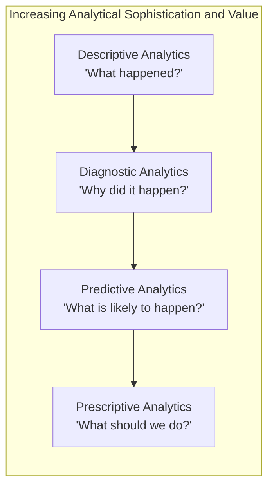

## Data Analytics and Business Intelligence Tools

### Overview

Data analytics and business intelligence (BI) tools transform raw operational and financial data — often sourced from ERP systems and other transactional platforms — into actionable insights that support managerial decision-making. In management accounting, these tools extend traditional reporting beyond static, periodic financial statements toward dynamic, interactive, and increasingly predictive analysis of cost behavior, profitability, and performance.

### Purpose and Role in Management Accounting

- Transform large volumes of transactional data into digestible visualizations, dashboards, and summary reports that support faster and better-informed decision-making
- Enable multi-dimensional analysis of cost and profitability data (e.g., by product, customer, region, channel simultaneously) beyond what traditional static reports typically provide
- Support forward-looking analysis (forecasting, predictive modeling) in addition to traditional backward-looking historical reporting
- Facilitate self-service reporting, allowing managers across the organization to explore data and answer their own questions without depending entirely on centralized finance/accounting report production
- Identify patterns, anomalies, and correlations in operational and financial data that might not be apparent through traditional ratio analysis or standard variance reports

**Key Points**

- Data analytics and BI tools generally sit on top of, and draw data from, the underlying transactional systems (particularly ERP systems) — they are typically analysis and visualization layers rather than transaction-processing systems themselves
- The shift toward data analytics tools reflects a broader movement in management accounting from primarily historical, compliance-oriented reporting toward more proactive, decision-support-oriented analysis

### The Business Intelligence Analytics Spectrum

Business analytics is often described along a spectrum of increasing analytical sophistication and decision-support value:

**Descriptive Analytics**

"What happened?" — summarizes historical data through reports, dashboards, and visualizations (e.g., last quarter's product line profitability, year-over-year cost trends by department).

**Diagnostic Analytics**

"Why did it happen?" — investigates the causes of observed patterns or anomalies, often through drill-down capability, correlation analysis, and variance decomposition (e.g., identifying which specific cost driver caused a cost center's unfavorable variance).

**Predictive Analytics**

"What is likely to happen?" — uses statistical modeling and, increasingly, machine learning techniques to forecast future outcomes based on historical patterns (e.g., forecasting future demand, predicting customer churn, projecting cash flow).

**Prescriptive Analytics**

"What should we do about it?" — goes beyond prediction to recommend specific actions or optimize decisions given constraints (e.g., optimization models for production scheduling, pricing recommendations, resource allocation optimization).

**Key Points**

- Each stage builds on the prior one and generally requires greater data maturity, more sophisticated tools, and more advanced analytical skill; many organizations are strongest in descriptive and diagnostic analytics and are still developing predictive and prescriptive capabilities [Inference — this reflects a commonly observed pattern of analytics maturity progression discussed in management accounting and business analytics literature, not a specific measured statistic for any particular organization]
- Traditional management accounting techniques like variance analysis fall primarily in the diagnostic category; modern data analytics tools extend management accounting's reach further into predictive and, increasingly, prescriptive territory

### Diagram: The Business Analytics Maturity Spectrum

### Common Categories of BI and Analytics Tools

**Dashboards and Visualization Platforms**

Tools that present key metrics and KPIs in visual formats (charts, graphs, gauges) designed for at-a-glance monitoring, often supporting drill-down into underlying detail.

**Self-Service Reporting Tools**

Platforms that allow non-technical business users to build their own reports and queries against underlying data without requiring dedicated IT or data-analyst support for every request.

**Data Warehouses and Data Marts**

Structured repositories that consolidate data from multiple source systems (ERP, CRM, external market data) into a format optimized for analysis and reporting, rather than for transaction processing.

**OLAP (Online Analytical Processing) Tools**

Tools supporting multi-dimensional analysis — allowing users to "slice and dice" data across dimensions like product, customer, time period, and region simultaneously.

**Statistical and Predictive Modeling Tools**

Software supporting regression analysis, time-series forecasting, and increasingly machine-learning-based predictive models applied to cost and revenue forecasting, customer behavior prediction, and risk assessment.

**Key Points**

- Many modern BI platforms combine several of these categories into an integrated suite (visualization, self-service reporting, and OLAP capability together), though the specific product landscape evolves rapidly and specific vendor/tool comparisons are beyond the scope of general management accounting principles

### Applications in Management Accounting

**Multi-Dimensional Profitability Analysis**

BI tools enable profitability analysis simultaneously across multiple dimensions (product × customer × region × channel) that would be impractical to produce through traditional, single-dimension cost reports — directly supporting customer profitability analysis and segment reporting.

**Enhanced Variance Analysis and Drill-Down**

Rather than a static variance report, BI dashboards allow a manager to drill down from a summary-level unfavorable variance directly to the underlying transactions or cost centers driving it, substantially accelerating the diagnostic process central to management by exception.

**Predictive Cost and Demand Forecasting**

Statistical and machine-learning models applied to historical cost and sales data can improve the accuracy of budgets, forecasts, and flexible budget planning inputs compared to purely judgment-based or simple trend-extrapolation forecasting methods.

**Anomaly Detection**

Automated anomaly detection algorithms can flag unusual transactions or cost patterns (e.g., an unusual spike in a specific expense category) for management investigation, supporting internal control and fraud-detection objectives alongside traditional cost management uses.

### Worked Example: BI-Enhanced Variance Investigation

A retail chain's finance team notices, through a real-time BI dashboard, that overall gross margin has declined by 1.5 percentage points company-wide in the current month compared to budget.

**Traditional Approach (Pre-BI)**: The finance team would typically need to manually request detailed sales and cost data from multiple store and product-line systems, consolidate it in a spreadsheet, and perform a multi-day analysis to identify the source of the decline.

**BI-Enabled Approach**:

1. The dashboard's drill-down capability allows the analyst to immediately decompose the company-wide margin decline by region, revealing that the decline is concentrated in one region rather than being uniform
2. Drilling further into that region by product category reveals the decline is concentrated specifically in one product line
3. Drilling into that product line by individual store reveals the decline is driven by a small number of stores that recently began running an aggressive promotional discount not reflected in the original budget assumptions
4. The analysis, which might have taken days using traditional manual consolidation, is completed within the same day, allowing management to make a timely decision about whether to continue, adjust, or discontinue the promotional pricing strategy

**Interpretation**: This illustrates the primary management accounting value of BI tools — not a fundamentally new analytical concept (this is still, at its core, a flexible budget variance investigation), but a dramatic acceleration and deepening of the diagnostic process, enabling faster and more granular management response.

### Data Quality and Governance Considerations

**Key Points**

- The value of any data analytics or BI output is fundamentally limited by the quality of the underlying data ("garbage in, garbage out") — inconsistent master data, duplicate records, or poorly integrated data sources can produce analytically sophisticated-looking but substantively unreliable results
- Effective use of BI tools in management accounting requires clear data governance: consistent definitions of key metrics (e.g., ensuring "gross margin" is calculated identically across all reports and dashboards), controlled access to sensitive financial data, and clear ownership of data quality for each source system
- As self-service reporting tools proliferate, organizations face a growing risk of inconsistent metric definitions across different self-built reports (sometimes called "multiple versions of the truth"), which BI governance frameworks and centrally defined metric libraries are intended to prevent

### Common Pitfalls

- **Treating BI tool adoption as a substitute for sound underlying costing methodology**: a visually sophisticated dashboard built on a flawed cost allocation methodology (e.g., an outdated or arbitrary overhead allocation base) simply presents flawed information more attractively and more quickly, without correcting the underlying analytical problem
- **Underinvesting in data governance while over-investing in visualization tools**: without consistent data definitions and quality controls, self-service BI tools can proliferate inconsistent or conflicting metrics across the organization, undermining rather than enhancing decision quality
- **Over-relying on descriptive/diagnostic dashboards without developing predictive or prescriptive capability**, missing opportunities for more forward-looking, decision-supportive analysis that more mature analytics capabilities can provide
- **Assuming correlation revealed by analytics tools implies causation**: pattern-detection and correlation analysis can surface interesting relationships in the data, but management accountants should apply appropriate analytical rigor before concluding that an observed correlation reflects an actual causal cost driver relationship
- **Neglecting user training and change management**: providing access to sophisticated BI tools without adequate training in how to interpret and appropriately use the resulting analysis can lead to misinterpretation or underutilization of the tool's capability

### Managerial Implications

- Data analytics and BI tools substantially accelerate and deepen the diagnostic and investigative processes central to variance analysis and management by exception, supporting faster and more granular managerial response to performance issues
- The progression from descriptive through diagnostic, predictive, and prescriptive analytics represents a capability-building roadmap for management accounting functions seeking to move beyond historical reporting toward more forward-looking decision support
- Because BI tool output is only as reliable as its underlying data and cost methodology, management accountants play an essential role in ensuring that BI-driven insights rest on sound costing principles and well-governed, consistently defined data — technology capability alone does not substitute for analytical rigor

**Related Topics**

- Enterprise Resource Planning Systems
- Activity-Based Costing and Multi-Dimensional Cost Analysis
- Customer Profitability Analysis
- Flexible Budget Variances and Management by Exception
- Data Governance and Master Data Management
- Predictive Analytics in Budgeting and Forecasting