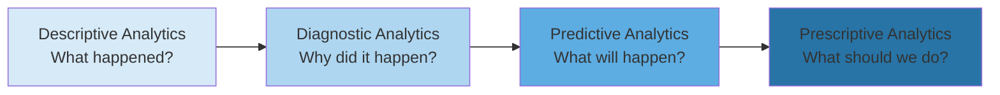
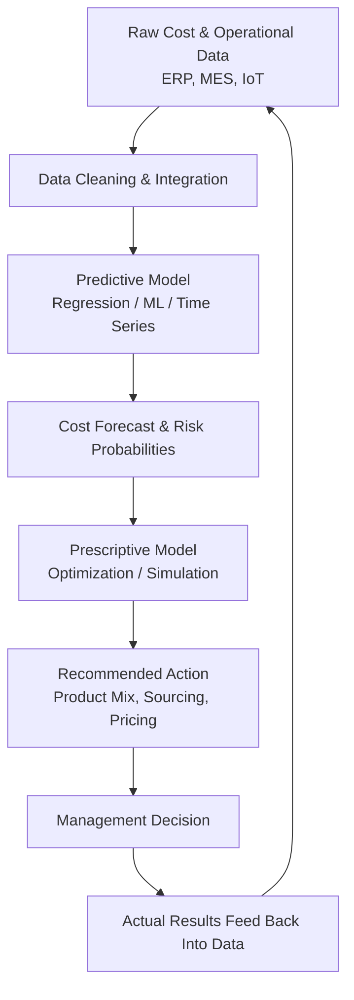

## Predictive and Prescriptive Analytics for Cost Management

### Overview

Predictive and prescriptive analytics represent the two most advanced tiers of the analytics maturity model as applied to cost management. Where traditional (descriptive) managerial accounting answers "what happened to our costs," predictive analytics answers "what is likely to happen to our costs," and prescriptive analytics answers "what should we do about it." These techniques allow management accountants to move from variance explanation to variance anticipation and, ultimately, to automated or recommended decision-making.

### The Analytics Maturity Continuum

Each stage increases in analytical complexity and decision value:

- **Descriptive** — Standard cost reports, variance reports, flexible budgets summarizing historical results
- **Diagnostic** — Variance analysis (price/rate and quantity/efficiency variances), root-cause drill-downs
- **Predictive** — Forecasting future costs, cost behavior, and risk using statistical/ML models
- **Prescriptive** — Optimization and simulation models that recommend the best course of action given constraints

### Predictive Analytics for Cost Management

#### Definition and Purpose

Predictive analytics applies statistical modeling, machine learning, and data mining techniques to historical and current data to forecast future cost outcomes, cost drivers, and cost behavior patterns. In managerial accounting, this extends traditional cost estimation (high-low method, regression analysis) into more sophisticated, data-intensive forecasting.

#### Core Techniques

**1. Regression-Based Cost Forecasting**

Traditional simple linear regression estimates cost behavior as:

$$Y = a + bX + \varepsilon$$

Where $Y$ is total cost, $a$ is fixed cost, $b$ is variable cost per unit of activity, $X$ is the cost driver (activity level), and $\varepsilon$ is the error term. Predictive analytics extends this to **multiple regression**, incorporating several cost drivers simultaneously:

$$Y = a + b_1X_1 + b_2X_2 + \dots + b_nX_n + \varepsilon$$

This is useful when costs are driven by multiple factors (e.g., machine hours, labor hours, and batch setups jointly explaining overhead costs).

**2. Time-Series Forecasting**

Used for forecasting costs that show trend, seasonality, or cyclical patterns (e.g., utility costs, seasonal raw material costs). Common models include:

- Moving averages and exponential smoothing
- ARIMA (AutoRegressive Integrated Moving Average) models
- Seasonal decomposition (trend, seasonal, cyclical, irregular components)

**3. Machine Learning Models**

- **Decision trees / random forests** — classify and predict cost categories or flag anomalous cost behavior
- **Gradient boosting (e.g., XGBoost)** — high-accuracy prediction of cost overruns on projects
- **Neural networks** — used for complex, nonlinear cost relationships, particularly in large manufacturing or supply chain datasets

**4. Driver-Based and Activity-Based Predictive Models**

Building on Activity-Based Costing (ABC), predictive models forecast **future activity volumes** and multiply by **predicted activity rates** to project overhead costs:

$$\text{Predicted Overhead Cost} = \sum_{i=1}^{n} (\text{Predicted Activity}_i \times \text{Predicted Rate}_i)$$

#### Practical Example: Predicting Overhead Costs

A manufacturer wants to predict next quarter's factory overhead using machine hours (X1) and number of production runs (X2) as predictors, based on 24 months of historical data.

Multiple regression output (illustrative):

$$\text{Overhead} = 50{,}000 + 12X_1 + 340X_2$$

| Driver | Predicted Value (Next Quarter) | Contribution |
| --- | --- | --- |
| Machine hours ($X_1$) | 8,000 | $12 \times 8{,}000 = \$96{,}000$ |
| Production runs ($X_2$) | 150 | $340 \times 150 = \$51{,}000$ |
| Fixed component | — | $50,000 |
| **Total predicted overhead** |  | **$197,000** |

**[Inference]** The reliability of this forecast depends on the regression's $R^2$, the stability of the underlying cost structure, and the absence of structural breaks (e.g., new equipment, process redesign) between the historical period and the forecast period.

#### Key Predictive Analytics Applications in Cost Management

- **Cost overrun prediction** on long-term contracts and projects (percentage-of-completion risk flagging)
- **Standard cost revision forecasting** — predicting when standard costs will drift from actual costs
- **Demand forecasting** feeding into production cost planning and budgeting
- **Predictive maintenance costing** — forecasting maintenance and downtime costs using sensor/IoT data
- **Customer/product profitability forecasting** using historical margin and cost-to-serve data
- **Inventory obsolescence risk prediction** to anticipate write-down costs

### Prescriptive Analytics for Cost Management

#### Definition and Purpose

Prescriptive analytics goes beyond forecasting to recommend or automate optimal actions, typically using optimization algorithms, simulation, and decision models that incorporate constraints, objectives, and trade-offs. It directly supports managerial decisions such as resource allocation, make-or-buy, pricing, and capacity planning.

#### Core Techniques

**1. Linear and Integer Programming (Optimization)**

Used to determine the optimal product mix, resource allocation, or cost-minimizing production plan subject to constraints (labor hours, machine capacity, material availability).

General form for a cost-minimization LP:

$$\text{Minimize } Z = \sum_{i=1}^{n} c_i x_i$$

subject to:

$$\sum_{i=1}^{n} a_{ij}x_i \leq b_j \quad \text{for each constraint } j$$

$$x_i \geq 0$$

Where $c_i$ is the cost per unit of decision variable $x_i$, and $b_j$ represents the capacity limit of resource $j$.

**2. Monte Carlo Simulation**

Used to model cost uncertainty by running thousands of scenarios with randomly sampled inputs (e.g., material price fluctuations, demand variability) to generate a probability distribution of total costs rather than a single-point estimate. This supports risk-adjusted budgeting and contingency planning.

**3. Scenario and Sensitivity Analysis**

Prescriptive tools often layer "what-if" scenario modeling on top of predictive forecasts to recommend the scenario that best satisfies management's objective function (e.g., minimize cost while maintaining a service level or quality threshold).

**4. Prescriptive Decision Trees and Optimization-Based Recommendation Engines**

Combine predicted probabilities (from predictive models) with payoff/cost matrices to recommend the decision with the lowest expected cost or highest expected value:

$$EV(\text{Decision}) = \sum_{k=1}^{m} P_k \times C_k$$

Where $P_k$ is the probability of outcome $k$ and $C_k$ is the cost/payoff associated with that outcome. The prescriptive system recommends the decision alternative that minimizes expected cost (or maximizes expected value).

#### Practical Example: Optimal Product Mix Under Capacity Constraints

A company produces two products, A and B, with the following data:

|  | Product A | Product B |
| --- | --- | --- |
| Contribution margin per unit | $40 | $30 |
| Machine hours per unit | 4 | 2 |
| Labor hours per unit | 2 | 3 |

Constraints: 4,000 machine hours available; 3,000 labor hours available.

**Objective function:**

$$\text{Maximize } Z = 40x_A + 30x_B$$

**Subject to:**

$$4x_A + 2x_B \leq 4{,}000$$

$$2x_A + 3x_B \leq 3{,}000$$

$$x_A, x_B \geq 0$$

A prescriptive optimization engine (e.g., Excel Solver, Python's PuLP, or an ERP-embedded optimizer) solves this LP to recommend the exact production quantities of A and B that maximize contribution margin given both constraints simultaneously — a task that becomes intractable manually once more than two or three products and constraints are involved.

**[Inference]** In practice, real-world prescriptive systems incorporate additional constraints (minimum order commitments, changeover costs, workforce availability) that can materially shift the optimal solution away from the simplified two-variable case shown here.

#### Key Prescriptive Analytics Applications in Cost Management

- **Optimal product/service mix** decisions under multiple constrained resources
- **Make-or-buy and outsourcing optimization** incorporating capacity, quality risk, and total landed cost
- **Dynamic pricing recommendations** that jointly optimize price and cost-to-serve
- **Supply chain and sourcing optimization** — recommending supplier mix to minimize total cost of ownership
- **Capital budgeting optimization** — capital rationing across competing projects to maximize NPV subject to budget constraints
- **Working capital and inventory optimization** — recommending reorder points and quantities that minimize total inventory-related cost

### Predictive vs. Prescriptive: Comparative Summary

| Dimension | Predictive Analytics | Prescriptive Analytics |
| --- | --- | --- |
| Core question | What will costs likely be? | What should we do about costs? |
| Output | Forecasts, probabilities, risk scores | Recommended actions, optimal allocations |
| Techniques | Regression, time series, ML classification | Optimization (LP/IP), simulation, decision analysis |
| Decision role | Informs the decision-maker | Recommends or automates the decision |
| Typical accounting use | Budget forecasting, cost overrun alerts | Product mix, sourcing, capital allocation |

### Data and Technology Infrastructure Requirements

Effective predictive and prescriptive cost analytics depend on:

- **Data integration** across ERP, MES (manufacturing execution systems), and IoT sensor data to obtain clean, granular cost driver data
- **Data warehousing/data lakes** to store historical cost, activity, and operational data at sufficient granularity and history depth
- **Analytics platforms** (e.g., Power BI, Tableau, Python/R environments, or embedded ERP analytics modules) capable of running statistical and optimization models
- **Governance and data quality controls**, since predictive/prescriptive outputs are only as reliable as the input data (garbage-in, garbage-out risk is amplified in automated recommendation systems)

**[Unverified]** Specific vendor tool capabilities (e.g., particular ERP analytics module features) change frequently with product updates; management accountants should verify current functionality against vendor documentation rather than relying on generalized descriptions.

### Illustrative Workflow: From Data to Decision

### Limitations and Professional Judgment Considerations

- Predictive models assume historical relationships persist into the future; structural shifts (new technology, regulatory change, supply chain disruption) can invalidate forecasts. **[Inference]** This risk is generally more pronounced in volatile input-cost environments (e.g., commodities) than in stable labor-cost environments.
- Prescriptive optimization outputs are only as good as the constraints and objective function specified; mis-specified constraints can produce mathematically "optimal" but practically infeasible or undesirable recommendations.
- Overreliance on automated recommendations without management accountant review can obscure qualitative factors (strategic positioning, customer relationships, ethical/regulatory considerations) not captured in the model.
- Model transparency ("explainability") matters for audit trails and internal control — highly complex ML/optimization "black box" outputs may need supplementary documentation for assurance and governance purposes.

### Related Topics

- Regression analysis and the high-low method for cost estimation
- Activity-Based Costing (ABC) and Activity-Based Management (ABM)
- Big Data and its role in management accounting
- Business Intelligence (BI) tools and dashboards for cost reporting
- Enterprise Resource Planning (ERP) systems and integrated cost data
- Monte Carlo simulation in capital budgeting
- Linear programming for constrained resource allocation
- Balanced Scorecard and performance measurement systems
- Robotic Process Automation (RPA) in accounting operations
- Data visualization techniques for variance and trend reporting