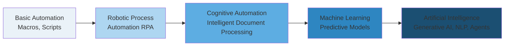
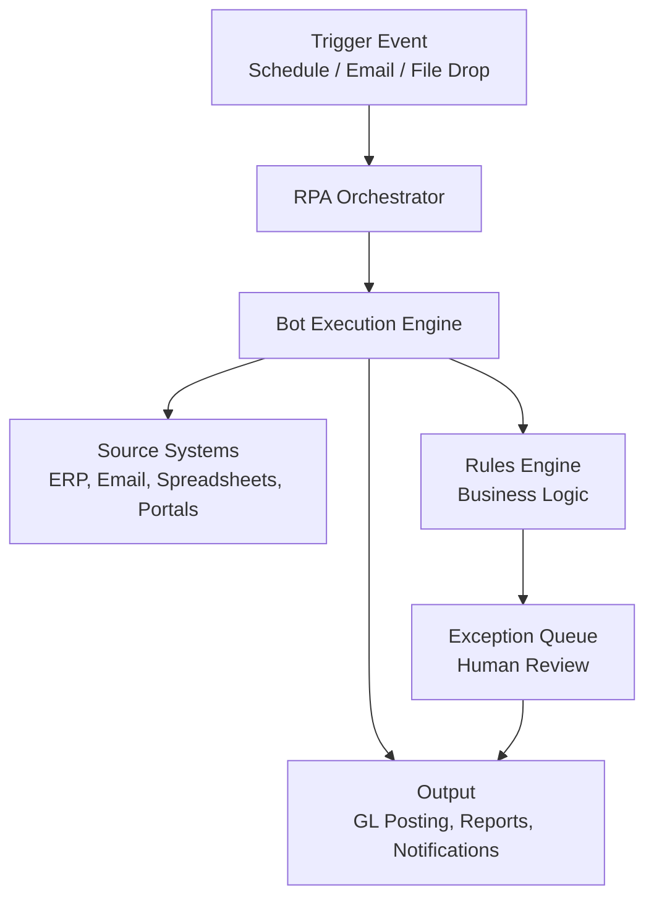
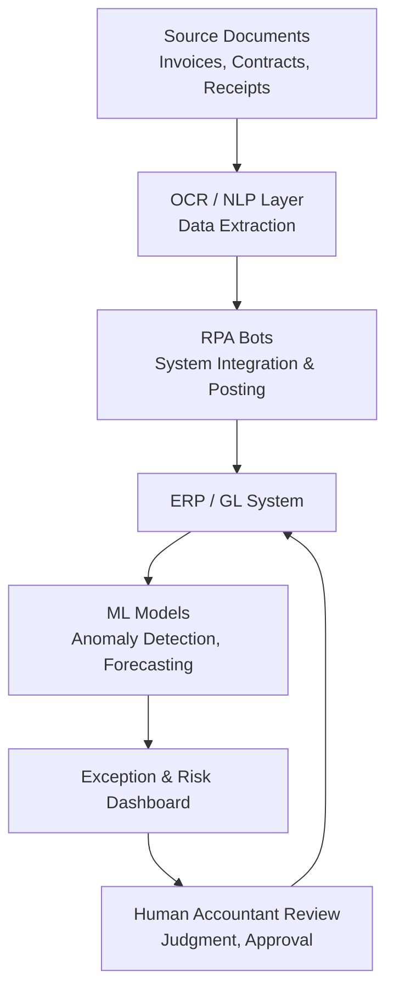

## Automation, Robotics, and Artificial Intelligence in Accounting Processes

### Overview

Automation, Robotics, and Artificial Intelligence (AI) have progressively transformed accounting from a manual, transaction-recording function into a technology-enabled discipline emphasizing analysis, control, and strategic advisory. These technologies exist on a spectrum of increasing autonomy and cognitive capability — from simple rule-based automation to self-learning AI systems — and management accountants must understand each layer to evaluate implementation decisions, control implications, and workforce impacts.

### The Automation-to-AI Spectrum

- **Basic automation** — Macros, scripts, and formula-driven spreadsheet logic performing repetitive, rule-based tasks
- **Robotic Process Automation (RPA)** — Software "bots" that mimic human interaction with digital systems following defined rules
- **Cognitive automation** — Systems combining RPA with AI capabilities (OCR, NLP) to handle semi-structured/unstructured data
- **Machine learning** — Statistical models that learn patterns from data to classify, predict, or detect anomalies
- **Artificial intelligence (broader/generative)** — Systems capable of natural language understanding, generation, and increasingly autonomous decision-support ("agentic" AI)

### Robotic Process Automation (RPA) in Accounting

#### Definition

RPA uses software robots ("bots") configured to execute high-volume, repeatable, rules-based tasks by interacting with existing systems the same way a human user would — through the user interface, without requiring changes to underlying IT systems.

#### Characteristics of RPA-Suitable Accounting Tasks

An accounting task is a strong RPA candidate when it is:

- High-volume and repetitive
- Rules-based with minimal exception handling
- Reliant on structured, digital data
- Performed across multiple, stable system interfaces
- Prone to human error from fatigue or manual re-keying

#### Common Accounting Applications of RPA

| Process | RPA Application |
| --- | --- |
| Accounts payable | Invoice data extraction, three-way matching (PO, receipt, invoice), payment scheduling |
| Accounts receivable | Automated invoice generation, payment matching, dunning letter issuance |
| Journal entries | Recurring/standard journal entry posting and reversal |
| Bank reconciliation | Automated matching of bank statement lines to GL transactions |
| Month-end close | Data extraction and consolidation from multiple ERP modules or subsidiaries |
| Payroll processing | Time data validation, payroll calculation checks, exception flagging |
| Tax compliance | Data gathering and pre-population of tax returns and compliance filings |
| Financial reporting | Report generation and distribution across standard templates |

#### RPA Architecture (Typical Components)

**Key architectural components:**

- **Orchestrator** — Central console that schedules, monitors, and manages bot deployment (e.g., UiPath Orchestrator, Automation Anywhere Control Room)
- **Bot execution engine** — The runtime that performs the actual UI/API interactions
- **Rules engine** — Encodes business logic and decision criteria
- **Exception handling queue** — Routes transactions that fail validation rules to human reviewers
- **Audit/logging layer** — Records every bot action for control and compliance purposes, critical for SOX and internal control documentation

#### Practical Example: RPA for Three-Way Matching

**Manual process:** An AP clerk manually compares a purchase order, goods receipt note, and vendor invoice, checking quantities and prices before approving payment.

**RPA-automated process:**

1. Bot monitors a shared inbox/folder for incoming invoices
2. Bot uses OCR/cognitive capture to extract invoice data (vendor, amount, PO number, line items)
3. Bot queries the ERP system via API or UI automation to retrieve the corresponding PO and goods receipt
4. Rules engine compares the three documents against tolerance thresholds (e.g., ±2% price variance)
5. If matched within tolerance → bot posts the invoice for payment automatically
6. If mismatched → bot routes to an exception queue with a flagged discrepancy report for human review

**[Inference]** Reported efficiency gains from three-way matching automation vary considerably by organization depending on invoice volume, ERP data quality, and the proportion of invoices requiring exception handling; specific percentage improvements cited by vendors should be treated as marketing estimates rather than guaranteed outcomes.

### Cognitive Automation and Intelligent Document Processing (IDP)

Cognitive automation extends RPA by incorporating:

- **Optical Character Recognition (OCR)** — Converts scanned/image-based documents into machine-readable text
- **Natural Language Processing (NLP)** — Extracts meaning, context, and classification from unstructured text (e.g., contract terms, email requests)
- **Machine learning classifiers** — Categorize documents (invoice vs. receipt vs. contract) and extract relevant fields even when formats vary across vendors

This enables automation of previously "RPA-unsuitable" tasks involving unstructured inputs, such as extracting terms from vendor contracts or classifying expense report receipts.

### Artificial Intelligence in Accounting Processes

#### Machine Learning Applications

- **Anomaly and fraud detection** — Models trained on historical transaction patterns flag outliers (e.g., unusual journal entries, duplicate payments, potential embezzlement patterns) for investigation
- **Continuous auditing/monitoring** — ML-driven systems continuously scan 100% of transactions rather than relying on sample-based testing
- **Expense report auditing** — Classification models flag policy violations or suspicious expense patterns automatically
- **Credit risk and collectability scoring** — Predicting the likelihood of customer default to inform allowance for doubtful accounts estimates

**Illustrative anomaly detection logic (simplified):**

A model computes an anomaly score for each journal entry based on deviation from historical norms:

$$\text{Anomaly Score} = \frac{|x_i - \mu|}{\sigma}$$

Where $x_i$ is a transaction feature (e.g., entry amount), $\mu$ is the historical mean for that entry type, and $\sigma$ is the historical standard deviation. Entries exceeding a defined threshold (e.g., a z-score above 3) are flagged for review. **[Inference]** Production fraud-detection systems typically combine multiple features and more sophisticated multivariate models (e.g., isolation forests, autoencoders) rather than relying on a single univariate z-score, since real-world fraud patterns are rarely captured by one variable alone.

#### Natural Language Processing (NLP) Applications

- **Contract analysis** — Extracting key terms, obligations, and revenue recognition triggers from customer/vendor contracts (relevant under ASC 606/IFRS 15 compliance)
- **Chatbots and virtual assistants** — Handling routine employee/vendor inquiries (e.g., "what is my expense report status")
- **Automated narrative generation** — Drafting variance explanations or MD&A commentary drafts from underlying financial data

#### Generative AI and Large Language Models (LLMs)

- **Financial report drafting assistance** — Generating first-draft commentary, footnote language, or variance narratives for accountant review
- **Data query via natural language** — Allowing non-technical users to query financial/cost data using conversational prompts rather than SQL or BI tool syntax
- **Code generation for analytics** — Assisting accountants in writing formulas, scripts, or queries for cost analysis

**[Unverified]** The specific capabilities, accuracy rates, and control safeguards of any named generative AI or LLM product change frequently with vendor updates; claims about a particular tool's current accounting-specific functionality should be verified against current vendor documentation rather than assumed static.

#### Emerging: Agentic AI in Accounting

An emerging development involves multi-step "agentic" AI systems capable of autonomously executing sequences of tasks (e.g., retrieving data, applying judgment rules, drafting outputs, and routing for approval) with limited human intervention, layered on top of RPA and ML foundations. **[Speculation]** As of this writing, widespread production deployment of fully autonomous agentic accounting systems (as opposed to human-supervised, recommendation-generating systems) remains at an early adoption stage across the profession, and governance frameworks for such systems are still evolving.

### Integrated Architecture: Combining RPA, ML, and AI

### Internal Control and Governance Implications

Automation and AI introduce specific internal control considerations relevant to management accountants:

- **Segregation of duties in a bot context** — Bot credentials and access rights must be controlled as rigorously as human user access; a bot with excessive system permissions creates concentrated risk
- **Change management controls** — Bot logic changes require the same authorization and testing rigor as changes to financial system configurations
- **Audit trail requirements** — Every automated decision/posting should be logged and traceable to support external/internal audit and regulatory review
- **Model governance** — ML/AI models used for financial estimates (e.g., allowance for doubtful accounts, fraud scoring) require documented validation, periodic recalibration, and bias testing
- **Exception escalation protocols** — Clear thresholds must define when automated processing stops and human judgment is required
- **Data privacy and security** — Automated systems processing financial and personal data must comply with applicable data protection regulations

### Comparative Summary: Automation Technologies in Accounting

| Technology | Data Type Handled | Decision Capability | Typical Accounting Use |
| --- | --- | --- | --- |
| Basic automation (macros/scripts) | Structured | None (fixed logic) | Spreadsheet consolidation, formula-driven reports |
| RPA | Structured, rules-based | Rule-following only | Invoice processing, reconciliations, recurring entries |
| Cognitive automation/IDP | Semi-structured/unstructured | Classification/extraction | Document capture, contract data extraction |
| Machine learning | Structured/historical data | Pattern-based prediction | Fraud detection, forecasting, risk scoring |
| Generative AI/LLMs | Unstructured/natural language | Content generation, reasoning support | Drafting, natural-language querying, code assistance |

### Impact on the Management Accounting Role

- Shift from transactional processing toward **analysis, interpretation, and business partnering**
- Increased demand for accountants to understand **data governance, model validation, and technology risk**
- Need for **hybrid skill sets** combining accounting judgment with data literacy (understanding model outputs, limitations, and appropriate reliance)
- Continued requirement for **professional skepticism** — automated outputs still require accountant review, particularly for estimates involving significant judgment (impairments, contingencies, revenue recognition)

### Limitations and Risks

- **Automation of flawed processes** — RPA automates existing process logic; if the underlying process is inefficient or contains errors, automation embeds and scales those errors rather than resolving them
- **Model bias and drift** — ML models trained on historical data may perpetuate historical biases or degrade in accuracy as business conditions change ("model drift"), requiring ongoing monitoring
- **Overreliance risk** — Excessive trust in automated outputs without independent verification can create control weaknesses, particularly for material estimates or judgment-based conclusions
- **Implementation cost and change management** — Technology costs, process redesign effort, and staff retraining are often underestimated relative to software licensing costs alone
- **Vendor/system dependency** — Heavy reliance on specific automation platforms creates operational risk if vendor support, updates, or system compatibility changes

### Related Topics

- Robotic Process Automation (RPA) implementation methodology
- Continuous auditing and continuous monitoring systems
- Internal controls in automated/IT-dependent environments (COSO framework application)
- Data governance and master data management
- Predictive and Prescriptive Analytics for Cost Management
- Enterprise Resource Planning (ERP) systems integration
- Blockchain and distributed ledger technology in accounting
- Cybersecurity risk considerations in financial systems
- Change management for technology-driven process transformation
- Ethical considerations and professional judgment in AI-assisted accounting