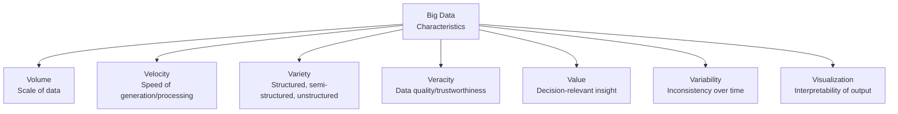
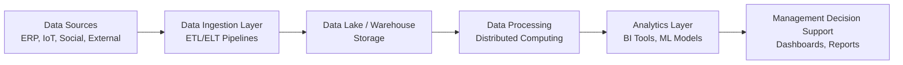

## Big Data Considerations for Managerial Decision Making

### Overview

Big Data refers to datasets characterized by volume, velocity, and variety that exceed the processing capability of traditional data management tools and techniques. For management accountants, Big Data extends the scope of decision-relevant information far beyond the general ledger — incorporating operational, sensor, social, and external market data into cost analysis, forecasting, and strategic decision-making. Understanding Big Data's characteristics, sourcing, and limitations is essential to using it responsibly in managerial decisions.

### Defining Characteristics: The "V" Framework

Big Data is traditionally characterized by multiple dimensions, commonly expanded from the original "3 Vs" to as many as 7:

| Dimension | Description | Managerial Accounting Relevance |
| --- | --- | --- |
| **Volume** | Scale of data generated (terabytes to petabytes) | Transaction-level costing across millions of SKUs/customers |
| **Velocity** | Speed at which data is generated and must be processed | Real-time cost monitoring, dynamic pricing |
| **Variety** | Structured (databases), semi-structured (XML/JSON), unstructured (text, images, sensor feeds) | Integrating IoT machine data with financial cost data |
| **Veracity** | Accuracy, trustworthiness, and quality of data | Risk of decisions based on incomplete/erroneous data |
| **Value** | Extent to which data yields actionable insight relative to cost of processing | Justifying investment in data infrastructure |
| **Variability** | Inconsistency of data flow/meaning over time | Seasonal cost driver behavior, changing customer patterns |
| **Visualization** | Ability to present data in an interpretable form for decision-makers | Dashboards, BI tools translating raw data into managerial insight |

### Sources of Big Data Relevant to Management Accounting

| Source Category | Examples | Managerial Accounting Use |
| --- | --- | --- |
| **Internal transactional systems** | ERP, POS, CRM | Detailed cost-to-serve, customer profitability |
| **Operational/IoT sensor data** | Machine sensors, RFID tags, GPS tracking | Predictive maintenance costing, logistics cost optimization |
| **Social media and web data** | Customer sentiment, reviews, web traffic | Demand forecasting, marketing cost-effectiveness analysis |
| **External market/economic data** | Commodity prices, exchange rates, industry benchmarks | Standard cost revision, risk-adjusted budgeting |
| **Supply chain data** | Supplier performance, logistics tracking | Total cost of ownership analysis, sourcing decisions |
| **Human capital data** | Time tracking, productivity metrics | Labor cost efficiency and capacity analysis |

### Big Data Infrastructure Concepts

#### Data Storage Architectures

- **Data warehouses** — Structured, schema-on-write repositories optimized for structured financial and operational reporting (e.g., for standard managerial reports)
- **Data lakes** — Store raw data (structured, semi-structured, unstructured) in native format, schema-on-read, supporting more exploratory/advanced analytics use cases
- **Data lakehouses** — Hybrid architecture combining data lake flexibility with data warehouse governance and query performance

#### Processing Frameworks (Conceptual Familiarity)

- **Distributed computing frameworks** (e.g., Hadoop, Apache Spark) — Process large datasets across clusters of machines rather than a single server, enabling analysis at volumes beyond traditional spreadsheet or single-database capacity
- **ETL/ELT pipelines** — Extract, Transform, Load (or Extract, Load, Transform) processes that move and prepare raw data for analysis
- **Cloud computing platforms** — Provide scalable, on-demand storage and processing capacity without requiring capital investment in physical infrastructure, shifting cost structure from fixed IT capital expenditure toward variable operating expenditure

**[Unverified]** Specific throughput, pricing, and feature capabilities of named cloud/Big Data platforms change frequently with vendor updates; management accountants evaluating infrastructure investment decisions should verify current vendor specifications rather than relying on generalized descriptions.

### Practical Example: Customer Profitability Analysis Using Big Data

**Traditional approach:** Customer profitability calculated using aggregated quarterly sales and allocated overhead based on a single cost driver (e.g., revenue).

**Big Data-enabled approach:** Integrating transaction-level POS/CRM data, logistics tracking data, and customer service interaction logs to compute a granular **cost-to-serve** for each customer:

$$\text{Customer Profitability} = \text{Revenue} - \text{COGS} - \sum_{i=1}^{n} \text{Activity Cost}_i$$

Where each $\text{Activity Cost}_i$ (e.g., order processing, returns handling, customer service calls, delivery cost) is driven by actual transaction-level activity data rather than broad allocation.

| Customer | Revenue | COGS | Order Processing Cost | Returns Cost | Delivery Cost | Customer Service Cost | Net Profitability |
| --- | --- | --- | --- | --- | --- | --- | --- |
| Customer A | $500,000 | $300,000 | $8,000 | $2,000 | $15,000 | $5,000 | $170,000 |
| Customer B | $500,000 | $300,000 | $25,000 | $18,000 | $40,000 | $22,000 | $95,000 |

Although both customers generate identical revenue, Big Data-driven activity tracking reveals Customer B's true profitability is substantially lower due to higher service intensity — an insight unavailable under traditional revenue-based cost allocation.

### Key Managerial Decision Applications

- **Dynamic and granular cost allocation** — Moving from broad overhead allocation to activity- and transaction-level cost assignment
- **Real-time performance dashboards** — Monitoring cost, margin, and KPI metrics continuously rather than at period-end
- **Demand sensing and forecasting** — Incorporating external/social data alongside internal sales data for more responsive production and cost planning
- **Supply chain risk and cost management** — Using supplier and logistics data to anticipate and mitigate disruption-related costs
- **Customer and product portfolio decisions** — Granular profitability data supporting pricing, retention, and product rationalization decisions
- **Fraud and anomaly detection** — Analyzing large transaction volumes to detect patterns invisible in sample-based review

### Big Data Governance and Quality Considerations

#### Data Quality Dimensions

| Dimension | Description | Risk if Compromised |
| --- | --- | --- |
| Accuracy | Data correctly reflects reality | Flawed cost/profitability conclusions |
| Completeness | All relevant data captured | Biased or partial analysis |
| Consistency | Data uniform across systems/sources | Reconciliation errors, conflicting reports |
| Timeliness | Data current enough for the decision | Decisions based on stale information |
| Validity | Data conforms to defined formats/rules | Processing errors, failed integrations |

#### Governance Framework Elements

- **Data ownership and stewardship** — Clear accountability for data accuracy and maintenance across departments
- **Master data management (MDM)** — Ensuring consistent definitions (e.g., a single definition of "customer" or "product") across integrated systems
- **Data privacy and regulatory compliance** — Adherence to data protection regulations (e.g., GDPR, and jurisdiction-specific privacy laws) when handling customer/employee data
- **Data security controls** — Access controls, encryption, and monitoring to protect sensitive financial and operational data
- **Data retention and lifecycle policies** — Defining how long data is stored and when it is archived/deleted, balancing analytical value against storage cost and compliance requirements

### Limitations and Risks of Big Data in Managerial Decision-Making

- **Correlation vs. causation risk** — Large datasets increase the likelihood of spurious correlations; management accountants must apply professional judgment to distinguish genuine causal cost drivers from coincidental patterns
- **Data quality and veracity risk** — Greater volume does not equal greater reliability; poor-quality source data at scale produces poor-quality decisions at scale
- **Analysis paralysis** — Excessive data availability without a clear decision framework can delay rather than improve decision-making
- **Cost-benefit of data infrastructure** — Building Big Data capability requires significant investment in technology, talent, and governance; the value of insights generated must be weighed against these costs
- **Privacy and ethical considerations** — Use of customer, employee, or third-party data raises ethical obligations around consent, transparency, and appropriate use, independent of legal compliance
- **Skills gap** — Effective use of Big Data requires data literacy and analytical skills that may exceed traditional accounting training, necessitating either upskilling or cross-functional collaboration with data science teams

**[Inference]** Organizations that invest heavily in Big Data infrastructure without corresponding investment in data governance and staff analytical capability commonly realize lower returns on that investment than anticipated, since the technology itself does not generate insight without appropriate analytical framing and quality controls.

### Comparative Summary: Traditional vs. Big Data-Enabled Managerial Accounting

| Aspect | Traditional Approach | Big Data-Enabled Approach |
| --- | --- | --- |
| Data scope | Internal financial/transactional data | Internal + external, structured + unstructured |
| Reporting frequency | Periodic (monthly/quarterly) | Real-time or near-real-time |
| Cost allocation | Broad, driver-based approximations | Granular, transaction-level activity tracking |
| Forecasting basis | Historical trend extrapolation | Multi-source predictive modeling |
| Decision support | Retrospective variance analysis | Prospective, scenario-based decision support |
| Required skill set | Accounting and finance expertise | Accounting expertise plus data literacy |

### Related Topics

- Predictive and Prescriptive Analytics for Cost Management
- Business Intelligence (BI) tools and data visualization
- Data governance and master data management
- Activity-Based Costing (ABC) and cost-to-serve analysis
- Enterprise Resource Planning (ERP) systems integration
- Customer profitability analysis
- Automation, Robotics, and Artificial Intelligence in Accounting Processes
- Data privacy and cybersecurity risk in financial systems
- Cloud computing cost and infrastructure decisions
- Ethical considerations in data-driven decision-making