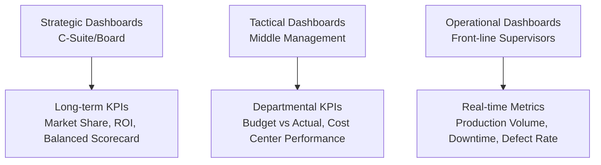

## Dashboards and Real Time Performance Reporting

### Overview

Dashboards and real-time performance reporting represent the visualization and delivery layer of management accounting analytics — translating underlying financial and operational data (including outputs from predictive/prescriptive models and Big Data systems) into accessible, actionable formats for decision-makers. Unlike traditional periodic reporting (monthly variance reports, quarterly financial statements), dashboards emphasize continuous or near-continuous visibility into key performance indicators (KPIs), enabling faster managerial response to emerging trends and problems.

### Dashboards vs. Traditional Reporting

| Dimension | Traditional Periodic Reporting | Dashboard/Real-Time Reporting |
| --- | --- | --- |
| Frequency | Monthly, quarterly, annual | Continuous, real-time, or near-real-time |
| Format | Static reports, printed/PDF documents | Interactive, dynamic visual interfaces |
| Data latency | Days to weeks after period close | Minutes to hours (or instantaneous) |
| User interaction | Passive consumption | Drill-down, filtering, self-service exploration |
| Decision support | Retrospective analysis | Prospective, in-the-moment response |
| Distribution | Scheduled push (email, printed reports) | On-demand pull (accessed anytime via portal/app) |

### Types of Dashboards by Organizational Level

| Dashboard Type | Primary Audience | Update Frequency | Example Metrics |
| --- | --- | --- | --- |
| **Strategic** | Executives, board of directors | Weekly/monthly | ROI, EVA, market share, strategic KPIs, Balanced Scorecard measures |
| **Tactical/Analytical** | Middle management, department heads | Daily/weekly | Budget-to-actual variance, departmental cost trends, project status |
| **Operational** | Supervisors, shop floor management | Real-time/hourly | Machine downtime, units produced, defect rate, labor efficiency variance |

### Core Components of an Effective Dashboard

- **Key Performance Indicators (KPIs)** — Carefully selected metrics directly tied to strategic and operational objectives; excessive metrics dilute focus ("metric overload")
- **Visual encoding elements** — Charts, gauges, heat maps, and trend lines chosen to match the nature of the data (trends → line charts; comparisons → bar charts; composition → stacked bars; proportion → limited use of pie charts)
- **Drill-down capability** — Ability to move from summary-level KPIs to underlying transaction-level detail (e.g., clicking a variance figure to see the specific cost center and account driving it)
- **Alerts and exception highlighting** — Visual cues (color coding, threshold-based alerts) flagging metrics outside acceptable ranges
- **Contextual benchmarks** — Comparisons against budget, prior period, or industry benchmark to give raw numbers meaning
- **Filtering and interactivity** — User-driven segmentation (by product, region, time period) without requiring a new report to be built

### Dashboard Design Principles for Management Accountants

#### 1. Alignment with Decision Needs

Every dashboard element should map to a specific decision or monitoring need. A useful discipline is to ask, for each metric: "What action would a user take differently based on this number changing?" Metrics without a clear decision link should generally be excluded.

#### 2. Appropriate Level of Aggregation

Dashboards should match the granularity to the audience — operational dashboards need transaction/shift-level detail; strategic dashboards need aggregated trends. Presenting overly granular data to executives (or overly aggregated data to shop-floor supervisors) reduces dashboard effectiveness.

#### 3. Visual Clarity and Cognitive Load Management

- Minimize non-data "chart junk" (excessive gridlines, 3D effects, decorative elements)
- Use consistent color coding across the organization (e.g., red = unfavorable/below target, green = favorable/on target) to reduce interpretation time
- Limit each dashboard view to a small number of primary KPIs (commonly cited guidance suggests roughly 5–9 key metrics per view, consistent with cognitive load research on working memory limits) **[Inference]** — the precise optimal number varies by audience expertise and decision complexity rather than being a fixed rule.

#### 4. Timeliness Matched to Decision Cycle

Real-time reporting is valuable only when the underlying decision cycle can actually act on real-time information; a dashboard refreshing every minute provides no additional decision value if management only reviews and acts on it weekly. The reporting frequency should be designed around the actual decision cadence, not maximized for its own sake.

### Technical Architecture of Real-Time Reporting Systems

#### Key Architectural Layers

- **Data integration layer** — Connects to source systems via APIs, database connectors, or streaming data pipelines (e.g., for IoT/sensor-driven operational dashboards); may use batch ETL for less time-sensitive data or streaming ingestion (e.g., Apache Kafka-style event streaming) for true real-time needs
- **Storage layer** — Operational data stores or data warehouses optimized for fast query performance rather than transactional processing
- **Semantic/metrics layer** — Defines KPIs consistently (e.g., a single, organization-wide definition of "gross margin" or "on-time delivery rate") to prevent conflicting numbers appearing across different dashboards — a critical governance function often called the "single source of truth"
- **Visualization/presentation layer** — The BI tool or custom application rendering the actual dashboard (e.g., Power BI, Tableau, Qlik, or embedded ERP reporting modules)

**[Unverified]** Specific feature sets, refresh-rate capabilities, and licensing models of named BI platforms change frequently with vendor updates; current capabilities should be verified against vendor documentation rather than assumed static.

### Practical Example: Operational Dashboard for a Production Cost Center

A manufacturing supervisor's real-time dashboard might display:

| Metric | Current Value | Target | Status |
| --- | --- | --- | --- |
| Units produced (shift) | 1,240 | 1,300 | Below target |
| Machine downtime (minutes) | 22 | < 15 | Above target (unfavorable) |
| Direct labor efficiency variance | $(340) | $0 | Unfavorable |
| Scrap/defect rate | 2.1% | < 2.0% | Above target |
| Material usage variance | $180 F | $0 | Favorable |

The dashboard's exception-highlighting logic might use conditional formatting equivalent to:

$$\text{Status} = \begin{cases} \text{Favorable (Green)} & \text{if } \frac{|\text{Actual} - \text{Target}|}{\text{Target}} \leq 0.02 \\ \text{Caution (Yellow)} & \text{if } 0.02 < \frac{|\text{Actual} - \text{Target}|}{\text{Target}} \leq 0.05 \\ \text{Unfavorable (Red)} & \text{if } \frac{|\text{Actual} - \text{Target}|}{\text{Target}} > 0.05 \end{cases}$$

This allows the supervisor to immediately identify that machine downtime requires investigation without needing to manually calculate variance percentages.

### Practical Example: Executive Strategic Dashboard (Balanced Scorecard Style)

| Perspective | KPI | Current | Target | Trend |
| --- | --- | --- | --- | --- |
| Financial | Return on Invested Capital (ROIC) | 14.2% | 15.0% | ↓ |
| Customer | Net Promoter Score (NPS) | 62 | 60 | ↑ |
| Internal Process | On-time delivery rate | 94% | 95% | → |
| Learning & Growth | Employee training hours/FTE | 18 | 20 | ↓ |

This dashboard structure links directly to the Balanced Scorecard framework, presenting leading and lagging indicators together rather than financial metrics in isolation.

### Alerting and Exception-Based Management

Real-time dashboards enable **management by exception**, where automated alerts (e.g., email/SMS notifications, dashboard flags) notify relevant managers only when metrics breach predefined thresholds, rather than requiring continuous manual monitoring. This reduces information overload while ensuring timely attention to genuine problems.

$$\text{Alert Triggered} = \begin{cases} \text{True} & \text{if } \text{Metric} \notin [\text{Lower Threshold}, \text{Upper Threshold}] \\ \text{False} & \text{otherwise} \end{cases}$$

### Governance and Control Considerations

- **Single source of truth** — Multiple dashboards drawing from inconsistent data definitions or stale data sources create conflicting numbers that undermine management trust; centralized metric definitions and data governance are essential
- **Access controls** — Dashboards may expose sensitive cost, margin, or compensation-linked data; role-based access control should restrict visibility appropriately
- **Data lineage and auditability** — Especially where dashboard figures feed into decisions with financial reporting implications, the underlying data sources and calculation logic should be documented and traceable
- **Version control of KPI definitions** — Changes to how a KPI is calculated (e.g., redefining "on-time delivery") should be documented and communicated, since silent redefinition undermines period-over-period comparability

### Limitations and Risks

- **Vanity metrics risk** — Dashboards can accumulate visually appealing but decision-irrelevant metrics that create an illusion of insight without supporting actual managerial action
- **Overreliance on real-time data for judgment-based decisions** — Some managerial decisions (e.g., long-term capital investment) are not well-suited to real-time dashboard-driven urgency and require the deliberative analysis traditional reporting cycles provide
- **Data quality propagation** — Dashboards inherit the quality of underlying source data; a well-designed dashboard displaying poor-quality data still produces poor decisions, faster
- **Alert fatigue** — Poorly calibrated thresholds generating excessive false-positive alerts can cause users to disengage from or ignore the alerting system altogether
- **Implementation and maintenance cost** — Real-time infrastructure (streaming pipelines, high-availability BI platforms) carries ongoing infrastructure and governance costs that must be justified against the incremental decision value of real-time (versus periodic) visibility

### Related Topics

- Balanced Scorecard and multi-dimensional performance measurement
- Key Performance Indicators (KPI) design and selection
- Business Intelligence (BI) tools and data visualization techniques
- Big Data Considerations for Managerial Decision Making
- Management by exception and variance analysis
- Data governance and single-source-of-truth metric definitions
- Predictive and Prescriptive Analytics for Cost Management
- Enterprise Resource Planning (ERP) systems and reporting integration
- Responsibility accounting and cost center performance reporting
- Continuous auditing and continuous monitoring systems