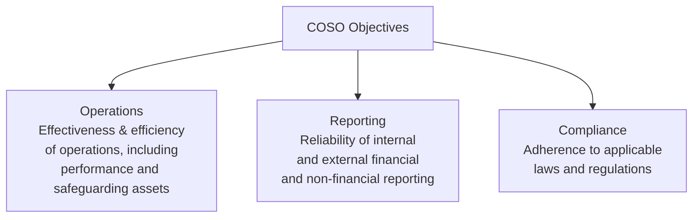
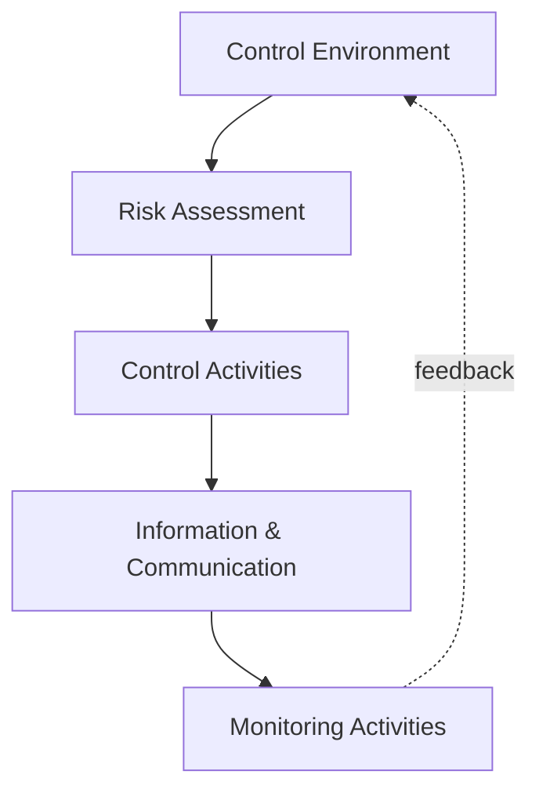
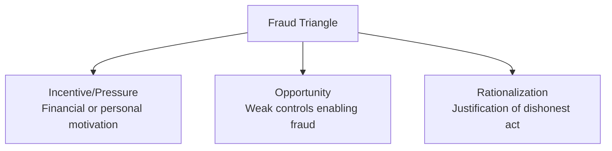
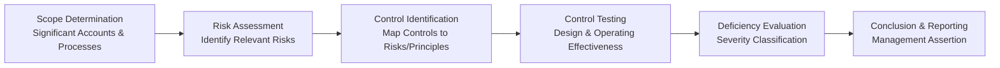

## COSO Internal Control Framework

### Overview

The COSO Internal Control Framework, published by the Committee of Sponsoring Organizations of the Treadway Commission, is the most widely adopted framework for designing, implementing, and evaluating internal control systems. Originally issued in 1992 and comprehensively updated in 2013, the framework provides a common language and structure for organizations to assess whether their internal controls are effective across operations, reporting, and compliance objectives. For management accountants, COSO underpins internal control design, financial reporting integrity, fraud risk mitigation, and SOX compliance assessments.

### The Three Objective Categories

COSO defines internal control effectiveness relative to three overlapping categories of objectives:

- **Operations objectives** — Pertain to the effectiveness and efficiency of the entity's operations, including operational and financial performance goals and safeguarding assets against loss
- **Reporting objectives** — Pertain to internal and external financial and non-financial reporting, encompassing reliability, timeliness, transparency, and other criteria set by regulators or the entity's own policies
- **Compliance objectives** — Pertain to adherence to laws and regulations to which the entity is subject

### The Five Components of Internal Control

COSO's 2013 framework structures internal control around five interrelated components, often visualized as a pyramid or cube:

| Component | Description | Key Focus |
| --- | --- | --- |
| **Control Environment** | The foundation for all other components; sets the tone of the organization | Integrity, ethics, board oversight, organizational structure, competence, accountability |
| **Risk Assessment** | The entity's process for identifying and analyzing relevant risks | Objective-setting, risk identification, fraud risk consideration, change analysis |
| **Control Activities** | Actions established through policies and procedures to mitigate risks | Approvals, authorizations, verifications, reconciliations, segregation of duties |
| **Information & Communication** | Systems supporting the identification, capture, and exchange of information | Internal/external communication, relevant and quality information |
| **Monitoring Activities** | Ongoing and/or separate evaluations to ascertain control effectiveness | Ongoing monitoring, separate evaluations, deficiency reporting |

### The 17 Principles

Each of the five components is supported by specific principles (17 total) that represent the fundamental concepts associated with that component. All 17 principles must be present and functioning, and operating together, for an internal control system to be considered effective.

#### Control Environment (Principles 1–5)

1. The organization demonstrates a commitment to integrity and ethical values
2. The board of directors demonstrates independence from management and exercises oversight of internal control
3. Management establishes structures, reporting lines, and appropriate authorities and responsibilities
4. The organization demonstrates a commitment to attract, develop, and retain competent individuals
5. The organization holds individuals accountable for their internal control responsibilities

#### Risk Assessment (Principles 6–9)

6. The organization specifies objectives with sufficient clarity to enable identification and assessment of risks
7. The organization identifies risks to the achievement of its objectives and analyzes risks as a basis for determining how they should be managed
8. The organization considers the potential for fraud in assessing risks
9. The organization identifies and assesses changes that could significantly impact the system of internal control

#### Control Activities (Principles 10–12)

10. The organization selects and develops control activities that mitigate risks to the achievement of objectives to acceptable levels
11. The organization selects and develops general control activities over technology
12. The organization deploys control activities through policies and procedures

#### Information and Communication (Principles 13–15)

13. The organization obtains or generates and uses relevant, quality information
14. The organization internally communicates information necessary to support internal control functioning
15. The organization communicates with external parties regarding matters affecting internal control

#### Monitoring Activities (Principles 16–17)

16. The organization selects, develops, and performs ongoing and/or separate evaluations to ascertain whether components of internal control are present and functioning
17. The organization evaluates and communicates internal control deficiencies in a timely manner to parties responsible for corrective action

### Requirements for Effective Internal Control

Under the COSO framework, internal control is deemed effective when the board and management have reasonable assurance that:

- Operations objectives are being achieved
- External financial reporting is reliable, prepared in accordance with applicable accounting standards
- Applicable laws and regulations are being complied with

This requires that **each of the five components and relevant principles is present and functioning**, and that **the five components operate together** in an integrated manner (i.e., they must not merely exist individually but function cohesively across the organization).

### Practical Example: Mapping Principles to Accounting Controls

| Principle | Example Accounting Control |
| --- | --- |
| Commitment to integrity (Principle 1) | Code of conduct requiring disclosure of conflicts of interest in vendor selection |
| Board independence (Principle 2) | Audit committee composed of independent directors reviewing financial statements |
| Fraud risk consideration (Principle 8) | Management override risk assessment for journal entry posting |
| Control activities over technology (Principle 11) | ERP system access controls restricting who can post/approve journal entries |
| Deploys policies and procedures (Principle 12) | Three-way matching policy requiring PO, receipt, and invoice agreement before payment |
| Relevant, quality information (Principle 13) | Monthly reconciliation reports validated for completeness before distribution |
| Ongoing/separate evaluations (Principle 16) | Internal audit testing of revenue recognition controls |
| Timely deficiency communication (Principle 17) | Escalation protocol requiring material weaknesses be reported to the audit committee within a defined period |

### COSO and the Fraud Triangle Integration

Principle 8 (fraud risk consideration) explicitly requires organizations to evaluate fraud risk using a structured lens, commonly integrated with the **Fraud Triangle** concept:

Management accountants apply this triangle when designing control activities specifically aimed at reducing **opportunity** (the only leg of the triangle directly controllable through internal control design), such as segregation of duties, mandatory vacations, and transaction-level approval limits.

### COSO ERM Framework: Relationship to Internal Control

COSO also publishes a separate but related framework, the **Enterprise Risk Management (ERM) — Integrating with Strategy and Performance** framework (updated 2017), which is broader in scope than internal control alone, addressing strategy-setting and performance in addition to control.

| Aspect | COSO Internal Control (2013) | COSO ERM (2017) |
| --- | --- | --- |
| Scope | Internal control specifically | Enterprise-wide risk management, including strategy |
| Objectives | Operations, reporting, compliance | Strategy, operations, reporting, compliance |
| Primary use | Financial reporting reliability, SOX compliance | Strategic risk management, risk appetite alignment |
| Structure | 5 components, 17 principles | 5 components, 20 principles |

**[Inference]** In practice, organizations often use the Internal Control framework specifically for SOX/financial reporting assurance purposes while applying the broader ERM framework for enterprise-wide strategic risk governance, though the two frameworks are designed to be complementary rather than mutually exclusive.

### Application in SOX Compliance

Under Section 404 of the Sarbanes-Oxley Act, U.S. public companies must have management assess and report on the effectiveness of internal control over financial reporting (ICFR), and COSO is the predominant framework used for this assessment. The typical SOX/COSO assessment workflow:

#### Deficiency Severity Classification

| Severity | Definition | Reporting Implication |

 

| Control deficiency | Design or operation does not allow timely prevention/detection of misstatement | Internally tracked and remediated |

| Significant deficiency | Less severe than a material weakness but important enough to merit attention by those responsible for oversight | Reported to audit committee |

| Material weakness | Reasonable possibility that a material misstatement will not be prevented or detected on a timely basis | Reported publicly; ICFR deemed ineffective |

### Roles and Responsibilities

- **Board of directors/audit committee** — Oversight of management's design and operation of internal control; independence and expertise are foundational to Principle 2
- **Management** — Primary responsibility for establishing, maintaining, and monitoring internal control
- **Internal audit function** — Provides independent, objective assurance regarding the effectiveness of internal control (typically supporting the "separate evaluations" aspect of Principle 16)
- **External auditors** — Under SOX, provide independent attestation on the effectiveness of ICFR (for accelerated filers)
- **All employees** — Internal control is not solely a finance/accounting function; COSO emphasizes that control is embedded in operations across the entire organization

### Limitations of Internal Control (Inherent Limitations)

COSO explicitly acknowledges that internal control, no matter how well designed, provides only **reasonable assurance**, not absolute assurance, regarding achievement of objectives, due to inherent limitations:

- **Human judgment** — Decisions can be flawed and subject to bias in judgment
- **Management override** — Management can override controls, whether for legitimate business reasons or fraudulent purposes
- **Collusion** — Two or more individuals can collude to circumvent controls that would otherwise be effective if acting alone
- **Resource constraints** — Controls must be designed with cost-benefit considerations, meaning not all risks can be mitigated to zero
- **Breakdown potential** — Controls can fail due to human error, system malfunction, or misunderstanding of instructions

### Common Implementation Challenges

- **Principle-based flexibility vs. inconsistent application** — Because the 17 principles are broadly stated, different organizations/auditors may interpret "presence and functioning" inconsistently without careful documentation standards
- **Documentation burden** — Mapping existing controls to all 17 principles and five components across a large organization is resource-intensive
- **Overreliance on entity-level controls** — Some organizations rely too heavily on high-level (entity-level) controls without sufficient process-level control activities to address specific risks
- **IT general controls integration** — Principle 11 requires increasing sophistication as organizations adopt more complex technology environments (cloud systems, automation, AI), requiring internal control frameworks to be continually updated for new technology risk

### Related Topics

- COSO Enterprise Risk Management (ERM) Framework
- Sarbanes-Oxley Act (SOX) Section 302 and 404 compliance
- Fraud Triangle and fraud risk assessment
- Segregation of duties and control activities design
- Internal audit function and its role in governance
- Material weakness and significant deficiency evaluation
- IT general controls (ITGC) in automated environments
- Enterprise Risk Management and risk appetite frameworks
- Corporate governance and board oversight structures
- Whistleblower programs and ethics reporting mechanisms