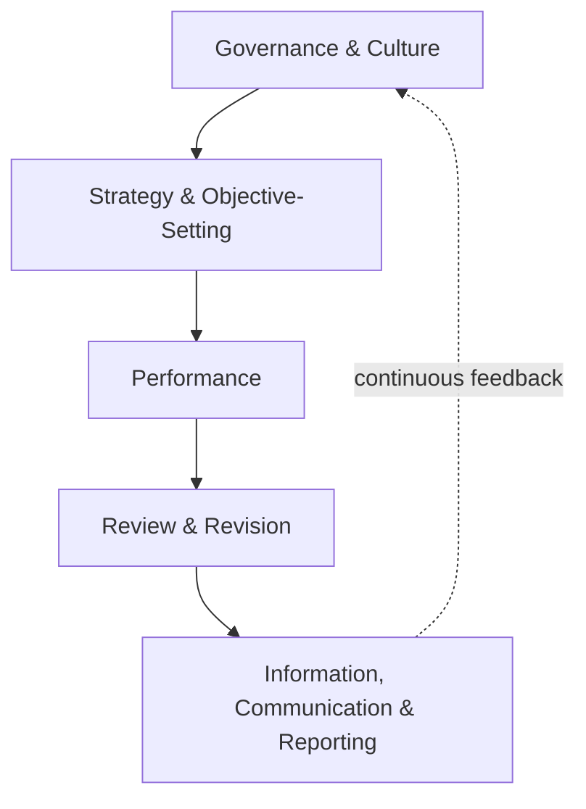
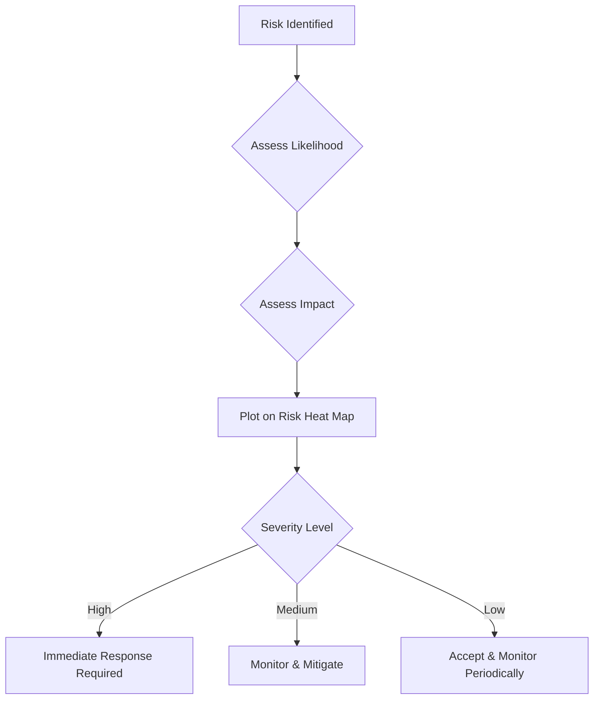
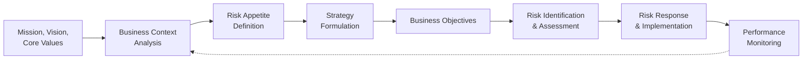

## COSO Enterprise Risk Management Framework

### Overview

The COSO Enterprise Risk Management (ERM) Framework, formally titled *Enterprise Risk Management — Integrating with Strategy and Performance* (updated in 2017, superseding the original 2004 framework), provides a broader risk management structure than the COSO Internal Control Framework. Where internal control focuses on ensuring operational, reporting, and compliance objectives are reasonably assured, ERM addresses how organizations identify, assess, and manage risk in the context of strategy-setting and overall performance. For management accountants, ERM informs strategic planning, risk-adjusted decision-making, capital allocation, and the integration of risk considerations into performance management systems.

### Evolution: 2004 to 2017 Framework

| Aspect | 2004 Framework | 2017 Framework |
| --- | --- | --- |
| Structure | 8 components (cube model) | 5 components, 20 principles |
| Primary orientation | Risk management as a standalone process | Risk management integrated with strategy and performance |
| Risk appetite treatment | Addressed but less central | Central concept, explicitly linked to strategy selection |
| Value creation link | Implicit | Explicit — ERM framed as enabling value creation and preservation |
| Visual model | Three-dimensional cube | Series of interconnected components (DNA/ribbon-style diagram) |

**[Inference]** The 2017 update's shift toward integration with strategy reflects a broader industry recognition that risk management divorced from strategic decision-making tends to become a compliance checkbox exercise rather than a value-adding management function, though organizations vary considerably in how fully they have operationalized this integration.

### The Five Components of ERM (2017)

| Component | Description | Key Focus |
| --- | --- | --- |
| **Governance and Culture** | Establishes oversight responsibilities and reinforces risk-aware culture | Board risk oversight, organizational culture, core values, attracting/retaining talent |
| **Strategy and Objective-Setting** | ERM integrated with strategic planning process | Business context analysis, risk appetite definition, alternative strategy evaluation, business objective formulation |
| **Performance** | Identifying and assessing risks that may affect strategy/objective achievement | Risk identification, severity assessment, prioritization, risk response selection, portfolio view |
| **Review and Revision** | Assessing how well ERM components are functioning over time | Substantial change assessment, review of risk and performance, pursuit of ERM improvement |
| **Information, Communication, and Reporting** | Obtaining and sharing information supporting ERM | Leveraging information systems, communicating risk information, reporting on risk, culture, and performance |

### The 20 Principles

#### Governance and Culture (Principles 1–5)

1. Exercises board risk oversight
2. Establishes operating structures
3. Defines desired culture
4. Demonstrates commitment to core values
5. Attracts, develops, and retains capable individuals

#### Strategy and Objective-Setting (Principles 6–9)

6. Analyzes business context
7. Defines risk appetite
8. Evaluates alternative strategies
9. Formulates business objectives

#### Performance (Principles 10–14)

10. Identifies risk
11. Assesses severity of risk
12. Prioritizes risks
13. Implements risk responses
14. Develops portfolio view

#### Review and Revision (Principles 15–17)

15. Assesses substantial change
16. Reviews risk and performance
17. Pursues improvement in enterprise risk management

#### Information, Communication, and Reporting (Principles 18–20)

18. Leverages information and technology
19. Communicates risk information
20. Reports on risk, culture, and performance

### Key Concept: Risk Appetite

Risk appetite is central to the 2017 framework — defined as the types and amount of risk an organization is willing to accept in pursuit of value. It directly shapes strategy selection (Principle 7 and Principle 8).

$$\text{Risk Capacity} \geq \text{Risk Appetite} \geq \text{Risk Tolerance (per objective)}$$

| Term | Definition |
| --- | --- |
| **Risk capacity** | The maximum amount of risk an entity is able to absorb in pursuit of its objectives, given resource constraints |
| **Risk appetite** | The types and amount of risk, on a broad level, an organization is willing to accept in pursuit of value |
| **Risk tolerance** | The acceptable variation in performance relative to a specific objective, often set in measurable/quantitative terms |

#### Practical Example: Risk Appetite Statement Translation

A company might articulate risk appetite qualitatively ("moderate appetite for operational risk, low appetite for compliance risk, high appetite for strategic/growth risk") and then translate it into measurable tolerances used by management accountants:

| Risk Category | Appetite Level | Quantified Tolerance |
| --- | --- | --- |
| Operational | Moderate | Downtime not to exceed 2% of total production hours annually |
| Compliance | Low | Zero tolerance for regulatory reporting violations |
| Strategic/Growth | High | Willing to accept up to 15% variance in ROI on new market entry within first 3 years |
| Financial/Credit | Low-Moderate | Bad debt expense not to exceed 1.5% of credit sales |

### Risk Assessment Techniques Within ERM

#### Risk Identification Methods

- **Risk workshops/interviews** — Structured sessions with management and staff to surface risks
- **SWOT analysis integration** — Linking identified threats to formal risk registers
- **Scenario analysis** — Constructing plausible future scenarios to identify emerging risks
- **Loss event data analysis** — Reviewing historical incidents (internal and industry-wide) for risk pattern identification
- **Risk factor checklists/taxonomies** — Standardized categories (strategic, operational, financial, compliance, reputational) ensuring comprehensive coverage

#### Risk Severity Assessment (Principle 11)

Risk severity is typically assessed along two dimensions — likelihood and impact — often visualized in a heat map:

A common quantitative expression of risk severity combines likelihood and impact:

$$\text{Risk Score} = \text{Likelihood} \times \text{Impact}$$

| Risk | Likelihood (1–5) | Impact (1–5) | Risk Score |
| --- | --- | --- | --- |
| Key supplier disruption | 3 | 5 | 15 |
| Cybersecurity breach | 4 | 4 | 16 |
| Foreign currency fluctuation | 4 | 2 | 8 |
| Regulatory non-compliance fine | 2 | 5 | 10 |

**[Inference]** While the multiplicative likelihood-times-impact score is a widely used heuristic for risk prioritization, it can obscure important distinctions between high-likelihood/low-impact risks and low-likelihood/high-impact (tail) risks that carry the same numerical score but require fundamentally different management responses.

### Risk Response Strategies (Principle 13)

| Response | Description | Example |
| --- | --- | --- |
| **Accept** | No action taken; risk within tolerance | Retaining minor foreign exchange exposure on immaterial transactions |
| **Avoid** | Exiting the activity giving rise to the risk | Discontinuing a product line with unacceptable liability exposure |
| **Reduce (Mitigate)** | Actions taken to reduce likelihood or impact | Implementing additional quality control checkpoints to reduce defect risk |
| **Share (Transfer)** | Reducing risk likelihood/impact by transferring/sharing a portion | Purchasing insurance, hedging with derivatives, outsourcing certain operations |
| **Pursue** | Accepting increased risk to pursue an opportunity (2017 addition) | Entering a new, higher-risk market to capture growth opportunity |

### The Portfolio View of Risk (Principle 14)

A distinguishing feature of ERM versus traditional risk management is the **portfolio view** — evaluating risks in aggregate across the enterprise rather than in isolated silos, recognizing that risks can be correlated, offsetting, or compounding across business units.

$$\text{Portfolio Risk} \neq \sum_{i=1}^{n} \text{Individual Risk}_i$$

This reflects that diversification effects, correlations between risk events, and concentration risk (e.g., multiple business units depending on the same supplier) mean that the aggregate enterprise-wide risk exposure cannot simply be summed from individually assessed risks — it requires a consolidated, correlated view, often maintained through an enterprise risk register or risk dashboard.

### Integration with Strategic Planning

Management accountants play a role in this integration by:

- Incorporating risk-adjusted metrics into capital budgeting (e.g., risk-adjusted discount rates, sensitivity/scenario analysis in NPV calculations)
- Linking risk appetite thresholds to budget variance tolerances and performance target-setting
- Embedding risk indicators into Balanced Scorecard or KPI dashboard reporting
- Supporting scenario planning and stress testing for strategic alternatives

### ERM vs. Internal Control Framework: Key Distinctions

| Aspect | COSO Internal Control (2013) | COSO ERM (2017) |
| --- | --- | --- |
| Primary purpose | Reasonable assurance over operations, reporting, compliance objectives | Managing risk in the context of strategy and performance to enhance value |
| Relationship to strategy | Assumes strategy is set; controls support objective achievement | Actively involved in strategy formulation and evaluation |
| Risk appetite role | Referenced but not central | Central organizing concept |
| Scope | Narrower — control-focused | Broader — enterprise-wide risk and value creation focused |
| Typical primary users | Compliance, internal audit, external auditors (SOX context) | Board, C-suite, strategic planning, enterprise risk management functions |

**[Inference]** The two frameworks are designed by COSO to be complementary and are frequently implemented together in practice — internal control providing the control-activity-level assurance mechanism, and ERM providing the enterprise-wide strategic risk governance overlay — though the degree of formal integration between the two varies significantly by organization size and industry.

### Practical Example: Applying ERM to a Capital Investment Decision

A manufacturing company evaluating a new overseas production facility applies ERM principles as follows:

1. **Business context analysis (Principle 6):** Assess geopolitical, currency, and regulatory environment of the target country
2. **Risk appetite check (Principle 7):** Confirm the investment's risk profile aligns with the board's stated appetite for growth/expansion risk
3. **Risk identification (Principle 10):** Currency risk, political risk, supply chain disruption risk, talent availability risk
4. **Severity assessment (Principle 11):** Score each risk by likelihood and impact
5. **Portfolio view (Principle 14):** Assess how this investment's risk profile correlates with existing overseas operations (concentration risk)
6. **Risk response (Principle 13):** Currency hedging instruments, political risk insurance, phased capital deployment to limit initial exposure
7. **Reporting (Principle 20):** Risk-adjusted NPV and sensitivity analysis presented to the board alongside the investment proposal

### Limitations and Implementation Challenges

- **Principle-based ambiguity** — Similar to the Internal Control framework, broadly stated principles allow flexibility but can lead to inconsistent implementation quality across organizations
- **Risk appetite quantification difficulty** — Translating qualitative risk appetite statements into consistently measurable tolerances across diverse risk categories is conceptually and practically difficult
- **Siloed implementation risk** — Organizations may implement ERM as a standalone risk management department function without genuine integration into strategic planning and operational decision-making, undermining the framework's core intent
- **Dynamic risk landscape** — Emerging risk categories (cybersecurity, climate-related risk, AI-related risk) require continuous framework adaptation, and static, infrequently updated risk registers can quickly become outdated
- **Board risk oversight capacity** — Effective governance (Principle 1) depends on board members possessing sufficient risk literacy and time to provide meaningful oversight, which is not guaranteed by framework adoption alone

### Related Topics

- COSO Internal Control Framework
- Risk appetite, risk tolerance, and risk capacity frameworks
- Enterprise risk registers and risk heat mapping
- Capital budgeting under risk and uncertainty
- Balanced Scorecard and strategic performance measurement
- Scenario planning and stress testing
- Corporate governance and board risk oversight
- Hedging and derivatives for financial risk management
- Business continuity and disaster recovery planning
- Cybersecurity risk management frameworks (e.g., NIST)