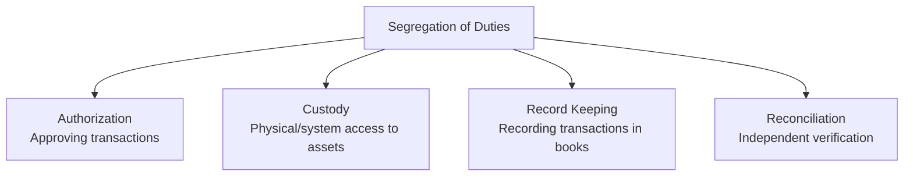
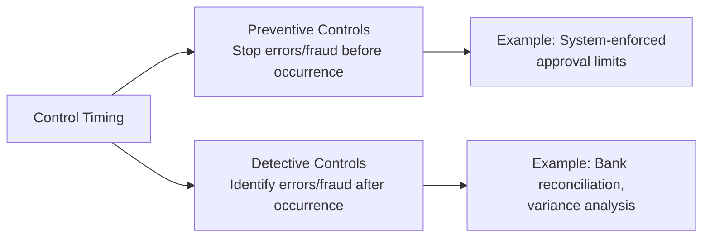
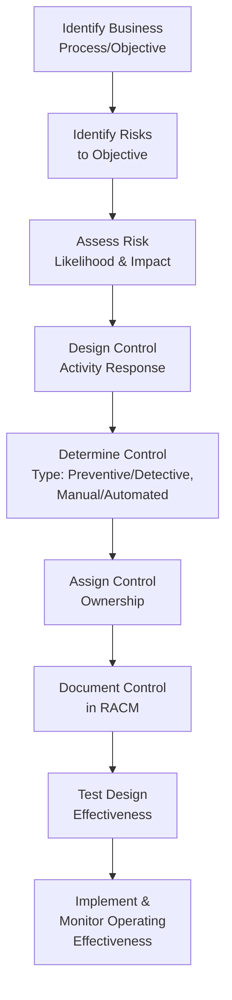

## Designing Internal Control Systems

### Overview

Designing internal control systems translates the conceptual COSO framework into concrete, operational policies, procedures, and system configurations tailored to an organization's specific risks, processes, and objectives. Effective design requires management accountants to move beyond generic control checklists toward a risk-based, cost-justified approach that embeds controls into business processes without unnecessarily impeding operational efficiency.

### Design Principles for Internal Control Systems

#### 1. Risk-Based Design

Controls should be designed in direct response to identified risks rather than applied uniformly. This requires a documented linkage between each risk and the control(s) intended to mitigate it, commonly captured in a **risk and control matrix (RACM)**.

$$\text{Residual Risk} = \text{Inherent Risk} - \text{Risk Mitigated by Control}$$

Where inherent risk is the level of risk before considering controls, and residual risk is what remains after controls are applied. Design should target residual risk levels within the organization's stated risk tolerance.

#### 2. Cost-Benefit Justification

No control system can eliminate all risk; controls consume resources (staff time, system costs, process friction) and must be justified relative to the risk they mitigate.

$$\text{Control Investment Justified if: } \text{Cost of Control} < \text{Expected Loss} \times \text{Probability of Loss Reduction}$$

**[Inference]** In practice, this cost-benefit calculation is rarely performed with strict quantitative precision for most operational controls; it functions more as a qualitative design discipline to avoid over-controlling low-risk, low-materiality processes than as a formal capital-budgeting-style calculation.

#### 3. Segregation of Duties (SoD)

A foundational design principle preventing any single individual from having control over all phases of a transaction. The classic SoD framework separates four functions:

| Function | Description | Example |
| --- | --- | --- |
| Authorization | Approving that a transaction should occur | Manager approves a purchase requisition |
| Custody | Physical or system-level control over the asset | Warehouse staff physically control inventory |
| Record keeping | Recording the transaction in accounting records | AP clerk records the vendor invoice |
| Reconciliation/Verification | Independent check confirming records match reality | Someone outside the above roles reconciles the bank statement |

When SoD cannot be fully achieved (common in small organizations), **compensating controls** — such as increased management review, mandatory job rotation, or surprise audits — are designed to offset the residual risk.

#### 4. Preventive vs. Detective Controls

| Type | Purpose | Design Consideration | Examples |
| --- | --- | --- | --- |
| **Preventive** | Stop an error or irregularity before it occurs | Generally preferred where feasible; often more cost-effective long-term but can be harder/costlier to implement | System-enforced approval workflows, access restrictions, input validation, segregation of duties |
| **Detective** | Identify errors or irregularities after they have occurred | Necessary where prevention is impractical or as a secondary layer; relies on timely follow-up to be effective | Bank reconciliations, variance analysis, physical inventory counts, exception reports |
| **Corrective** | Remediate identified issues and prevent recurrence | Closes the loop after detection | Root-cause analysis and process redesign following a detected control failure |

A well-designed system layers preventive and detective controls rather than relying exclusively on one type, since no preventive control is perfectly effective and detective controls alone allow errors to persist until discovery.

#### 5. Manual vs. Automated (IT-Dependent) Controls

| Type | Characteristics | Design Consideration |
| --- | --- | --- |
| **Manual controls** | Performed by people without system enforcement | More flexible for judgment-based scenarios; higher risk of inconsistency and human error |
| **Automated controls** | Embedded in system logic (e.g., ERP configuration) | More consistent once correctly configured; risk shifts to IT general controls (access, change management) governing the system itself |
| **IT-dependent manual controls** | Manual controls relying on system-generated reports/data | Effectiveness depends on both the manual review and the underlying data/report accuracy |

Automating a control does not eliminate risk — it transforms the risk from "will the person follow the procedure correctly each time?" to "is the system correctly configured, and are IT general controls (access, change management) over that configuration adequate?"

### The Control Design Process

#### Step-by-Step Design Methodology

1. **Process mapping** — Document the business process flow (e.g., procure-to-pay, order-to-cash) to identify each step where risk of error, fraud, or inefficiency could arise
2. **Risk identification per process step** — For each step, identify what could go wrong (e.g., "invoice paid twice," "unauthorized vendor added to master file")
3. **Control point identification** — Determine where in the process flow a control can most effectively intervene, generally as close to the risk point as possible
4. **Control design specification** — Define precisely what the control does, who performs it, how frequently, and what evidence it generates
5. **Control ownership assignment** — Assign clear accountability for control performance to a specific role (not merely a department)
6. **Documentation** — Formalize the control in policy/procedure documentation and the risk-control matrix
7. **Design effectiveness testing** — Confirm the control, as designed, would actually prevent or detect the risk it targets if operating as intended
8. **Operating effectiveness monitoring** — Ongoing testing to confirm the control is functioning consistently in practice (distinct from design effectiveness)

### Practical Example: Designing Controls for the Procurement Process

| Process Step | Risk | Control Designed | Type | Owner |
| --- | --- | --- | --- | --- |
| Requisition creation | Unauthorized purchases | System-enforced approval workflow based on dollar threshold | Preventive, Automated | Department manager |
| Vendor selection | Fictitious/unapproved vendors | Vendor master file changes require dual approval | Preventive, IT-dependent manual | AP supervisor |
| Purchase order issuance | Duplicate orders | System validation blocking duplicate PO numbers/amounts | Preventive, Automated | System configuration (IT) |
| Goods receipt | Recording goods not received | Physical receiving confirmation required before payment (three-way match) | Preventive, Manual/Automated | Warehouse receiving clerk |
| Invoice processing | Duplicate/erroneous payment | System duplicate-invoice detection; independent invoice review | Preventive & Detective | AP clerk / AP supervisor |
| Payment disbursement | Unauthorized disbursement | Segregation between invoice processing and payment release; positive pay with bank | Preventive | Treasury |
| Period-end | Undetected errors accumulating | Monthly AP subledger-to-GL reconciliation | Detective | Accounting manager |

### Key Control Design Frameworks and Tools

#### Risk and Control Matrix (RACM)

A structured document mapping each identified risk to its corresponding control(s), including control type, frequency, owner, and testing approach — the central artifact used in SOX/COSO-based control design and later testing.

| Risk ID | Risk Description | Control Description | Control Type | Frequency | Control Owner | Test Procedure |
| --- | --- | --- | --- | --- | --- | --- |
| R-01 | Revenue recognized before delivery | System blocks invoice generation until shipment confirmation recorded | Preventive, Automated | Continuous | Order-to-cash system owner | Inspect system configuration; test sample of transactions |

#### Control Frequency Considerations

Controls should be designed with a frequency appropriate to the risk's materiality and volatility:

- **Transaction-level (every transaction)** — For high-risk, high-volume, individually material transactions (e.g., wire transfer approvals)
- **Periodic (daily/weekly/monthly)** — For lower-frequency risks or where transaction-level controls would be cost-prohibitive (e.g., bank reconciliations)
- **Annual/Ad hoc** — For lower-risk or infrequent events (e.g., annual physical inventory count, contract renewal reviews)

### Designing for the IT Environment

As organizations increasingly automate transaction processing, control design must explicitly address:

- **Access controls** — Role-based access ensuring users can only perform actions consistent with their assigned duties within the system (system-enforced segregation of duties)
- **Change management controls** — Formal authorization, testing, and approval processes before changes to system configurations, reports, or automated control logic take effect
- **Interface controls** — Validation controls over data transferred between systems (e.g., ensuring a sales system correctly and completely transmits data to the general ledger)
- **Data integrity/edit controls** — Input validation rules (field format checks, range checks, mandatory field enforcement) preventing erroneous data entry at the point of capture

### Common Design Pitfalls

- **Control redundancy without risk coverage gaps analysis** — Multiple controls addressing the same low-risk area while genuine high-risk areas remain uncontrolled
- **Overly manual design in high-volume environments** — Manual controls applied to high-transaction-volume processes create bottlenecks and inconsistent execution; such environments generally benefit more from automated preventive controls
- **Poorly defined control ownership** — Assigning control responsibility to a department rather than a specific accountable role leads to diffusion of responsibility and control failure
- **Static design in a changing environment** — Controls designed once and never revisited as processes, systems, or risk profiles evolve become misaligned with actual current risk (addressed by COSO Internal Control Principle 9 and ERM Principle 15)
- **Ignoring behavioral/cultural factors** — Even well-designed controls fail if the control environment (tone at the top, incentive structures) does not support genuine compliance rather than workaround behavior

### Testing Newly Designed Controls

Before relying on a newly designed control, both **design effectiveness** and **operating effectiveness** should be evaluated:

| Evaluation Type | Question Addressed | Typical Testing Method |
| --- | --- | --- |
| Design effectiveness | If operating as designed, would this control actually prevent or detect the targeted risk? | Walkthrough of the control logic against the risk scenario |
| Operating effectiveness | Is the control actually functioning consistently as designed, in practice, over time? | Sample testing of transactions, re-performance, observation |

A control can be well-designed but ineffective in operation (e.g., an approval requirement that is consistently bypassed in practice), which is why both evaluations are necessary and distinct.

### Related Topics

- COSO Internal Control Framework
- COSO Enterprise Risk Management Framework
- Segregation of duties and compensating controls
- Risk and control matrix (RACM) development
- IT general controls (ITGC) and application controls
- Fraud risk assessment and the fraud triangle
- SOX Section 404 control testing methodology
- Business process mapping techniques
- Internal audit control testing procedures
- Control self-assessment (CSA) programs