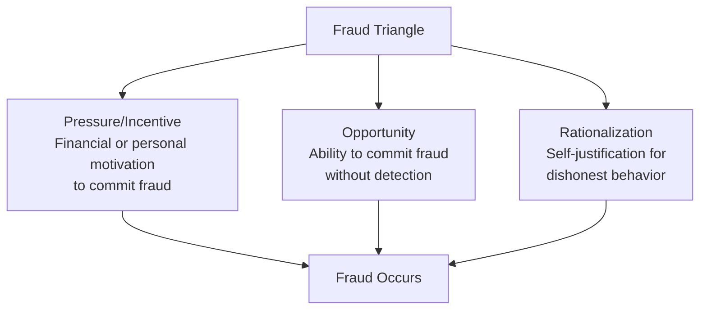
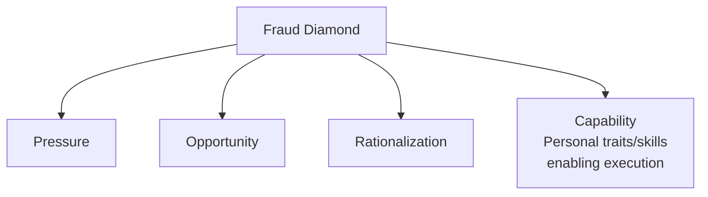
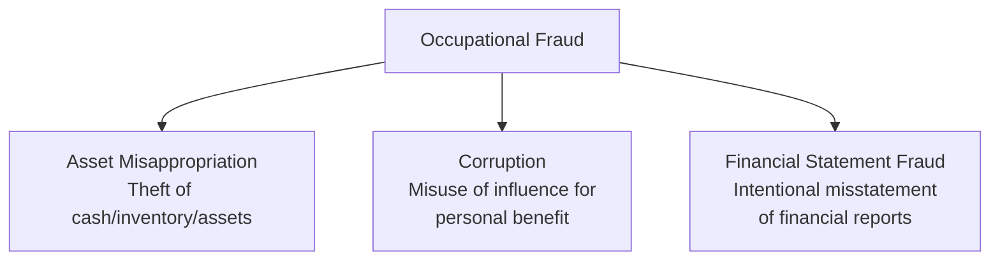
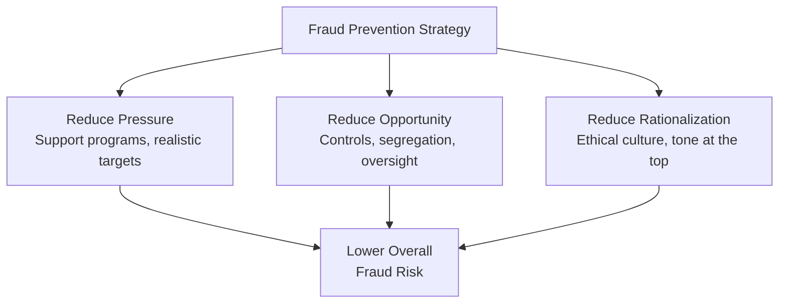
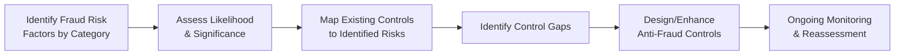

## The Fraud Triangle and Fraud Prevention

### Overview

The Fraud Triangle, developed from criminologist Donald Cressey's research on trust violators, is the foundational conceptual model explaining why individuals who otherwise hold positions of trust commit fraud. It identifies three conditions that, together, create the circumstances under which fraud is likely to occur. For management accountants, the Fraud Triangle underpins fraud risk assessment (a required element of COSO Internal Control Principle 8), the design of anti-fraud controls, and forensic investigation methodology.

### The Three Elements of the Fraud Triangle

| Element | Description | Organizational Control Relevance |
| --- | --- | --- |
| **Pressure (Incentive)** | A perceived financial or non-financial need driving the individual toward fraud | Largely outside direct organizational control; can be indirectly mitigated through employee assistance and support programs |
| **Opportunity** | A perceived ability to commit fraud with a low likelihood of detection | The only leg directly controllable through internal control design |
| **Rationalization** | The internal justification allowing the individual to reconcile the dishonest act with their self-image as an otherwise honest person | Influenced by organizational culture, tone at the top, and ethical climate |

#### Pressure (Incentive) — Common Sources

- **Financial pressure** — Personal debt, medical expenses, lifestyle beyond means, gambling problems
- **Work-related pressure** — Unrealistic performance targets, fear of job loss, resentment over compensation/recognition
- **Vice-related pressure** — Addiction-driven financial need
- **Business pressure (for management fraud)** — Pressure to meet analyst earnings expectations, debt covenant compliance, bonus/incentive compensation tied to reported results

#### Opportunity — Common Sources

- Weak or absent segregation of duties
- Inadequate management oversight or review
- Poor access controls over systems and assets
- Lack of independent verification/reconciliation
- Management override capability with insufficient counterbalancing oversight
- Complex or opaque transactions that are difficult for others to scrutinize

#### Rationalization — Common Patterns

- "I'm only borrowing the money; I'll pay it back"
- "I deserve this; I'm underpaid relative to my contribution"
- "Everyone does this; it's not really wrong"
- "The company won't miss this small amount" or "the company can afford it"
- "I'm just meeting the numbers the company demanded of me" (particularly relevant to management/financial statement fraud)

### The Fraud Diamond: An Extension

A widely referenced extension to the triangle adds a fourth element:

**Capability** recognizes that even with pressure, opportunity, and rationalization present, the individual must also possess the personal traits, position, intelligence, ego, and coercion skills necessary to actually recognize and exploit the opportunity and manage the stress of the deception over time. **[Inference]** The Fraud Diamond is generally treated as a refinement of, rather than a replacement for, the original triangle, since capability is arguably a component of how effectively an individual can exploit a given opportunity rather than a wholly independent causal condition.

### Categories of Occupational Fraud

The most widely cited fraud classification structure divides occupational fraud into three primary categories:

| Category | Description | Relative Frequency | Relative Median Loss |
| --- | --- | --- | --- |
| **Asset misappropriation** | Theft or misuse of organizational assets (cash, inventory, payroll fraud) | Most common | Typically lowest median loss per scheme |
| **Corruption** | Bribery, kickbacks, conflicts of interest, illegal gratuities | Moderately common | Moderate median loss |
| **Financial statement fraud** | Intentional misstatement or omission in financial reports (overstating revenue, understating expenses/liabilities) | Least common | Typically highest median loss per scheme |

**[Unverified]** Specific statistics on relative frequency and dollar losses by category (such as those published in periodic occupational fraud studies) are updated regularly by fraud examination organizations; current figures should be sourced from the most recent published study rather than assumed static, as methodology and reporting periods vary between editions.

### Common Asset Misappropriation Schemes

| Scheme Type | Description | Example |
| --- | --- | --- |
| Skimming | Theft of cash before it is recorded in the accounting system | Cashier pockets cash sale without recording the transaction |
| Larceny | Theft of cash or assets after they have been recorded | Employee steals cash from a recorded till drawer |
| Billing schemes | Fraudulent invoices submitted for payment | Creating a shell company to submit fictitious invoices |
| Payroll schemes | Manipulation of payroll records for illicit gain | "Ghost employee" added to payroll |
| Expense reimbursement schemes | Fraudulent or inflated expense claims | Submitting personal expenses as business expenses |
| Check tampering | Altering or forging company checks | Forging a signature on a company check |
| Inventory/asset misuse or theft | Physical theft or unauthorized use of company assets | Employee removes inventory for personal use or resale |

### Financial Statement Fraud Techniques

- **Revenue recognition manipulation** — Recording revenue prematurely (before delivery/performance obligation satisfaction) or recording fictitious sales
- **Improper expense capitalization** — Capitalizing costs that should be expensed to inflate current-period earnings
- **Understating liabilities/expenses** — Omitting or delaying recognition of known liabilities (e.g., unrecorded warranty obligations)
- **Overstating assets** — Inflating inventory values, failing to write down impaired assets, overvaluing receivables (understating allowance for doubtful accounts)
- **Improper disclosures** — Omitting related-party transactions or off-balance-sheet arrangements

### Fraud Prevention Framework

#### Addressing Pressure

- Reasonable, achievable performance targets and compensation structures avoiding excessive incentive-driven distortion
- Employee assistance programs addressing financial or personal hardship
- Confidential channels for employees to raise concerns about unsustainable workload or targets

#### Addressing Opportunity (Primary Control Focus)

- **Segregation of duties** across authorization, custody, record-keeping, and reconciliation functions
- **Strong internal controls** — approval hierarchies, system access restrictions, physical safeguards over assets
- **Surprise audits and unpredictable review timing** — reduce the ability to plan around known review schedules
- **Mandatory vacation/job rotation policies** — schemes often unravel when the perpetrator is absent and duties are covered by someone else
- **Whistleblower/hotline programs** — anonymous reporting mechanisms significantly increase detection likelihood
- **Management override monitoring** — heightened scrutiny of journal entries and transactions bypassing normal controls, particularly around period-end

#### Addressing Rationalization

- **Tone at the top** — Visible, consistent ethical leadership from senior management and the board
- **Code of conduct and ethics training** — Clear articulation of expected behavior and consequences of violations
- **Consistent enforcement** — Uniform application of consequences regardless of position or performance, avoiding perceived unfairness that fuels rationalization
- **Open communication culture** — Environments where employees feel safe raising concerns without retaliation reduce the "everyone does it" rationalization pathway

### Fraud Detection Techniques

| Technique | Description |
| --- | --- |
| **Data analytics/continuous monitoring** | Automated analysis of 100% of transactions for anomalies (duplicate payments, round-dollar amounts, unusual timing) |
| **Benford's Law analysis** | Statistical technique comparing the expected frequency distribution of leading digits in naturally occurring datasets to actual data, flagging datasets with anomalous digit patterns suggestive of fabrication |
| **Variance/trend analysis** | Comparing actual results to budgets/prior periods to identify unexplained fluctuations warranting investigation |
| **Tip lines/whistleblower hotlines** | Consistently identified as one of the most effective fraud detection methods across fraud studies |
| **Internal audit testing** | Targeted testing of high-risk areas identified through fraud risk assessment |
| **External audit procedures** | Required fraud risk assessment procedures under auditing standards, though external audits are not primarily designed to detect fraud |

#### Benford's Law Illustration

Benford's Law predicts the expected frequency of the leading digit $d$ in many naturally occurring numerical datasets:

$$P(d) = \log_{10}\left(1 + \frac{1}{d}\right)$$

Under this law, the digit 1 is expected to appear as the leading digit roughly 30.1% of the time, while the digit 9 appears roughly 4.6% of the time. Fabricated numbers (e.g., invented invoice amounts) often deviate from this natural distribution, making Benford's Law analysis a useful (though not conclusive) screening tool for identifying data sets warranting closer investigation. **[Inference]** Benford's Law is most reliable as a screening technique applied to large, naturally varying datasets (such as full-year transaction populations) rather than small samples or data with inherent structural constraints (e.g., prices ending predominantly in ".99"), and a deviation from the expected distribution is a red flag warranting further inquiry rather than proof of fraud.

### Fraud Risk Assessment Process

Fraud risk assessment (required under COSO Internal Control Principle 8) systematically evaluates:

- Incentives and pressures specific to the organization/industry
- Opportunities created by the organization's specific control environment and process design
- Types of fraud that could occur given the nature of the business (revenue recognition risk, inventory theft risk, management override risk)
- Populations/individuals with heightened capability or access relevant to specific fraud schemes

### Practical Example: Fraud Triangle Applied to a Case Scenario

**Scenario:** An accounts payable manager with sole authority to both create vendors in the master file and approve payments (opportunity), facing significant personal medical debt (pressure), rationalizes creating a fictitious vendor ("the company has plenty of money, and I'll stop once I pay off my debt") and diverts payments to a personally controlled account.

**Control redesign addressing the scenario:**

| Fraud Triangle Element | Control Weakness Exploited | Redesigned Control |
| --- | --- | --- |
| Opportunity | Same individual creates vendors AND approves payments | Segregate vendor master file maintenance from payment approval; require dual approval for new vendor additions |
| Opportunity | No independent verification of vendor legitimacy | Periodic vendor master file audit comparing vendor addresses/bank details against employee records (detecting employee-vendor address matches) |
| Rationalization | No visible consequence precedent | Clear, consistently enforced disciplinary policy communicated organization-wide |
| Pressure | No support mechanism for financial hardship | Confidential employee assistance program |

### Roles in Fraud Prevention and Detection

- **Management** — Primary responsibility for establishing and maintaining anti-fraud controls and culture
- **Board/Audit committee** — Oversight of management's fraud risk assessment and response; independent channel for whistleblower escalation
- **Internal audit** — Ongoing testing of fraud-relevant controls and investigation support
- **External auditors** — Required to assess fraud risk as part of financial statement audits (though detection of fraud is not the primary audit objective)
- **Certified Fraud Examiners (CFEs)** — Specialized forensic accounting professionals conducting fraud investigations
- **All employees** — Front-line awareness and willingness to report suspicious activity through established channels

### Limitations of Fraud Prevention Efforts

- **No control eliminates fraud risk entirely** — Collusion between two or more individuals can circumvent even well-designed segregation of duties
- **Management override risk** — Senior management possesses the authority to override controls, making top-level fraud (particularly financial statement fraud) inherently harder to prevent through process-level controls alone
- **Detection lag** — Occupational fraud schemes often continue for a considerable period before detection, particularly asset misappropriation schemes in organizations with weak oversight; specific average duration figures vary by study and fraud type and should be sourced from current fraud studies rather than assumed
- **Cost-benefit trade-offs** — Comprehensive fraud controls carry real operational costs, and organizations must balance fraud risk mitigation against operational efficiency and control cost
- **Evolving schemes** — As detection techniques improve, fraud schemes adapt, requiring continuous reassessment rather than static, one-time control design

### Related Topics

- COSO Internal Control Framework (Principle 8: fraud risk consideration)
- Designing Internal Control Systems and segregation of duties
- Forensic accounting and fraud examination methodology
- Whistleblower programs and ethics hotlines
- Financial statement analysis for fraud red flags
- Benford's Law and digital analysis techniques
- Management override of controls
- Corporate governance and tone at the top
- Internal audit fraud risk assessment procedures
- Data analytics and continuous auditing for fraud detection