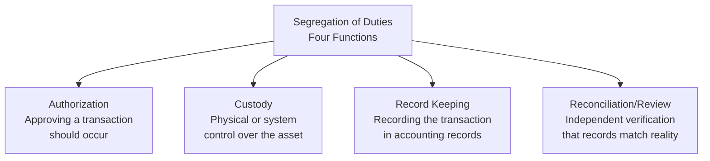
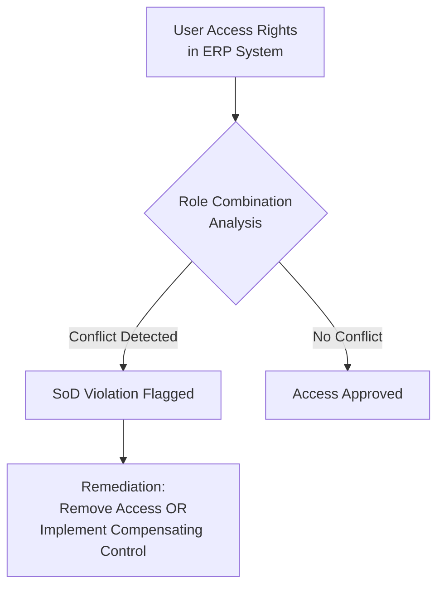
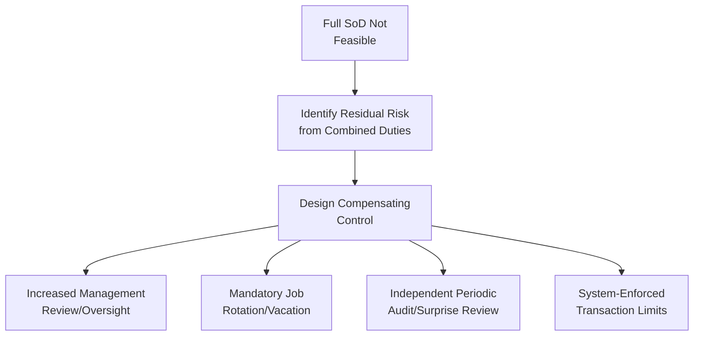
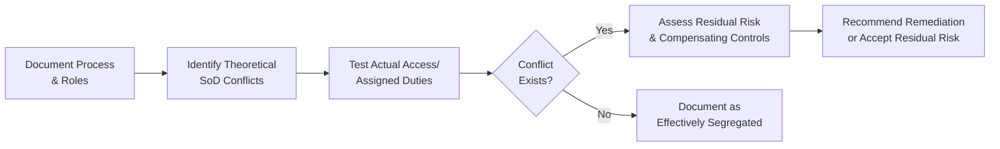

## Segregation of Duties

### Overview

Segregation of Duties (SoD) is a foundational internal control principle requiring that no single individual has control over all phases of a transaction from initiation through recording and reconciliation. By dividing incompatible responsibilities among multiple people, SoD reduces both the opportunity for fraud (a direct application of the Fraud Triangle's opportunity element) and the likelihood that unintentional errors go undetected. SoD is embedded across COSO's Control Activities component and is one of the most commonly tested controls in SOX compliance and financial statement audits.

### The Four Core Incompatible Functions

| Function | Description | Example Role |
| --- | --- | --- |
| **Authorization** | Approving that a transaction should be initiated or executed | Purchasing manager approving a purchase order |
| **Custody** | Physical possession or system-level control over an asset | Warehouse staff with physical control of inventory; treasury staff with access to bank accounts |
| **Record Keeping** | Recording the transaction within the accounting system | Accounting clerk posting the journal entry or invoice |
| **Reconciliation/Independent Verification** | Confirming that recorded amounts agree with independent evidence | An individual outside the above roles reconciling the bank statement to the cash ledger |

**The core design principle:** No single individual should perform two or more of these four functions for the same transaction, since combining any two creates an opportunity for that individual to both commit and conceal an irregularity without independent detection.

### Why SoD Matters: The Risk Logic

If one person can both authorize a payment and record it in the books, that individual could authorize a fraudulent payment and then adjust the accounting records to conceal it, with no independent party positioned to notice the discrepancy. SoD breaks this chain by ensuring that any individual attempting fraud would need the active cooperation (collusion) of at least one other person — which meaningfully raises the practical difficulty and detection risk of the scheme, even though it does not make fraud impossible.

### Common SoD Conflicts by Process Area

#### Cash Receipts/Accounts Receivable

| Incompatible Combination | Risk Created |
| --- | --- |
| Opening mail/receiving payments + posting to customer accounts | Employee can skim cash and adjust customer records to hide the shortage |
| Approving credit memos + handling cash receipts | Employee can issue a fraudulent credit memo to cover a skimmed payment |
| Maintaining customer master file + processing receipts | Employee can redirect payments through fictitious customer account changes |

#### Cash Disbursements/Accounts Payable

| Incompatible Combination | Risk Created |
| --- | --- |
| Creating/maintaining vendor master file + approving invoices for payment | Employee can create a fictitious vendor and approve payments to it |
| Approving invoices + signing/releasing checks | Employee can approve and pay fraudulent or personal invoices without independent check |
| Reconciling bank statements + processing disbursements | Employee can conceal unauthorized disbursements during reconciliation |

#### Payroll

| Incompatible Combination | Risk Created |
| --- | --- |
| Maintaining employee master file (HR data) + processing payroll | Employee can add a "ghost employee" and process payment to them |
| Approving timesheets + calculating/distributing pay | Employee can inflate hours and directly benefit without independent check |
| Payroll processing + distributing physical paychecks | Employee can withhold a terminated employee's final check for personal use |

#### Inventory

| Incompatible Combination | Risk Created |
| --- | --- |
| Physical custody of inventory + inventory record keeping | Employee can steal inventory and adjust records to conceal the shortage |
| Authorizing inventory write-offs + physical custody | Employee can steal inventory and authorize its own write-off as "damaged" or "obsolete" |

#### General Ledger/Financial Reporting

| Incompatible Combination | Risk Created |
| --- | --- |
| Preparing journal entries + approving journal entries | Unauthorized or erroneous entries could post without independent review |
| System administration access + transaction processing | IT staff with both roles could bypass application controls undetected |

### SoD in the IT/ERP Environment

Modern ERP systems introduce a distinct dimension of SoD risk: **system access-based SoD conflicts**, where a user's assigned system roles/permissions — rather than their job title alone — determine whether incompatible functions are combined.

#### Key IT-Specific SoD Considerations

- **Role-based access control (RBAC)** — System roles should be designed to mirror job function boundaries, preventing a single user profile from being assigned both, e.g., "create vendor" and "approve payment" transaction codes
- **Automated SoD conflict matrices** — Many ERP and GRC (Governance, Risk, and Compliance) platforms include built-in rule sets that automatically flag when a user's combined access rights create a known SoD conflict
- **Emergency/firefighter access** — Temporary elevated access granted for urgent issue resolution, which should be tightly logged, time-limited, and subject to mandatory post-use review
- **Segregation between development and production environments** — Developers should not have unrestricted access to modify production financial data directly, separate from the traditional transactional SoD conflicts
- **System administrator oversight** — IT administrators with the technical ability to grant themselves any access right represent a unique SoD risk requiring independent monitoring of admin activity logs

**[Unverified]** Specific SoD rule libraries and conflict-detection capabilities vary by ERP/GRC vendor and are updated with new releases; the applicable rule set for a given implementation should be verified against current vendor documentation rather than assumed generic.

### When Full SoD Is Not Feasible: Compensating Controls

In smaller organizations or departments with limited staff, achieving full four-way segregation is often impractical. In these cases, **compensating controls** are designed to offset the residual risk created by incomplete segregation:

| Compensating Control | Description |
| --- | --- |
| **Enhanced management review** | Owner/senior manager personally reviews and approves transactions that would otherwise lack independent segregation |
| **Mandatory job rotation** | Periodically rotating employees through roles, increasing the likelihood that a successor will notice irregularities |
| **Mandatory vacation policy** | Requiring uninterrupted time away from duties, during which someone else performs the role and may uncover concealment schemes requiring continuous perpetrator presence |
| **Third-party/outsourced review** | Engaging external bookkeepers or accountants to perform independent reconciliations |
| **System-enforced transaction limits** | Capping the dollar value an individual can process without secondary approval, limiting potential loss exposure even without full segregation |
| **Surprise audits** | Unscheduled reviews reducing the ability to plan concealment around known audit timing |

**[Inference]** Compensating controls reduce but do not eliminate the risk created by incomplete segregation; management should document the rationale for relying on compensating controls (rather than achieving full segregation) as part of the organization's overall control design and risk acceptance documentation.

### Practical Example: Redesigning a Small Business Cash Process

**Original process (SoD conflict):** The office manager opens mail, records customer payments in the accounting system, deposits cash at the bank, and reconciles the bank statement — combining custody, record-keeping, and reconciliation in one role.

**Redesigned process with compensating controls (5-person company where full segregation is impractical):**

| Step | Assigned To | Purpose |
| --- | --- | --- |
| Mail opened and checks logged on a receipts list | Receptionist (not office manager) | Creates an independent record of expected deposits |
| Payments recorded in accounting system | Office manager | Efficient use of limited staff |
| Deposits made at bank | Office manager | Same constraint |
| **Compensating control:** Owner reviews receipts list against bank deposit confirmations monthly | Owner (independent of daily processing) | Detects discrepancies between what was received and what was deposited/recorded |
| **Compensating control:** Bank reconciliation performed by outsourced bookkeeper | External bookkeeper | Provides independent verification the office manager cannot influence |

### SoD Testing and Assessment Methodology

Testing SoD typically involves:

1. **Process/role documentation** — Mapping who performs each function within a given business cycle
2. **Access rights review** — For IT-dependent processes, reviewing actual system access grants (not merely job descriptions) against defined SoD conflict rules
3. **Sample transaction testing** — Confirming that, in practice, the same individual did not perform incompatible steps for sampled transactions
4. **Exception evaluation** — For identified conflicts, assessing whether compensating controls adequately mitigate the residual risk
5. **Reporting and remediation tracking** — Documenting identified conflicts, management's response, and remediation timelines

### Limitations of Segregation of Duties

- **Collusion** — SoD is specifically designed to require collusion between two or more individuals to circumvent; it does not prevent fraud when such collusion occurs
- **Management override** — Senior management, by virtue of organizational authority, may possess override capability that bypasses segregation designed for lower organizational levels
- **Cost and efficiency trade-offs** — Full segregation requires sufficient staffing; smaller organizations must weigh the cost of additional personnel against the residual risk accepted through compensating controls
- **False sense of security from access-only analysis** — Reviewing system access rights alone, without observing actual practice, may miss situations where informal workarounds (e.g., password sharing) effectively recombine segregated duties despite technically compliant access assignments
- **Static conflict matrices in evolving processes** — As business processes and organizational structures change, previously defined SoD conflict rules require periodic reassessment to remain relevant

### Related Topics

- The Fraud Triangle and Fraud Prevention
- Designing Internal Control Systems
- COSO Internal Control Framework (Control Activities component)
- IT general controls (ITGC) and role-based access control
- Governance, Risk, and Compliance (GRC) platforms
- Compensating controls in small business environments
- Internal audit testing of control design and operating effectiveness
- Risk and control matrix (RACM) development
- Management override of controls
- Cash handling and treasury control procedures