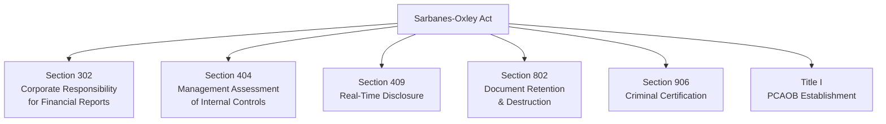
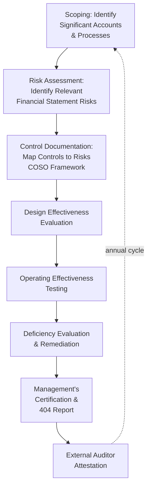
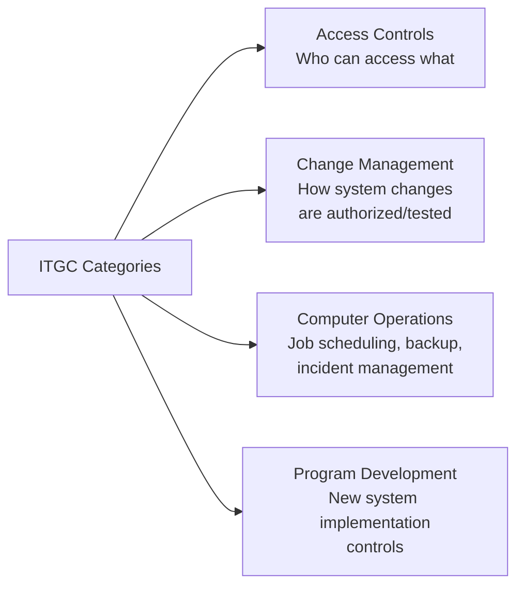

## Sarbanes Oxley Implications for Management Accounting

### Overview

The Sarbanes-Oxley Act of 2002 (SOX), enacted in response to major corporate accounting scandals (Enron, WorldCom), fundamentally reshaped financial reporting governance, internal control requirements, and personal accountability for U.S. public companies. While SOX is often discussed primarily in the context of external audit and financial reporting, it carries substantial direct implications for management accountants, who are typically responsible for designing, documenting, executing, and monitoring the internal controls that SOX compliance requires.

### Key SOX Provisions Relevant to Management Accounting

| Section | Requirement | Management Accounting Relevance |
| --- | --- | --- |
| **Section 302** | CEO/CFO must personally certify the accuracy of financial reports and the effectiveness of disclosure controls each quarter | Management accountants supply and validate the underlying data supporting these certifications |
| **Section 404** | Management must assess and report on the effectiveness of internal control over financial reporting (ICFR); auditors must attest to this assessment (for accelerated filers) | Directly drives the internal control documentation, testing, and remediation work management accountants perform |
| **Section 409** | Real-time disclosure of material changes in financial condition | Requires management accounting systems capable of rapid, accurate financial data compilation |
| **Section 802** | Criminal penalties for destroying, altering, or falsifying records to impede an investigation | Establishes document retention obligations affecting accounting records management |
| **Section 906** | Criminal certification of financial reports by CEO/CFO, with substantial penalties for knowing false certification | Elevates the stakes of inaccurate underlying accounting data and management reporting |
| **Title I** | Establishes the Public Company Accounting Oversight Board (PCAOB) to oversee audits of public companies | Sets auditing standards that shape how ICFR is tested and reported on |

### Section 404: The Core Management Accounting Impact

Section 404 is generally considered the SOX provision with the most direct and ongoing operational impact on management accounting functions, comprising two sub-sections:

- **Section 404(a)** — Requires management to include an internal control report in the annual report, stating management's responsibility for establishing and maintaining adequate ICFR and providing management's assessment of ICFR effectiveness
- **Section 404(b)** — Requires the external auditor to attest to and report on management's internal control assessment (applicable to "accelerated filers" and "large accelerated filers"; smaller reporting companies may be exempt from the auditor attestation requirement, though management's own assessment obligation under 404(a) generally still applies)

**[Unverified]** The specific filer-size thresholds distinguishing accelerated filers, large accelerated filers, and non-accelerated/smaller reporting companies for SOX 404(b) applicability are set and periodically adjusted by the SEC; current thresholds should be verified against current SEC rules rather than assumed static.

### The SOX 404 Compliance Cycle

#### Management Accountant Responsibilities Across the Cycle

| Cycle Stage | Typical Management Accounting Involvement |
| --- | --- |
| Scoping | Identifying financially significant accounts, processes, and locations based on materiality and risk |
| Risk assessment | Identifying risks of material misstatement within owned processes (e.g., revenue recognition, inventory valuation) |
| Control documentation | Preparing/maintaining process narratives, flowcharts, and risk-control matrices (RACM) |
| Design evaluation | Participating in walkthroughs demonstrating how controls operate |
| Operating effectiveness testing | Providing evidence (reports, approvals, reconciliations) for internal/external testing samples |
| Deficiency remediation | Implementing corrective action plans for identified control gaps |
| Certification support | Providing sub-certifications up the management chain supporting the CEO/CFO's ultimate Section 302/906 certifications |

### Deficiency Classification Under SOX

| Severity | Definition | Management Accounting Action |
| --- | --- | --- |
| **Control deficiency** | Design or operation does not allow timely prevention/detection of misstatement, but does not rise to significant deficiency or material weakness | Documented and tracked; typically remediated in normal course |
| **Significant deficiency** | Less severe than a material weakness, but important enough to merit attention by those responsible for oversight of financial reporting | Reported to the audit committee; remediation plan typically required |
| **Material weakness** | A reasonable possibility that a material misstatement of the financial statements will not be prevented or detected on a timely basis | Requires disclosure that ICFR is not effective; significant remediation priority, often board-level visibility |

$$\text{Materiality Threshold (illustrative)} = f(\text{quantitative magnitude}, \text{qualitative factors})$$

**[Inference]** Materiality assessment for control deficiency classification is not governed by a single universal quantitative formula; it combines quantitative thresholds (often benchmarked against a percentage of a relevant financial statement base) with qualitative factors (e.g., whether the deficiency involves fraud, senior management, or a pervasive process), and the specific weighting applied varies by organization and auditor judgment.

### Documentation Requirements Management Accountants Typically Prepare

- **Process narratives** — Written descriptions of how a business process flows from initiation to financial statement impact
- **Process flowcharts** — Visual representations of process steps, decision points, and control points
- **Risk and control matrices (RACM)** — Structured mapping of financial statement assertions/risks to specific controls, including control owner, frequency, and type
- **Control testing evidence** — Retained documentation (approvals, reconciliations, system reports) demonstrating that controls operated as designed during the testing period
- **Entity-level control documentation** — Documentation of higher-level controls (e.g., codes of conduct, board oversight structures) supporting the overall control environment

### Impact on Journal Entry and Close Process Controls

SOX has particularly heightened scrutiny of processes historically associated with management override risk:

- **Journal entry controls** — Formal approval requirements, system-enforced posting restrictions, and independent review specifically targeting manual/non-standard journal entries (a historically common vehicle for financial statement fraud)
- **Period-end close checklists** — Standardized, documented close procedures with sign-off requirements at each step
- **Account reconciliation requirements** — Mandatory, documented, and independently reviewed reconciliation of all balance sheet accounts on a defined schedule
- **Estimates and judgments documentation** — Enhanced documentation supporting significant accounting estimates (allowances, reserves, impairments) given their susceptibility to management bias

### IT General Controls (ITGC) Under SOX

As financial reporting increasingly depends on automated systems, SOX 404 compliance extends control assessment into the IT environment:

Management accountants relying on system-generated reports for financial reporting must understand that the reliability of those reports depends on the underlying ITGC environment — a report is only as trustworthy as the access controls and change management protecting the system that generated it.

### Practical Example: SOX Impact on a Revenue Recognition Process

**Pre-SOX approach (illustrative):** Revenue recognized based on individual judgment calls by sales/accounting staff with limited formal documentation of the basis for recognition timing.

**Post-SOX-compliant approach:**

| Element | SOX-Driven Enhancement |
| --- | --- |
| Process documentation | Formal process narrative describing revenue recognition criteria applied (e.g., delivery confirmation requirements) |
| Control design | System-enforced block preventing invoice/revenue posting until shipment confirmation is recorded in the system |
| Control testing | Quarterly sample testing confirming revenue was recognized in the correct period per documented criteria |
| Estimate documentation | Formal memo documenting judgment applied to any non-standard or complex revenue arrangements |
| Certification chain | Revenue accounting manager provides a sub-certification to the controller, feeding up to the CFO's Section 302 certification |

### Personal Accountability and Certification Implications

SOX Sections 302 and 906 create direct personal liability exposure for executives who knowingly certify inaccurate financial reports. This has practical downstream effects on management accounting practice:

- **Sub-certification cascades** — Many organizations implement internal "sub-certification" processes where controllers, business unit finance leaders, and process owners formally attest to their area's accuracy and control effectiveness before the CEO/CFO's ultimate certification, effectively distributing accountability (and diligence) throughout the accounting organization
- **Heightened documentation discipline** — Because certifications carry criminal liability implications, there is increased organizational emphasis on maintaining defensible, well-documented support for accounting judgments and estimates
- **Increased scrutiny of estimates and non-routine transactions** — Areas involving significant management judgment receive disproportionate documentation and review attention given their historical association with financial statement fraud

### Auditor Independence Implications

SOX also restricts the scope of non-audit services external auditors may provide to audit clients, which has organizational implications for management accounting functions:

- Certain consulting/advisory services (e.g., some categories of bookkeeping, financial information systems design/implementation) that external auditors previously performed for audit clients are restricted, shifting this work to internal management accounting resources or non-auditor third parties
- Audit committee pre-approval is required for permitted non-audit services, creating additional governance touchpoints for management accounting-related engagements

### Whistleblower Protections Under SOX

Section 806 provides whistleblower protection for employees who report suspected securities fraud or violations of SEC rules, with anti-retaliation provisions. This has direct relevance to management accounting fraud risk management:

- Reinforces the importance of internal reporting/hotline mechanisms discussed under fraud prevention frameworks
- Creates legal risk for organizations that retaliate against employees (including accounting staff) who raise good-faith concerns about financial reporting irregularities

### Cost and Resource Implications for Management Accounting Functions

- **Compliance cost burden** — SOX compliance, particularly Section 404, has historically represented a material ongoing cost (documentation maintenance, testing, remediation, audit coordination), disproportionately impacting smaller public companies relative to their revenue base
- **Resource allocation shift** — Management accounting staff time is diverted from purely analytical/decision-support activities toward compliance documentation and testing support
- **Technology investment justification** — SOX compliance requirements often justify investment in ERP systems, workflow automation, and GRC (Governance, Risk, and Compliance) platforms that improve control documentation, testing efficiency, and audit trail generation

**[Inference]** Organizations that integrate SOX compliance activities with broader internal control and risk management processes (rather than treating SOX as a standalone annual compliance exercise) generally derive greater ongoing value from the compliance investment, since the underlying control documentation and testing infrastructure also supports operational risk management and audit readiness beyond the specific SOX certification requirement.

### Limitations and Ongoing Debates

- **Compliance cost vs. benefit debate** — Critics have long questioned whether SOX 404 compliance costs, particularly for smaller public companies, are proportionate to the incremental fraud prevention/detection benefit achieved
- **Checkbox compliance risk** — Organizations may treat SOX compliance as a documentation exercise disconnected from genuine risk management, achieving formal compliance without meaningfully reducing risk
- **Scope limitations** — SOX 404 focuses specifically on internal control over *financial reporting*; it does not comprehensively address operational risk, strategic risk, or all forms of fraud (e.g., fraud that does not materially affect financial statements may fall outside SOX's direct scope, though other laws may still apply)
- **Does not guarantee fraud prevention** — As with any internal control framework, SOX compliance provides reasonable, not absolute, assurance; SOX-compliant companies have still experienced significant fraud and financial reporting failures, illustrating the framework's inherent limitations rather than a design flaw specific to SOX itself

### Related Topics

- COSO Internal Control Framework
- Designing Internal Control Systems
- The Fraud Triangle and Fraud Prevention
- Segregation of Duties
- Material weakness and significant deficiency evaluation
- IT general controls (ITGC) in financial reporting systems
- Public Company Accounting Oversight Board (PCAOB) auditing standards
- Whistleblower programs and Section 806 protections
- Governance, Risk, and Compliance (GRC) platforms
- Corporate governance and audit committee oversight