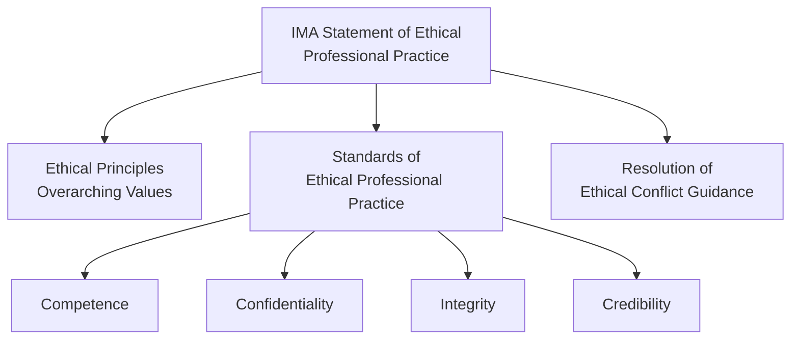
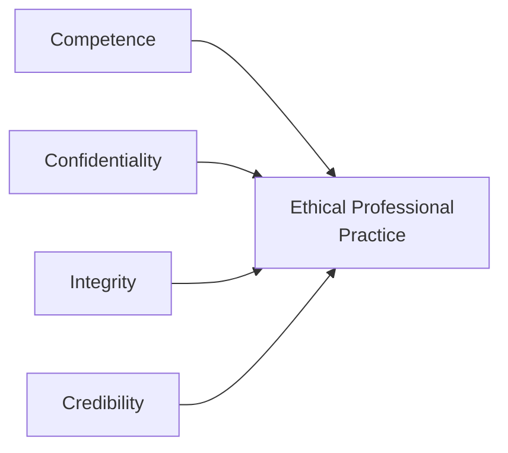
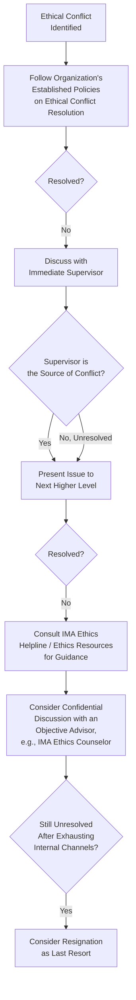

## IMA Statement of Ethical Professional Practice in Depth

### Overview

The IMA Statement of Ethical Professional Practice, issued by the Institute of Management Accountants, establishes the ethical standards governing management accounting and financial management professionals, including those holding the Certified Management Accountant (CMA) credential. It provides both a set of overarching ethical principles and specific, actionable standards of conduct, along with resolution guidance for ethical conflicts. For management accountants, this statement functions as the professional counterpart to the technical/regulatory frameworks (COSO, SOX) covered elsewhere in risk management and internal control — addressing the individual practitioner's ethical obligations rather than organizational control design.

### Structure of the Statement

The statement is organized into two complementary tiers: broad **ethical principles** that describe the values underlying the profession, and specific **standards** that translate those principles into concrete behavioral expectations across four categories.

### Ethical Principles

The IMA identifies core ethical principles that describe the foundational values members are expected to embody, generally including:

- **Honesty** — Truthfulness in all professional dealings and communications
- **Fairness** — Impartial and equitable treatment of all stakeholders
- **Objectivity** — Freedom from bias in professional judgment
- **Responsibility** — Accountability for one's professional actions and their consequences

**[Unverified]** The IMA periodically reviews and may revise the precise wording and enumeration of its ethical principles; practitioners should consult the current published IMA Statement of Ethical Professional Practice for the authoritative, current text rather than relying on a paraphrased summary.

### The Four Standards of Ethical Professional Practice

#### 1. Competence

Management accountants are expected to maintain an appropriate level of professional expertise through ongoing development and to perform duties in accordance with relevant laws, regulations, and technical standards.

**Core obligations under Competence:**

- Maintain an appropriate level of professional expertise by continually developing knowledge and skills
- Perform professional duties in accordance with relevant laws, regulations, and technical standards
- Provide decision support information and recommendations that are accurate, clear, concise, and timely
- Recognize and communicate professional limitations or other constraints that would preclude responsible judgment or successful performance of an activity

**Practical example:** A management accountant asked to prepare a lease accounting analysis under a standard they have not applied since a major accounting standards update should proactively identify this competence gap, seek updated technical guidance or training, or escalate the limitation rather than proceeding with outdated methodology and presenting the result as reliable.

#### 2. Confidentiality

Management accountants routinely have access to sensitive financial, strategic, and operational information, creating a distinct ethical obligation regarding its use and disclosure.

**Core obligations under Confidentiality:**

- Keep information confidential except when disclosure is authorized or legally required
- Inform relevant parties regarding appropriate use of confidential information; monitor to ensure compliance
- Refrain from using confidential information for unethical or illegal advantage, whether personally or through third parties

**Practical example:** A management accountant with advance knowledge of an unannounced acquisition must not trade in the securities of either company or tip off family/friends to trade, even though no explicit written policy addresses that specific scenario — the confidentiality standard applies independent of whether a specific rule enumerates the exact situation.

#### 3. Integrity

Integrity addresses the management accountant's obligation to avoid conflicts of interest and to refrain from engaging in conduct that would discredit the profession.

**Core obligations under Integrity:**

- Mitigate actual conflicts of interest; regularly communicate with business associates to avoid apparent conflicts; advise all parties of any potential conflicts
- Refrain from engaging in any conduct that would prejudice carrying out duties ethically
- Abstain from engaging in or supporting any activity that might discredit the profession
- Contribute to a positive ethical culture and place integrity of the profession above personal interests

**Practical example:** A management accountant who owns a personal stake in a vendor being evaluated for a major supply contract has an obligation to disclose this interest to relevant decision-makers, regardless of whether they personally believe the stake would not affect their objectivity — integrity requires proactive disclosure of the *potential* conflict, not merely avoidance of a proven actual conflict.

#### 4. Credibility

Credibility addresses the obligation to communicate information fairly, objectively, and completely, ensuring that recipients of accounting information can rely on its accuracy and completeness.

**Core obligations under Credibility:**

- Communicate information fairly and objectively
- Disclose all relevant information that could reasonably be expected to influence an intended user's understanding of reports, analyses, or recommendations
- Disclose delays or deficiencies in information, timeliness, processing, or internal controls in conformance with organizational policy and/or applicable law
- Communicate professional limitations or other constraints that would preclude responsible judgment or successful performance of an activity

**Practical example:** If a management accountant preparing a capital budgeting analysis becomes aware of a material risk factor omitted from the model at a manager's informal request (to make the project appear more favorable), disclosing that omission — rather than silently complying — is required under the Credibility standard, since withholding material information would mislead the analysis's users.

### Comparative Summary of the Four Standards

| Standard | Primary Focus | Key Risk Addressed |
| --- | --- | --- |
| Competence | Technical proficiency and honest self-assessment of capability | Providing unreliable analysis due to knowledge gaps |
| Confidentiality | Protection and appropriate use of sensitive information | Misuse of insider or proprietary information |
| Integrity | Avoidance of conflicts of interest and ethical conduct | Personal interest compromising professional judgment |
| Credibility | Fair, complete, and objective communication | Misleading or incomplete disclosure to information users |

### Resolution of Ethical Conflict

The IMA Statement includes specific guidance for resolving situations where a management accountant identifies unethical conduct or faces pressure to act unethically. The recommended approach generally follows an escalating internal path before considering external action:

**Key principles embedded in the resolution guidance:**

- **Exhaust internal channels first** — The process generally directs practitioners to attempt resolution within the organization's own established procedures before escalating further
- **Bypass a compromised supervisor** — If the immediate supervisor is implicated in the ethical issue, the guidance directs the practitioner to the next higher managerial level rather than remaining blocked at that reporting line
- **Confidential external consultation** — The IMA provides access to a confidential ethics helpline/resource for members seeking guidance in navigating a difficult ethical situation without necessarily disclosing the organization's identity
- **Resignation as a last resort** — If, after pursuing all reasonable internal avenues, the ethical conflict remains unresolved and the conduct in question is serious, resignation from the organization may be the appropriate final step, since continued involvement could itself constitute complicity
- **No obligation to report externally to authorities as a first step** — Unlike some whistleblower frameworks, the IMA's own ethical resolution guidance emphasizes internal resolution channels; separate legal whistleblower protections (e.g., under SOX Section 806) operate independently of this professional ethics guidance and may apply depending on the nature of the conduct involved

**[Inference]** The IMA's ethical conflict resolution guidance is designed as a professional conduct framework for its members and does not substitute for applicable legal reporting obligations (e.g., securities law violations, which may trigger separate whistleblower statutes); a practitioner facing a serious ethical conflict involving potential legal violations should generally consider both the professional guidance and applicable legal counsel.

### Practical Example: Applying the Resolution Framework

**Scenario:** A cost accountant is instructed by their direct supervisor (the controller) to reclassify a known operating expense as a capital asset to improve the current quarter's reported earnings, in violation of applicable accounting standards.

**Applying the resolution framework:**

1. The accountant first considers whether the organization has a formal ethics policy or ombudsperson process and, if so, follows it
2. Because the controller (the immediate supervisor) is the source of the conflict, the accountant escalates to the next higher level — for example, the CFO or audit committee — rather than raising it again with the controller
3. If the CFO is unresponsive or complicit, the accountant may seek confidential guidance from the IMA's ethics counseling resources to think through appropriate next steps
4. If internal escalation exhausts all reasonable avenues and the improper accounting continues, resignation may become the appropriate final step to avoid personal complicity in issuing materially misstated financial information

### Relationship to Other Professional and Regulatory Frameworks

| Framework | Relationship to IMA Ethics Statement |
| --- | --- |
| COSO Internal Control Framework | IMA ethics standards support the "Control Environment" component's emphasis on integrity and ethical values (Principle 1) at the individual practitioner level |
| Sarbanes-Oxley Act | SOX's whistleblower protections (Section 806) and certification requirements (Sections 302/906) operate alongside, but are legally distinct from, the IMA's professional ethics resolution guidance |
| CMA Certification | Adherence to the IMA Statement of Ethical Professional Practice is a professional conduct requirement tied to maintaining CMA certification, distinct from the technical competency demonstrated on the CMA exam |
| Corporate codes of conduct | Organizational codes of conduct typically operate as the "first line" internal policy referenced in the resolution guidance's initial escalation step |

### Common Ethical Dilemma Categories Addressed by the Statement

- **Earnings management pressure** — Requests to manipulate the timing or classification of revenue/expenses to meet targets (implicates Integrity and Credibility)
- **Cost allocation manipulation** — Directed misallocation of costs between products/divisions/contracts to achieve a desired reported outcome (implicates Credibility and Integrity)
- **Insider information misuse** — Trading on or tipping others regarding material non-public information (implicates Confidentiality)
- **Undisclosed conflicts of interest** — Personal financial relationships with vendors, customers, or competitors affecting professional judgment (implicates Integrity)
- **Withholding material information from decision-makers** — Selectively omitting unfavorable analysis results to please a requester (implicates Credibility)
- **Practicing beyond competence without disclosure** — Presenting analysis in an unfamiliar technical area as authoritative without disclosing the limitation (implicates Competence and Credibility)

### Limitations and Practical Considerations

- **Voluntary professional standard, not law** — The IMA Statement is a professional ethics code binding on IMA members/CMA holders through their professional association membership; it does not carry independent legal force, though violating it can result in professional sanctions (including loss of CMA certification) and often overlaps with conduct that separately violates law
- **Enforcement limitations** — Unlike SOX's criminal penalty provisions, IMA ethics enforcement operates primarily through professional association mechanisms (investigation, censure, certification revocation) rather than civil or criminal courts
- **Ambiguity in real-world application** — While the four standards provide clear categories, real-world ethical dilemmas often implicate multiple standards simultaneously and require professional judgment to navigate, particularly around materiality and the practical limits of internal escalation
- **Organizational culture dependency** — The resolution framework assumes a functioning internal escalation path exists; in organizations with pervasive ethical dysfunction extending to the highest levels, the practical value of internal escalation may be limited, increasing the relative importance of external legal protections and resources

### Related Topics

- Sarbanes Oxley Implications for Management Accounting
- The Fraud Triangle and Fraud Prevention
- COSO Internal Control Framework (Control Environment component)
- Certified Management Accountant (CMA) certification requirements
- Corporate codes of conduct and ethics programs
- Whistleblower protections and Section 806 of SOX
- Earnings management and financial statement fraud
- Professional judgment in accounting estimates
- Corporate governance and tone at the top
- Conflicts of interest disclosure practices