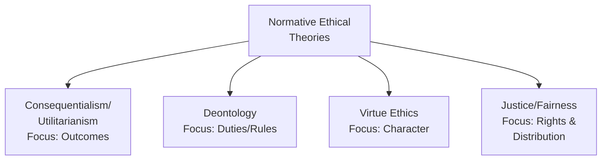
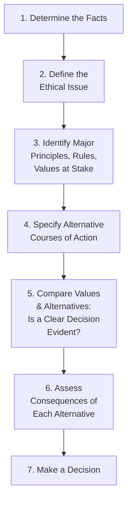
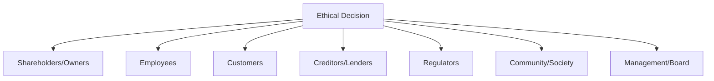

## Ethical Decision Making Frameworks

### Overview

Ethical decision-making frameworks provide structured methodologies for analyzing dilemmas where competing values, obligations, or stakeholder interests make the "right" course of action unclear. While the IMA Statement of Ethical Professional Practice defines *what* standards management accountants must uphold (competence, confidentiality, integrity, credibility), ethical decision-making frameworks provide the analytical process for *how* to reason through situations where applying those standards is not straightforward — particularly when multiple standards or stakeholder interests appear to conflict.

### Major Normative Ethical Theories

| Theory | Core Question | Decision Criterion |
| --- | --- | --- |
| **Consequentialism (Utilitarianism)** | What action produces the best overall outcome? | Maximize aggregate benefit/welfare; minimize aggregate harm across all affected stakeholders |
| **Deontology (Duty-based ethics)** | What does duty/moral rule require, regardless of outcome? | Adherence to universal moral rules or duties (e.g., honesty, promise-keeping) independent of consequences |
| **Virtue Ethics** | What would a person of good character do? | Action consistent with virtues such as honesty, courage, fairness, and prudence |
| **Justice/Fairness Theory** | Is the distribution of benefits/burdens and the process itself fair? | Equitable treatment, protection of rights, fair process (procedural justice) |

#### Consequentialism/Utilitarianism Applied

Under a utilitarian analysis, a management accountant evaluates an ethical dilemma by estimating the aggregate welfare impact across all affected parties:

$$\text{Net Utility} = \sum_{i=1}^{n} (\text{Benefit}_i - \text{Harm}_i) \text{ for each stakeholder } i$$

**Practical example:** A controller considering whether to disclose a minor, immaterial accounting error to the board might weigh the utilitarian costs (board time, potential unwarranted alarm) against benefits (transparency norm reinforcement, avoiding a "slippery slope" toward larger nondisclosures) — though critics note utilitarian analysis can be misused to rationalize withholding disclosure by overweighting short-term convenience.

#### Deontology Applied

A deontological analysis asks whether an action violates a duty or rule that should be followed regardless of the specific outcome it produces in this instance.

**Practical example:** Under a strict deontological view, a management accountant has a duty to accurately report financial information (per the IMA Credibility standard) regardless of whether a specific instance of non-disclosure might plausibly produce a "better" short-term outcome for the company — the duty to honesty applies as a rule, not a case-by-case cost-benefit calculation.

#### Virtue Ethics Applied

Virtue ethics shifts focus from the specific act or its consequences to the character of the decision-maker, asking what a person of genuine integrity, courage, and practical wisdom would do in the situation.

**Practical example:** Facing pressure to approve a questionable expense reimbursement from a senior executive, a virtue-ethics lens asks not "what rule applies" or "what produces the best outcome," but "what would someone of genuine professional integrity and courage do here" — reframing the decision around character rather than calculation.

#### Justice/Fairness Theory Applied

This framework emphasizes whether processes and outcomes treat stakeholders equitably, and whether fundamental rights are respected.

**Practical example:** Evaluating whether a proposed layoff-driven cost reduction plan disproportionately and unfairly burdens a particular employee group raises a distributive justice question distinct from whether the plan simply produces the best net financial outcome.

### Structured Ethical Decision-Making Process Models

Beyond the underlying philosophical theories, several practical, step-based frameworks are commonly taught for applying ethical reasoning to real business dilemmas.

#### The AAA (American Accounting Association) Model

1. **Determine the facts** — What is actually known, unknown, and assumed about the situation?
2. **Define the ethical issue** — Precisely identify what ethical question(s) the situation raises
3. **Identify major principles, rules, and values** — Which professional standards (e.g., IMA's four standards), organizational policies, and personal/societal values are implicated?
4. **Specify alternative courses of action** — Generate a reasonably complete set of possible responses, not just an obvious binary choice
5. **Compare values/alternatives** — Determine if one alternative clearly satisfies all identified values without conflict
6. **Assess consequences** — For remaining viable alternatives, evaluate short-term and long-term consequences for all stakeholders
7. **Decide on the appropriate course of action** — Select and be prepared to justify the chosen action

#### The Langenderfer-Rockness Model (Accounting-Specific)

A model developed specifically for accounting ethical dilemmas, emphasizing:

1. **Identify the ethical dilemma** and the stakeholders involved
2. **Identify the affected parties** and their respective interests/rights
3. **Rank stakeholders and their claims** by relative importance/legitimacy
4. **Identify the alternative courses of action** available
5. **Evaluate the alternatives** against ethical criteria and stakeholder impact
6. **Assess the consequences** of each alternative
7. **Make a decision**

#### Simplified "PLUS" Ethical Decision-Making Model

A commonly referenced practitioner-oriented framework asking four filtering questions of a proposed decision:

| Filter | Question |
| --- | --- |
| **P** — Policies | Is it consistent with organizational policies, procedures, and guidelines? |
| **L** — Legal | Is it acceptable under applicable laws and regulations? |
| **U** — Universal | Does it align with universal ethical principles/values (honesty, fairness)? |
| **S** — Self | Does it satisfy my own personal sense of right and wrong? |

**[Inference]** Practical frameworks like PLUS are generally intended as accessible mental checklists for time-pressured, real-world decisions rather than substitutes for the more rigorous, multi-step analytical models (AAA, Langenderfer-Rockness) used in formal ethics training or complex dilemma analysis.

### Stakeholder Analysis in Ethical Decision-Making

A common element across structured frameworks is systematic stakeholder identification and impact assessment:

For each stakeholder group, the analysis typically considers:

- **Interest** — What does this stakeholder want or need from the outcome?
- **Impact** — How would each alternative course of action affect this stakeholder?
- **Rights** — Does this stakeholder hold a legitimate claim or right that must be respected regardless of aggregate outcome?
- **Power/influence** — What is this stakeholder's practical ability to affect or respond to the decision? (relevant to consequence assessment, not to determining whose interests matter)

### Practical Example: Applying the AAA Model to a Cost Allocation Dilemma

**Scenario:** A cost accountant is asked by a division manager to allocate a disproportionate share of shared corporate overhead away from the manager's division and onto a sister division, in order to make the requesting manager's division appear more profitable ahead of a bonus determination period. The allocation methodology change has a superficially plausible business justification but is primarily motivated by the bonus impact.

**Applying the AAA model:**

1. **Facts:** Current allocation methodology has been consistently applied for three years; the proposed change would shift approximately 8% of shared overhead between divisions; bonus determinations occur next month
2. **Ethical issue:** Whether adopting a methodologically defensible but improperly motivated allocation change constitutes a violation of objectivity/credibility, even if not a clear violation of GAAP
3. **Principles at stake:** IMA Credibility standard (fair, objective communication); IMA Integrity standard (avoiding conduct that discredits the profession); fairness to the sister division's management team
4. **Alternatives:** (a) Implement the change as requested; (b) refuse outright; (c) propose an independent review of the allocation methodology by someone outside both divisions, disclosing the timing coincidence with bonus determination
5. **Compare values:** No alternative satisfies all values without some friction — refusing outright may create interpersonal/organizational conflict, but implementing the change compromises objectivity
6. **Consequences:** Implementing the change risks setting a precedent for allocation manipulation tied to compensation cycles and unfairly disadvantages the sister division's management team's bonus outcome; refusing preserves methodological integrity at the cost of the immediate relationship
7. **Decision:** Alternative (c) — proposing independent review with full disclosure of the timing — best balances objectivity/credibility obligations against the legitimate possibility that the allocation change has genuine merit independent of its timing

### Comparative Summary: When Different Frameworks Are Most Useful

| Framework/Theory | Most Useful When |
| --- | --- |
| Utilitarian/consequentialist analysis | Decision primarily involves trading off aggregate stakeholder welfare with reasonably estimable outcomes |
| Deontological analysis | A clear professional duty or non-negotiable rule is directly implicated (e.g., fraud, legal violation) |
| Virtue ethics | The situation involves interpersonal pressure or courage-testing dynamics rather than a clean rule-based question |
| Justice/fairness analysis | Distributional fairness or process fairness across stakeholder groups is the central concern |
| Structured step models (AAA, Langenderfer-Rockness) | A complex, multi-stakeholder dilemma requires systematic, defensible, documented analysis |
| PLUS filter | Quick, real-time practical screening of a proposed decision under time pressure |

### Common Cognitive Biases That Distort Ethical Decision-Making

Effective use of ethical frameworks also requires awareness of psychological factors that can undermine otherwise sound reasoning:

- **Self-serving bias** — Tendency to interpret ambiguous situations in ways that favor one's own interests while genuinely believing the interpretation is objective
- **Incrementalism/slippery slope normalization** — Small ethical compromises gradually shift the perceived baseline of acceptable behavior ("ethical fading")
- **Obedience to authority pressure** — Difficulty resisting explicit or implicit pressure from a superior, even when the requested action conflicts with professional standards
- **Groupthink** — Organizational or team consensus suppressing individual dissent or ethical concern-raising
- **Rationalization** — As discussed in the Fraud Triangle, the tendency to construct self-justifying narratives that reconcile unethical action with one's self-image as an ethical person

**[Inference]** Structured decision-making frameworks are partly designed as a counterweight to these cognitive biases — by forcing explicit, documented, step-by-step reasoning rather than an instantaneous gut judgment, they create friction against rationalization and self-serving interpretation, though no framework fully eliminates bias risk since the analyst applying the framework remains subject to the same psychological tendencies.

### Integration with Organizational Ethics Infrastructure

Ethical decision-making frameworks function most effectively when supported by organizational infrastructure:

- **Codes of conduct** — Provide the baseline rules/values referenced in steps like "identify principles at stake"
- **Ethics training programs** — Build practitioner familiarity and comfort applying structured frameworks before high-pressure situations arise
- **Ethics hotlines/ombudspersons** — Provide a resource for consultation when frameworks surface a genuine dilemma without a clear answer
- **Escalation pathways** (as described in the IMA's conflict resolution guidance) — Provide the procedural "next step" once framework-based analysis identifies that internal escalation is warranted

### Limitations of Ethical Decision-Making Frameworks

- **Framework selection ambiguity** — Different theories can yield different recommended actions for the same dilemma; frameworks provide structure for reasoning but do not eliminate genuine philosophical disagreement about which values should prevail
- **Time and information constraints** — Real-world business decisions often do not afford the time or complete information a rigorous multi-step framework assumes
- **False precision risk** — Structured, step-by-step processes can create an illusion of objective rigor around what remains, at its core, a judgment call involving genuinely competing values
- **Framework as rationalization tool** — A sufficiently motivated decision-maker can potentially manipulate framework inputs (e.g., selectively defining "stakeholders" or "consequences") to arrive at a predetermined, self-serving conclusion, undermining the framework's intended objectivity
- **Cultural and contextual variation** — Perceptions of fairness, duty, and virtue can vary across cultural contexts, complicating the application of universal ethical frameworks in multinational organizational settings

### Related Topics

- IMA Statement of Ethical Professional Practice in Depth
- The Fraud Triangle and Fraud Prevention
- Corporate codes of conduct and ethics programs
- Stakeholder theory and corporate social responsibility
- Cognitive biases in managerial and financial decision-making
- Corporate governance and tone at the top
- Whistleblower protections and ethical escalation channels
- Behavioral economics and decision-making under pressure
- Professional judgment in accounting estimates
- Organizational culture and ethical climate assessment