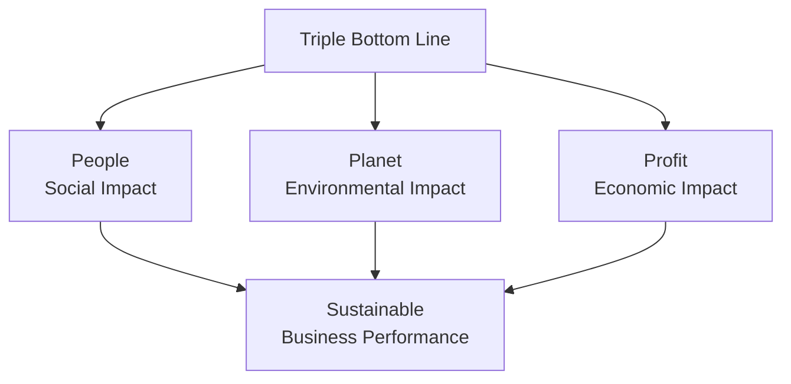
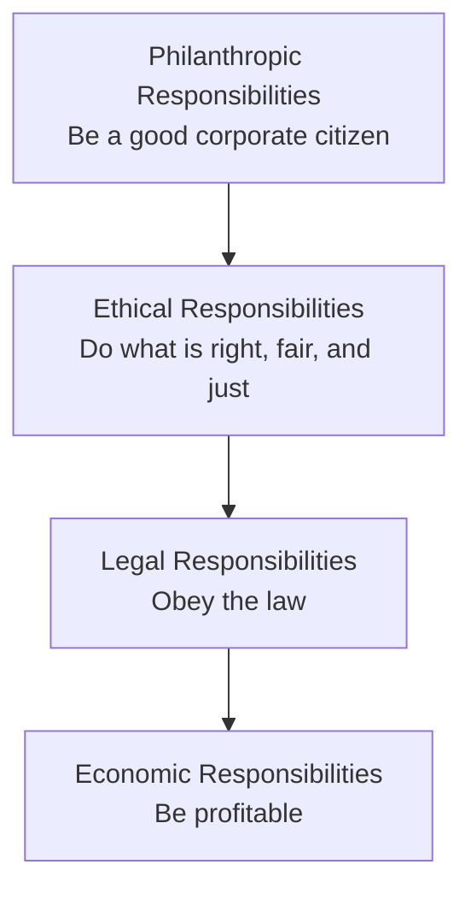
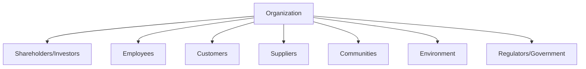
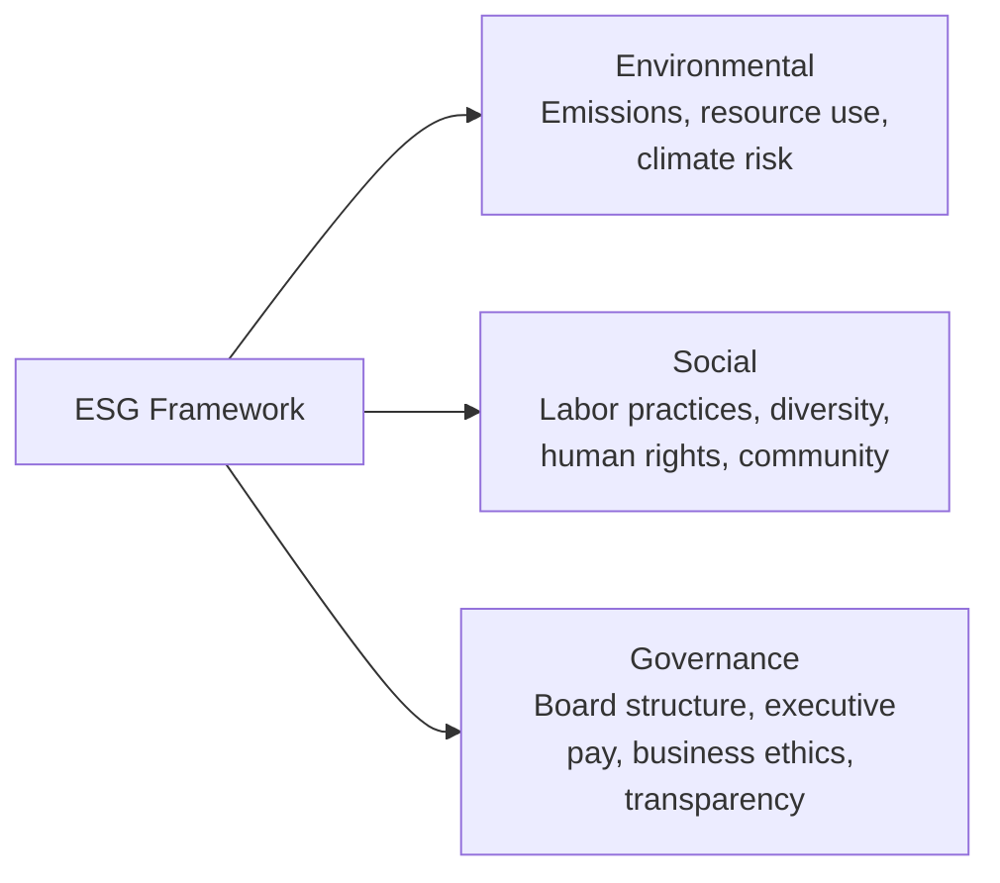
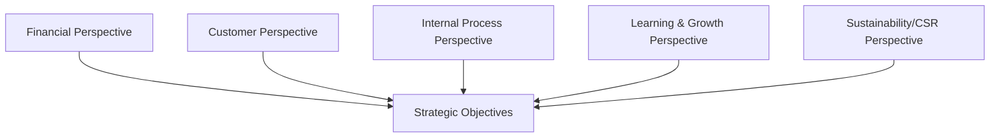

## Corporate Social Responsibility

### Overview

Corporate Social Responsibility (CSR) refers to an organization's voluntary commitment to conduct business in a manner that accounts for its social, environmental, and economic impact on stakeholders beyond shareholders alone. For management accountants, CSR carries direct implications for cost measurement, performance reporting, resource allocation, and disclosure practices, as organizations increasingly integrate non-financial impact into strategic decision-making and external reporting alongside traditional financial metrics.

### Conceptual Foundations of CSR

#### The Triple Bottom Line

The Triple Bottom Line (TBL) framework, a widely referenced organizing concept for CSR, holds that organizations should measure and report performance across three dimensions rather than financial results alone:

| Dimension | Focus | Example Metrics |
| --- | --- | --- |
| **People (Social)** | Impact on employees, communities, and society | Employee safety incidents, diversity metrics, community investment, labor practices in the supply chain |
| **Planet (Environmental)** | Impact on natural resources and the environment | Carbon emissions, water usage, waste generation, energy efficiency |
| **Profit (Economic)** | Traditional financial performance | Revenue, profit margin, ROI, shareholder value |

#### Carroll's CSR Pyramid

A foundational conceptual model organizing corporate responsibilities into a hierarchy:

| Layer (bottom to top) | Description |
| --- | --- |
| **Economic** | The foundational responsibility to be profitable, as the basis on which all other responsibilities depend |
| **Legal** | Compliance with laws and regulations reflecting society's codified expectations |
| **Ethical** | Obligations beyond legal compliance, doing what is right, fair, and just even absent legal mandate |
| **Philanthropic** | Voluntary contributions to community welfare (charitable giving, volunteerism) beyond obligatory ethical conduct |

**[Inference]** Carroll's pyramid is often taught as sequential/hierarchical for pedagogical clarity, though in practice organizations typically pursue multiple layers concurrently rather than only addressing higher layers after "completing" lower ones.

### Stakeholder Theory and CSR

CSR is closely linked to **stakeholder theory**, which holds that organizations have obligations to a broader set of stakeholders beyond shareholders alone:

This contrasts with the traditional **shareholder primacy** view (associated with economist Milton Friedman's position that a corporation's primary social responsibility is to increase profits within the rules of the game), representing an ongoing tension in CSR discourse between shareholder-focused and stakeholder-focused governance philosophies.

### Management Accounting's Role in CSR

#### CSR-Related Costing and Measurement

Management accountants are increasingly responsible for capturing, measuring, and reporting non-financial performance data that supports CSR initiatives and disclosures:

| Function | CSR Application |
| --- | --- |
| **Environmental cost accounting** | Identifying, measuring, and allocating environmental costs (waste disposal, emissions compliance, remediation) often previously buried in general overhead |
| **Social cost measurement** | Quantifying costs/benefits of labor practices, community investment, and supply chain social compliance |
| **Sustainability performance metrics** | Developing and maintaining non-financial KPIs (carbon footprint, water usage, diversity ratios) with the same rigor traditionally applied to financial metrics |
| **Integrated reporting** | Combining financial and non-financial (ESG) performance data into unified reporting frameworks for stakeholders |
| **Cost-benefit analysis of CSR initiatives** | Evaluating the financial return, risk mitigation value, and reputational impact of proposed CSR investments |

#### Environmental Management Accounting (EMA)

A specialized branch of management accounting focused specifically on environmental costs:

$$\text{Total Environmental Cost} = \text{Conventional Costs} + \text{Hidden Costs} + \text{Contingent Costs} + \text{Image/Relationship Costs}$$

| Cost Category | Description | Example |
| --- | --- | --- |
| Conventional costs | Direct environmental compliance costs typically already captured | Waste disposal fees, pollution control equipment |
| Hidden costs | Environmental costs buried in general overhead rather than traced to causing activities | Regulatory compliance staff time allocated across all products regardless of actual environmental impact by product |
| Contingent/liability costs | Future costs contingent on uncertain events | Potential remediation costs, environmental litigation exposure |
| Image/relationship costs | Costs/benefits related to stakeholder perception | Cost of environmental certifications, reputational impact of environmental incidents |

**[Inference]** A key EMA insight is that traditional cost accounting often obscures environmental costs within general overhead, understating the true environmental cost of specific products/processes and thereby understating the financial case for environmentally favorable process changes; activity-based costing techniques are commonly applied to make these hidden costs visible.

### ESG (Environmental, Social, Governance) Reporting

CSR has increasingly been operationalized through **ESG** frameworks, which provide more standardized, measurable criteria for evaluating and reporting non-financial performance:

| ESG Pillar | Example Metrics |
| --- | --- |
| Environmental | Greenhouse gas emissions (Scope 1, 2, 3), energy consumption, water usage, waste and recycling rates |
| Social | Employee turnover, workplace safety (e.g., incident rates), diversity/inclusion metrics, supply chain labor standards |
| Governance | Board independence, executive compensation structure, anti-corruption policies, shareholder rights |

**[Unverified]** ESG reporting standards and frameworks (including specific standard-setting bodies, disclosure requirement scopes, and regulatory mandates) are an actively evolving area with jurisdiction-specific developments; current applicable standards and reporting obligations should be verified against current regulatory guidance and standard-setter publications rather than assumed static, as this is a fast-changing regulatory landscape.

### Practical Example: Integrating CSR into Capital Budgeting

A traditional capital budgeting analysis evaluates a proposed manufacturing process change based solely on direct financial NPV. A CSR-integrated analysis expands the evaluation:

| Evaluation Dimension | Traditional Analysis | CSR-Integrated Analysis |
| --- | --- | --- |
| Direct costs/savings | Equipment cost, labor savings, material cost changes | Same, plus energy/water usage reduction quantified in cost terms |
| Risk assessment | Financial/operational risk only | Adds regulatory risk (future emissions standards), reputational risk exposure |
| Intangible benefits | Generally excluded or treated qualitatively | Employee retention/engagement impact, brand value, customer preference shifts quantified where feasible |
| Decision metric | NPV/IRR based on direct cash flows alone | NPV/IRR supplemented with a qualitative or semi-quantitative ESG impact assessment presented alongside financial metrics |

$$\text{Adjusted NPV Consideration} = \text{NPV}_{\text{financial}} + \text{Risk-Adjusted Value of Avoided Future Environmental/Regulatory Cost}$$

**[Inference]** Fully monetizing all CSR-related benefits and risks (e.g., precisely quantifying reputational value) remains methodologically difficult and subject to significant estimation uncertainty; many organizations therefore present CSR/ESG factors as a qualitative or scored overlay alongside, rather than fully integrated into, the core financial NPV calculation.

### CSR Strategy Approaches

| Approach | Description | Management Accounting Implication |
| --- | --- | --- |
| **Reactive/Compliance-driven** | CSR limited to meeting minimum legal/regulatory requirements | Cost tracking focused primarily on compliance cost minimization |
| **Defensive/Risk mitigation** | CSR aimed at avoiding reputational or regulatory risk exposure | Cost-benefit analysis emphasizes risk avoidance value |
| **Proactive/Strategic** | CSR integrated into core strategy as a source of competitive advantage | CSR metrics embedded into Balanced Scorecard and strategic KPI systems |
| **Values-driven/Purpose-led** | CSR reflects genuine organizational mission/values beyond financial calculation | Performance measurement may deliberately accept lower short-term financial optimization for mission alignment |

### Measuring CSR Performance: Balanced Scorecard Integration

CSR/sustainability metrics are commonly integrated into the Balanced Scorecard framework, sometimes through a dedicated "sustainability" perspective alongside the traditional four:

| Perspective | Traditional Focus | CSR-Integrated Addition |
| --- | --- | --- |
| Financial | Revenue, profit, ROI | Cost of environmental compliance, cost avoidance from sustainability initiatives |
| Customer | Satisfaction, retention | Customer perception of ethical/sustainability practices |
| Internal Process | Efficiency, quality | Environmental process efficiency, waste reduction |
| Learning & Growth | Employee skills, innovation | Diversity and inclusion, employee well-being metrics |

### Criticisms and Challenges of CSR

- **Greenwashing risk** — Organizations may overstate or misrepresent CSR/sustainability performance for reputational benefit without corresponding substantive action; management accountants play a role in ensuring reported metrics are accurate and verifiable rather than aspirational marketing claims
- **Measurement standardization challenges** — Unlike financial accounting's relatively mature standard-setting infrastructure, non-financial/ESG metrics have historically lacked comparable universal measurement standards, complicating cross-organizational comparison
- **Shareholder primacy critique** — Some economic perspectives (associated with Friedman's shareholder theory) argue that pursuing CSR objectives beyond legal compliance and profit maximization represents an inappropriate use of shareholder resources for causes shareholders have not directly authorized
- **Cost-benefit uncertainty** — The financial return on CSR investment is often difficult to isolate and measure with the same rigor as traditional capital investments, complicating resource allocation decisions
- **Trade-off tensions** — Genuine trade-offs can exist between short-term financial performance and CSR objectives (e.g., higher-cost sustainable sourcing reducing near-term margin), requiring management judgment about the appropriate balance rather than a formulaic resolution

**[Inference]** The empirical relationship between CSR performance and financial performance is a subject of ongoing research and debate; while some studies suggest a positive association (often attributed to risk reduction, talent attraction, or customer loyalty effects), the direction of causality and the consistency of this relationship across industries and time periods remains contested rather than definitively established.

### CSR and Risk Management Integration

CSR considerations increasingly intersect with the risk management frameworks covered elsewhere in this curriculum:

- **Reputational risk** — CSR failures (labor scandals, environmental incidents) can trigger significant reputational and financial damage, making CSR risk assessment a component of comprehensive ERM (as discussed under the COSO ERM Framework)
- **Regulatory risk** — Evolving CSR/ESG-related regulation creates compliance risk requiring proactive monitoring, similar in structure to other compliance risk categories
- **Supply chain risk** — CSR due diligence over supplier labor and environmental practices has become a component of broader supply chain risk management

### Related Topics

- IMA Statement of Ethical Professional Practice in Depth
- Ethical Decision Making Frameworks
- Environmental Management Accounting and cost measurement
- ESG (Environmental, Social, Governance) reporting standards
- Balanced Scorecard and multi-dimensional performance measurement
- Stakeholder theory and corporate governance
- COSO Enterprise Risk Management Framework
- Capital budgeting under risk and uncertainty
- Activity-Based Costing (ABC) for hidden cost visibility
- Sustainability reporting frameworks and standards