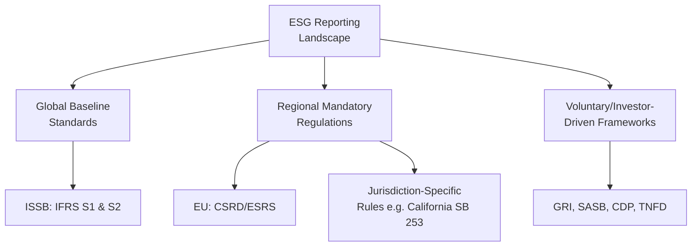
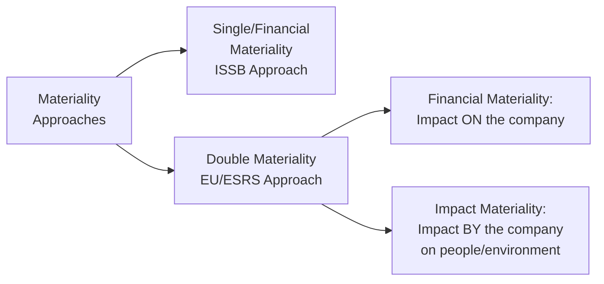
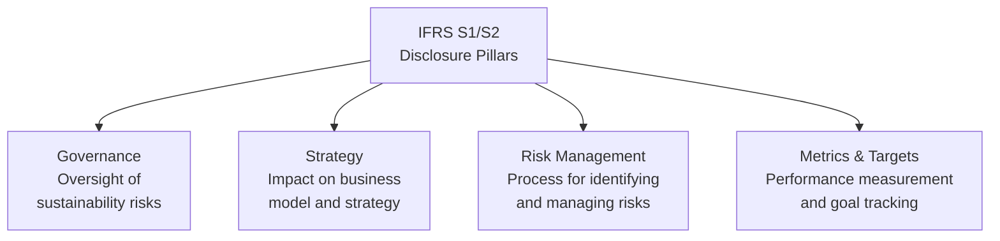
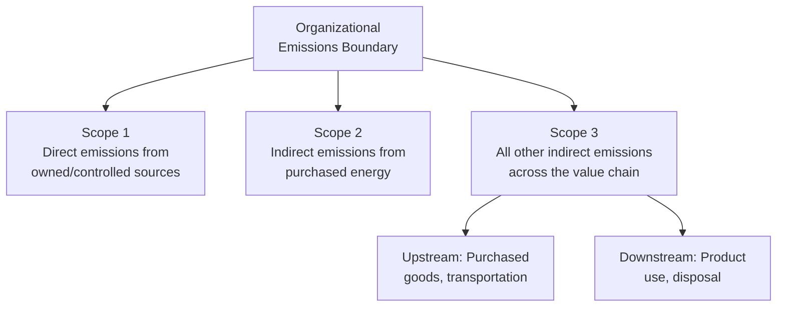
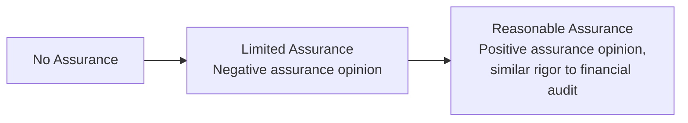
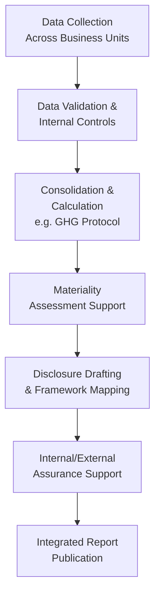

## Environmental, Social, and Governance Reporting

### Overview

Environmental, Social, and Governance (ESG) reporting refers to the structured disclosure of an organization's non-financial performance across environmental impact, social practices, and governance structures, increasingly standardized through formal reporting frameworks and, in a growing number of jurisdictions, mandated by regulation. Where Corporate Social Responsibility (CSR) describes the underlying values-driven business philosophy, ESG reporting represents its operationalized, measurable, and increasingly auditable disclosure infrastructure. Management accountants play a central role in ESG reporting as the function typically responsible for data collection, internal control over non-financial metrics, and integration of ESG disclosures with financial reporting processes.

### The ESG Framework Landscape

#### Key Global and Regional Frameworks

| Framework/Standard | Issuing Body | Scope | Nature |
| --- | --- | --- | --- |
| **IFRS S1** | International Sustainability Standards Board (ISSB) | General sustainability-related financial disclosures (all material sustainability topics) | Global baseline, investor/financial-materiality focused |
| **IFRS S2** | ISSB | Climate-related disclosures specifically (emissions, transition/physical risk) | Global baseline; builds on and effectively succeeds the TCFD recommendations |
| **ESRS (European Sustainability Reporting Standards)** | European Financial Reporting Advisory Group (EFRAG), under the EU's CSRD | Comprehensive environmental, social, and governance disclosure for EU-scoped entities | Mandatory technical standards under EU law, using a "double materiality" approach |
| **GRI (Global Reporting Initiative) Standards** | Global Sustainability Standards Board | Broad stakeholder-oriented sustainability reporting | Voluntary, widely used as a supplementary/stakeholder-facing framework |
| **SASB (Sustainability Accounting Standards Board) Standards** | Now consolidated under the ISSB/IFRS Foundation | Industry-specific financially material sustainability metrics (77 industry standards) | Now integrated into and referenced by IFRS S1 as industry-specific guidance |
| **TCFD (Task Force on Climate-related Financial Disclosures) recommendations** | Originally an FSB task force | Climate-related governance, strategy, risk management, metrics/targets | Legacy framework; its structure has been substantially incorporated into IFRS S2 and ESRS E1 |
| **TNFD (Taskforce on Nature-related Financial Disclosures)** | TNFD | Nature and biodiversity-related risk disclosure | Voluntary, growing adoption |
| **CDP (formerly Carbon Disclosure Project)** | CDP | Climate, water, and forest-related questionnaire-based disclosure | Voluntary, investor-requested; widely used as an underlying data source feeding other frameworks |

**[Unverified]** As of this writing, ESG reporting requirements are in active, rapid regulatory flux across multiple jurisdictions — including significant EU simplification efforts affecting CSRD/ESRS scope and timelines, evolving ISSB jurisdictional adoption, and jurisdiction-specific rules such as certain U.S. state-level climate disclosure requirements. The specific mandatory scope, timelines, and assurance requirements applicable to any given organization should be verified against current regulatory guidance and standard-setter publications rather than assumed static, given how frequently this landscape is being revised.

### Materiality Approaches: Single vs. Double Materiality

A foundational distinction across ESG frameworks concerns how "materiality" is defined for disclosure purposes:

| Approach | Question Asked | Primary Framework |
| --- | --- | --- |
| **Single/Financial materiality** | Is this sustainability matter material to the company's own enterprise value and financial performance? | ISSB (IFRS S1/S2) — investor-decision-useful focus |
| **Double materiality** | Is this matter material to the company's financial performance (financial materiality) OR material because of the company's impact on people/environment (impact materiality)? | EU CSRD/ESRS — broader stakeholder-oriented focus |

This distinction has direct management accounting implications: a double-materiality assessment requires broader stakeholder engagement and impact quantification processes beyond what a purely financial-materiality-driven assessment would require, generally increasing the data collection and internal control scope.

### IFRS S1 and S2: Structure and Requirements

#### IFRS S1 (General Sustainability-Related Disclosures)

Requires disclosure of material sustainability-related risks and opportunities across four content areas, mirroring the TCFD's original structure:

| Pillar | Focus |
| --- | --- |
| Governance | Board and management oversight processes for sustainability-related risks and opportunities |
| Strategy | How sustainability matters affect the business model, strategy, and financial planning |
| Risk Management | Processes for identifying, assessing, and managing sustainability-related risks |
| Metrics and Targets | Quantitative metrics used to measure and manage performance, including progress against targets |

#### IFRS S2 (Climate-Specific Disclosures)

Applies the same four-pillar structure specifically to climate, with defined cross-industry metric categories: disclosures required under IFRS S1 and IFRS S2 are subject to a materiality assessment, and companies applying the standards must consider industry-based SASB standards to identify sustainability risks and opportunities. Cross-industry climate metrics under IFRS S2 include:

- Scope 1, Scope 2, and Scope 3 greenhouse gas emissions
- Climate-related transition risks
- Climate-related physical risks
- Climate-related opportunities

**Scope 3 emissions transition relief:** IFRS S2 requires disclosure of all Scope 1, 2, and 3 greenhouse gas emissions, but provides transition relief allowing companies to omit Scope 3 in their first year of reporting, reflecting the practical difficulty of measuring value-chain emissions outside an organization's direct operational control. [thinkparallax](https://blog.thinkparallax.com/your-guide-to-ifrs-sustainability-disclosure-standards-what-you-need-to-know)

### The GHG Protocol: Scope 1, 2, and 3 Emissions

The most widely used methodology underlying emissions disclosure across nearly all ESG frameworks is the Greenhouse Gas (GHG) Protocol's scope classification:

| Scope | Definition | Example | Measurement Difficulty |
| --- | --- | --- | --- |
| **Scope 1** | Direct emissions from sources owned or controlled by the organization | Company vehicle fuel combustion, on-site manufacturing emissions | Relatively straightforward — direct operational data |
| **Scope 2** | Indirect emissions from purchased electricity, steam, heating, or cooling | Emissions from electricity purchased to power a factory | Moderate — depends on utility-provided or grid-average emission factors |
| **Scope 3** | All other indirect emissions occurring in the organization's value chain, both upstream and downstream | Emissions from purchased raw materials, employee commuting, product use by customers, end-of-life disposal | Most difficult — requires data from suppliers and customers outside direct organizational control |

$$\text{Total Carbon Footprint} = \text{Scope 1} + \text{Scope 2} + \text{Scope 3}$$

**[Inference]** Scope 3 emissions frequently represent the largest share of an organization's total carbon footprint for many industries (particularly those with extensive supply chains or product-use-phase emissions), which is precisely why Scope 3 measurement and disclosure — despite being methodologically the most challenging — has become a central focus of evolving ESG regulation rather than a peripheral concern.

### EU CSRD and ESRS: Structure and Recent Simplification

The EU's Corporate Sustainability Reporting Directive (CSRD), implemented through the European Sustainability Reporting Standards (ESRS), represents the most comprehensive mandatory ESG disclosure regime currently in force for in-scope entities. The European Commission launched a comprehensive simplification initiative affecting CSRD in 2025, and reporting timelines for large EU undertakings not previously subject to the prior Non-Financial Reporting Directive, as well as for listed SMEs and certain non-EU parent companies, have been deferred through the European Commission's "omnibus/stop-the-clock" process. [impactmaker](https://www.impactmaker.co/esg-frameworks-2026)[pulsora](https://www.pulsora.com/blog/esg-reporting-timelines-deadlines-enterprise)

| ESRS Category | Example Standards |
| --- | --- |
| Cross-cutting | ESRS 1 (General requirements), ESRS 2 (General disclosures) |
| Environmental | ESRS E1 (Climate change), E2 (Pollution), E3 (Water and marine resources), E4 (Biodiversity), E5 (Resource use and circular economy) |
| Social | ESRS S1 (Own workforce), S2 (Workers in the value chain), S3 (Affected communities), S4 (Consumers and end-users) |
| Governance | ESRS G1 (Business conduct) |

**[Unverified]** The precise scope reduction, phase-in timelines, and assurance requirements under the CSRD/ESRS simplification process (commonly referred to as the "Omnibus" package) were subject to active revision as of this writing; the applicable requirements for any specific entity should be verified against the current EFRAG/European Commission publications rather than assumed fixed, given the pace of recent regulatory change in this area.

### Assurance Requirements

A distinguishing feature of mature ESG reporting regimes is the progression toward external assurance, paralleling the audit assurance long required for financial statements:

| Jurisdiction/Framework | Typical Assurance Trajectory |
| --- | --- |
| EU (CSRD) | Limited assurance required initially, with an expectation of progressing to reasonable assurance across the full report content over time |
| UK (ISSB-aligned) | Assurance expected to be phased in, starting with limited assurance of Scope 1 and 2 emissions |
| Australia | Assurance is required for climate statements |

**Limited assurance** (a negative-form opinion — "nothing came to our attention indicating material misstatement") requires substantially less audit evidence-gathering than **reasonable assurance** (a positive-form opinion similar to a traditional financial statement audit), meaning the assurance rigor — and consequently the internal control and documentation rigor management accountants must support — increases significantly as a reporting regime matures toward reasonable assurance.

### Management Accounting's Operational Role in ESG Reporting

#### Key Functional Responsibilities

- **Data governance for non-financial metrics** — Establishing the same data quality discipline (completeness, accuracy, consistency, timeliness) historically applied to financial data, now extended to emissions, workforce, and governance metrics
- **Internal controls over ESG data (ICESGR)** — Designing control activities analogous to ICFR (segregation of duties, review/approval, reconciliation) specifically over sustainability data collection and calculation processes, given the move toward external assurance
- **Cross-functional data aggregation** — Coordinating data inputs from HR (workforce metrics), facilities/operations (energy/emissions data), procurement (supply chain/Scope 3 data), and legal/compliance (governance metrics)
- **Framework mapping and gap analysis** — Determining which specific disclosure requirements apply given the organization's jurisdiction, size, and listing status, and identifying data collection gaps against those requirements
- **Emissions calculation methodology** — Applying GHG Protocol calculation methods (e.g., spend-based vs. activity-based methods for Scope 3 estimation) consistently period over period
- **Integrated reporting** — Combining financial and ESG disclosures into a cohesive annual/sustainability report, often requiring reconciliation between financial statement figures and sustainability metrics (e.g., capital expenditure classified as "green" investment)

### Practical Example: Scope 3 Emissions Estimation Methods

A management accountant tasked with estimating Scope 3 "purchased goods and services" emissions (often the largest single Scope 3 category for many organizations) typically chooses between methodologies of varying precision:

| Method | Approach | Data Requirement | Precision |
| --- | --- | --- | --- |
| **Spend-based method** | Emissions estimated by multiplying procurement spend by industry-average emission factors | Procurement spend data by category; published emission factor databases | Lower — reflects industry averages, not supplier-specific performance |
| **Average-data method** | Emissions estimated using average activity data (e.g., average emissions per unit produced) for a product category | Physical quantity of goods purchased; average emission factors per unit | Moderate |
| **Supplier-specific method** | Emissions data obtained directly from suppliers reflecting their actual production processes | Direct supplier engagement and reporting | Highest — but requires mature supplier data-sharing relationships |

$$\text{Estimated Scope 3 Emissions (Spend-Based)} = \sum_{i=1}^{n} (\text{Procurement Spend}_i \times \text{Emission Factor}_i)$$

**[Inference]** Organizations typically begin Scope 3 estimation with the spend-based method due to its lower data burden, then progressively transition specific high-impact categories toward supplier-specific data as supply chain data-sharing capability matures — a trajectory explicitly anticipated by the transition relief provisions found in frameworks like IFRS S2.

### Comparative Summary: Financial Reporting vs. ESG Reporting Maturity

| Dimension | Financial Reporting | ESG Reporting (Current State) |
| --- | --- | --- |
| Standard-setting maturity | Highly mature (decades of GAAP/IFRS development) | Rapidly evolving, multiple competing/converging frameworks |
| Assurance requirement | Reasonable assurance (full audit) standard for public companies | Ranges from none to limited assurance in most jurisdictions currently |
| Data infrastructure | Deeply embedded in ERP/GL systems | Often fragmented across HR, operations, procurement, and manual processes |
| Comparability across organizations | High, due to standardized chart-of-accounts-driven reporting | Improving but still variable, particularly for estimated metrics like Scope 3 |
| Regulatory consistency across jurisdictions | Substantial convergence (GAAP/IFRS) | Significant jurisdictional variation, though convergence trend underway via ISSB adoption |

### Risks and Challenges in ESG Reporting

- **Greenwashing and reputational/legal risk** — Overstating ESG performance or making unsubstantiated claims exposes organizations to regulatory enforcement and reputational damage; accurate, well-controlled data underpins credible disclosure
- **Data quality and system fragmentation** — Non-financial data often originates from systems (HR, facilities, procurement) not designed with financial-reporting-grade controls, creating a significant internal control build-out challenge as assurance requirements increase
- **Regulatory fragmentation and compliance burden** — Multinational organizations may face overlapping, only partially interoperable requirements across jurisdictions (ISSB-aligned rules, EU CSRD/ESRS, jurisdiction-specific rules), increasing compliance complexity
- **Scope 3 measurement uncertainty** — The most consequential emissions category is often also the least precisely measurable, creating disclosure risk around the reliability of reported figures
- **Rapid regulatory change** — As reflected in ongoing simplification initiatives and phased jurisdictional adoption, the applicable requirements for any given organization can shift meaningfully within a single reporting cycle, requiring continuous monitoring rather than one-time compliance program design

### Related Topics

- Corporate Social Responsibility
- Environmental Management Accounting and cost measurement
- COSO Internal Control Framework (applied to non-financial data controls)
- Balanced Scorecard and sustainability performance integration
- IMA Statement of Ethical Professional Practice in Depth
- GHG Protocol emissions accounting methodology
- Internal controls over ESG reporting (ICESGR)
- Materiality assessment methodologies (single vs. double materiality)
- Integrated reporting frameworks
- Corporate governance and board sustainability oversight