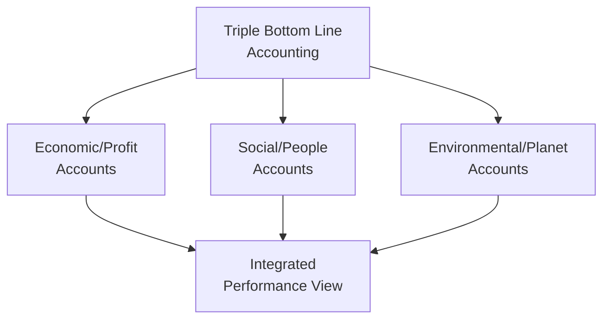
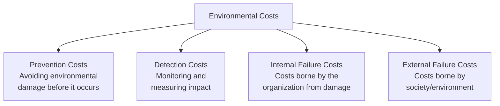
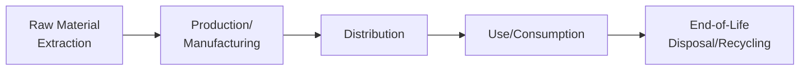
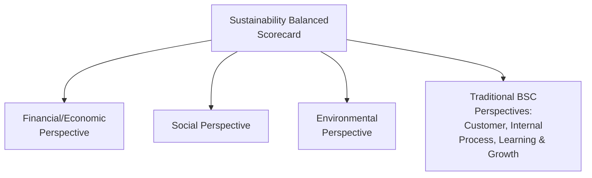

## Sustainability Accounting and the Triple Bottom Line

### Overview

Sustainability accounting is the specialized discipline of measuring, recording, and reporting an organization's environmental and social performance using accounting-grade methodologies, providing the analytical and measurement infrastructure that underlies both CSR strategy and ESG disclosure. Where the Triple Bottom Line (TBL) provides the conceptual organizing framework (People, Planet, Profit) and ESG reporting provides the external disclosure structure, sustainability accounting supplies the internal measurement techniques — costing methods, valuation approaches, and performance metrics — that make TBL and ESG reporting operationally possible for management accountants.

### The Triple Bottom Line as a Measurement Framework

While the Triple Bottom Line concept (introduced conceptually elsewhere in this curriculum's CSR coverage) provides the "what should be measured" framework, sustainability accounting addresses the harder question of "how is it actually measured in units comparable to, or reconcilable with, financial accounts."

| TBL Dimension | Traditional Accounting Analog | Sustainability Accounting Challenge |
| --- | --- | --- |
| Economic/Profit | Well-established GAAP/IFRS-based measurement | Relatively mature; the baseline against which the other two dimensions are compared |
| Social/People | No direct traditional accounting analog | Requires new metrics (e.g., human capital value, social return on investment) without a unified currency |
| Environmental/Planet | No direct traditional accounting analog | Requires physical unit measurement (tons CO2e, liters of water) and increasingly monetary valuation of externalities |

**[Inference]** A central methodological challenge in sustainability accounting is the lack of a single common unit of measurement across all three TBL dimensions — financial accounting benefits from a universal monetary unit, whereas social and environmental performance are often measured in incommensurable physical or qualitative units, complicating efforts to produce a single aggregated "sustainability bottom line" figure analogous to net income.

### Environmental Accounting Methodologies

#### Environmental Cost Categorization

Building on Environmental Management Accounting (EMA) concepts, sustainability accounting formalizes environmental cost capture into structured categories:

| Category | Description | Example |
| --- | --- | --- |
| **Prevention costs** | Costs incurred to prevent environmental damage from occurring | Pollution control equipment, cleaner production process redesign |
| **Detection/Appraisal costs** | Costs of monitoring, measuring, and auditing environmental performance | Emissions monitoring systems, environmental compliance audits |
| **Internal failure costs** | Costs borne directly by the organization when environmental damage occurs | Regulatory fines, remediation costs, waste disposal |
| **External failure costs** | Costs borne by society/environment that are not directly captured in organizational financial statements (externalities) | Air/water pollution health impacts, biodiversity loss, climate change contribution |

**[Inference]** A defining feature of traditional financial accounting is that external failure costs (externalities) are generally not captured on the organization's own books at all, since no market transaction requires the organization to pay for them directly — a central critique motivating sustainability accounting's push toward more complete environmental cost recognition, whether through internal shadow pricing, carbon accounting, or regulatory mechanisms (e.g., carbon taxes/cap-and-trade) that convert previously external costs into internal ones.

#### Life Cycle Costing (LCC) and Life Cycle Assessment (LCA)

Sustainability accounting extends traditional product costing across the entire product life cycle rather than only the production phase:

| Life Cycle Stage | Traditional Cost Accounting Scope | Sustainability Accounting Extension |
| --- | --- | --- |
| Raw material extraction | Typically only purchase price captured | Upstream environmental impact (Scope 3 category) |
| Production | Direct materials, labor, overhead | Adds energy/water consumption, waste generation costs |
| Distribution | Freight/logistics cost | Adds transportation emissions |
| Use/consumption | Generally outside traditional product cost scope | Product-in-use emissions/environmental impact (relevant to downstream Scope 3) |
| End-of-life | Generally excluded entirely | Disposal costs, recycling value/cost, extended producer responsibility obligations |

$$\text{Full Life Cycle Cost} = \text{Production Cost} + \text{Distribution Cost} + \text{Use-Phase Environmental Cost} + \text{End-of-Life Cost}$$

**Practical example:** A traditional cost accounting analysis of a household appliance captures manufacturing cost and selling price. A life cycle costing analysis additionally quantifies the energy consumption cost over the appliance's expected use life (relevant to both customer total-cost-of-ownership messaging and the manufacturer's downstream Scope 3 emissions disclosure) and end-of-life disposal/recycling costs — providing a materially more complete picture of the product's total economic and environmental footprint.

#### Carbon Accounting

A specialized sustainability accounting discipline focused specifically on quantifying greenhouse gas emissions in standardized units:

$$\text{CO}_2\text{e Emissions} = \text{Activity Data} \times \text{Emission Factor} \times \text{Global Warming Potential}$$

Where activity data represents a measurable quantity (e.g., liters of fuel consumed, kilowatt-hours of electricity used), the emission factor converts that activity into greenhouse gas mass, and the Global Warming Potential (GWP) standardizes different greenhouse gases (methane, nitrous oxide, etc.) into a common carbon dioxide equivalent (CO2e) unit for aggregation.

### Social Accounting Methodologies

#### Human Capital Accounting

Attempts to quantify the economic value of an organization's workforce, extending beyond traditional labor cost expensing:

| Traditional Accounting Treatment | Human Capital Accounting Extension |
| --- | --- |
| Wages/salaries expensed as incurred | Investment view — recruitment, training, and development costs treated as building an asset-like capability, even though not capitalized under GAAP/IFRS |
| Turnover reflected only in replacement hiring cost | Quantifies broader turnover cost (productivity loss, institutional knowledge loss, training investment loss) |
| No standard measurement of employee engagement/satisfaction | Develops proxy metrics (engagement scores, retention rates) as leading indicators of social sustainability performance |

**[Inference]** Human capital accounting metrics generally remain internal management reporting tools rather than items recognized directly on the balance sheet under current GAAP/IFRS, since existing accounting standards do not recognize internally developed workforce capability as a recognizable intangible asset; this represents an area of ongoing debate between traditional accounting's reliability-focused recognition criteria and sustainability accounting's broader value-relevance objectives.

#### Social Return on Investment (SROI)

A methodology for monetizing social impact to enable cost-benefit-style comparison with traditional financial investments:

$$\text{SROI Ratio} = \frac{\text{Present Value of Social Impact Created (Monetized)}}{\text{Present Value of Investment}}$$

An SROI ratio of 3:1, for example, indicates that every currency unit invested is estimated to generate three units of monetized social value. **[Inference]** SROI calculations require significant judgment in selecting appropriate financial proxies for non-market social outcomes (e.g., assigning a monetary value to improved community health outcomes), making the resulting ratio considerably more subjective and methodology-dependent than a traditional financial ROI calculation, and figures from different SROI studies are not necessarily directly comparable unless consistent proxy valuation methodologies were applied.

### Integrating the Three Dimensions: Sustainability Balanced Scorecard

Organizations commonly operationalize the Triple Bottom Line by extending the traditional Balanced Scorecard with dedicated environmental and social perspectives (or embedding environmental/social KPIs within existing perspectives), enabling sustainability metrics to be tracked, targeted, and reviewed with the same management discipline traditionally applied only to financial metrics.

| Perspective | Example Metric | Target Example |
| --- | --- | --- |
| Economic | Cost savings from energy efficiency initiatives | $500,000 annual savings |
| Environmental | Scope 1+2 emissions intensity | Reduce by 15% per unit of revenue over 3 years |
| Social | Employee safety incident rate | Reduce lost-time injury rate by 20% |
| Social | Supply chain labor audit compliance | 100% of Tier 1 suppliers audited annually |

### Practical Example: TBL-Integrated Product Costing Decision

A company evaluating whether to switch a key input material to a more expensive but more sustainably sourced alternative applies sustainability accounting to support the decision:

| Factor | Conventional Cost Accounting View | Sustainability Accounting View |
| --- | --- | --- |
| Direct material cost | Increases by $0.40/unit | Same figure, but contextualized |
| Waste/scrap rate | Not separately highlighted | New material reduces scrap by 8%, partially offsetting cost increase |
| Carbon footprint | Not considered | New material reduces embedded Scope 3 emissions by an estimated 12% per unit |
| Regulatory risk | Not considered | Reduces exposure to anticipated future extended producer responsibility regulation |
| Customer/market impact | Not considered | Supports sustainability claims relevant to customer segments with stated ESG purchasing criteria |
| **Net decision view** | Simple cost increase, likely rejected on cost grounds alone | Multi-dimensional view supports the investment when environmental risk mitigation and potential market differentiation are weighed alongside direct cost |

$$\text{TBL-Adjusted Decision Value} = \Delta \text{Financial Cost} + \text{Risk-Adjusted Regulatory Exposure Avoided} + \text{Qualitative Market Positioning Value}$$

### Reporting Outputs of Sustainability Accounting

Sustainability accounting data feeds into several distinct reporting outputs, each serving different audiences:

| Output | Primary Audience | Framework Basis |
| --- | --- | --- |
| Integrated annual report | Investors, board | Combines financial statements with material sustainability disclosures (often per IFRS S1/S2 or ESRS) |
| Standalone sustainability/CSR report | Broader stakeholder audience (customers, NGOs, community) | Often GRI-based, more narrative and stakeholder-inclusive than investor-focused ISSB disclosures |
| Internal management sustainability dashboard | Internal management, operational decision-makers | Custom internal KPIs, often more granular and operationally focused than external disclosures |
| Regulatory ESG filings | Regulators (e.g., under CSRD/ESRS or jurisdiction-specific mandates) | Prescribed mandatory technical standards |

### Comparative Summary: Sustainability Accounting vs. Traditional Financial Accounting

| Dimension | Traditional Financial Accounting | Sustainability Accounting |
| --- | --- | --- |
| Unit of measurement | Monetary (single currency) | Mixed — monetary, physical (tons, liters, kWh), and qualitative |
| Recognition criteria | Well-defined recognition/measurement rules (GAAP/IFRS) | Emerging, less standardized, still converging across frameworks |
| Externality treatment | Externalities generally excluded unless internalized via regulation/market mechanism | Explicit objective to identify and, where feasible, value externalities |
| Time horizon | Primarily historical and near-term forward-looking (going concern) | Explicitly incorporates longer-term, intergenerational considerations (e.g., climate transition risk decades out) |
| Assurance maturity | Mature, reasonable assurance standard for public companies | Developing, ranging from no assurance to limited assurance in most current regimes |

### Limitations and Ongoing Methodological Debates

- **Valuation subjectivity** — Monetizing social and environmental impact (as in SROI or shadow-pricing externalities) inherently involves significant estimation judgment, reducing comparability relative to traditional financial measures
- **Lack of a unified "sustainability bottom line"** — Unlike net income, there is no single, universally agreed aggregate figure combining all three TBL dimensions, limiting the framework's ability to support simple, single-metric decision rules
- **Data availability and quality gaps** — Particularly for upstream/downstream environmental and social data (e.g., supply chain labor conditions, product-use-phase emissions), reliable primary data is often unavailable, requiring estimation methods of varying rigor
- **Risk of selective/incomplete measurement** — Organizations may measure and report favorable TBL metrics prominently while underreporting or omitting less favorable ones, undermining the framework's intended completeness
- **Standard convergence still in progress** — While frameworks like ISSB are working toward global convergence, meaningful methodological variation persists across jurisdictions and voluntary frameworks, complicating cross-organizational comparability

### Related Topics

- Corporate Social Responsibility
- Environmental, Social, and Governance Reporting
- Environmental Management Accounting and cost measurement
- Balanced Scorecard and multi-dimensional performance measurement
- Life cycle costing and activity-based costing applications
- Carbon accounting and the GHG Protocol
- Human capital accounting and workforce metrics
- Social Return on Investment (SROI) methodology
- Integrated reporting frameworks
- Materiality assessment in sustainability disclosure