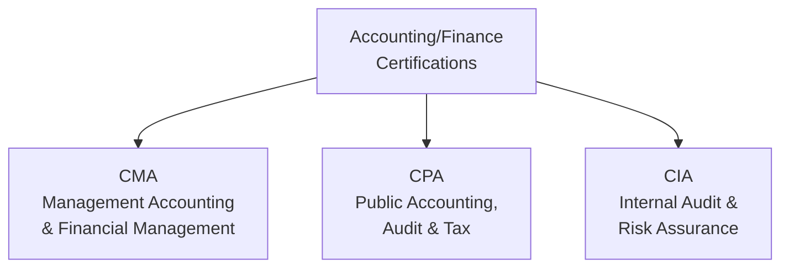
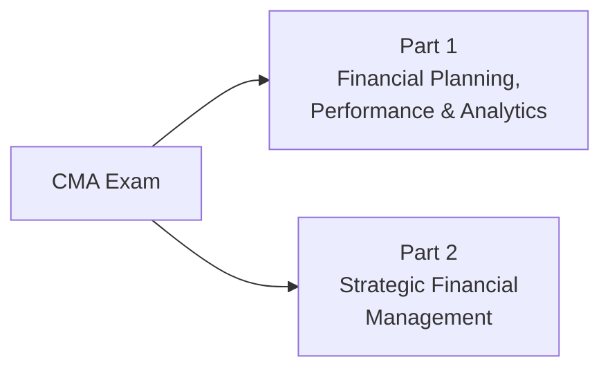
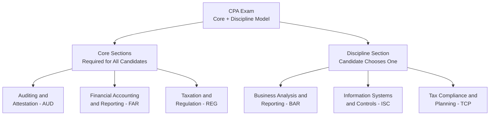
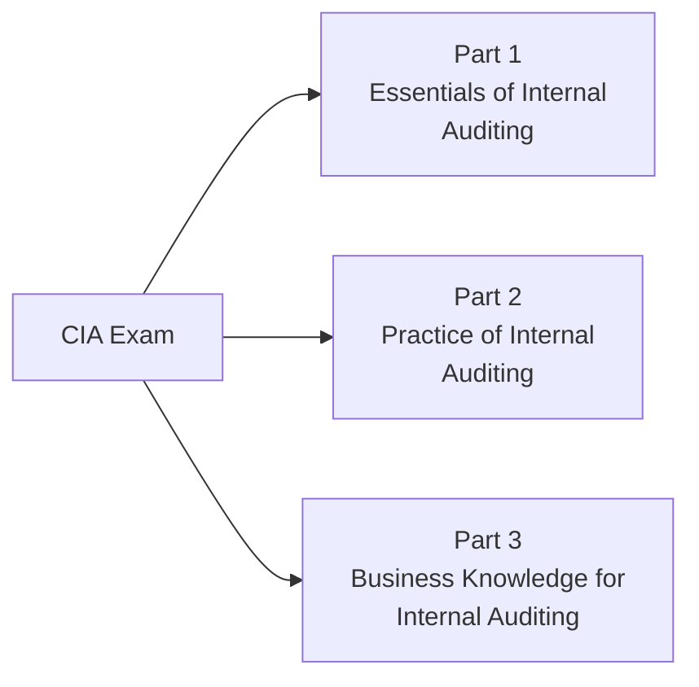
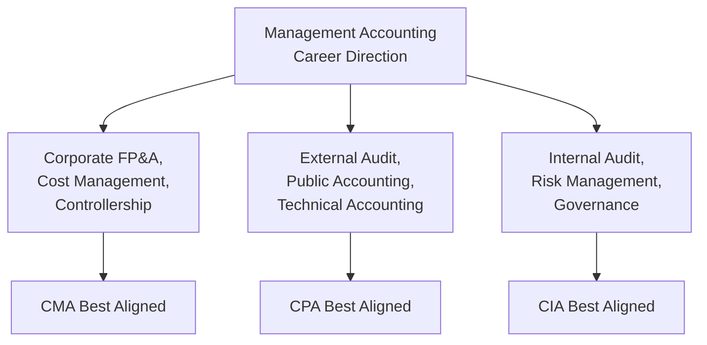

## Professional Certification Paths (CMA, CPA, CIA)

### Overview

The three principal accounting/finance professional certifications relevant to management accounting practitioners — the Certified Management Accountant (CMA), Certified Public Accountant (CPA), and Certified Internal Auditor (CIA) — each represent distinct specializations, governing bodies, and career trajectories. While overlapping in foundational accounting knowledge, they diverge significantly in focus, eligibility structure, exam format, and typical career application. Understanding these distinctions is essential for management accountants making credentialing decisions aligned with their career direction.

### Comparative Overview

| Attribute | CMA | CPA | CIA |
| --- | --- | --- | --- |
| **Governing body** | Institute of Management Accountants (IMA) | State boards of accountancy (U.S.), coordinated via AICPA/NASBA | Institute of Internal Auditors (IIA) |
| **Primary focus** | Management accounting, financial planning, cost management, decision support | Public accounting, external audit, tax, assurance, financial reporting | Internal audit, risk management, governance, internal controls |
| **Number of exam parts** | 2 parts | 4 sections (under the CPA Evolution model: 3 core + 1 discipline) | 3 parts |
| **Typical candidate profile** | Corporate finance/accounting professionals, controllers, FP&A | Public accounting firm staff, auditors, tax professionals seeking audit signing authority | Internal audit, risk, and compliance professionals |
| **License vs. certification** | Certification (no state licensing requirement) | State-issued license (required to sign audit opinions) | Certification (no state licensing requirement) |

### Certified Management Accountant (CMA)

#### Structure and Content

The CMA exam consists of **two parts**, each covering distinct content domains relevant to management accounting practice:

| Part | Coverage Area |
| --- | --- |
| **Part 1** | Financial Planning, Performance, and Analytics — covering external financial reporting decisions, planning/budgeting/forecasting, performance management, cost management, internal controls, and technology and analytics |
| **Part 2** | Strategic Financial Management — covering financial statement analysis, corporate finance, decision analysis, risk management, investment decisions, and professional ethics |

Each part contains **100 multiple-choice questions**, and candidates must score at least 50% on the MCQ section to unlock the second section of the exam.

**[Unverified]** Beginning in 2026, the IMA is transitioning the CMA exam's second section from traditional essay questions to Case-Based Questions (CBQs) — structured, scenario-driven tasks using formats such as drag-and-drop, numerical entry, and multiple-select, built around roughly 250-word business scenarios. According to IMA's own communications on this change, the underlying Content Specification Outline, Learning Outcome Statements, exam difficulty, exam length, and fee structure remain unchanged — only the question format for the applied-knowledge section is changing, reportedly to align with global testing standards, improve accessibility for non-native English speakers, and enable faster scoring. Given the pace of this transition (with a candidate-choice transitional window before CBQs become mandatory), candidates should verify the current exam format and applicable transition timeline directly with the IMA rather than relying on a fixed description, as exact rollout dates and transitional options may be refined.

#### Eligibility Requirements

| Requirement | Detail |
| --- | --- |
| **Education** | Bachelor's degree in any discipline from an accredited institution, or an IMA-recognized professional qualification |
| **Work experience** | Two continuous years of professional experience in management accounting or financial management |
| **Membership** | Active IMA membership required at registration and throughout candidacy |
| **Exam completion window** | Both parts must be passed within a defined candidacy window |
| **Age limit** | None |

**[Unverified]** Specific candidacy window lengths (the period within which both parts must be passed) and the separate window for verifying education/experience are periodically subject to administrative adjustment by the IMA; candidates should confirm current windows directly with the IMA rather than relying on a fixed figure.

#### Passing Standard

A scaled score of at least a defined threshold (commonly cited as 360 out of a 500-point scale) is required to pass each part. **[Unverified]** This specific numeric passing threshold and scoring methodology should be verified against current official IMA candidate guidance, as scoring methodology details are the kind of administrative specification that can be updated.

### Certified Public Accountant (CPA)

#### Structure and the CPA Evolution Model

The CPA exam has transitioned to a **Core + Discipline** model (commonly referred to as "CPA Evolution"), consisting of three mandatory core sections plus one elective discipline section chosen by the candidate:

| Section Category | Section | Focus |
| --- | --- | --- |
| Core | Auditing and Attestation (AUD) | Audit procedures, professional responsibilities, attestation standards |
| Core | Financial Accounting and Reporting (FAR) | GAAP-based financial statement preparation and reporting |
| Core | Taxation and Regulation (REG) | Federal taxation, business law, ethics |
| Discipline (choose one) | Business Analysis and Reporting (BAR) | Advanced financial reporting, technical accounting, data analytics |
| Discipline (choose one) | Information Systems and Controls (ISC) | IT audit, systems controls, data management/governance |
| Discipline (choose one) | Tax Compliance and Planning (TCP) | Advanced individual and entity tax compliance/planning |

**[Inference]** The discipline section a candidate selects does not restrict their subsequent practice area or licensure scope once certified — all CPAs hold the same license regardless of which discipline section they completed — but the choice allows candidates to align exam preparation with their anticipated career specialization (e.g., an aspiring IT auditor might select ISC).

#### Eligibility and Licensure

| Requirement | Detail |
| --- | --- |
| **Education** | Typically requires 150 semester hours of college education (varies by state), generally including a concentration in accounting |
| **Work experience** | Typically requires 1–2 years of relevant experience under the supervision of a licensed CPA (requirements vary by state) |
| **Licensing authority** | Individual U.S. state boards of accountancy — the CPA is a state-issued *license*, not merely a certification |
| **Exam administration** | Coordinated nationally through AICPA/NASBA, though licensure itself remains state-specific |
| **Continuing education** | Ongoing continuing professional education (CPE) required to maintain licensure, with specific hour requirements varying by state |

**[Unverified]** Specific state-by-state educational hour requirements, experience requirements, and reciprocity/mobility provisions vary considerably and are subject to individual state board rule changes; candidates should verify requirements with their specific state board of accountancy rather than assuming a uniform national standard.

#### Distinguishing Feature: Audit Signing Authority

The CPA is the only one of the three credentials that confers legal authority to sign audit opinions on behalf of a public accounting firm for financial statement audits — a function directly tied to its state-licensure structure and central to its role in the external audit ecosystem discussed elsewhere in this curriculum's coverage of SOX and financial reporting assurance.

### Certified Internal Auditor (CIA)

#### Structure and Content

The CIA exam consists of **three parts**, focused specifically on internal audit practice, governance, and risk management — directly complementing this curriculum's coverage of COSO Internal Control and ERM frameworks:

| Part | Coverage Area |
| --- | --- |
| **Part 1** | Essentials of Internal Auditing — foundations of internal auditing, independence/objectivity, proficiency and due professional care, quality assurance, governance/risk management/control concepts, fraud risk |
| **Part 2** | Practice of Internal Auditing — managing the internal audit function, planning individual engagements, performing engagements, communicating results, monitoring progress |
| **Part 3** | Business Knowledge for Internal Auditing — business acumen, information security, information technology, financial management |

#### Eligibility Requirements

| Requirement | Detail |
| --- | --- |
| **Education** | Bachelor's degree (or equivalent) from an accredited institution, though pathways exist for candidates without a degree combined with additional relevant experience |
| **Work experience** | Relevant work experience in internal audit or a related field (typically required prior to certification, though exams may be attempted earlier in some pathway structures) |
| **Character reference** | Requires character reference attestation as part of the application |
| **Membership** | IIA membership generally required or discounted pricing tied to membership |

**[Unverified]** Specific degree-equivalent pathways, required years of experience, and character reference requirements are administered by the IIA and subject to periodic revision; current requirements should be verified directly against IIA candidate guidance.

### Comparative Career Application for Management Accountants

| Career Direction | Most Aligned Credential | Rationale |
| --- | --- | --- |
| Corporate controller, FP&A leadership, cost accounting management | CMA | Direct curriculum alignment with budgeting, cost management, decision analysis, and performance management |
| Public accounting partner track, external audit signing authority, technical GAAP/IFRS specialization | CPA | Only credential conferring audit opinion signing authority; deepest GAAP/IFRS technical coverage |
| Internal audit director, chief audit executive, enterprise risk management leadership | CIA | Direct alignment with COSO-based internal audit practice, governance, and risk assurance |
| Multi-disciplinary finance leadership (e.g., CFO track) | Often combined (CPA+CMA, or CMA+CIA) | Different credentials cover complementary knowledge domains valuable at senior finance leadership levels |

**[Inference]** It is increasingly common, though not universal, for finance professionals pursuing senior leadership roles (e.g., CFO, VP of Finance) to hold more than one of these credentials, since each covers a distinct and complementary knowledge domain (external reporting/audit via CPA, internal management decision support via CMA, governance/risk assurance via CIA) that collectively spans the full scope of senior finance responsibility.

### Continuing Professional Education (CPE) Requirements

All three credentials require ongoing continuing professional education to maintain active certification status, though specific hour requirements and reporting cycles differ by credentialing body:

| Credential | General CPE Structure |
| --- | --- |
| CMA | Annual CPE hours required, including a mandatory ethics component, reported to the IMA |
| CPA | State-specific CPE hours required (varies by state board), often on a biennial or triennial cycle, typically including an ethics component |
| CIA | Annual CPE hours required, reported to the IIA, with specific requirements varying based on membership/practice status |

**[Unverified]** Specific CPE hour requirements, reporting cycles, and ethics component mandates for each credential are subject to periodic revision by the respective governing bodies; current requirements should be verified directly against IMA, state board, and IIA guidance respectively.

### Practical Example: Credential Selection Scenario

**Scenario:** A cost accountant with three years of experience in a manufacturing company's FP&A function is deciding which credential to pursue to advance toward a controller role within the same organization, with no interest in external audit practice.

**Analysis:**

- **CMA** — Strong alignment: the two-part exam structure directly covers budgeting/forecasting, cost management, performance analysis, and decision support — the core competencies of the target controller role; the two-year relevant work experience requirement is likely already satisfied
- **CPA** — Less directly aligned to the stated goal since the candidate has no interest in audit signing authority or public accounting practice, though the technical GAAP/IFRS depth could still be valuable for complex financial reporting responsibilities a controller role often includes; the 150-hour education requirement may also require additional coursework depending on the candidate's existing degree
- **CIA** — Less aligned unless the career path pivots toward internal audit/risk rather than controllership

**Likely recommendation directionally supported by the facts given:** CMA represents the most directly aligned credential for this specific stated career goal, though pursuing CPA in addition (particularly if the organization's financial reporting complexity is high) could provide complementary technical depth over a longer career horizon.

### Limitations and Considerations in Credential Comparison

- **Credentials are not universally interchangeable in employer perception** — Employer and industry expectations for a given role (e.g., "controller" positions frequently value CPA licensure highly even though CMA content may be more directly applicable) can diverge from a purely content-based analysis, and practical career decisions should account for local/industry hiring norms
- **Ongoing content and format evolution** — As reflected in the CMA's 2026 format transition, exam content, format, and administrative requirements evolve over time across all three credentials; candidates should consult current official guidance rather than relying on a fixed historical description when planning exam preparation
- **Jurisdictional variation for CPA** — Because CPA licensure is state-specific in the U.S. (and internationally, governed by separate national bodies for non-U.S. equivalents), specific eligibility and reciprocity considerations vary meaningfully by location
- **Credential does not substitute for practical experience** — All three credentials are generally viewed as complementary to, rather than a substitute for, demonstrated practical experience in the relevant functional area

### Related Topics

- IMA Statement of Ethical Professional Practice in Depth
- COSO Internal Control Framework (CIA exam alignment)
- Sarbanes Oxley Implications for Management Accounting (CPA/audit alignment)
- Financial Planning and Analysis (FP&A) career competencies
- Continuing professional education and lifelong learning in accounting
- Public Company Accounting Oversight Board (PCAOB) and external audit standards
- Institute of Internal Auditors (IIA) Standards for internal audit practice
- Career pathways in corporate finance leadership
- International accounting credentials (e.g., CIMA, ACCA) and global equivalency
- Ethics requirements across professional accounting credentials