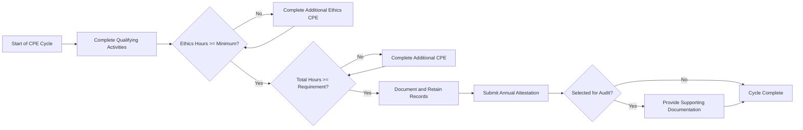
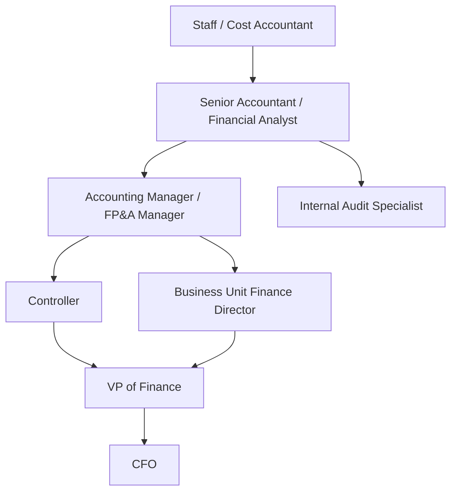

## Continuing Professional Education and Career Development

### Overview

Continuing Professional Education (CPE) refers to the structured, ongoing learning activities that management accountants undertake to maintain, update, and expand their professional knowledge and competencies after earning an initial credential or entering the profession. Career development refers to the broader, longer-horizon planning of skills, credentials, roles, and experiences that a management accountant pursues to advance within the profession. These two concepts are treated together because professional bodies typically make CPE a mandatory condition for maintaining certification, while career development is the strategic context in which CPE choices are made.

### Why CPE Exists

**Key Points**

- Accounting standards, tax rules, regulatory requirements, and technology change continuously; CPE ensures practitioners remain current.
- Professional bodies use CPE as a quality-control mechanism to protect the credibility of their credentials.
- CPE supports the profession's ethical obligation of "professional competence and due care" under codes of conduct (e.g., the IMA Statement of Ethical Professional Practice and the IESBA Code of Ethics).
- Employers rely on certified professionals' CPE compliance as an implicit guarantee of up-to-date skill levels.

### Major Certifications Requiring CPE

| Certification | Issuing Body | Typical CPE Requirement |
| --- | --- | --- |
| CMA (Certified Management Accountant) | IMA (Institute of Management Accountants) | 30 hours/year, including 2 hours of ethics |
| CPA (Certified Public Accountant) | State Boards of Accountancy (US) / AICPA | Varies by state, typically 40 hours/year (80–120 hours per 2–3 year cycle) |
| CIA (Certified Internal Auditor) | IIA (Institute of Internal Auditors) | 40 hours/year, including 2 hours of ethics |
| CFA (Chartered Financial Analyst) | CFA Institute | Voluntary but tracked (35 hours/year recommended) |
| CGMA (Chartered Global Management Accountant) | AICPA/CIMA | Aligned with underlying CPA/CIMA CPE rules |

[Unverified] — exact CPE hour thresholds and cycle lengths change periodically by jurisdiction and issuing body; practitioners should confirm current requirements directly with the relevant board or institute.

### Qualifying CPE Activities

**Key Points**

- Formal courses: university classes, professional seminars, employer-sponsored training.
- Self-study: e-learning modules, recorded webinars with assessment components.
- Conferences and technical sessions at professional association events.
- Authorship: writing technical articles, books, or CPE course material (often credited at a higher hour multiplier).
- Teaching: instructing a college-level accounting/finance course or CPE session (typically credited once, not for repeat deliveries of the same material).
- In-house training: structured internal firm training programs, if they meet the sponsoring body's content and documentation standards.

Most bodies require that content be relevant to accounting, finance, business, or ethics, and that programs come from a "qualified" or "approved" sponsor, or otherwise meet documented learning-objective standards.

### Ethics Component

Nearly all major management accounting certifications carve out a **mandatory ethics sub-requirement** within total CPE hours (commonly 2 hours annually). This reflects the profession's view that ethical reasoning is a decaying skill requiring periodic reinforcement, not a one-time competency established at certification.

### CPE Cycle and Recordkeeping

**Example**

A CMA holder's typical annual cycle:

1. Complete 30 CPE hours between January 1 and December 31.
2. Of those, at least 2 hours must cover ethics.
3. Retain certificates of completion, agendas, or sign-in sheets for a defined retention period (commonly 3 years, per [Unverified] IMA-specific policy at time of use).
4. Submit an annual CPE report or attestation to IMA, often as part of annual membership/certification renewal.
5. Be prepared for random audit by the certifying body, which may request documentation.

Failure to meet CPE requirements typically results in a grace period, followed by certification suspension or revocation if unresolved.

### CPE Tracking Diagram

### Career Development Framework

Career development for a management accountant is typically modeled as progression across four dimensions: technical competency, business acumen, leadership/people skills, and digital/analytical fluency. The IMA's Management Accounting Competency Framework is a commonly referenced structure organizing these into domains such as strategy, planning, technology, operations, and leadership.

**Key Points**

- Early career: focus on technical mastery (costing, budgeting, reporting, compliance).
- Mid-career: focus on business partnering, cross-functional collaboration, and analytical/decision-support skills.
- Senior career: focus on strategic leadership, enterprise risk oversight, and organizational influence.
- Digital fluency (data analytics, ERP systems, automation, and increasingly AI-assisted analysis) is now treated as a cross-cutting requirement at all levels rather than a late-career specialization.

### Career Progression Path (Illustrative)

[Inference] — actual career paths vary substantially by industry, company size, and individual specialization; this diagram illustrates one common, not universal, trajectory.

### Competency Development Areas

| Domain | Example Skills | Example Development Activities |
| --- | --- | --- |
| Technical Accounting | Cost accounting, variance analysis, standard costing | CPE courses, technical certifications |
| Financial Planning & Analysis | Budgeting, forecasting, scenario modeling | Advanced Excel/financial modeling training |
| Strategic & Business Acumen | Industry knowledge, competitive analysis | MBA coursework, cross-functional rotations |
| Technology & Analytics | ERP systems, data visualization, basic scripting/SQL | Vendor certifications, data analytics bootcamps |
| Leadership & Communication | Team management, executive presentation | Leadership training, mentoring programs |
| Ethics & Governance | Professional judgment, fraud awareness | Mandatory ethics CPE, governance seminars |

### Professional Association Involvement

Active involvement in bodies such as IMA, AICPA, IIA, or CFA Institute supports both CPE fulfillment and career development through:

- Local chapter meetings and networking.
- Volunteer leadership roles (committee work, chapter officer positions), which build leadership experience.
- Access to research, salary surveys, and competency benchmarking tools.
- Mentorship programs pairing experienced and early-career professionals.

### Employer-Sponsored Development

**Key Points**

- Many employers fund CPE and certification costs as part of retention strategy.
- Tuition reimbursement programs support graduate education (e.g., MBA, Master of Accountancy).
- Job rotation programs expose accountants to operations, sales, or strategic planning functions, broadening business acumen beyond pure accounting technique.
- Formal mentorship and sponsorship programs pair rising professionals with senior leaders for career guidance.

### Self-Directed Career Planning

**Example**

A mid-career management accountant's development plan might include:

1. **Skills gap analysis** — comparing current competencies against a target role (e.g., Controller) using a competency framework.
2. **Certification roadmap** — pursuing a complementary credential (e.g., a CMA holder adding a CPA, or a CPA adding a Data Analytics certificate).
3. **Networking targets** — identifying professional association events and internal stakeholders to build relationships with.
4. **CPE alignment** — deliberately selecting CPE courses that close identified skills gaps (e.g., choosing a data visualization course over a generic ethics filler course, while still meeting the minimum ethics requirement).
5. **Timeline and milestones** — setting annual checkpoints to reassess progress.

### Emerging Trends Affecting CPE and Career Development

**Key Points**

- **Data analytics and AI fluency** are increasingly embedded into CPE catalogs and competency frameworks, reflecting the shift of management accountants into data-driven decision support roles.
- **Micro-credentials and digital badges** are growing as supplements to traditional certifications, allowing narrower, faster skill validation.
- **On-demand/self-paced e-learning** has become the dominant CPE delivery format, replacing much in-person seminar attendance. [Inference] based on general industry direction; exact proportions vary by provider and are not independently verified here.
- **ESG and sustainability reporting competency** is an emerging required skill area, reflecting the chapter-level convergence of ethics, sustainability, and professional practice — accountants are expected to build fluency in sustainability metrics and assurance standards (e.g., relevant to frameworks such as those from the ISSB) as part of ongoing development, though specific CPE mandates around ESG topics vary by jurisdiction and issuing body. [Unverified]

### Common Pitfalls

**Key Points**

- Treating CPE as a compliance checkbox rather than a career investment (choosing the cheapest/easiest hours instead of relevant ones).
- Waiting until late in the reporting cycle to complete hours, increasing audit and compliance risk.
- Failing to retain adequate documentation, which can jeopardize certification even when hours were genuinely completed.
- Neglecting non-technical skill development (communication, leadership) in favor of purely technical CPE, which can limit advancement into senior roles.

### Conclusion

CPE and career development are interdependent: CPE is the mandatory, credential-preserving mechanism, while career development is the strategic framework that gives CPE choices direction and purpose. Effective management accountants treat CPE not merely as a renewal requirement but as a deliberate tool for closing skill gaps aligned to their career trajectory, particularly as the profession's competency expectations expand into data analytics, technology fluency, and sustainability reporting.

**Related Topics**

- IMA Management Accounting Competency Framework in detail
- Professional certifications comparison (CMA vs. CPA vs. CIA vs. CFA)
- Codes of ethics for management accountants (IMA Statement of Ethical Professional Practice)
- Data analytics and AI literacy for accounting professionals
- ESG/sustainability reporting competencies and assurance standards
- Mentorship and sponsorship models in professional accounting careers
- Succession planning and leadership pipeline development in finance functions