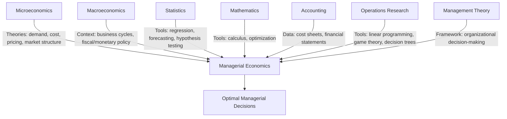

## Managerial Economics in Relation to Microeconomics, Macroeconomics, and Allied Disciplines

### Overview

Managerial economics is not an isolated discipline; it is an applied field that draws its analytical core from economic theory (both micro and macro) and borrows tools from several other quantitative and management disciplines. Understanding these relationships clarifies both what managerial economics uses from each field and what makes it distinct.

### Relationship with Microeconomics

Microeconomics is the primary theoretical foundation of managerial economics — so much so that managerial economics is sometimes called "applied microeconomics" or "business economics."

**Key Points**

- **Common Subject Matter**: Both deal with individual economic units — consumers, firms, and industries — rather than the economy as a whole.
- **Borrowed Theories**: Managerial economics directly applies microeconomic concepts such as:
  - Theory of demand and elasticity
  - Theory of production and cost
  - Theory of the firm under various market structures (perfect competition, monopoly, monopolistic competition, oligopoly)
  - Theory of pricing
  - Theory of profit
- **Difference in Approach**: Microeconomics is largely **positive/descriptive** — it explains how markets and firms behave in theory, often using simplifying assumptions (e.g., perfect information, rational actors, ceteris paribus). Managerial economics is **normative/prescriptive** — it takes these theories and adapts them to solve actual decision problems under real-world constraints (imperfect information, uncertainty, competitor behavior).
- **Simplification vs. Realism**: Microeconomic models are often built for analytical elegance (e.g., assuming a single-product firm, static equilibrium). Managerial economics must relax these assumptions to fit multi-product firms, dynamic markets, and incomplete data.

**Example**: Microeconomic theory establishes that a profit-maximizing firm produces where Marginal Revenue (MR) equals Marginal Cost (MC). Managerial economics takes this principle and applies it operationally — e.g., a manager uses estimated demand and cost functions from company data to calculate the actual output level and price that approximates the MR = MC condition, adjusting for real-world frictions like inventory costs or contractual constraints.

### Relationship with Macroeconomics

While managerial economics is primarily microeconomic in its core focus (the firm), macroeconomics provides the essential **external environment** within which the firm operates.

**Key Points**

- **Environmental/Contextual Role**: Macroeconomic variables — national income, inflation, interest rates, exchange rates, unemployment, business cycles, and government fiscal/monetary policy — form the backdrop against which managerial decisions are made.
- **No Firm is an Island**: A firm's demand forecasts, investment plans, and pricing decisions cannot be made without accounting for macro conditions. For instance, a recessionary macro environment (falling aggregate demand) directly affects a firm's sales forecasts, regardless of how well its microeconomic pricing strategy is designed.
- **Policy Impact**: Government monetary policy (interest rate changes by a central bank) affects the firm's cost of capital and investment decisions; fiscal policy (taxation, subsidies) affects profitability and cost structure.
- **Forecasting Application**: Macroeconomic forecasting techniques (e.g., analyzing GDP growth trends, inflation trends) are used by firms for long-term strategic and capital investment planning.

**Example**: A firm planning a major plant expansion (a capital budgeting decision) must consider not just its own microeconomic cost-benefit analysis (NPV, IRR) but also macroeconomic factors like prevailing interest rates (affecting the cost of borrowed capital) and inflation forecasts (affecting real returns).

### Comparative Summary: Micro vs. Macro Contribution

| Aspect | Microeconomics | Macroeconomics |
| --- | --- | --- |
| Unit of analysis | Individual firm/consumer | Economy as a whole |
| Role in managerial economics | Core theoretical toolkit (demand, cost, pricing, market structure) | Environmental/contextual framework (business cycles, policy) |
| Application | Direct — used to build decision models | Indirect — used to set constraints/assumptions for those models |
| Example variables | Price elasticity, marginal cost, market structure | GDP, inflation rate, interest rate, exchange rate |

### Relationship with Allied Disciplines

Managerial economics is genuinely interdisciplinary, integrating tools from multiple quantitative and management fields to convert economic theory into actionable decisions.

#### 1. Statistics

- Provides tools for **demand estimation and forecasting** (regression analysis, correlation, time-series analysis).
- Used in **hypothesis testing** to validate assumptions about market behavior.
- Essential for **sampling and data analysis** in market research supporting managerial decisions.

#### 2. Mathematics

- Provides the formal language for economic models: **calculus** (differentiation for marginal analysis — marginal cost, marginal revenue), **algebra** (solving simultaneous equations for equilibrium), and **optimization techniques** (constrained maximization/minimization, e.g., Lagrangian methods for cost minimization subject to output constraints).

#### 3. Accounting

- Supplies the **cost and revenue data** used in managerial economic analysis (e.g., financial statements, cost sheets).
- Managerial economics reinterprets accounting data through an economic lens — e.g., distinguishing **accounting profit** (revenue minus explicit costs) from **economic profit** (which also subtracts implicit/opportunity costs).

#### 4. Operations Research (OR) / Management Science

- Contributes quantitative decision-making tools: **linear programming** (optimal resource allocation), **game theory** (strategic decision-making under competition), **queuing theory**, **inventory models**, and **decision trees** (for decisions under risk/uncertainty).

#### 5. Management Theory / Organizational Behavior

- Provides the **decision-making framework** within which economic analysis is applied — how organizational structure, authority, and behavioral factors affect the implementation of economically "optimal" decisions.

### Interdisciplinary Integration Diagram

### Distinguishing Managerial Economics from Pure Economics

**Key Points**

- **Scope**: Pure economics (both micro and macro) is broader and more theoretical; managerial economics is narrower and firm-specific, focused on actionable decisions.
- **Assumptions**: Pure economic theory often assumes perfect competition, perfect information, and rational behavior for analytical simplicity. Managerial economics must work with imperfect competition, incomplete information, and bounded rationality — the actual conditions firms face.
- **Purpose**: Economics seeks to explain and predict economic phenomena broadly. Managerial economics seeks to **guide specific business decisions** (pricing a product, choosing a plant location, setting production levels).
- **Output**: Economic theory produces generalized models and predictions; managerial economics produces **operational recommendations** for a specific firm's problem.

### Visual Summary of Positioning (svg_diagram)

<svg xmlns="http://www.w3.org/2000/svg" viewBox="0 0 720 320">
<text x="360" y="24" font-size="15" font-weight="bold" text-anchor="middle" fill="#1a1a1a">Positioning of Managerial Economics (svg_diagram)</text>
<circle cx="230" cy="160" r="110" fill="#e8f0fe" stroke="#4a6fa5" fill-opacity="0.6" />
<text x="170" y="90" font-size="12" fill="#1a1a1a">Microeconomics</text>
<circle cx="490" cy="160" r="110" fill="#fde8e8" stroke="#a53a3a" fill-opacity="0.6" />
<text x="500" y="90" font-size="12" fill="#1a1a1a">Macroeconomics</text>
<ellipse cx="360" cy="230" rx="120" ry="55" fill="#fef3e0" stroke="#c98a2b" fill-opacity="0.85" />
<text x="360" y="225" font-size="12" font-weight="bold" text-anchor="middle" fill="#1a1a1a">Managerial</text>
<text x="360" y="242" font-size="12" font-weight="bold" text-anchor="middle" fill="#1a1a1a">Economics</text>
<rect x="20" y="270" width="680" height="40" rx="6" fill="#e6f4ea" stroke="#3a8a52" />
<text x="360" y="294" font-size="11" text-anchor="middle" fill="#1a1a1a">+ Statistics, Mathematics, Accounting, Operations Research, Management Theory</text>
</svg>

### Example: Integrated Application

A telecom firm deciding whether to launch a new data plan draws on all these fields simultaneously:

- **Microeconomics**: Estimates price elasticity of demand for data plans to set an optimal price.
- **Macroeconomics**: Considers current consumer income trends and inflation to judge affordability and demand sustainability.
- **Statistics**: Uses regression on historical subscriber data to forecast uptake.
- **Accounting**: Uses cost data (infrastructure, spectrum costs) to compute break-even subscriber volume.
- **Operations Research**: Uses linear programming to allocate network capacity efficiently across plans.

This illustrates managerial economics as the **integrative layer** that synthesizes inputs from all these disciplines into a single coherent business decision.

**Related Topics**

- Positive vs. normative economics and their role in managerial decision-making
- Theory of the firm under different market structures
- Role of forecasting techniques (time-series, regression) in managerial economics
- Opportunity cost and incremental reasoning in decision-making
- Business cycles and their impact on firm-level planning
- Role and qualifications of a managerial economist