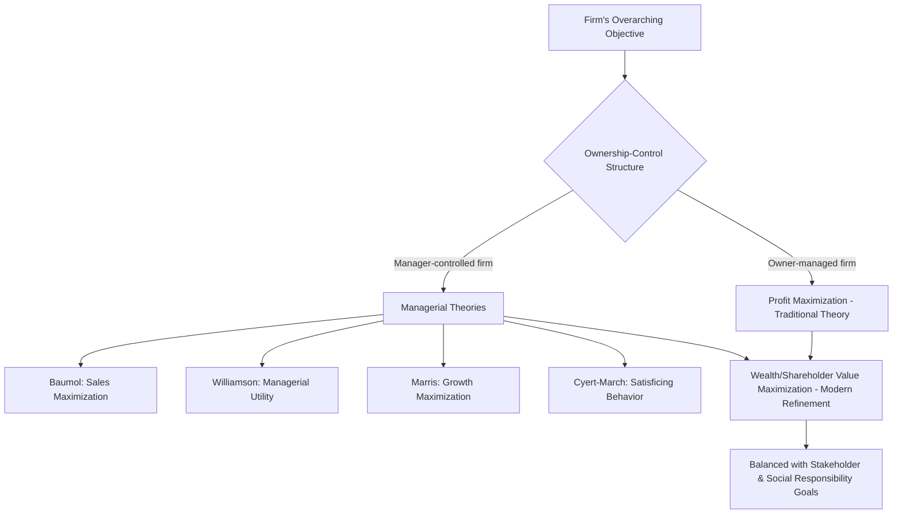

## The Theory of the Firm and Its Objectives

### Overview

The theory of the firm is the body of economic analysis explaining why firms exist, how they make production and pricing decisions, and what objective(s) guide those decisions. It forms the analytical core of managerial economics because every managerial decision — pricing, output, investment, resource allocation — is ultimately made in pursuit of some organizational objective.

### Why Firms Exist

- **Coordination of Production**: Firms exist to organize and coordinate factors of production (land, labor, capital, entrepreneurship) more efficiently than could be achieved through a series of individual market transactions.
- **Transaction Cost Explanation [Inference — theoretical framework, associated with Ronald Coase]**: Firms emerge because conducting all economic activity through market transactions (search costs, negotiation costs, contract enforcement costs) is often more expensive than internalizing those activities within an organizational hierarchy.
- **Risk-Bearing Function**: The firm (particularly the entrepreneur/owner) bears the residual risk of business operations in exchange for residual profit.

### Traditional Theory of the Firm: Profit Maximization

The classical/neoclassical theory of the firm assumes a **single, clear objective: profit maximization**.

**Key Points**

- **Core Assumption**: The firm seeks to maximize the difference between Total Revenue (TR) and Total Cost (TC): $\pi = TR - TC$
- **Marginal Condition**: Under the traditional theory, profit is maximized at the output level where Marginal Revenue equals Marginal Cost: $MR = MC$, provided the marginal cost curve cuts the marginal revenue curve from below (second-order condition for a maximum).
- **Rationality Assumption**: Assumes the firm has complete information, acts rationally, and has a single decision-maker (owner-manager) whose interests align with maximizing profit.
- **Short-run vs. Long-run**: In the short run, firms maximize profit given fixed factors; in the long run, they adjust all factors, including entry/exit decisions, to reach long-run equilibrium.

### Profit Maximization: Graphical Illustration (svg_diagram)

<svg xmlns="http://www.w3.org/2000/svg" viewBox="0 0 700 380">
<text x="350" y="24" font-size="15" font-weight="bold" text-anchor="middle" fill="#1a1a1a">MR = MC Profit Maximization (svg_diagram)</text>
<line x1="80" y1="320" x2="650" y2="320" stroke="#333" stroke-width="1.5" />
<line x1="80" y1="320" x2="80" y2="50" stroke="#333" stroke-width="1.5" />
<text x="660" y="325" font-size="12" fill="#1a1a1a">Output (Q)</text>
<text x="50" y="45" font-size="12" fill="#1a1a1a">Cost /</text>
<text x="30" y="60" font-size="12" fill="#1a1a1a">Revenue</text>
<path d="M100,300 C 250,60 400,60 600,260" stroke="#4a6fa5" stroke-width="2.5" fill="none" />
<text x="605" y="255" font-size="12" fill="#4a6fa5">MC</text>
<line x1="100" y1="140" x2="600" y2="140" stroke="#a53a3a" stroke-width="2.5" />
<text x="605" y="140" font-size="12" fill="#a53a3a">MR</text>
<line x1="345" y1="320" x2="345" y2="140" stroke="#888" stroke-width="1" stroke-dasharray="4,3" />
<circle cx="345" cy="140" r="4" fill="#1a1a1a" />
<text x="345" y="340" font-size="12" text-anchor="middle" fill="#1a1a1a">Q*</text>
<text x="360" y="130" font-size="11" fill="#1a1a1a">MR = MC</text>
<text x="360" y="116" font-size="11" fill="#1a1a1a">(Profit-maximizing output)</text>
</svg>

### Limitations of the Profit Maximization Model

**Key Points**

- **Separation of Ownership and Control**: In large modern corporations, shareholders (owners) are distinct from professional managers (controllers). Managers may not pursue pure profit maximization if it conflicts with their own goals — this is a core critique from **managerial theories of the firm**.
- **Uncertainty and Imperfect Information**: Firms rarely have complete information about demand or cost curves, making precise MR = MC calculation impractical in real operations; managers often use approximations or rules of thumb (e.g., cost-plus pricing).
- **Multiple Stakeholders**: Modern firms must balance interests of shareholders, employees, customers, creditors, and regulators — not purely profit alone.
- **Time Horizon Ambiguity**: Should the firm maximize short-run or long-run profit? These can conflict (e.g., cutting R&D boosts short-run profit but harms long-run competitiveness).

### Alternative (Behavioral and Managerial) Theories of the Firm

Because of these limitations, several alternative theories have been proposed, particularly relevant when ownership and control are separated.

#### 1. Baumol's Sales (Revenue) Maximization Theory [Unverified — attributed to William Baumol]

- Argues that managers seek to **maximize total sales revenue** (not profit) subject to a **minimum acceptable profit constraint** required to satisfy shareholders.
- Rationale: Managerial salaries, prestige, and market power are often more closely linked to sales volume/market share than to profit level.

#### 2. Williamson's Managerial Discretion Model [Unverified — attributed to Oliver Williamson]

- Suggests managers maximize their own **utility function**, which includes elements like staff expenditure, managerial emoluments (perks), and discretionary investment — subject to a minimum profit constraint imposed by shareholders.

#### 3. Marris's Growth Maximization Theory [Unverified — attributed to Robin Marris]

- Proposes that managers pursue the **maximization of the firm's balanced growth rate** (growth of demand for the firm's products and growth of capital), since firm size and growth are linked to managerial status, job security, and compensation.

#### 4. Behavioral Theory (Cyert and March) [Unverified]

- Views the firm not as a single decision-making unit but as a **coalition of different interest groups** (departments, managers, workers) with potentially conflicting goals.
- Introduces the concept of **"satisficing"** rather than "maximizing" — the firm seeks satisfactory (acceptable) levels of performance across multiple goals (sales, profit, market share) rather than optimizing any single one, due to bounded rationality and organizational complexity.

#### 5. Agency Theory Perspective

- Frames the manager as an **"agent"** acting on behalf of shareholders (the **"principal"**). Since the agent's interests (job security, perks, risk aversion) may diverge from the principal's interest (profit/shareholder value maximization), this creates the **"agency problem,"** which is often mitigated through incentive structures (stock options, performance bonuses) to align managerial and shareholder objectives.

### Comparative Summary of Theories of the Firm

| Theory | Assumed Objective | Key Constraint |
| --- | --- | --- |
| Traditional (Neoclassical) | Profit maximization | None (single decision-maker) |
| Baumol | Sales/revenue maximization | Minimum profit constraint |
| Williamson | Managerial utility maximization (perks, discretion) | Minimum profit constraint |
| Marris | Growth rate maximization | Balance between growth and financial stability |
| Behavioral (Cyert & March) | Satisficing across multiple goals | Bounded rationality, coalition bargaining |

### Other Possible Objectives of the Firm

Beyond the formal theories above, firms in practice may pursue (often simultaneously):

- **Wealth Maximization / Shareholder Value Maximization**: Considered a more refined version of profit maximization that accounts for the time value of money and risk — maximizing the present value of the firm's expected future cash flows.
- **Market Share Maximization**: Pursuing dominance in a market as a strategic goal, sometimes even at the expense of short-run profit.
- **Survival and Stability**: Particularly relevant for firms in volatile or highly competitive industries — prioritizing continuity over aggressive growth or profit targets.
- **Social Responsibility / Stakeholder Value**: Balancing profit objectives with obligations to employees, communities, and the environment (Corporate Social Responsibility considerations).
- **Cost Minimization for a Given Output**: A dual objective often pursued alongside revenue goals — technically distinct from profit maximization but closely related.

### Objective Hierarchy Flow

### Example: Applying the Theory

A publicly listed company's board sets executive compensation partly through **stock options** tied to share price performance. This is a direct real-world application of **agency theory** — designed to align the manager's personal incentive (maximizing their own compensation) with the shareholders' objective (wealth maximization), thereby reducing the divergence predicted by Williamson's and Baumol's models.

### Significance for Managerial Economics

**Key Points**

- The assumed objective function (profit maximization, wealth maximization, sales maximization, satisficing, etc.) determines the entire analytical approach used in managerial decision-making — e.g., the optimal price, output, or investment level differs depending on which objective is assumed.
- Managerial economics generally uses the **wealth/value maximization** objective as its standard working assumption for formal analysis, since it accounts for both profitability and time/risk considerations, while acknowledging in practice that real firms may pursue **satisficing or multiple-goal behavior** as described by behavioral theory.
- Understanding these alternative theories helps managers and analysts interpret real corporate behavior that may deviate from pure profit-maximizing predictions (e.g., a firm prioritizing market share growth over immediate profit).

**Related Topics**

- Marginal analysis (MR = MC rule) in pricing and output decisions
- Agency problem and corporate governance mechanisms
- Wealth maximization vs. profit maximization as decision criteria
- Behavioral economics and bounded rationality in managerial decisions
- Break-even analysis and profit planning
- Separation of ownership and control in modern corporations