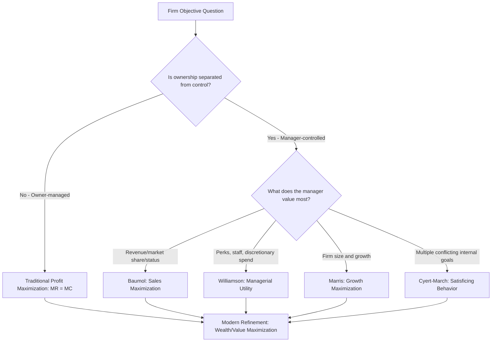

## Profit Maximization and Alternative Theories of the Firm

### Overview

While the traditional theory of the firm assumes profit maximization as the sole objective, this assumption has been challenged on both theoretical and empirical grounds — particularly in large modern corporations where ownership and control are separated. This has led to the development of several alternative theories, each proposing a different objective function that managers actually pursue. This topic examines profit maximization in depth as the baseline model, then details the alternative theories that have emerged to explain observed managerial behavior more realistically.

### The Profit Maximization Model (Traditional Theory)

**Key Points**

- **Objective Function**: The firm chooses output level $Q$ to maximize $\pi(Q) = TR(Q) - TC(Q)$, where $TR$ is total revenue and $TC$ is total cost.
- **First-Order Condition**: Profit is maximized where marginal revenue equals marginal cost: $MR = MC$, i.e., $\frac{d\pi}{dQ} = 0$.
- **Second-Order Condition**: For a true maximum (not minimum), the marginal cost curve must cut the marginal revenue curve from below — i.e., $MC$ must be rising relative to $MR$ at that point ($\frac{d^2\pi}{dQ^2} < 0$).
- **Assumptions Required**:
  - Single decision-maker (owner-manager) with full authority
  - Perfect/complete information about demand and cost functions
  - Rational, consistent decision-making
  - No conflict of interest between ownership and management
  - Short-run and long-run objectives are consistent

### Types of Profit Concepts Underlying the Model

| Concept | Definition |
| --- | --- |
| Accounting Profit | Total revenue minus explicit (out-of-pocket) costs only |
| Economic Profit | Total revenue minus both explicit and implicit (opportunity) costs |
| Normal Profit | The minimum return needed to keep a firm's resources in their current use (treated as a cost, not a profit, in economic analysis) |
| Supernormal/Abnormal Profit | Economic profit above normal profit; attracts entry in competitive markets |

### Criticisms of the Profit Maximization Hypothesis

**Key Points**

- **Separation of Ownership and Control**: In large corporations, professional managers control day-to-day decisions while dispersed shareholders own the firm. Managers may not have strong personal incentives to maximize shareholder profit if their compensation and status depend on other factors.
- **Informational Constraints**: Firms rarely possess complete knowledge of their demand and cost curves; true MR = MC optimization is often practically infeasible, leading firms to use heuristics like cost-plus pricing instead.
- **Multiplicity of Goals**: Real organizations pursue several objectives simultaneously (growth, market share, employee welfare, risk reduction) that may conflict with strict profit maximization.
- **Time Horizon Problem**: Short-run profit maximization can conflict with long-run value creation (e.g., cutting R&D or maintenance spending boosts current profit but damages future competitiveness).
- **Behavioral/Bounded Rationality Critique**: Managers operate under cognitive and informational limits, making "maximizing" behavior unrealistic; they instead seek satisfactory outcomes.

### Alternative Theories of the Firm

These theories emerged largely from the **managerial revolution** literature — recognizing that once ownership and control are separated, managers' personal utility functions, not shareholders' profit interest, may drive firm behavior.

#### 1. Baumol's Sales (Revenue) Maximization Theory [Unverified — associated with William Baumol]

- **Core Proposition**: Managers maximize total sales revenue, not profit, subject to a **minimum profit constraint** sufficient to keep shareholders satisfied and avoid takeover threats.
- **Rationale**: Managerial salaries, bonuses, promotions, and prestige are often tied more directly to sales volume, market share, and firm size than to reported profit.
- **Implication**: A sales-maximizing firm will generally produce a **higher output and charge a lower price** than a profit-maximizing firm, because it continues expanding output past the profit-maximizing point (where $MR = MC$) up to the point where the minimum profit constraint becomes binding.

#### 2. Williamson's Managerial Discretion Model [Unverified — associated with Oliver Williamson]

- **Core Proposition**: Managers maximize their own **utility function**, which includes variables such as:
  - Staff expenditure (size of department, number of subordinates)
  - Managerial emoluments/perks (expense accounts, offices, benefits)
  - Discretionary investment (projects that enhance managerial prestige/security beyond what's strictly profit-optimal)
- **Constraint**: Subject to a minimum profit level required to keep shareholders from intervening.
- **Implication**: Leads to potential **organizational slack** — resources used for managerial benefit rather than strict profit maximization.

#### 3. Marris's Growth Maximization Theory [Unverified — associated with Robin Marris]

- **Core Proposition**: Managers seek to maximize the firm's **balanced growth rate** — simultaneous growth in demand for the firm's output and growth in its capital supply — since firm size and growth rate correlate with managerial salary, status, and job security.
- **Constraint**: A "valuation ratio" (market value of the firm relative to its book value) must be kept above a minimum level to avoid the risk of takeover.
- **Implication**: Growth-maximizing firms may pursue diversification and expansion strategies even where they don't strictly maximize short-run profit.

#### 4. Behavioral Theory of the Firm (Cyert and March) [Unverified]

- **Core Proposition**: The firm is not a monolithic profit-maximizing entity but a **coalition of individuals and groups** (departments, managers, shareholders, workers) with differing, sometimes conflicting, goals.
- **Key Concept — Satisficing**: Because of bounded rationality, limited information, and organizational complexity, firms do not "maximize" any single variable; instead they seek **satisfactory levels** of performance across multiple goals (sales, profit, market share, inventory levels).
- **Organizational Slack**: Resources not strictly necessary for operations, which act as a buffer during downturns and a source of negotiation among coalition members.

#### 5. Agency Theory

- **Core Proposition**: Frames managers as **agents** acting on behalf of shareholders (**principals**). Since agents' interests (job security, risk aversion, personal compensation, effort minimization) may diverge from principals' interest (profit/wealth maximization), an **agency problem** (also called agency cost) arises.
- **Mitigation Mechanisms**: Performance-linked pay, stock options, monitoring by boards of directors, and market discipline (takeover threats) are used to align managerial incentives with shareholder objectives.

### Comparative Table of Theories

| Theory | Objective Maximized | Constraint | Output vs. Profit-Max Firm |
| --- | --- | --- | --- |
| Traditional (Neoclassical) | Profit | None | Baseline |
| Baumol | Sales/Total Revenue | Minimum profit | Higher output, lower price |
| Williamson | Managerial utility (staff, perks, discretionary investment) | Minimum profit | Higher costs/slack, lower reported profit |
| Marris | Balanced growth rate | Minimum valuation ratio | Growth/diversification-focused |
| Behavioral (Cyert & March) | Satisfactory levels across multiple goals | Bounded rationality, coalition bargaining | Variable, not optimized on one dimension |

### Modern Refinement: Wealth (Value) Maximization

- **Definition**: Maximizing the **present value of the firm's expected future cash flows**, accounting for both the timing (time value of money) and the risk of returns: $$V = \sum_{t=1}^{n} \frac{CF_t}{(1+r)^t}$$ where $CF_t$ is expected cash flow in period $t$ and $r$ is the discount rate reflecting risk.
- **Why Preferred in Modern Finance/Managerial Economics**: Addresses the criticism that simple profit maximization ignores the timing of profits (a dollar today vs. a dollar in ten years) and the riskiness of the income stream — two dimensions wealth maximization explicitly incorporates.

### Decision Tree of Firm Objectives

### Example: Contrasting Predictions

Consider a firm facing a decision on whether to expand output beyond the profit-maximizing point:

- **Traditional theory** predicts the firm stops expanding at $MR = MC$, since further output reduces profit.
- **Baumol's theory** predicts the firm continues expanding output beyond that point — as long as the resulting profit stays above the minimum acceptable level — because expanding output/revenue increases managerial prestige and market share.
- **Marris's theory** predicts the firm may pursue diversification or acquisition (increasing size/growth) even if it temporarily reduces per-unit profitability, as long as the valuation ratio stays above the takeover-risk threshold.
- **Behavioral theory** predicts the firm's department heads negotiate internally, and the final output decision reflects a **compromise** among sales targets, cost-control targets, and inventory targets rather than a single optimized value.

### Significance for Managerial Decision-Making

**Key Points**

- The choice of assumed objective function directly changes the predicted "optimal" price, output, and investment decisions — so understanding which theory best describes a given firm's actual behavior is critical for accurate managerial analysis.
- **Practical takeaway**: Managerial economics uses profit/wealth maximization as the standard analytical benchmark for formal modeling, while recognizing (per the alternative theories) that real corporate behavior — especially in large, manager-controlled firms — often reflects sales growth, market share, or satisficing objectives shaped by internal organizational incentives.
- Corporate governance mechanisms (stock options, board oversight, activist shareholders) exist specifically to narrow the gap between what managerial theories predict (self-interested managerial behavior) and what shareholders want (profit/wealth maximization).

**Related Topics**

- Agency theory and corporate governance mechanisms
- Wealth maximization vs. profit maximization as decision criteria
- Marginal analysis (MR = MC) in output and pricing decisions
- Break-even analysis and profit planning
- Behavioral economics and bounded rationality
- Separation of ownership and control in modern corporations