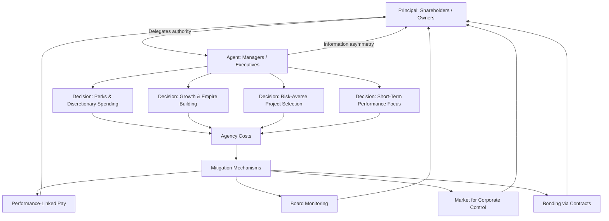

## Principal-Agent Problems and Managerial Objectives

### Overview

The principal-agent problem (also called the agency problem) arises whenever one party (the **principal**) delegates decision-making authority or work to another party (the **agent**), and the agent's interests diverge from the principal's interests, combined with **information asymmetry** that prevents the principal from perfectly monitoring the agent's actions. In managerial economics, this framework is central to understanding why real firm behavior often departs from the pure profit/wealth-maximization predictions of traditional theory.

### Definition and Core Concept

- **Principal**: The party who delegates authority and bears the ultimate financial consequence of decisions (e.g., shareholders, business owners, a company's board on behalf of shareholders).
- **Agent**: The party entrusted with decision-making authority to act on the principal's behalf (e.g., professional managers, CEOs, employees).
- **Agency Relationship**: Exists wherever one party's welfare depends on actions taken by another party who possesses specialized knowledge or control the first party lacks.
- **Agency Problem**: Emerges because the agent may pursue their own self-interest rather than faithfully acting to maximize the principal's welfare, and the principal cannot costlessly verify whether the agent is doing so.

### Root Causes of the Principal-Agent Problem

**Key Points**

- **Separation of Ownership and Control**: In modern corporations, shareholders (owners/principals) are typically dispersed and do not manage daily operations; professional managers (agents) run the firm. This structural separation is the foundational condition enabling the agency problem.
- **Information Asymmetry**: Managers possess more detailed, real-time information about the firm's operations, opportunities, and risks than shareholders do. Shareholders cannot fully observe managerial effort or decision quality.
- **Divergent Utility Functions**: Managers may value things shareholders do not directly benefit from — job security, reduced personal effort, prestige, perks, empire-building (increasing firm size/scope), and risk avoidance (to protect their own employment) — rather than pure profit or shareholder wealth.
- **Costly Monitoring**: Even where mechanisms exist to monitor agents (audits, board oversight, reporting requirements), monitoring itself is costly and imperfect, leaving room for agency slack.

### Forms of Agency Costs

Agency costs are the costs incurred because of the divergence between principal and agent interests. They are typically categorized into three types:

| Type | Description |
| --- | --- |
| Monitoring Costs | Costs borne by the principal to observe, measure, and control agent behavior (e.g., audits, board meetings, performance reporting systems) |
| Bonding Costs | Costs borne by the agent to credibly commit to acting in the principal's interest (e.g., contractual guarantees, non-compete clauses, agreeing to performance-linked pay) |
| Residual Loss | The remaining loss in value that persists even after monitoring and bonding mechanisms are in place, due to imperfect alignment of interests |

### How the Agency Problem Manifests in Managerial Objectives

The theories of the firm covered under alternative (managerial) theories are, in essence, specific hypotheses about **what agents (managers) actually maximize** once the principal-agent problem is present:

- **Expense Preference / Perquisite Consumption**: Managers may over-consume perks (luxury offices, travel, large staff) — consistent with Williamson's managerial discretion model.
- **Empire Building**: Managers may pursue excessive firm growth, acquisitions, or diversification (increasing firm size and their own span of control) even when it does not maximize shareholder value — consistent with Marris's growth maximization model.
- **Risk Aversion (Career Concerns)**: Because managers' personal wealth (job, reputation) is tied to firm performance in a way that isn't diversified (unlike a shareholder's diversified portfolio), managers may avoid legitimately profitable but risky projects to protect their own job security — a divergence from what a diversified shareholder would prefer.
- **Short-Termism**: Managers compensated or evaluated on short-run performance metrics may prioritize short-run earnings over long-run value creation (e.g., cutting R&D or maintenance spending to boost quarterly profit).
- **Sales/Revenue Emphasis**: Managers may prioritize sales growth and market share (tied to status and compensation) over strict profit maximization, consistent with Baumol's theory.

### Principal-Agent Relationship Structure

### Mechanisms to Mitigate the Principal-Agent Problem

**Key Points**

- **Performance-Linked Compensation**: Tying managerial pay to metrics aligned with shareholder interest — stock options, restricted stock units, bonuses linked to profit or share price growth — designed to make managerial wealth move with shareholder wealth.
- **Board of Directors Oversight**: Independent boards and audit committees monitor management decisions and can remove underperforming executives.
- **Market for Corporate Control**: The threat of hostile takeover disciplines managers — if a firm's stock is undervalued due to poor managerial decisions, external parties may acquire the firm and replace management, creating an incentive for managers to avoid value-destroying behavior.
- **Debt Financing as a Disciplining Device [Inference — theoretical argument in corporate finance literature]**: Higher leverage (debt) commits the firm to fixed interest payments, reducing "free cash flow" available for managers to misuse on unprofitable perks or projects.
- **Reputation Effects**: Managers who build a reputation for honest, effective performance improve their future employability and compensation, creating an incentive to act in shareholders' interest even without explicit contracts.
- **Regulatory and Disclosure Requirements**: Mandatory financial reporting, audits, and securities regulations reduce information asymmetry between managers and shareholders.

### Example

A CEO is offered a choice between two investment projects:

- **Project A**: High expected return but higher risk/volatility, benefiting diversified shareholders who can spread risk across their broader portfolios.
- **Project B**: Lower expected return but safer, protecting the CEO's own job security since their entire career/reputation is tied to this one firm's performance (they cannot "diversify" their employment).

Absent proper incentive alignment, a risk-averse CEO whose compensation is largely salary-based (not equity-linked) may rationally choose **Project B**, even though shareholders (who are diversified) would prefer **Project A**'s higher expected return. This is a direct illustration of the principal-agent problem — introducing **stock options or equity-based compensation** tied to firm performance is a common mechanism to correct this misalignment by making the CEO's payoff resemble a shareholder's.

### Relationship to Alternative Theories of the Firm

**Key Points**

- The principal-agent framework provides the underlying **theoretical justification** for why alternative theories (Baumol's sales maximization, Williamson's managerial utility, Marris's growth maximization, and the behavioral theory's satisficing) predict outcomes different from pure profit maximization: in each case, the "agent" (manager) pursues an objective that reflects their own utility function rather than the principal's (shareholder's) wealth-maximizing interest.
- These alternative theories can be understood as **specific empirical hypotheses** about the form the agency problem takes in practice — i.e., different assumptions about exactly what managers substitute for profit maximization when their interests diverge from shareholders'.

### Significance for Managerial Economics

**Key Points**

- Explains persistent gaps between theoretical profit-maximizing predictions and observed corporate behavior (excessive executive compensation, unprofitable acquisitions, resistance to layoffs/cost-cutting, resistance to disclosure).
- Provides the analytical basis for **corporate governance design** — structuring compensation, monitoring, and control mechanisms to minimize agency costs.
- Extends beyond the shareholder-manager relationship to other agency relationships within a firm (e.g., manager-employee, firm-creditor, firm-customer), all of which involve similar information asymmetry and incentive misalignment issues relevant to managerial decision-making.

**Related Topics**

- Alternative theories of the firm (Baumol, Williamson, Marris, behavioral theory)
- Corporate governance mechanisms and board structures
- Performance-linked executive compensation design
- Wealth maximization vs. profit maximization as decision criteria
- Information asymmetry and moral hazard in economic transactions
- Market for corporate control and hostile takeovers