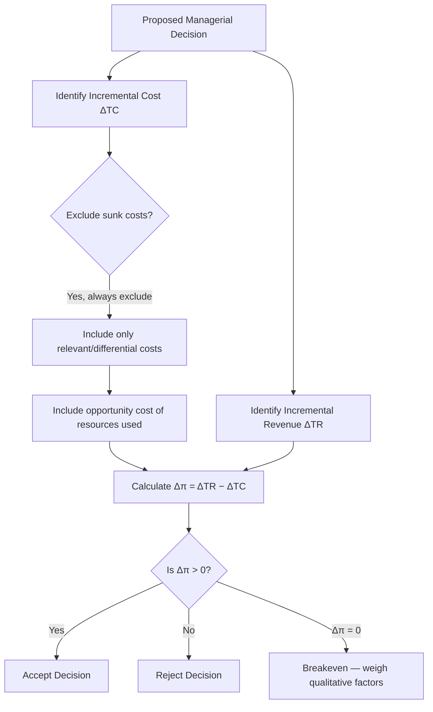

## Incremental and Marginal Analysis in Decision Making

### Overview

Incremental and marginal analysis are two closely related, foundational analytical tools in managerial economics used to evaluate the consequences of a change in a business decision. Both focus on **change** — the additional effects (revenue, cost, or other outcomes) that result from a specific decision — rather than average or total values, which is what makes them so central to rational managerial decision-making.

### Marginal Analysis

**Definition**: Marginal analysis examines the effect of a **one-unit change** in an economic variable (typically output) on another variable (typically total cost or total revenue). It is the calculus-based, unit-level version of change analysis.

**Key Points**

- **Marginal Cost (MC)**: The additional cost incurred from producing one more unit of output: $MC = \frac{\Delta TC}{\Delta Q}$, or in continuous form, $MC = \frac{dTC}{dQ}$
- **Marginal Revenue (MR)**: The additional revenue gained from selling one more unit of output: $MR = \frac{\Delta TR}{\Delta Q}$, or $MR = \frac{dTR}{dQ}$
- **Marginal Utility**: The additional satisfaction gained from consuming one more unit of a good.
- **Marginal Product**: The additional output produced by employing one more unit of a variable input (e.g., labor), holding other inputs constant.
- **Decision Rule**: A rational economic agent continues an activity as long as the marginal benefit exceeds the marginal cost, and stops (or reverses) when marginal cost exceeds marginal benefit. The optimum occurs where marginal benefit equals marginal cost.

### Incremental Analysis

**Definition**: Incremental analysis is a broader, more practically applicable version of marginal analysis. Instead of examining the effect of a single infinitesimal unit change, it examines the effect of a **discrete managerial decision or policy change** — which may involve a "lumpy" or non-marginal change (e.g., adding a new product line, changing a large batch of output, altering an entire process).

**Key Points**

- **Incremental Cost**: The total additional cost incurred as a result of a specific managerial decision (e.g., launching a new product, increasing production by a large batch, changing a marketing campaign).
- **Incremental Revenue**: The total additional revenue generated by that same decision.
- **Decision Rule**: A decision should be undertaken if the **incremental revenue exceeds the incremental cost** (i.e., incremental profit is positive): $\Delta \pi = \Delta TR - \Delta TC > 0$
- **Why Broader than Marginal Analysis**: Real managerial decisions are rarely about producing exactly "one more unit." They typically involve discrete, often large-scale choices (e.g., "Should we open a new branch?" "Should we accept this bulk order?" "Should we discontinue this product line?"). Incremental analysis is the practical tool suited to these lumpy, real-world decisions, while marginal analysis remains the underlying theoretical/calculus-based concept.

### Marginal vs. Incremental Analysis: Comparison

| Aspect | Marginal Analysis | Incremental Analysis |
| --- | --- | --- |
| Scope of change | Single unit (or infinitesimally small change) | Discrete, often large or "lumpy" change (a policy, project, or batch decision) |
| Mathematical basis | Calculus (derivatives): $\frac{dTC}{dQ}$ | Simple difference: $\Delta TC = TC_2 - TC_1$ |
| Typical use case | Theoretical determination of optimal output ($MR = MC$) | Practical business decisions (accept/reject a special order, add a product line, change a process) |
| Precision requirement | Requires continuous, differentiable cost/revenue functions | Works with discrete, real-world data (before-and-after comparison) |

### Core Decision Rule (Formal Statement)

For any proposed managerial decision, compare the **incremental revenue** to the **incremental cost** of that decision:

$$\Delta \pi = \Delta TR - \Delta TC$$

- If $\Delta \pi > 0$: Accept the decision (it adds to overall profit).
- If $\Delta \pi < 0$: Reject the decision (it reduces overall profit).
- If $\Delta \pi = 0$: The decision is a breakeven proposition; other qualitative factors should determine the choice.

### Key Principles Underlying Incremental/Marginal Reasoning

**Key Points**

- **Ignore Sunk Costs**: Costs already incurred and unrecoverable (sunk costs) are irrelevant to a forward-looking incremental decision — only future incremental costs and revenues matter.
- **Focus on Relevant (Differential) Costs**: Only costs and revenues that **differ** between the alternatives being compared are relevant; costs common to all alternatives should be excluded from the comparison.
- **Consider Opportunity Costs**: The incremental cost of a decision must include the value of the best foregone alternative (e.g., using idle factory capacity for a special order has an opportunity cost only if that capacity has an alternative profitable use).
- **Include Indirect/Secondary Effects**: A complete incremental analysis considers not just direct effects but also indirect effects — e.g., will accepting a special order at a discounted price cannot be ignored if it damages the firm's regular pricing structure or existing customer relationships (cannibalization effects).

### Example 1: Special Order Decision (Classic Incremental Analysis Application)

A manufacturer has spare production capacity and receives a one-time bulk order at a price below its normal selling price. Suppose:

- Normal selling price per unit: $50
- Variable (incremental) cost per unit: $30
- Special order price offered: $35 per unit for 1,000 units
- Fixed costs are already covered by existing normal production and will not change regardless of this order (i.e., fixed costs are irrelevant to this decision).

**Incremental analysis**:

- Incremental Revenue = $35 \times 1{,}000 = \$35{,}000$
- Incremental Cost = $30 \times 1{,}000 = \$30{,}000$
- Incremental Profit = $\$35{,}000 - \$30{,}000 = \$5{,}000$ (positive)

**Decision**: Accept the special order, since it generates positive incremental profit, **even though $35 is below the normal selling price of $50** — a conclusion that traditional average-cost thinking might have incorrectly rejected.

### Example 2: Marginal Analysis Application (Output Decision)

Suppose a firm's marginal cost function is $MC = 10 + 2Q$ and marginal revenue is constant at $MR = 50$ (a price-taking firm in a competitive market). Setting $MR = MC$:

$$50 = 10 + 2Q \implies Q = 20$$

The firm should produce **20 units**, the output level at which marginal revenue equals marginal cost — beyond this point, each additional unit costs more to produce than it earns in revenue, reducing total profit.

### Decision Flow for Incremental/Marginal Analysis

### Applications in Managerial Decision-Making

**Key Points**

- **Pricing Decisions**: Deciding whether to accept a special/bulk order below normal price, using idle capacity.
- **Make-or-Buy Decisions**: Comparing the incremental cost of producing a component in-house versus purchasing it externally.
- **Product Line Decisions**: Whether to add or drop a product line, based on the incremental revenue and incremental (avoidable) costs specifically attributable to that line.
- **Shift/Capacity Decisions**: Whether to add an extra production shift, comparing incremental revenue from additional output against incremental costs (overtime wages, additional utility costs).
- **Advertising/Promotion Decisions**: Whether an additional advertising expenditure is justified by the resulting incremental sales revenue it generates.
- **Capital Investment Decisions**: Evaluating whether a new investment's incremental cash flows justify its incremental cost, closely related to capital budgeting techniques (NPV, IRR).

### Common Pitfalls in Applying Incremental Analysis

**Key Points**

- **Including Sunk Costs**: A common error is factoring in costs already incurred (e.g., "we already spent $1 million on this project, we can't stop now") — this is economically irrelevant to a forward-looking decision (the "sunk cost fallacy").
- **Using Average Cost Instead of Incremental Cost**: Rejecting a special order because its price is below the *average* total cost per unit, ignoring that fixed costs are already covered and only the *incremental* (variable) cost matters for that specific decision.
- **Ignoring Opportunity Costs**: Assuming idle capacity has "zero cost" when it could otherwise be used for a different profitable purpose.
- **Ignoring Long-Term/Indirect Effects**: Failing to account for how a short-term incremental decision (e.g., a discounted special order) might affect long-term brand positioning, customer expectations, or existing contracts.

### Significance in Managerial Economics

**Key Points**

- Incremental and marginal analysis together form the **operational backbone** of managerial decision-making, converting the abstract $MR = MC$ optimization rule of economic theory into a practical tool applicable to real, discrete business choices.
- These techniques directly embody the core managerial economics principle of "**decisions at the margin**" — that rational choices are made by comparing the additional benefit against the additional cost of each specific decision, not by looking at averages or totals in isolation.
- Widely used across nearly all functional areas of business — pricing, production, marketing, finance, and operations — making it one of the most broadly applicable tools covered in managerial economics.

**Related Topics**

- Opportunity cost and its role in decision-making
- Relevant costs vs. sunk costs in short-term decisions
- Break-even analysis and cost-volume-profit (CVP) analysis
- Make-or-buy and outsourcing decisions
- Capital budgeting techniques (NPV, IRR, payback period)
- MR = MC rule under different market structures