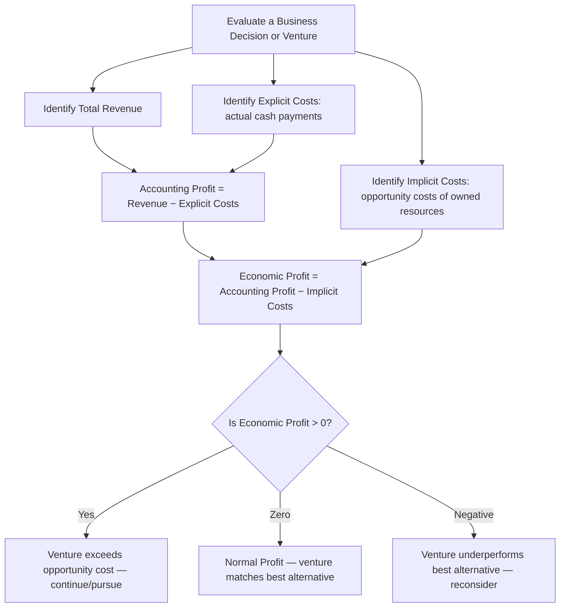

## Opportunity Cost and Economic Versus Accounting Profit

### Overview

Opportunity cost is one of the most fundamental concepts in economics and managerial decision-making — it underlies the distinction between accounting profit and economic profit, and shapes how a rational decision-maker should evaluate the true cost of any choice. Understanding this distinction prevents managers from mistaking positive accounting profit for genuine economic success.

### Opportunity Cost

**Definition**: Opportunity cost is the value of the **best forgone alternative** that must be given up when a choice is made among mutually exclusive options. Because resources (time, capital, labor) are scarce, using them for one purpose means they cannot simultaneously be used for another.

**Key Points**

- **Not Necessarily a Cash Outflow**: Opportunity cost need not involve any actual monetary payment — it represents forgone benefit, not incurred expense.
- **Applies to All Resources**: Time, capital, labor, land, and managerial attention all carry opportunity costs when allocated to one use rather than another.
- **Central to Rational Decision-Making**: Every decision implicitly involves comparing the chosen option's value against the value of the next-best alternative; ignoring this comparison leads to economically inefficient decisions.
- **Distinct from Sunk Cost**: Opportunity cost is forward-looking (about future alternatives forgone), whereas sunk cost is backward-looking (already incurred and irrecoverable) — sunk costs are irrelevant to decision-making, but opportunity costs are highly relevant.

### Two Categories of Cost: Explicit vs. Implicit

| Cost Type | Definition | Example |
| --- | --- | --- |
| Explicit Cost | Actual, out-of-pocket monetary payment made to outside parties for resources used | Wages paid to employees, rent paid to a landlord, payments for raw materials |
| Implicit Cost | The opportunity cost of using resources the firm/owner already possesses, for which no direct cash payment is made | Forgone salary the owner could have earned working elsewhere; forgone interest/return on capital the owner invested in the business instead of elsewhere; forgone rent on owned premises used by the business |

### Accounting Profit

**Definition**: Accounting profit is the profit measure used in financial statements and reported to shareholders, tax authorities, and regulators. It is calculated using standard accounting conventions.

$$\text{Accounting Profit} = \text{Total Revenue} - \text{Explicit (Accounting) Costs}$$

**Key Points**

- Recognizes only **explicit costs** — actual cash or contractual payments made for labor, materials, rent, utilities, depreciation (per accounting rules), and taxes.
- Governed by standardized accounting principles (e.g., Generally Accepted Accounting Principles or International Financial Reporting Standards) to ensure comparability and external reporting reliability.
- Used for tax computation, financial statement preparation, and external stakeholder communication (investors, creditors, regulators).

### Economic Profit

**Definition**: Economic profit is the profit measure used in economic analysis and managerial decision-making. It accounts for the **full opportunity cost** of all resources used in the business, not just cash expenditures.

$$\text{Economic Profit} = \text{Total Revenue} - \text{Explicit Costs} - \text{Implicit Costs}$$

Equivalently:

$$\text{Economic Profit} = \text{Accounting Profit} - \text{Implicit Costs}$$

**Key Points**

- Because it subtracts implicit costs (opportunity costs of owner-supplied resources) in addition to explicit costs, **economic profit is always less than or equal to accounting profit**.
- Economic profit answers the question: "Is this business venture actually a better use of the owner's resources than the next-best alternative?" — accounting profit alone cannot answer this.
- A business can show **positive accounting profit while simultaneously earning zero or negative economic profit** — meaning it is profitable in a bookkeeping sense but not truly the best use of the owner's time and capital.

### Normal Profit

**Definition**: Normal profit is the level of accounting profit exactly equal to the implicit (opportunity) costs of the owner's resources — i.e., the minimum return necessary to keep the entrepreneur/owner engaged in the current business rather than switching to their next-best alternative.

**Key Points**

- Normal profit corresponds to the point where **economic profit equals zero** — the firm is earning exactly enough to compensate for opportunity costs, no more, no less.
- Normal profit is treated as a **cost** in economic analysis (an implicit cost), not as a surplus, because it represents the minimum compensation required to retain the entrepreneur's resources in this use.
- **Economic profit above zero (supernormal/abnormal profit)** signals the business is earning more than its opportunity cost — a signal that, in competitive markets, tends to attract new entrants until the excess profit is competed away.

### Relationship Between the Three Profit Concepts (svg_diagram)

<svg xmlns="http://www.w3.org/2000/svg" viewBox="0 0 700 320">
<text x="350" y="24" font-size="15" font-weight="bold" text-anchor="middle" fill="#1a1a1a">Profit Concepts Breakdown (svg_diagram)</text>
<rect x="80" y="60" width="540" height="50" fill="#e6f4ea" stroke="#3a8a52" />
<text x="350" y="90" font-size="13" text-anchor="middle" fill="#1a1a1a">Total Revenue</text>
<rect x="80" y="120" width="330" height="50" fill="#e8f0fe" stroke="#4a6fa5" />
<text x="245" y="150" font-size="13" text-anchor="middle" fill="#1a1a1a">Explicit Costs</text>
<rect x="410" y="120" width="210" height="50" fill="#fef3e0" stroke="#c98a2b" />
<text x="515" y="145" font-size="12" text-anchor="middle" fill="#1a1a1a">Implicit Costs</text>
<text x="515" y="160" font-size="10" text-anchor="middle" fill="#444">(incl. Normal Profit)</text>
<rect x="410" y="180" width="210" height="60" fill="#fde8e8" stroke="#a53a3a" />
<text x="515" y="205" font-size="12" text-anchor="middle" fill="#1a1a1a">Economic Profit</text>
<text x="515" y="222" font-size="10" text-anchor="middle" fill="#444">(Revenue − Explicit − Implicit)</text>
<rect x="80" y="180" width="330" height="60" fill="#f5f5f5" stroke="#888" />
<text x="245" y="205" font-size="12" text-anchor="middle" fill="#1a1a1a">Accounting Profit</text>
<text x="245" y="222" font-size="10" text-anchor="middle" fill="#444">(Revenue − Explicit Costs)</text>
<line x1="80" y1="260" x2="620" y2="260" stroke="#333" stroke-width="1" stroke-dasharray="3,3" />
<text x="350" y="280" font-size="11" text-anchor="middle" fill="#1a1a1a">Accounting Profit = Explicit-cost-adjusted Revenue; Economic Profit further nets out Implicit Costs</text>
</svg>

### Worked Numerical Example

A sole proprietor runs a small retail business. Over one year:

- Total Revenue: $200,000
- Explicit Costs (rent, wages paid to staff, inventory purchased, utilities): $150,000
- Implicit Costs:
  - Forgone salary the owner could earn working for another company: $40,000
  - Forgone interest on $50,000 of personal capital invested in the business (at a 6% alternative return): $3,000

**Calculations**:

$$\text{Accounting Profit} = \$200{,}000 - \$150{,}000 = \$50{,}000$$

$$\text{Total Implicit Costs} = \$40{,}000 + \$3{,}000 = \$43{,}000$$

$$\text{Economic Profit} = \$50{,}000 - \$43{,}000 = \$7{,}000$$

**Interpretation**: The business shows a healthy $50,000 accounting profit, which might look attractive on paper. However, once the opportunity cost of the owner's forgone salary and forgone investment return are accounted for, the true **economic profit is only $7,000**. This small positive economic profit indicates the business is *marginally* a better use of the owner's resources than their next-best alternative — but not by a wide margin. If the calculated economic profit were negative, it would signal the owner would be financially better off pursuing the alternative (e.g., taking the outside job and investing the $50,000 elsewhere) despite the business still showing positive accounting profit.

### Comparison Table: Accounting Profit vs. Economic Profit

| Aspect | Accounting Profit | Economic Profit |
| --- | --- | --- |
| Costs deducted | Explicit costs only | Explicit costs + implicit (opportunity) costs |
| Purpose | External reporting, taxation, financial statements | Internal managerial decision-making, resource allocation |
| Governing rules | Accounting standards (GAAP/IFRS) | Economic theory / opportunity cost principle |
| Typical magnitude | Generally higher (or equal) | Generally lower (or equal) than accounting profit |
| Zero point significance | Break-even in a cash/bookkeeping sense | Break-even relative to the best alternative use of resources (normal profit) |

### Applications in Managerial Decision-Making

**Key Points**

- **Business Continuation Decisions**: An entrepreneur should compare economic profit (not just accounting profit) to decide whether to continue operating the business or pursue an alternative use of their time and capital.
- **Capital Allocation**: When comparing investment projects, the opportunity cost of capital (the return forgone by not investing in the next-best alternative project) is central to techniques like Net Present Value (NPV) analysis, where the discount rate represents this opportunity cost.
- **Resource Allocation Within the Firm**: Deciding whether to use existing (owned) resources — such as a company-owned building or idle machinery — for a new project requires including the opportunity cost of that resource's next-best use, not treating it as "free" simply because no direct cash payment is required.
- **Make-or-Buy and Outsourcing Decisions**: Evaluating whether to use in-house capacity (with opportunity costs) versus outsourcing requires comparing the full economic cost, not just the explicit accounting cost, of the in-house option.
- **Entry and Exit Decisions in an Industry**: In competitive market theory, firms are expected to enter an industry when economic profit is positive (supernormal profit) and exit when economic profit is negative, since normal profit (zero economic profit) represents the equilibrium condition in the long run under perfect competition.

### Decision Framework

### Significance in Managerial Economics

**Key Points**

- The economic profit concept, built on opportunity cost reasoning, prevents the common managerial error of relying solely on accounting profit (which can overstate genuine economic success by ignoring the cost of owner-supplied resources).
- It reinforces one of managerial economics' core principles: economic decision-making requires comparing all relevant alternatives, not just recorded cash flows — a theme that also underlies incremental/marginal analysis and capital budgeting.
- In competitive market theory, the concept of normal profit (zero economic profit) explains long-run equilibrium behavior: firms enter industries earning supernormal (positive economic) profit and exit industries earning subnormal (negative economic) profit, driving the industry toward a state where only normal profit remains.

**Related Topics**

- Incremental and marginal analysis in decision-making
- Sunk costs vs. relevant costs in short-term decisions
- Cost of capital and its role in capital budgeting (NPV, IRR)
- Long-run equilibrium under perfect competition
- Theory of the firm and profit maximization
- Make-or-buy and resource allocation decisions