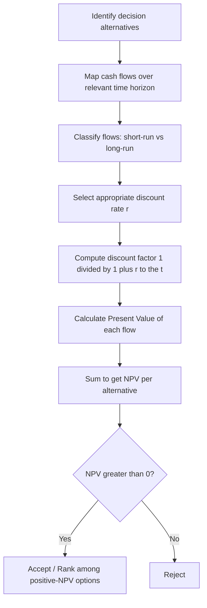

## Time Perspective and the Discounting Principle

### Definition and Conceptual Foundation

Time perspective in managerial economics refers to the principle that managers must evaluate decisions over an appropriate time horizon, distinguishing between short-run and long-run consequences of a choice. The discounting principle is the complementary rule that a naira, dollar, or peso receivable in the future is worth less than the same amount available today, because money has a time value.

The two concepts work together: time perspective tells a manager *which* time horizon and *which* future flows are relevant to a decision, while discounting tells the manager *how to compare* monetary values that occur at different points in that horizon.

### Why Money Has Time Value

Three economic reasons justify discounting future amounts:

- **Opportunity cost of capital**: money in hand today can be invested to earn a return; money delayed forfeits that return.
- **Inflation risk**: purchasing power of currency generally erodes over time.
- **Uncertainty/risk**: future receipts are less certain than present ones (a bird in hand principle).

### The Short-Run vs Long-Run Perspective

**Short-run perspective** treats at least one input (commonly capital, plant capacity, or technology) as fixed. Decisions are evaluated on their immediate impact on costs, revenue, and profit within the current operating structure.

**Long-run perspective** treats all inputs as variable. Decisions are evaluated on their impact after the firm has had time to adjust capacity, technology, and strategy.

A manager applying correct time perspective avoids two common errors:

1. **Short-run myopia**: accepting a decision that boosts current-period profit but destroys long-run value (e.g., cutting R&D or maintenance to inflate this quarter's earnings).
2. **Long-run overreach**: rejecting a viable current opportunity by over-weighting speculative distant benefits without discounting them properly.

**Example**

A firm considers replacing manual quality inspection with an automated system.

- Short-run view: installation cost and training disruption reduce this quarter's profit.
- Long-run view: lower defect rates and labor savings raise profit in future years.

  Correct managerial decision-making requires comparing the *discounted* value of long-run savings against the *upfront* short-run cost, not judging the project on short-run profit alone.

### The Discounting Principle: Formal Statement

The present value (PV) of a future sum $FV_t$ received $t$ periods from now, given discount rate $r$, is:

$$PV = \frac{FV_t}{(1+r)^t}$$

For a stream of cash flows $CF_1, CF_2, \ldots, CF_n$ occurring at the end of each period:

$$PV = \sum_{t=1}^{n} \frac{CF_t}{(1+r)^t}$$

Where:

- $CF_t$ = cash flow at time $t$
- $r$ = discount rate (reflecting opportunity cost of capital and risk)
- $t$ = number of periods until the cash flow occurs
- $n$ = total number of periods

The term $\frac{1}{(1+r)^t}$ is called the **discount factor**.

### Choosing the Discount Rate

The discount rate is not arbitrary; it should reflect:

- The firm's **cost of capital** (weighted average cost of debt and equity, WACC)
- **Risk premium** specific to the project or cash flow stream (riskier flows use a higher $r$)
- **Opportunity cost** — the best alternative use of the funds

[Inference] In practice, many firms use a single corporate hurdle rate for simplicity, even though finance theory recommends project-specific risk-adjusted rates; this simplification can lead to systematic misallocation across projects of differing risk.

### Present Value vs Net Present Value

**Net Present Value (NPV)** extends the discounting principle to investment decisions by netting out the initial outlay $C_0$:

$$NPV = -C_0 + \sum_{t=1}^{n} \frac{CF_t}{(1+r)^t}$$

Decision rule: accept the project if $NPV > 0$; reject if $NPV < 0$.

**Example**

A project requires an initial outlay of $100,000 and returns $40,000 at the end of each of the next 3 years. Assume $r = 10\%$.

$$NPV = -100{,}000 + \frac{40{,}000}{1.10} + \frac{40{,}000}{1.10^2} + \frac{40{,}000}{1.10^3}$$

$$NPV = -100{,}000 + 36{,}364 + 33{,}058 + 30{,}053 = -525$$

Since $NPV$ is slightly negative, the project marginally fails to cover its opportunity cost of capital at $r = 10\%$ and would be rejected under the NPV rule, despite appearing profitable on an undiscounted (short-run, nominal) basis (total inflows of $120,000 against $100,000 outlay).

### Discounting and the Time Perspective Decision Rule

Managerial economics integrates the two ideas into a single decision framework:

1. Identify all relevant cash flows across the full time horizon of the decision (long-run perspective — do not stop at the current period).
2. Convert every future flow to a common present-value basis using the discounting principle.
3. Compare alternatives on a discounted, not nominal, basis.
4. Select the option maximizing discounted net benefit (e.g., NPV), subject to risk and strategic constraints.

### Diagram: Discounting Decision Process

### Visual: Present Value Decay Curve

<svg xmlns="http://www.w3.org/2000/svg" viewBox="0 0 640 320">
<text x="320" y="24" text-anchor="middle" font-size="16" font-weight="bold" fill="#1a1a1a">Present Value Decay of a Fixed Future Sum (svg_diagram)</text>
<line x1="60" y1="270" x2="600" y2="270" stroke="#333" stroke-width="2" />
<line x1="60" y1="270" x2="60" y2="50" stroke="#333" stroke-width="2" />
<text x="330" y="300" text-anchor="middle" font-size="13" fill="#333">Time (periods, t)</text>
<text x="25" y="160" text-anchor="middle" font-size="13" fill="#333" transform="rotate(-90 25 160)">Present Value</text>
<path d="M 60,60 Q 200,120 320,180 T 600,255" fill="none" stroke="#2563eb" stroke-width="3" />
<circle cx="60" cy="60" r="4" fill="#2563eb" />
<circle cx="180" cy="105" r="4" fill="#2563eb" />
<circle cx="300" cy="150" r="4" fill="#2563eb" />
<circle cx="420" cy="195" r="4" fill="#2563eb" />
<circle cx="540" cy="235" r="4" fill="#2563eb" />
<text x="60" y="45" text-anchor="middle" font-size="11" fill="#555">t=0</text>
<text x="180" y="285" text-anchor="middle" font-size="11" fill="#555">t=1</text>
<text x="300" y="285" text-anchor="middle" font-size="11" fill="#555">t=2</text>
<text x="420" y="285" text-anchor="middle" font-size="11" fill="#555">t=3</text>
<text x="540" y="285" text-anchor="middle" font-size="11" fill="#555">t=4</text>
<text x="400" y="70" font-size="12" fill="#666">Higher r → steeper decay</text>
</svg>

### Common Applications in Managerial Decisions

- **Capital budgeting**: evaluating machinery purchases, plant expansion, or new product lines via NPV/IRR.
- **Make-vs-buy decisions**: comparing discounted cost streams of in-house production versus outsourcing contracts spanning multiple years.
- **Lease-vs-buy analysis**: discounting lease payment streams against the discounted cost of purchase.
- **Valuation of firms/projects**: discounted cash flow (DCF) valuation models.
- **Compensation and contract design**: comparing deferred compensation packages to current salary offers.

### Key Points

- Time perspective determines *which* costs and benefits matter for a decision (short-run fixed-input view vs long-run all-variable view).
- Discounting determines *how* to compare monetary amounts occurring at different times.
- The discount rate should reflect the opportunity cost of capital and the risk profile of the specific cash flow stream.
- NPV is the standard tool integrating both principles into a single accept/reject decision rule.
- Ignoring time perspective leads to short-termism; ignoring discounting leads to comparing incomparable (non-time-adjusted) sums.

### Related Topics

- Net Present Value (NPV) and Internal Rate of Return (IRR) as capital budgeting criteria
- Weighted Average Cost of Capital (WACC) estimation
- Risk-adjusted discount rates and certainty-equivalent methods
- Compounding vs discounting (future value mechanics)
- Marginal analysis and its relationship to time-based decision rules
- Opportunity cost as a foundational managerial economics concept
- Short-run vs long-run cost curves and production functions