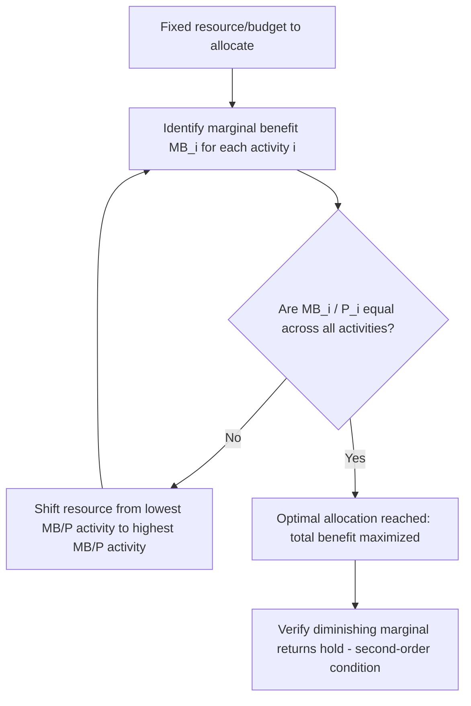

## The Equimarginal Principle

### Definition and Core Concept

The equimarginal principle is a decision rule in managerial economics stating that a decision-maker allocating a limited resource across multiple activities achieves an optimal (utility-maximizing or profit-maximizing) allocation when the marginal benefit per unit of resource spent is equal across all activities. In other words, resources should be distributed such that the last unit allocated to each activity yields the same marginal return.

Formally, for a resource allocated across $n$ activities, the optimal allocation satisfies:

$$\frac{MU_1}{P_1} = \frac{MU_2}{P_2} = \cdots = \frac{MU_n}{P_n}$$

where $MU_i$ is the marginal utility (or marginal benefit) derived from activity $i$, and $P_i$ is the price or marginal cost of allocating one more unit of the resource to activity $i$.

This principle is also known as the "law of equimarginal returns" or the "principle of substitution." It generalizes the logic behind consumer equilibrium (equating marginal utility per dollar across goods) to any managerial context involving the allocation of a scarce input — capital, labor, advertising budget, raw materials, or managerial time — across competing uses.

### Underlying Logic

The reasoning follows from marginal analysis. If the marginal benefit per unit of resource in activity A exceeds that in activity B, then transferring a unit of resource from B to A increases total benefit — the loss from B is smaller than the gain in A. This transfer should continue until the marginal benefit per unit is equalized across all activities. At that point, no reallocation can increase total benefit; any further shift would raise benefit in one area only at a greater cost in another. This equalization condition is the first-order condition for an interior constrained optimum.

### Mathematical Derivation

Consider a firm with a fixed budget $B$ to allocate across $n$ activities, each with an output or benefit function $f_i(x_i)$, where $x_i$ is the resource allocated to activity $i$. The optimization problem is:

$$\max \sum_{i=1}^{n} f_i(x_i) \quad \text{subject to} \quad \sum_{i=1}^{n} P_i x_i = B$$

Setting up the Lagrangian:

$$L = \sum_{i=1}^{n} f_i(x_i) - \lambda \left( \sum_{i=1}^{n} P_i x_i - B \right)$$

Taking first-order conditions with respect to each $x_i$:

$$\frac{\partial f_i}{\partial x_i} = \lambda P_i \quad \Rightarrow \quad \frac{f_i'(x_i)}{P_i} = \lambda \quad \text{for all } i$$

Since $\lambda$ (the shadow price of the budget constraint, representing the marginal benefit of relaxing the constraint by one unit) is the same for every activity at the optimum, this yields:

$$\frac{f_1'(x_1)}{P_1} = \frac{f_2'(x_2)}{P_2} = \cdots = \frac{f_n'(x_n)}{P_n} = \lambda$$

This confirms the equimarginal condition emerges directly from constrained optimization.

### Second-Order Condition

For the interior solution to represent a maximum (not a minimum or saddle point), each $f_i$ must be concave over the relevant range, i.e., $f_i''(x_i) < 0$ — diminishing marginal returns must hold in every activity. If any activity exhibits increasing marginal returns throughout, the optimum may lie at a corner (all resources in one activity) rather than satisfying the equimarginal condition at an interior point. [Inference: this corner-solution caveat depends on the specific curvature of each $f_i$ and is a standard result in constrained optimization theory rather than a universal guarantee.]

### Applications in Managerial Economics

**Allocation of Advertising Budget**

A firm dividing an advertising budget across media channels (television, digital, print) should allocate spending such that the marginal revenue generated per dollar spent is equal across channels. If digital advertising yields higher marginal revenue per dollar than television, funds should shift from television to digital until the returns equalize.

**Allocation of Labor Across Departments or Tasks**

A manager assigning a fixed number of labor hours across production lines should assign hours such that the marginal product per unit of labor cost is equal across lines, maximizing total output for the given labor budget.

**Capital Budgeting and Investment Allocation**

When a firm has a fixed capital budget to distribute across multiple projects, the equimarginal principle implies funds should be allocated such that the marginal rate of return per dollar invested is equalized across projects, subject to each project's risk-adjusted return profile.

**Consumer Behavior (Utility Maximization)**

Although this chapter frames the principle managerially, its classical origin is consumer theory: a consumer with fixed income allocates spending across goods $X$ and $Y$ such that:

$$\frac{MU_X}{P_X} = \frac{MU_Y}{P_Y}$$

This is the consumer-side analogue that managerial applications generalize.

### Worked Example

**Scenario**: A firm has a budget of $10,000 to allocate between two marketing channels, A and B. The marginal revenue product (MRP) schedules are:

| Units of $1,000 | MRP from Channel A | MRP from Channel B |
| --- | --- | --- |
| 1st | $2,200 | $2,000 |
| 2nd | $1,900 | $1,700 |
| 3rd | $1,600 | $1,400 |
| 4th | $1,300 | $1,100 |
| 5th | $1,000 | $800 |
| 6th | $700 | $500 |

**Step 1**: Rank all units by MRP regardless of channel, and allocate the budget to the ten highest-MRP units (since the total budget is 10 units of $1,000).

**Step 2**: Sorting all twelve possible units by MRP in descending order:

2200 (A1), 2000 (B1), 1900 (A2), 1700 (B2), 1600 (A3), 1400 (B3), 1300 (A4), 1100 (B4), 1000 (A5), 800 (B5), 700 (A6), 500 (B6).

**Step 3**: Selecting the top 10 units: A1–A5 (5 units) and B1–B5 (5 units) are selected, since these are the ten highest MRP values (down to and including 800). The next units, A6 (700) and B6 (500), are excluded.

**Result**: The optimal allocation is $5,000 to Channel A and $5,000 to Channel B. At this allocation, the marginal return on the last dollar spent in A ($1,000, from the 5th unit) is close to the marginal return on the last dollar spent in B ($800, from the 5th unit) — the equalization is approximate here due to the discrete (lumpy) nature of the $1,000 increments; with continuous divisibility, the two marginal returns would equalize exactly.

**Key Points**

- The equimarginal principle directs resources toward whichever activity currently offers the highest marginal return, continuing until returns equalize.
- With discrete/lumpy inputs, exact equalization may not be achievable; the closest feasible allocation is chosen instead.
- The principle assumes diminishing marginal returns in each activity, which is why continually shifting resources toward a single activity is self-correcting — that activity's marginal return falls as more resource is committed to it.

### Diagrammatic Representation

The following diagram illustrates two marginal benefit curves for Activities A and B, both plotted against the amount of resource allocated. The optimal split occurs where a common horizontal line (equal marginal benefit) intersects both curves, and the resource amounts sum to the total budget.

<svg xmlns="http://www.w3.org/2000/svg" viewBox="0 0 700 420">
<text x="350" y="25" text-anchor="middle" font-size="16" font-weight="bold" fill="#1a1a1a">Equimarginal Principle: Optimal Resource Split (svg_diagram)</text>

<line x1="60" y1="350" x2="60" y2="60" stroke="#333" stroke-width="1.5" />
<line x1="60" y1="350" x2="320" y2="350" stroke="#333" stroke-width="1.5" />
<text x="190" y="385" text-anchor="middle" font-size="13" fill="#333">Resource to Activity A →</text>
<text x="35" y="200" text-anchor="middle" font-size="13" fill="#333" transform="rotate(-90 35 200)">Marginal Benefit (A)</text>

<path d="M 70 90 Q 150 150, 300 320" fill="none" stroke="#2563eb" stroke-width="2.5" />
<text x="230" y="150" font-size="12" fill="#2563eb">MB_A curve</text>

<line x1="640" y1="350" x2="640" y2="60" stroke="#333" stroke-width="1.5" />
<line x1="640" y1="350" x2="380" y2="350" stroke="#333" stroke-width="1.5" />
<text x="510" y="385" text-anchor="middle" font-size="13" fill="#333">← Resource to Activity B</text>
<text x="665" y="200" text-anchor="middle" font-size="13" fill="#333" transform="rotate(90 665 200)">Marginal Benefit (B)</text>

<path d="M 630 90 Q 550 150, 400 320" fill="none" stroke="#dc2626" stroke-width="2.5" />
<text x="440" y="150" font-size="12" fill="#dc2626">MB_B curve</text>

<line x1="60" y1="220" x2="640" y2="220" stroke="#16a34a" stroke-width="1.5" stroke-dasharray="6,4" />
<text x="350" y="212" text-anchor="middle" font-size="12" fill="#16a34a">Equal marginal benefit level (λ)</text>

<circle cx="205" cy="220" r="5" fill="#2563eb" />
<circle cx="470" cy="220" r="5" fill="#dc2626" />

<line x1="205" y1="220" x2="205" y2="350" stroke="#2563eb" stroke-width="1" stroke-dasharray="3,3" />
<line x1="470" y1="220" x2="470" y2="350" stroke="#dc2626" stroke-width="1" stroke-dasharray="3,3" />

<text x="205" y="365" text-anchor="middle" font-size="11" fill="`#2563eb`">x_A*</text>

<text x="470" y="365" text-anchor="middle" font-size="11" fill="`#dc2626`">x_B*</text>

<text x="350" y="410" text-anchor="middle" font-size="12" fill="#555">x_A* + x_B* = Total Budget (fixed resource constraint)</text>

</svg>

### Decision Process Flow

### Limitations and Practical Considerations

**Divisibility Assumption**: The principle assumes resources are perfectly divisible, allowing marginal quantities to be shifted continuously. In practice, many resources (machines, employees, discrete budget tranches) are lumpy, meaning exact equalization is often infeasible; managers instead approximate the condition, as shown in the worked example above.

**Measurement Difficulty**: Marginal benefit is often difficult to measure precisely in real business settings, particularly for activities like brand-building advertising or R&D, where returns are uncertain, delayed, or non-linear. [Inference: this limitation is widely cited in applied managerial economics texts as a practical, rather than theoretical, weakness of the principle.]

**Static Framework**: The principle typically describes an optimum at a point in time. It does not inherently account for dynamic considerations such as how current allocation affects future marginal benefit curves (e.g., learning effects, market saturation, or diminishing novelty in advertising).

**Interdependence Across Activities**: The principle assumes each activity's marginal benefit is independent of allocations to other activities. When activities are complementary or substitutable (e.g., advertising in one channel amplifying effectiveness in another), the simple equalization rule requires modification to account for cross-effects. [Inference: the treatment of interdependent marginal benefits is an extension found in more advanced treatments and is not part of the basic equimarginal formulation.]

**Behavior may vary** across firms and contexts depending on how marginal benefit is defined, measured, and whether managers have access to accurate marginal data in real time.

### Relationship to Other Managerial Economics Concepts

- **Law of Diminishing Marginal Returns**: The equimarginal principle relies on this law to ensure a stable, well-defined interior optimum.
- **Opportunity Cost**: Reallocating resources under this principle is fundamentally about recognizing the opportunity cost of using a resource in one activity rather than another.
- **Marginal Analysis**: The equimarginal principle is a direct extension of marginal analysis to multi-activity resource allocation problems.
- **Shadow Price / Lagrange Multiplier ($\lambda$)**: In the constrained optimization formulation, $\lambda$ represents the common marginal value of the resource across all uses — effectively the "price" of the constraint itself.

**Related Topics**

- Law of diminishing marginal utility and marginal returns
- Marginal analysis and marginal cost–marginal revenue decision rules
- Constrained optimization and Lagrangian methods in economics
- Capital budgeting techniques (NPV, IRR) and resource allocation
- Opportunity cost and scarcity in managerial decision-making
- Producer theory: optimal input combination (isoquants and isocost lines)
- Consumer equilibrium and utility maximization theory