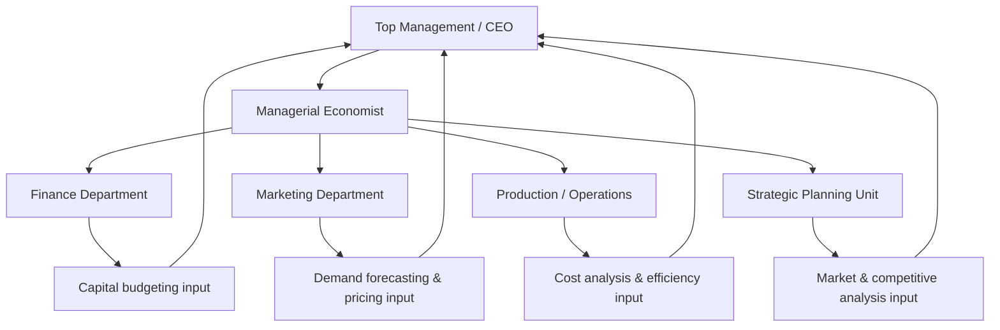

## Role and Responsibilities of the Managerial Economist

### Definition and Scope

A managerial economist is a professional who applies economic theory, quantitative methods, and analytical tools to solve practical business decision-making problems within an organization. The managerial economist serves as a bridge between abstract economic theory and concrete managerial decisions, translating concepts such as demand, cost, market structure, and risk into actionable business intelligence.

The role is inherently interdisciplinary, drawing on microeconomics, macroeconomics, statistics, econometrics, operations research, and financial analysis, and applying them to functions such as pricing, forecasting, investment appraisal, and strategic planning.

### Core Functions

**Demand Estimation and Forecasting**

The managerial economist estimates current and future demand for the firm's products or services using historical data, market surveys, and econometric models. Forecasting supports decisions on production scheduling, inventory management, capacity planning, and revenue projection.

**Cost Analysis and Control**

This involves analyzing short-run and long-run cost behavior, identifying fixed versus variable costs, estimating cost functions, and determining the most efficient scale of operation. The economist helps management understand cost-volume-profit relationships and break-even points.

**Pricing Policy and Practices**

The managerial economist advises on pricing strategy by analyzing price elasticity of demand, competitor pricing, cost structures, and market conditions. This includes recommending pricing models such as cost-plus pricing, value-based pricing, price discrimination, or dynamic pricing where applicable.

**Profit Planning and Analysis**

The economist analyzes historical and projected profit trends, identifies factors affecting profitability, and assists in setting profit targets. This includes break-even analysis and sensitivity analysis under varying assumptions about costs, prices, and volumes.

**Capital Budgeting and Investment Decisions**

The managerial economist evaluates investment proposals using techniques such as net present value (NPV), internal rate of return (IRR), and payback period, incorporating the time value of money and risk assessment into capital allocation decisions.

**Market Research and Competitive Analysis**

This function involves studying market structure, competitor behavior, industry trends, and consumer preferences to inform strategic decisions such as market entry, product differentiation, and competitive positioning.

**Risk and Uncertainty Analysis**

The managerial economist evaluates the impact of uncertainty on business decisions, employing tools such as probability analysis, decision trees, sensitivity analysis, and scenario planning to quantify and manage risk exposure.

**Economic Environment Analysis**

The economist monitors macroeconomic indicators (inflation, interest rates, exchange rates, GDP growth, fiscal and monetary policy) and assesses their implications for the firm's operations, supply chains, and strategic planning.

**Advising on Government Policy and Regulation**

The managerial economist interprets the impact of government regulations, trade policy, taxation, and industry-specific legislation on the firm, and may represent the firm's interests in regulatory or policy discussions.

### Key Points

- The managerial economist's core value lies in converting economic theory and data into actionable recommendations for management.
- Functions span short-term operational decisions (pricing, cost control) and long-term strategic decisions (capital budgeting, market entry).
- The role requires close collaboration with other departments — finance, marketing, operations, and top management — since economic analysis informs decisions across the organization.

### Required Skills and Competencies

| Skill Category | Specific Competencies |
| --- | --- |
| Analytical | Statistical analysis, econometrics, data interpretation |
| Technical | Proficiency in forecasting models, spreadsheet/statistical software, financial modeling |
| Conceptual | Strong grounding in micro- and macroeconomic theory |
| Communication | Ability to translate technical analysis into clear recommendations for non-specialist management |
| Business Acumen | Understanding of the firm's industry, competitive environment, and strategic objectives |
| Judgment | Capacity to make decisions under incomplete information and uncertainty |

### Relationship to Traditional Economic Theory

Traditional economic theory often relies on simplifying assumptions (perfect information, profit maximization as the sole objective, static equilibrium conditions) that do not fully capture the complexity of real business environments. The managerial economist's responsibility includes adapting these theoretical models to real-world constraints such as imperfect information, multiple organizational objectives, dynamic competition, and behavioral factors affecting decision-making. This adaptation process is often referred to as "bridging the gap" between economic theory and business practice.

### Position Within the Organization

The managerial economist typically functions in a staff/advisory capacity rather than a line management role, providing analytical support to decision-makers across departments while reporting findings and recommendations to senior management.

### Decision-Making Process Supported by the Managerial Economist

### Example: Application in a Pricing Decision

**Scenario**: A firm is considering a price increase for its flagship product.

**Managerial Economist's Process**:

1. Estimate the price elasticity of demand using historical sales and price data.
2. Analyze competitor pricing and potential competitive response.
3. Project the effect of the price change on total revenue, using $\%\Delta Q = E_d \times \%\Delta P$ to estimate the quantity response.
4. Assess cost implications, including whether cost structure changes (e.g., input cost inflation) justify the price adjustment.
5. Incorporate macroeconomic context, such as current inflation and consumer purchasing power trends.
6. Present a recommendation to management, including a sensitivity analysis showing outcomes under optimistic, base, and pessimistic elasticity assumptions.

**Output**: A report recommending either the price increase, a smaller incremental adjustment, or maintaining current price, supported by quantitative projections of revenue and profit impact.

### Distinction from a General Economist

| Aspect | General/Academic Economist | Managerial Economist |
| --- | --- | --- |
| Primary Focus | Theoretical and empirical understanding of economic phenomena | Application of economic principles to firm-specific decisions |
| Audience | Academic community, policymakers, general public | Firm management and internal stakeholders |
| Time Horizon | Often long-term, generalizable findings | Often short-to-medium term, decision-specific |
| Success Metric | Contribution to economic knowledge, publication | Improved firm decisions, measurable business outcomes |

### Limitations and Challenges of the Role

**Data Quality and Availability**: The managerial economist's analysis is only as reliable as the underlying data; incomplete, delayed, or noisy data can constrain forecast accuracy and recommendation quality.

**Multiple and Conflicting Objectives**: Firms often pursue objectives beyond pure profit maximization (market share growth, sustainability targets, employee welfare), complicating the economist's models, which frequently assume a single optimization objective.

**Uncertainty in Forecasting**: Economic forecasts are inherently subject to error due to unforeseen changes in market conditions, competitor behavior, and macroeconomic shocks. [Inference: the degree of forecast error varies substantially by industry volatility and data quality, and is not a fixed or quantifiable constant across contexts.]

**Organizational Influence**: The managerial economist's recommendations must often compete with political, behavioral, and non-economic considerations within the organization, meaning technically sound recommendations are not always adopted as presented. **Behavior may vary** depending on organizational culture and the decision-making authority granted to the analytical function.

**Related Topics**

- Nature and scope of managerial economics
- Demand analysis and elasticity of demand
- Cost theory and cost-output relationships
- Profit maximization theories vs. alternative theories of the firm (e.g., sales maximization, satisficing behavior)
- Capital budgeting techniques and investment appraisal
- Risk analysis: decision trees, sensitivity analysis, and scenario planning
- Macroeconomic environment and its impact on business decisions
- Managerial economics vs. microeconomics: distinctions and overlaps