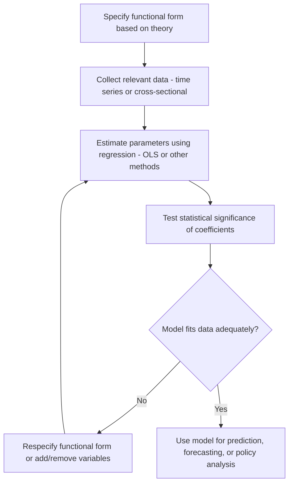

## Functional Relationships and Economic Models

### Definition and Purpose

A functional relationship is a mathematical expression describing how one variable (the dependent variable) changes in response to changes in one or more other variables (the independent variables). In managerial economics, functional relationships form the building blocks of economic models — simplified representations of real-world economic phenomena used to analyze, predict, and support decision-making.

An economic model abstracts away non-essential details of a real-world system to focus on the relationships between key variables relevant to a specific decision or question. Models allow managers and economists to derive testable predictions, quantify trade-offs, and simulate the effects of changes in controllable and uncontrollable variables.

### General Form of a Functional Relationship

A functional relationship is generally expressed as:

$$Y = f(X_1, X_2, \ldots, X_n)$$

where $Y$ is the dependent variable and $X_1, X_2, \ldots, X_n$ are independent (explanatory) variables. The function $f$ specifies the precise mathematical rule linking inputs to the output.

**Example**: A demand function may be written as:

$$Q_d = f(P, P_s, P_c, Y, T, A)$$

where $Q_d$ is quantity demanded, $P$ is the product's own price, $P_s$ is the price of substitutes, $P_c$ is the price of complements, $Y$ is consumer income, $T$ represents consumer tastes/preferences, and $A$ is advertising expenditure.

### Types of Functional Relationships

**Linear Functions**

A linear function takes the form:

$$Y = a + bX$$

where $a$ is the intercept (value of $Y$ when $X = 0$) and $b$ is the slope, representing the constant rate of change of $Y$ with respect to $X$. Linear functions are widely used for their simplicity and ease of estimation, though they assume a constant marginal effect, which may not hold across the entire range of $X$.

**Example**: A simple total cost function $TC = 500 + 10Q$, where $500 is fixed cost and $10 is the constant marginal cost per unit $Q$.

**Non-Linear Functions**

Non-linear functions capture relationships where the rate of change of $Y$ with respect to $X$ varies. Common forms in managerial economics include:

- **Quadratic functions**: $Y = a + bX + cX^2$, often used to model total cost or total revenue curves that first rise, then change curvature (e.g., reflecting diminishing marginal returns).
- **Cubic functions**: $Y = a + bX + cX^2 + dX^3$, commonly used to represent short-run total cost curves that capture increasing returns, then diminishing returns, then increasing costs at high output levels.
- **Power functions**: $Y = aX^b$, frequently used in production functions (e.g., Cobb-Douglas) and demand functions with constant elasticity.
- **Exponential functions**: $Y = ae^{bX}$, used to model growth processes such as compound interest, market growth, or the diffusion of new products.

**Example (Cubic Total Cost Function)**:

$$TC = 200 + 40Q - 5Q^2 + 0.5Q^3$$

This form allows the marginal cost curve derived from it to exhibit the classic U-shape observed in short-run production theory.

### Multivariate Functional Relationships

Many economic relationships depend on more than one independent variable simultaneously. The **Cobb-Douglas production function** is a canonical example:

$$Q = A L^{\alpha} K^{\beta}$$

where $Q$ is output, $L$ is labor input, $K$ is capital input, $A$ is total factor productivity, and $\alpha$, $\beta$ are output elasticities of labor and capital respectively. This functional form is popular because the exponents $\alpha$ and $\beta$ directly represent elasticities, and the function can model constant, increasing, or decreasing returns to scale depending on whether $\alpha + \beta$ equals, exceeds, or falls short of 1.

### Types of Economic Models

**Deterministic Models**

These models assume no randomness — a given set of inputs produces exactly one predictable output. Most introductory managerial economics models (basic demand, cost, and production functions) are deterministic for simplicity of analysis.

**Stochastic (Probabilistic) Models**

These incorporate uncertainty by including random error terms or probability distributions. A stochastic demand function might be written as:

$$Q_d = f(P, Y, \ldots) + \varepsilon$$

where $\varepsilon$ represents random disturbances (e.g., unpredictable shifts in consumer taste) not captured by the systematic component of the model. Regression-based econometric models are typically stochastic.

**Static Models**

Static models represent relationships at a single point in time, without regard to the path or speed of adjustment — e.g., a demand curve capturing quantity demanded at current prices and income.

**Dynamic Models**

Dynamic models incorporate the element of time explicitly, showing how variables adjust over multiple periods. Examples include the cobweb model of price adjustment in agricultural markets, and time-series forecasting models that use lagged variables.

**Optimization Models**

These models are structured to find the value(s) of decision variables that maximize or minimize an objective function, subject to constraints — e.g., profit maximization subject to a production capacity constraint, formulated as:

$$\max \pi = TR(Q) - TC(Q) \quad \text{subject to} \quad Q \leq \bar{Q}$$

### Key Points

- Functional relationships express how a dependent variable responds to one or more independent variables, forming the mathematical core of economic models.
- The choice of functional form (linear, quadratic, cubic, power, exponential) affects the shape of derived curves (marginal cost, marginal product, marginal revenue) and should match the underlying economic behavior being modeled.
- Economic models simplify reality by isolating the variables most relevant to a specific decision, deliberately excluding less relevant factors to maintain analytical tractability.

### Diagrammatic Illustration of Common Functional Forms

The following diagram compares the shapes of a linear, quadratic, and cubic total cost curve as functions of output $Q$.

<svg xmlns="http://www.w3.org/2000/svg" viewBox="0 0 700 420">
<text x="350" y="25" text-anchor="middle" font-size="16" font-weight="bold" fill="#1a1a1a">Common Functional Forms: Total Cost Curves (svg_diagram)</text>
<line x1="70" y1="370" x2="70" y2="60" stroke="#333" stroke-width="1.5" />
<line x1="70" y1="370" x2="640" y2="370" stroke="#333" stroke-width="1.5" />
<text x="355" y="400" text-anchor="middle" font-size="13" fill="#333">Output (Q)</text>
<text x="35" y="220" text-anchor="middle" font-size="13" fill="#333" transform="rotate(-90 35 220)">Total Cost (TC)</text>

<line x1="80" y1="330" x2="600" y2="120" stroke="#2563eb" stroke-width="2.5" />
<text x="500" y="140" font-size="12" fill="#2563eb">Linear: TC = a + bQ</text>

<path d="M 80 340 Q 350 260, 600 90" fill="none" stroke="#dc2626" stroke-width="2.5" />
<text x="480" y="105" font-size="12" fill="#dc2626">Quadratic: TC = a + bQ + cQ²</text>

<path d="M 80 350 C 200 280, 250 220, 350 210 C 450 200, 500 150, 600 70" fill="none" stroke="#16a34a" stroke-width="2.5" />
<text x="420" y="230" font-size="12" fill="#16a34a">Cubic: TC = a + bQ + cQ² + dQ³</text>
</svg>

### Estimation of Functional Relationships

Functional relationships used in managerial decision-making are typically estimated empirically using regression analysis. The general process involves:

### Example: Estimating and Applying a Demand Function

**Scenario**: A firm collects historical data on quantity sold ($Q$), price ($P$), and consumer income ($Y$), and estimates the following linear demand function using regression:

$$Q = 500 - 4P + 0.02Y$$

**Interpretation**:

- The intercept term (embedded in 500) reflects quantity demanded attributable to factors other than price and income at baseline levels.
- The coefficient $-4$ on $P$ indicates that, holding income constant, a $1 increase in price is associated with a decrease of 4 units in quantity demanded.
- The coefficient $0.02$ on $Y$ indicates that, holding price constant, a $1 increase in income is associated with a 0.02-unit increase in quantity demanded, suggesting the good is a normal good.

**Application**: If price is set at $50 and income is $40,000:

$$Q = 500 - 4(50) + 0.02(40000) = 500 - 200 + 800 = 1100 \text{ units}$$

This estimated functional relationship allows the firm to simulate the effect of alternative pricing or respond to anticipated changes in consumer income.

### Assumptions and Limitations of Functional Relationships in Models

**Ceteris Paribus Assumption**: Functional relationships typically hold other variables constant when examining the effect of one variable, which may not reflect real-world conditions where multiple variables change simultaneously.

**Parameter Stability**: Models assume that estimated parameters (slopes, elasticities) remain stable over the period of application; in reality, structural changes in the market (new competitors, regulatory shifts, technological disruption) can cause parameters to shift. [Inference: the degree and speed of such parameter drift is context-dependent and cannot be generalized across all markets or time horizons.]

**Correct Functional Form Specification**: Choosing an inappropriate functional form (e.g., using a linear model where the true relationship is non-linear) can produce biased or misleading predictions, particularly outside the range of observed data (extrapolation risk).

**Behavior may vary** in real-world applications depending on data quality, sample size, and the presence of confounding variables not included in the specified model.

### Distinction Between Functional Relationships and Full Economic Models

| Aspect | Functional Relationship | Economic Model |
| --- | --- | --- |
| Scope | A single mathematical equation linking variables | A broader analytical framework, potentially comprising multiple functional relationships, assumptions, and constraints |
| Purpose | Quantifies a specific input-output relationship | Represents an entire economic system or decision problem |
| Example | $TC = a + bQ$ | A full profit-maximization model combining demand, cost, and revenue functions with an optimization objective |

**Related Topics**

- Demand functions and elasticity concepts
- Production functions: Cobb-Douglas and returns to scale
- Cost functions: short-run and long-run cost curves
- Regression analysis and estimation techniques (OLS, multiple regression)
- Optimization techniques: unconstrained and constrained optimization
- Marginal analysis derived from functional relationships (marginal cost, marginal revenue, marginal product)
- Model assumptions: ceteris paribus, linearity, and specification error