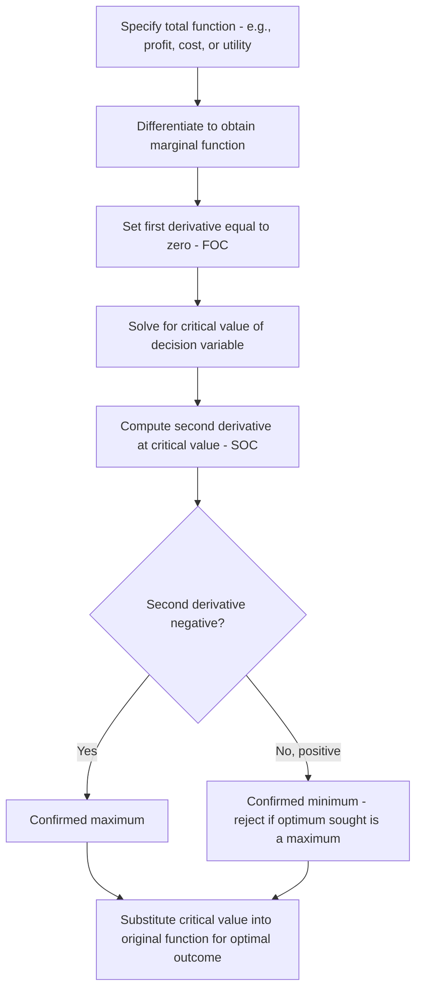

## Marginal Analysis Using Differential Calculus

### Definition and Purpose

Marginal analysis is a quantitative technique that examines the effect of a small (marginal) change in one economic variable on another, typically to identify optimal decisions such as profit maximization, cost minimization, or optimal resource allocation. Differential calculus provides the mathematical machinery for marginal analysis: the derivative of a function measures the instantaneous rate of change of the dependent variable with respect to the independent variable, which corresponds precisely to the economic concept of a "marginal" quantity.

Formally, if $Y = f(X)$, the marginal value of $Y$ with respect to $X$ is:

$$\text{Marginal } Y = \frac{dY}{dX} = f'(X)$$

This derivative represents the approximate change in $Y$ resulting from a one-unit increase in $X$, evaluated at a specific point.

### Core Marginal Concepts and Their Derivatives

**Marginal Cost (MC)**

Given a total cost function $TC = f(Q)$, marginal cost is:

$$MC = \frac{d(TC)}{dQ}$$

**Marginal Revenue (MR)**

Given a total revenue function $TR = f(Q)$, marginal revenue is:

$$MR = \frac{d(TR)}{dQ}$$

**Marginal Product (MP)**

Given a production function $Q = f(L)$ (output as a function of labor), marginal product of labor is:

$$MP_L = \frac{dQ}{dL}$$

**Marginal Utility (MU)**

Given a utility function $U = f(X)$, marginal utility is:

$$MU = \frac{dU}{dX}$$

### First-Order Condition for Optimization

The central application of differential calculus in managerial economics is finding the values of decision variables (e.g., output level $Q$) that maximize or minimize an objective function (e.g., profit $\pi$). The first-order condition (FOC) for an interior optimum requires setting the first derivative equal to zero:

$$\frac{d\pi}{dQ} = 0$$

**Profit Maximization Example**

Given total revenue $TR(Q)$ and total cost $TC(Q)$, profit is:

$$\pi(Q) = TR(Q) - TC(Q)$$

Differentiating and setting equal to zero:

$$\frac{d\pi}{dQ} = \frac{d(TR)}{dQ} - \frac{d(TC)}{dQ} = MR - MC = 0$$

This yields the fundamental profit-maximizing condition:

$$MR = MC$$

This confirms, via calculus, the classical economic rule that profit is maximized where marginal revenue equals marginal cost.

### Second-Order Condition

The first-order condition alone identifies a critical point (where the slope is zero), but does not confirm whether that point is a maximum, minimum, or inflection point. The second-order condition (SOC) uses the second derivative to distinguish these cases:

$$\frac{d^2\pi}{dQ^2} < 0 \quad \Rightarrow \quad \text{maximum (concave function at that point)}$$

$$\frac{d^2\pi}{dQ^2} > 0 \quad \Rightarrow \quad \text{minimum (convex function at that point)}$$

In profit-maximization terms, the second-order condition requires:

$$\frac{d(MC)}{dQ} > \frac{d(MR)}{dQ}$$

meaning marginal cost must be rising relative to marginal revenue at the point where $MR = MC$ — i.e., marginal cost must cut marginal revenue from below on a standard MR/MC diagram.

### Worked Example: Profit Maximization

**Given**:

$$TR(Q) = 100Q - 2Q^2$$

$$TC(Q) = Q^3 - 8Q^2 + 60Q + 30$$

**Step 1**: Form the profit function.

$$\pi(Q) = TR(Q) - TC(Q) = (100Q - 2Q^2) - (Q^3 - 8Q^2 + 60Q + 30)$$

$$\pi(Q) = -Q^3 + 6Q^2 + 40Q - 30$$

**Step 2**: Apply the first-order condition.

$$\frac{d\pi}{dQ} = -3Q^2 + 12Q + 40 = 0$$

Solving this quadratic using the quadratic formula:

$$Q = \frac{-12 \pm \sqrt{144 - 4(-3)(40)}}{2(-3)} = \frac{-12 \pm \sqrt{624}}{-6}$$

$$Q = \frac{-12 \pm 24.98}{-6}$$

This yields two critical values: $Q \approx -2.16$ (economically infeasible, discarded since output cannot be negative) and $Q \approx 6.16$.

**Step 3**: Apply the second-order condition.

$$\frac{d^2\pi}{dQ^2} = -6Q + 12$$

At $Q \approx 6.16$:

$$\frac{d^2\pi}{dQ^2} = -6(6.16) + 12 = -36.96 + 12 = -24.96 < 0$$

Since the second derivative is negative, $Q \approx 6.16$ is confirmed as a profit-maximizing output level (a maximum, not a minimum).

**Step 4**: Calculate maximum profit by substituting $Q \approx 6.16$ back into $\pi(Q)$.

$$\pi(6.16) = -(6.16)^3 + 6(6.16)^2 + 40(6.16) - 30 \approx -233.7 + 227.7 + 246.4 - 30 \approx 210.4$$

**Result**: The firm maximizes profit at approximately $Q = 6.16$ units, yielding maximum profit of approximately $210.40.

### Key Points

- The derivative of a total function (total cost, total revenue, total utility, total product) yields the corresponding marginal function.
- The first-order condition (setting the derivative to zero) identifies candidate optimal points; the second-order condition (sign of the second derivative) confirms whether the point is a maximum or minimum.
- The classical rule $MR = MC$ for profit maximization is a direct application of the first-order condition in calculus-based marginal analysis.

### Partial Derivatives in Multivariable Marginal Analysis

When a function depends on more than one variable, partial derivatives isolate the marginal effect of one variable while holding others constant. For a production function $Q = f(L, K)$:

$$MP_L = \frac{\partial Q}{\partial L} \quad \text{(holding } K \text{ constant)}$$

$$MP_K = \frac{\partial Q}{\partial K} \quad \text{(holding } L \text{ constant)}$$

Partial derivatives are essential for constrained optimization problems involving multiple decision variables, such as determining the cost-minimizing combination of labor and capital for a given output level.

### Diagrammatic Illustration: MR, MC, and Profit Maximization

The following diagram shows the relationship between total profit and its derivative-based marginal conditions.

<svg xmlns="http://www.w3.org/2000/svg" viewBox="0 0 700 420">
<text x="350" y="25" text-anchor="middle" font-size="16" font-weight="bold" fill="#1a1a1a">Marginal Analysis: MR = MC Optimum (svg_diagram)</text>
<line x1="70" y1="370" x2="70" y2="60" stroke="#333" stroke-width="1.5" />
<line x1="70" y1="370" x2="640" y2="370" stroke="#333" stroke-width="1.5" />
<text x="355" y="400" text-anchor="middle" font-size="13" fill="#333">Output (Q)</text>
<text x="35" y="220" text-anchor="middle" font-size="13" fill="#333" transform="rotate(-90 35 220)">Marginal Revenue / Marginal Cost</text>

<line x1="90" y1="120" x2="600" y2="300" stroke="#2563eb" stroke-width="2.5" />
<text x="480" y="270" font-size="12" fill="#2563eb">MR</text>

<path d="M 90 300 Q 300 150, 420 180 Q 500 200, 600 100" fill="none" stroke="#dc2626" stroke-width="2.5" />
<text x="560" y="90" font-size="12" fill="#dc2626">MC</text>

<circle cx="420" cy="180" r="6" fill="#16a34a" />
<line x1="420" y1="180" x2="420" y2="370" stroke="#16a34a" stroke-width="1" stroke-dasharray="4,4" />
<text x="420" y="390" text-anchor="middle" font-size="12" fill="#16a34a">Q* (MR = MC)</text>
</svg>

### Elasticity via Calculus

Point elasticity of demand, a key managerial economics concept, is computed using the derivative rather than discrete percentage changes:

$$E_d = \frac{dQ}{dP} \cdot \frac{P}{Q}$$

This calculus-based formula gives the elasticity at an exact point on the demand curve, in contrast to arc elasticity, which measures elasticity over a discrete interval using average values.

### Optimization Process Flow

### Applications Beyond Profit Maximization

**Cost Minimization**: Differential calculus identifies the output level or input combination that minimizes total or average cost, using the first-order condition $\frac{d(AC)}{dQ} = 0$ to locate the minimum point of the average cost curve.

**Inventory Optimization**: Calculus-based marginal analysis underlies models such as the Economic Order Quantity (EOQ), which minimizes total inventory cost (holding cost plus ordering cost) by setting the derivative of total inventory cost with respect to order quantity to zero.

**Utility Maximization Subject to a Budget Constraint**: Constrained optimization using Lagrange multipliers (an extension of basic differentiation) identifies the consumption bundle that maximizes utility subject to a budget constraint, yielding the equimarginal condition $\frac{MU_X}{P_X} = \frac{MU_Y}{P_Y}$.

### Assumptions and Limitations

**Continuity and Differentiability**: Calculus-based marginal analysis requires that the underlying functions be continuous and differentiable over the relevant range. Many real-world economic relationships (e.g., step-function pricing, lumpy investment decisions) do not satisfy this assumption, requiring alternative discrete optimization methods.

**Single-Valued, Well-Behaved Functions**: The technique assumes a well-defined mathematical relationship between variables; in practice, estimating the precise functional form of cost or revenue functions from real data introduces estimation uncertainty not captured by the pure calculus framework.

**Static, Point-in-Time Analysis**: Standard marginal analysis using derivatives evaluates optimal conditions at a single point in time, without inherently accounting for dynamic adjustment costs, time lags, or intertemporal trade-offs. [Inference: dynamic extensions such as optimal control theory address this limitation but represent a separate, more advanced quantitative tool beyond basic differential calculus.]

**Behavior may vary** in applied settings depending on how accurately the estimated functional forms (total cost, total revenue) reflect actual firm-level cost and demand structures.

**Related Topics**

- Functional relationships and economic models
- Elasticity of demand and supply: point vs. arc elasticity
- Constrained optimization and Lagrange multipliers
- Cost functions and the derivation of marginal and average cost curves
- Revenue functions under different market structures (perfect competition, monopoly)
- Economic Order Quantity (EOQ) and inventory management
- The equimarginal principle and its calculus-based derivation