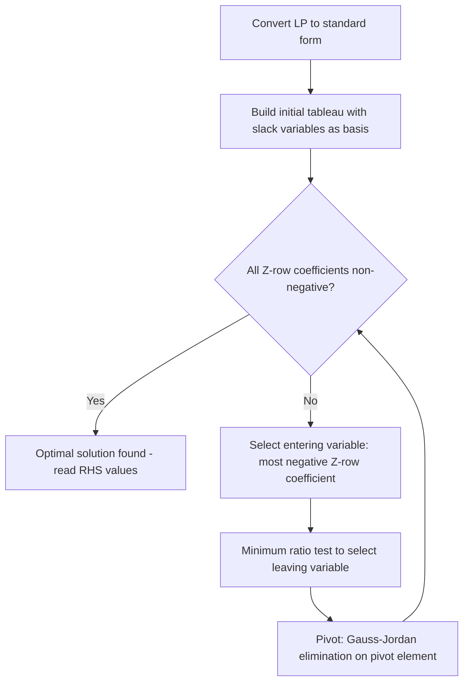

## The Simplex Method and Duality in Linear Programming

### Purpose and Scope

The simplex method is an algebraic algorithm for solving linear programming (LP) problems with any number of decision variables, overcoming the two-variable limitation of the graphical method. Duality theory provides a complementary LP formulation — the **dual problem** — associated with every LP (the **primal problem**), offering economic interpretation of resource scarcity through shadow prices.

### Standard Form for the Simplex Method

Before applying simplex, an LP must be converted to **standard form**:

1. All constraints expressed as equalities (via slack, surplus, or artificial variables).
2. All decision variables non-negative.
3. The objective function to be maximized (minimization problems are converted by negating the objective, or minimized directly using an adapted rule).

**Converting inequalities:**

- For $\le$ constraints, add a **slack variable** $s_i \ge 0$: $a_1x_1 + a_2x_2 \le b \Rightarrow a_1x_1 + a_2x_2 + s = b$
- For $\ge$ constraints, subtract a **surplus variable** and add an **artificial variable**: $a_1x_1 + a_2x_2 \ge b \Rightarrow a_1x_1 + a_2x_2 - s + A = b$
- For $=$ constraints, add only an artificial variable $A \ge 0$.

Slack/surplus variables have zero coefficients in the objective function; artificial variables are penalized heavily (Big-M method) or eliminated via a two-phase procedure, since they have no real economic meaning.

### Worked Example Setup

$$\text{Maximize } Z = 40x_1 + 30x_2$$

subject to:

$$2x_1 + x_2 \le 100$$

$$x_1 + 2x_2 \le 80$$

$$x_1, x_2 \ge 0$$

**Standard form:**

$$Z - 40x_1 - 30x_2 = 0$$

$$2x_1 + x_2 + s_1 = 100$$

$$x_1 + 2x_2 + s_2 = 80$$

### The Simplex Algorithm — Step by Step

1. **Set up the initial simplex tableau** with the slack variables forming the initial basic feasible solution ($x_1 = x_2 = 0$, $s_1 = 100$, $s_2 = 80$, $Z = 0$).
2. **Test for optimality**: examine the objective row (often called the $Z$-row or indicator row). If all coefficients are non-negative (for a maximization problem written with $Z$ on the left), the solution is optimal; otherwise, continue.
3. **Select the entering variable**: choose the column with the most negative coefficient in the $Z$-row (this variable will increase $Z$ fastest per unit).
4. **Select the leaving variable** using the **minimum ratio test**: for each row with a positive coefficient in the entering column, compute $\frac{\text{RHS}}{\text{coefficient}}$; the row with the smallest non-negative ratio determines the leaving (departing) basic variable. This ratio test prevents any variable from becoming negative.
5. **Pivot**: perform Gauss-Jordan elimination to make the entering variable's column a unit vector (1 in the pivot row, 0 elsewhere), updating all rows including the $Z$-row.
6. **Repeat** steps 2–5 until no negative coefficients remain in the $Z$-row (optimality reached).

### Initial Tableau

| Basis | $x_1$ | $x_2$ | $s_1$ | $s_2$ | RHS |
| --- | --- | --- | --- | --- | --- |
| $Z$ | −40 | −30 | 0 | 0 | 0 |
| $s_1$ | 2 | 1 | 1 | 0 | 100 |
| $s_2$ | 1 | 2 | 0 | 1 | 80 |

**Entering variable**: $x_1$ (most negative coefficient, −40).

**Ratio test**: $100/2 = 50$; $80/1 = 80$. Minimum ratio → $s_1$ leaves.

**Pivot on row $s_1$, column $x_1$** (divide row by 2, then eliminate $x_1$ from other rows):

| Basis | $x_1$ | $x_2$ | $s_1$ | $s_2$ | RHS |
| --- | --- | --- | --- | --- | --- |
| $Z$ | 0 | −10 | 20 | 0 | 2,000 |
| $x_1$ | 1 | 0.5 | 0.5 | 0 | 50 |
| $s_2$ | 0 | 1.5 | −0.5 | 1 | 30 |

**Entering variable**: $x_2$ (only remaining negative coefficient, −10).

**Ratio test**: $50/0.5 = 100$; $30/1.5 = 20$. Minimum ratio → $s_2$ leaves.

**Pivot on row $s_2$, column $x_2$:**

| Basis | $x_1$ | $x_2$ | $s_1$ | $s_2$ | RHS |
| --- | --- | --- | --- | --- | --- |
| $Z$ | 0 | 0 | 16.67 | 6.67 | 2,200 |
| $x_1$ | 1 | 0 | 0.667 | −0.333 | 40 |
| $x_2$ | 0 | 1 | −0.333 | 0.667 | 20 |

All $Z$-row coefficients are now non-negative → **optimal solution reached**: $x_1 = 40$, $x_2 = 20$, $Z = \$2{,}200$ — matching the graphical solution exactly.

### Diagram: Simplex Iteration Flow

### Special Cases in Simplex

- **Degeneracy**: a basic variable equals zero, which can cause cycling (repeated pivoting without improvement); resolved via Bland's rule (smallest-index tie-breaking).
- **Alternative optima**: a non-basic variable has a zero coefficient in the final $Z$-row, indicating multiple optimal solutions exist along an edge or face of the feasible region.
- **Unbounded solution**: during the ratio test, if all coefficients in the entering column are $\le 0$, no leaving variable can be found, indicating the objective can increase indefinitely.
- **Infeasibility**: in the Big-M or two-phase method, if an artificial variable remains positive in the final optimal tableau, the original problem has no feasible solution.

### Duality in Linear Programming

Every LP problem (the **primal**) has an associated **dual problem**, constructed by transposing the roles of constraints and variables. Duality provides an alternative economic interpretation: while the primal answers "how much to produce," the dual answers "what is each scarce resource worth."

**Primal (maximization, ≤ constraints):**

$$\text{Maximize } Z = c_1x_1 + c_2x_2$$

$$\text{s.t. } a_{11}x_1 + a_{12}x_2 \le b_1$$

$$a_{21}x_1 + a_{22}x_2 \le b_2$$

$$x_1, x_2 \ge 0$$

**Dual (minimization, ≥ constraints):**

$$\text{Minimize } W = b_1y_1 + b_2y_2$$

$$\text{s.t. } a_{11}y_1 + a_{21}y_2 \ge c_1$$

$$a_{12}y_1 + a_{22}y_2 \ge c_2$$

$$y_1, y_2 \ge 0$$

**Construction rules:**

| Primal (Max) | Dual (Min) |
| --- | --- |
| One constraint per | One variable |
| One variable per | One constraint |
| Objective coefficients $c_j$ | RHS values |
| RHS values $b_i$ | Objective coefficients |
| Constraint matrix $A$ | Transpose $A^T$ |
| $\le$ constraints | $y_i \ge 0$ |
| $x_j \ge 0$ | $\ge$ constraints |

### Dual of the Worked Example

Primal used labor ($b_1 = 100$) and material ($b_2 = 80$) constraints with profit coefficients 40 and 30.

$$\text{Minimize } W = 100y_1 + 80y_2$$

$$\text{s.t. } 2y_1 + y_2 \ge 40$$

$$y_1 + 2y_2 \ge 30$$

$$y_1, y_2 \ge 0$$

Here, $y_1$ and $y_2$ represent the **shadow prices** (implicit marginal values) of one hour of labor and one unit of raw material, respectively.

### Economic Interpretation of Duality

- **Shadow price**: the dual variable value $y_i^*$ represents the amount by which the optimal objective function $Z$ would improve per one-unit increase in the availability of resource $i$, holding other constraints fixed. It is a marginal valuation, analogous to the marginal product concept in production theory.
- **Complementary Slackness Theorem**: if a primal constraint is non-binding (slack $s_i > 0$) at the optimum, its corresponding dual variable $y_i^* = 0$ (an abundant resource has zero shadow price); conversely, if a dual variable is positive, its primal constraint is binding.
- **Strong Duality Theorem**: at optimality, the primal objective value equals the dual objective value ($Z^* = W^*$). In the worked example, $Z^* = 2{,}200$, and solving the dual (reading directly from the final primal tableau's $Z$-row under the slack columns) gives $y_1^* = 16.67$, $y_2^* = 6.67$, confirming $W^* = 100(16.67) + 80(6.67) = 2{,}200$.
- **Weak Duality Theorem**: for any feasible primal solution and any feasible dual solution, the primal objective value never exceeds the dual objective value (for a max-primal/min-dual pair), establishing the dual as a bound on the primal's optimum.

### Reading the Dual Solution from the Primal's Final Tableau

A practical shortcut: in the optimal simplex tableau of the primal, the values of the dual variables (shadow prices) appear in the $Z$-row under the columns of the original slack variables. In the worked example's final tableau, the $s_1$ column coefficient (16.67) is $y_1^*$ and the $s_2$ column coefficient (6.67) is $y_2^*$ — this avoids re-solving the dual problem from scratch.

### Managerial Applications of Duality

- **Resource pricing decisions**: shadow prices tell a manager the maximum amount worth paying to acquire one additional unit of a scarce resource (e.g., overtime labor, extra raw material).
- **Make-or-buy and outsourcing**: comparing an external price to the internal shadow price of a bottleneck resource informs whether to outsource.
- **Sensitivity analysis**: dual values indicate over what range of resource availability the current optimal basis (and thus shadow price) remains valid, informing capacity expansion decisions.

### Key Points

- The simplex method solves LP problems of any size algebraically, using tableau iterations governed by the entering-variable rule and minimum ratio test.
- Optimality is reached when no further improvement to the objective is possible (non-negative $Z$-row coefficients in a maximization problem).
- Every primal LP has a dual LP; solving one provides the solution structure of the other via strong duality.
- Dual variable values are shadow prices — the marginal economic value of relaxing a binding resource constraint.
- Complementary slackness links binding/non-binding primal constraints to zero/positive dual variables, and vice versa.

### Next Steps

- Sensitivity analysis: ranging of objective coefficients and RHS values
- Two-phase method and Big-M method for handling artificial variables
- Degeneracy and cycling prevention (Bland's rule)
- Integer and mixed-integer programming extensions
- Transportation and assignment problems as specialized LP structures
- Software implementation (Excel Solver, Python PuLP/SciPy linprog) for large-scale LP