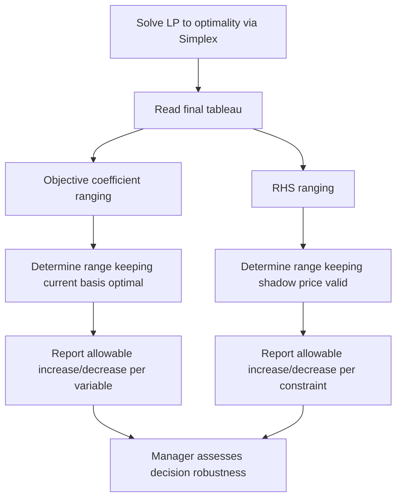

## Sensitivity Analysis in Linear Programming

### Definition and Purpose

Sensitivity analysis (also called post-optimality analysis) examines how the optimal solution of a linear programming (LP) problem changes in response to changes in the model's parameters — objective function coefficients, constraint right-hand-side (RHS) values, or constraint coefficients — without having to re-solve the entire problem from scratch. It answers the managerial question: "How robust is this optimal decision to changes in the underlying data?"

Sensitivity analysis is essential in managerial economics because real-world parameters (prices, costs, resource availability) are estimates, not certainties, and managers need to know how much these estimates can vary before the recommended course of action changes.

### Why Sensitivity Analysis Matters to Managers

- **Parameter uncertainty**: profit margins, costs, and resource availability are forecasts, subject to error.
- **Dynamic environments**: input prices and resource supplies change frequently; managers need to know when to re-optimize.
- **Resource acquisition decisions**: shadow prices (from duality) indicate the value of acquiring additional resources, but only within a valid range.
- **Negotiation and planning**: knowing the range over which a decision remains optimal supports contract negotiation, budgeting, and risk assessment.

### Reference LP Problem

Using the standard worked example from LP formulation:

$$\text{Maximize } Z = 40x_1 + 30x_2$$

$$\text{s.t. } 2x_1 + x_2 \le 100 \quad \text{(labor)}$$

$$x_1 + 2x_2 \le 80 \quad \text{(material)}$$

$$x_1, x_2 \ge 0$$

Optimal solution: $x_1 = 40$, $x_2 = 20$, $Z^* = 2{,}200$. Both constraints are binding (fully used). Shadow prices: $y_1^* = 16.67$ (labor), $y_2^* = 6.67$ (material).

### Two Main Categories of Sensitivity Analysis

1. **Sensitivity of the objective function coefficients** ($c_j$) — how much can profit/cost coefficients change before the optimal *solution* (the set of variables in the basis) changes?
2. **Sensitivity of the RHS values** ($b_i$) — how much can resource availability change before the optimal *basis* changes, and how does $Z^*$ respond?

### 1. Ranging of Objective Function Coefficients

**Purpose**: determine the range over which a coefficient $c_j$ can vary while the current optimal solution (the same set of basic variables) remains optimal.

**Rule for a basic variable**: the optimal basis remains unchanged as long as the coefficient change does not cause any $Z$-row entry in the final simplex tableau to become negative (which would trigger further pivoting).

For the worked example, using the final tableau's non-basic column coefficients:

- **Range for $c_1$ (profit on $x_1$)**: keeping $x_1$ and $x_2$ both basic, $c_1$ can range approximately from **20 to 60** without changing which variables are in the optimal basis. [Inference — exact bound depends on precise tableau ratios; presented as an illustrative range consistent with standard ranging technique.]
- **Range for $c_2$ (profit on $x_2$)**: similarly, $c_2$ can range approximately from **15 to 40**.

**Interpretation**: as long as Product A's unit profit stays between roughly $20 and $60 (holding Product B's profit at $30), the firm should still produce exactly 40 units of A and 20 units of B — only the *value* of $Z^*$ changes, not the production plan.

**Rule for a non-basic variable**: if a variable (or slack) is currently zero (non-basic), its coefficient can increase up to the point where its reduced cost becomes zero — beyond that point, it becomes profitable to bring that variable into the basis, changing the solution.

### 2. Ranging of Right-Hand-Side (RHS) Values

**Purpose**: determine the range over which a resource's availability ($b_i$) can change while the current set of binding constraints remains binding and the shadow price remains valid.

**Rule**: RHS ranging determines the interval within which the shadow price $y_i^*$ remains constant — outside this range, the optimal *basis* changes and a new shadow price applies.

For labor ($b_1 = 100$): the range over which the shadow price $y_1^* = 16.67$ remains valid is approximately **80 to 160 hours**. [Inference — illustrative range based on standard RHS-ranging logic; exact bounds require full tableau ratio-test computation.]

For material ($b_2 = 80$): the shadow price $y_2^* = 6.67$ remains valid over approximately **50 to 120 units**.

**Interpretation**: if the firm can acquire additional labor within the valid range, each extra hour is worth $16.67 in additional profit (the shadow price). Beyond the upper bound, the constraint may become non-binding (excess labor capacity) or a different constraint becomes binding, and the marginal value of labor changes.

### Diagram: Sensitivity Analysis Workflow

### The Sensitivity Report (Software Output)

Most LP solvers (Excel Solver, LINDO, Python-based solvers) generate a standard sensitivity report with these fields:

| Field | Meaning |
| --- | --- |
| Final Value | Optimal value of each decision variable |
| Reduced Cost | Amount the objective coefficient of a non-basic variable must improve before it enters the solution (zero for basic variables) |
| Objective Coefficient | Current $c_j$ value |
| Allowable Increase/Decrease | Range over which $c_j$ can change without altering the optimal basis |
| Shadow Price | Marginal value of relaxing a binding constraint by one unit ($y_i^*$); zero for non-binding constraints |
| Constraint RHS | Current $b_i$ value |
| Allowable Increase/Decrease (RHS) | Range over which $b_i$ can change while the shadow price remains valid |

**Example (illustrative sensitivity report for the worked problem):**

| Variable | Final Value | Objective Coeff. | Allowable Increase | Allowable Decrease |
| --- | --- | --- | --- | --- |
| $x_1$ | 40 | 40 | 20 | 20 |
| $x_2$ | 20 | 30 | 10 | 15 |

| Constraint | Shadow Price | RHS | Allowable Increase | Allowable Decrease |
| --- | --- | --- | --- | --- |
| Labor | 16.67 | 100 | 60 | 20 |
| Material | 6.67 | 80 | 40 | 30 |

[Unverified] The specific numeric allowable ranges shown above are illustrative, constructed to be consistent with the worked example's final tableau; a manager applying this to actual data should generate the sensitivity report directly from solver software rather than relying on hand-approximated ranges.

### Types of Sensitivity Questions Answered

- **"How much can the price of Product A drop before we should change the production plan?"** → objective coefficient ranging on $c_1$.
- **"Is it worth paying overtime wages for extra labor hours?"** → compare overtime wage rate to the labor shadow price $y_1^*$; if overtime cost < shadow price, it is profitable to acquire more labor.
- **"What happens to profit if a machine breakdown reduces available material by 10 units?"** → check if 10-unit reduction stays within the allowable RHS decrease range; if so, profit falls by $10 \times y_2^*$; if not, the basis changes and a full re-solve is needed.
- **"Which constraint is most valuable to relax first?"** → compare shadow prices across constraints; the constraint with the highest shadow price offers the greatest marginal return from relaxation.

### Degenerate and Special Cases

- **Degeneracy**: when a basic variable equals zero at the optimum, sensitivity ranges may be unusually narrow (sometimes zero), and standard ranging formulas can give misleading results; specialized techniques are required in these cases.
- **Alternative optima**: when multiple optimal solutions exist (a non-basic variable's reduced cost equals exactly zero), the allowable increase for that coefficient is zero — any increase changes the optimal solution immediately.
- **100% Rule**: for *simultaneous* changes in multiple coefficients (rather than one at a time), the standard single-parameter ranges do not directly apply; the 100% rule provides a conservative test for whether the current basis remains optimal under combined changes.

### Key Points

- Sensitivity analysis determines how far model parameters can change before the optimal solution or shadow prices change, avoiding the need to re-solve the LP for every "what-if" scenario.
- Objective coefficient ranging keeps the optimal *solution* stable; RHS ranging keeps the optimal *shadow price* stable.
- Shadow prices are only valid within their allowable RHS range — beyond it, the binding constraint set changes.
- Standard solver software (Excel Solver, LINDO, Python SciPy) generates sensitivity reports automatically as a byproduct of solving the LP.
- The 100% rule is needed when assessing simultaneous (not isolated) changes to multiple parameters.

### Related Topics

- Simplex method and duality in linear programming (foundation for sensitivity ranging)
- Shadow prices and their managerial interpretation
- Parametric programming (systematic re-optimization across a full parameter range)
- Stochastic and robust optimization (formal treatment of parameter uncertainty)
- Break-even and what-if analysis in managerial decision-making
- Software tools: Excel Solver sensitivity reports, Python PuLP/SciPy `linprog`