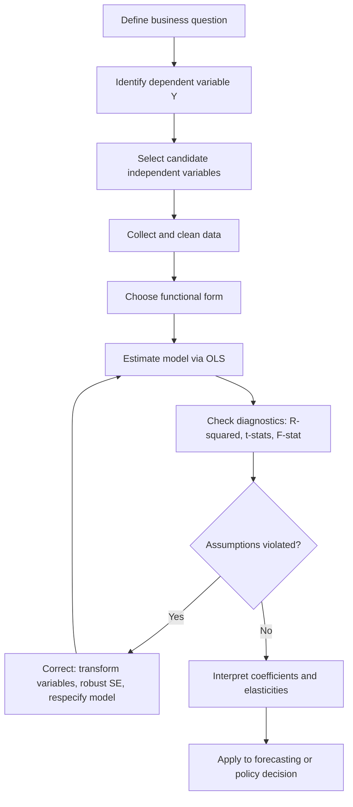

## Regression Analysis Fundamentals for Business Decisions

### Overview

Regression analysis is a statistical technique that estimates the relationship between a dependent variable (the outcome a manager wants to predict or explain) and one or more independent variables (the factors believed to influence that outcome). In managerial economics, regression is the primary tool for converting historical data — sales, costs, demand, pricing — into quantified relationships that support forecasting, demand estimation, cost analysis, and policy evaluation.

**Key Points**

- Regression quantifies both the direction and magnitude of relationships between variables.
- It allows managers to isolate the effect of one variable (e.g., price) while controlling for others (e.g., advertising, income, competitor pricing).
- Output includes point estimates, statistical significance, and measures of overall model fit.

---

### The Simple Linear Regression Model

The simple (bivariate) linear regression model relates one independent variable to one dependent variable:

$$Y_i = \beta_0 + \beta_1 X_i + \varepsilon_i$$

Where:

- $Y_i$ = dependent variable (e.g., quantity demanded)
- $X_i$ = independent variable (e.g., price)
- $\beta_0$ = intercept (value of $Y$ when $X = 0$)
- $\beta_1$ = slope coefficient (change in $Y$ per unit change in $X$)
- $\varepsilon_i$ = error term (captures unobserved influences and randomness)

The estimated regression line, produced from sample data, is written as:

$$\hat{Y}_i = b_0 + b_1 X_i$$

where $b_0$ and $b_1$ are sample estimates of $\beta_0$ and $\beta_1$.

### The Multiple Linear Regression Model

Most business relationships depend on more than one factor. The multiple regression model extends the simple model:

$$Y_i = \beta_0 + \beta_1 X_{1i} + \beta_2 X_{2i} + \dots + \beta_k X_{ki} + \varepsilon_i$$

**Example**

A firm modeling demand for its product might specify:

$$Q_i = \beta_0 + \beta_1 P_i + \beta_2 A_i + \beta_3 I_i + \beta_4 P^C_i + \varepsilon_i$$

Where $Q$ = quantity sold, $P$ = own price, $A$ = advertising expenditure, $I$ = consumer income, and $P^C$ = competitor's price. Each $\beta$ coefficient shows the isolated (ceteris paribus) effect of that variable on quantity, holding the others constant.

---

### Ordinary Least Squares (OLS) Estimation

The most common estimation method is Ordinary Least Squares (OLS), which selects $b_0$ and $b_1$ (and additional $b_k$ values in multiple regression) to minimize the sum of squared residuals — the squared vertical distances between observed data points and the fitted regression line:

$$\min \sum_{i=1}^{n} (Y_i - \hat{Y}_i)^2 = \min \sum_{i=1}^{n} e_i^2$$

where $e_i = Y_i - \hat{Y}_i$ is the residual for observation $i$.

For simple regression, the closed-form OLS estimators are:

$$b_1 = \frac{\sum (X_i - \bar{X})(Y_i - \bar{Y})}{\sum (X_i - \bar{X})^2}$$

$$b_0 = \bar{Y} - b_1\bar{X}$$

**Example (worked calculation)**

| Month | Advertising ($000), $X$ | Sales ($000), $Y$ |
| --- | --- | --- |
| 1 | 10 | 100 |
| 2 | 15 | 120 |
| 3 | 20 | 150 |
| 4 | 25 | 170 |
| 5 | 30 | 200 |

$\bar{X} = 20$, $\bar{Y} = 148$

$\sum (X_i - \bar{X})(Y_i - \bar{Y}) = (-10)(-48) + (-5)(-28) + (0)(2) + (5)(22) + (10)(52) = 480+140+0+110+520 = 1250$

$\sum (X_i - \bar{X})^2 = 100+25+0+25+100 = 250$

$b_1 = 1250/250 = 5$

$b_0 = 148 - 5(20) = 48$

Estimated model: $\hat{Y} = 48 + 5X$ — each additional $1,000 of advertising is associated with $5,000 more in sales, holding other factors constant [as observed in this sample; causal interpretation requires additional assumptions].

---

### Assumptions of the Classical Linear Regression Model (CLRM)

For OLS estimates to be reliable (Best Linear Unbiased Estimators, per the Gauss-Markov theorem), several assumptions should hold:

1. **Linearity** — the relationship between $X$ and $Y$ is linear in parameters.
2. **Zero conditional mean** — $E(\varepsilon_i | X_i) = 0$; the error term is uncorrelated with the independent variables.
3. **Homoskedasticity** — the variance of the error term is constant across all levels of $X$.
4. **No autocorrelation** — error terms are not correlated across observations (especially relevant in time-series data).
5. **No perfect multicollinearity** — independent variables are not exact linear combinations of one another.
6. **Normality of errors** — errors are normally distributed (needed for valid hypothesis testing in small samples).

**Key Points**

- Violations of these assumptions do not necessarily bias coefficient estimates but often bias standard errors, which distorts hypothesis tests.
- Managers should treat regression output cautiously if diagnostic checks (discussed below) suggest violations.

---

### Evaluating Model Fit and Significance

**Coefficient of Determination ($R^2$)**

$R^2$ measures the proportion of variation in $Y$ explained by the model:

$$R^2 = 1 - \frac{SSR}{SST} = \frac{SSE}{SST}$$

Where $SST$ = total sum of squares, $SSE$ = explained sum of squares, $SSR$ = residual (unexplained) sum of squares. $R^2$ ranges from 0 to 1; higher values indicate the model explains more variation, though a high $R^2$ does not by itself confirm a correct or causal model [Inference: interpretation depends on context, since $R^2$ can be inflated by adding variables regardless of true relevance].

**Adjusted $R^2$** penalizes the addition of variables that do not meaningfully improve fit, making it more appropriate for comparing models with different numbers of predictors:

$$\bar{R}^2 = 1 - (1 - R^2)\frac{n-1}{n-k-1}$$

**t-tests for Individual Coefficients**

Each coefficient's statistical significance is tested using:

$$t = \frac{b_j - 0}{SE(b_j)}$$

compared against a critical t-value at a chosen significance level (commonly $\alpha = 0.05$). If the calculated $|t|$ exceeds the critical value (or the p-value is below $\alpha$), the coefficient is statistically significant — meaning it is unlikely to be zero in the true population relationship.

**F-test for Overall Significance**

The F-test evaluates whether the model as a whole has explanatory power:

$$F = \frac{R^2/k}{(1-R^2)/(n-k-1)}$$

A significant F-statistic indicates that at least one independent variable meaningfully explains variation in $Y$.

---

### Interpreting Coefficients for Managerial Use

| Element | Interpretation |
| --- | --- |
| Sign of $b_j$ | Direction of relationship (positive/negative) |
| Magnitude of $b_j$ | Unit change in $Y$ per unit change in $X_j$, holding other variables constant |
| p-value | Probability of observing this result (or more extreme) if the true coefficient were zero |
| Confidence Interval | Range within which the true coefficient likely falls (e.g., 95% CI) |
| Elasticity (derived) | $\% \Delta Y / \% \Delta X$, often computed at means: $E = b_j \cdot (\bar{X}/\bar{Y})$ |

**Example**

If a demand regression yields $b_1 = -4.5$ for price with $\bar{P} = 10$ and $\bar{Q} = 200$:

$$E_P = -4.5 \times (10/200) = -0.225$$

This indicates inelastic demand — a 1% price increase is associated with only a 0.225% decrease in quantity demanded, suggesting a price increase would raise total revenue [Inference: assumes the regression correctly isolates the price effect and other conditions remain stable].

---

### Common Problems in Business Regression Applications

**Multicollinearity**

Occurs when independent variables are highly correlated with each other, inflating standard errors and making individual coefficients unstable or statistically insignificant despite a strong overall model fit. Detected using the Variance Inflation Factor (VIF); values above 10 are commonly treated as concerning.

**Heteroskedasticity**

Occurs when the variance of residuals is not constant (e.g., variance in sales forecasts grows with firm size). Detected visually via residual plots or formally via the Breusch-Pagan or White tests. Addressed using robust standard errors or variable transformation (e.g., logarithms).

**Autocorrelation**

Common in time-series business data (e.g., quarterly sales), where residuals in one period correlate with residuals in another. Detected using the Durbin-Watson statistic (values near 2 indicate no autocorrelation). Addressed with lagged variables or generalized least squares.

**Specification Error**

Occurs when relevant variables are omitted, irrelevant variables are included, or the functional form is incorrect (e.g., using a linear form for a relationship that is actually curvilinear).

**Key Points**

- These are diagnostic issues, not necessarily reasons to discard a model, but they affect how confidently a manager should act on the results.

---

### Functional Forms Used in Business Regression

| Form | Equation | Use Case |
| --- | --- | --- |
| Linear | $Y = b_0 + b_1X$ | Constant marginal effect |
| Log-Linear (semi-log) | $\ln Y = b_0 + b_1X$ | Constant % change in $Y$ per unit $X$ |
| Log-Log | $\ln Y = b_0 + b_1 \ln X$ | Constant elasticity models (common in demand estimation); $b_1$ is directly interpreted as elasticity |
| Quadratic | $Y = b_0 + b_1X + b_2X^2$ | Diminishing/increasing marginal effects, e.g., cost curves |
| Reciprocal | $Y = b_0 + b_1(1/X)$ | Effects that approach an asymptote |

**Example**

A log-log demand model, $\ln Q = b_0 + b_1 \ln P$, estimated with $b_1 = -1.3$, means the coefficient itself is the price elasticity of demand: a 1% increase in price is associated with a 1.3% decrease in quantity demanded (elastic demand).

---

### Process Flow for Applying Regression to a Business Decision

---

### Applications in Managerial Economics

- **Demand estimation** — quantifying how price, income, advertising, and competitor actions affect sales.
- **Cost estimation** — regressing total cost against output to estimate marginal and average cost functions.
- **Sales forecasting** — using historical trends and leading indicators to project future revenue.
- **Production function estimation** — relating output to labor and capital inputs (e.g., Cobb-Douglas specifications estimated via log-log regression).
- **Policy and program evaluation** — assessing the impact of a marketing campaign, price change, or operational intervention using before/after or control-variable regression designs.

---

### Regression Output Structure (Illustrative)

<svg xmlns="http://www.w3.org/2000/svg" viewBox="0 0 760 340" font-family="Arial, sans-serif">
<rect x="0" y="0" width="760" height="340" fill="#ffffff" stroke="#333333" stroke-width="1" />
<text x="20" y="28" font-size="16" font-weight="bold" fill="#111111">Regression Output Structure (svg_diagram)</text>
<rect x="20" y="45" width="720" height="30" fill="#e8eef7" stroke="#333333" />
<text x="30" y="65" font-size="13" font-weight="bold" fill="#111111">Variable</text>
<text x="230" y="65" font-size="13" font-weight="bold" fill="#111111">Coefficient</text>
<text x="380" y="65" font-size="13" font-weight="bold" fill="#111111">Std. Error</text>
<text x="510" y="65" font-size="13" font-weight="bold" fill="#111111">t-stat</text>
<text x="620" y="65" font-size="13" font-weight="bold" fill="#111111">p-value</text>
<rect x="20" y="75" width="720" height="28" fill="#ffffff" stroke="#cccccc" />
<text x="30" y="94" font-size="12" fill="#111111">Intercept</text>
<text x="230" y="94" font-size="12" fill="#111111">48.00</text>
<text x="380" y="94" font-size="12" fill="#111111">6.21</text>
<text x="510" y="94" font-size="12" fill="#111111">7.73</text>
<text x="620" y="94" font-size="12" fill="#111111">0.005</text>
<rect x="20" y="103" width="720" height="28" fill="#f5f5f5" stroke="#cccccc" />
<text x="30" y="122" font-size="12" fill="#111111">Advertising (X)</text>
<text x="230" y="122" font-size="12" fill="#111111">5.00</text>
<text x="380" y="122" font-size="12" fill="#111111">0.29</text>
<text x="510" y="122" font-size="12" fill="#111111">17.24</text>
<text x="620" y="122" font-size="12" fill="#111111">0.0004</text>
<rect x="20" y="145" width="720" height="26" fill="#ffffff" />
<text x="30" y="163" font-size="12" fill="#111111">R-squared = 0.990</text>
<text x="300" y="163" font-size="12" fill="#111111">Adjusted R-squared = 0.987</text>
<text x="580" y="163" font-size="12" fill="#111111">F-stat = 297.3</text>
<line x1="20" y1="185" x2="740" y2="185" stroke="#999999" stroke-dasharray="4,4" />
<text x="20" y="205" font-size="12" fill="#555555">Interpretation:</text>
<text x="20" y="225" font-size="12" fill="#333333">- Intercept: baseline sales when advertising = 0 (\$48,000)</text>
<text x="20" y="245" font-size="12" fill="#333333">- Slope: each \$1,000 in advertising associated with \$5,000 higher sales</text>
<text x="20" y="265" font-size="12" fill="#333333">- Both coefficients statistically significant at p &lt; 0.01</text>
<text x="20" y="285" font-size="12" fill="#333333">- Model explains 99% of variation in sales in this sample</text>
<text x="20" y="315" font-size="11" fill="#888888">Note: illustrative output based on the worked example above</text>
</svg>

---

### Limitations and Cautions for Managerial Use

- **Correlation vs. causation** — regression identifies statistical association; establishing causation requires theoretical justification, controlled experimentation, or quasi-experimental designs (e.g., difference-in-differences, instrumental variables).
- **Extrapolation risk** — predictions outside the observed range of the data (e.g., forecasting sales at advertising levels far beyond historical spending) carry higher uncertainty. [Inference: reliability degrades outside the sampled range, though the degree varies by context]
- **Sample size and data quality** — small samples reduce statistical power and reliability of estimates.
- **Structural change** — coefficients estimated from historical data may not hold if market conditions, competitors, or regulations change materially. [Unverified: whether a specific structural break has occurred requires testing, e.g., a Chow test]
- **Model behavior may vary** by software package, data preprocessing choices, and specification; managers should treat regression output as decision support rather than a guaranteed prediction.

---

**Related Topics**

- Multiple regression and dummy (categorical) variables
- Demand estimation and elasticity analysis
- Time-series forecasting (trend, seasonal, and moving average models)
- Cost function estimation (short-run and long-run)
- Hypothesis testing and confidence intervals in business statistics
- Multicollinearity diagnostics and remedies (VIF, ridge regression)
- Experimental and quasi-experimental methods (A/B testing, instrumental variables)
- Logistic regression for binary business outcomes (e.g., customer churn)