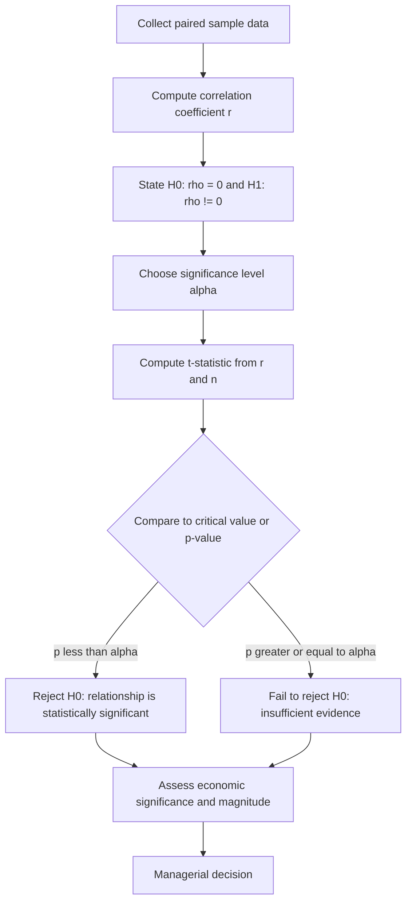

## Correlation, Hypothesis Testing, and Statistical Significance in Economic Analysis

### Overview and Managerial Relevance

Managers routinely face questions of the form: *Is advertising spend related to sales?* *Did the new pricing policy actually reduce churn, or did churn fall by chance?* *Is the observed difference between two suppliers' defect rates real or noise?* Correlation analysis and hypothesis testing are the core statistical tools that let a manager move from raw data to a defensible claim about relationships and effects, while explicitly quantifying the risk of being wrong.

These tools sit at the intersection of descriptive statistics (summarizing what happened) and inferential statistics (generalizing from a sample to a population or a data-generating process). In managerial economics, they underpin demand estimation, cost analysis, quality control, marketing effectiveness studies, and policy evaluation.

---

### Correlation Analysis

#### Definition and Intuition

Correlation measures the strength and direction of a **linear** association between two variables. It does not measure causation, nonlinear relationships, or the magnitude of change in real units — only how consistently two variables move together in a standardized sense.

#### Pearson Correlation Coefficient

The most common measure is the Pearson product-moment correlation coefficient, $r$:

$$r = \frac{\sum_{i=1}^{n}(x_i - \bar{x})(y_i - \bar{y})}{\sqrt{\sum_{i=1}^{n}(x_i - \bar{x})^2}\sqrt{\sum_{i=1}^{n}(y_i - \bar{y})^2}}$$

where $x_i$ and $y_i$ are paired observations, and $\bar{x}$, $\bar{y}$ are their sample means.

**Properties:**

- $r$ ranges from $-1$ to $1$
- $r = 1$: perfect positive linear relationship
- $r = -1$: perfect negative linear relationship
- $r = 0$: no linear relationship (nonlinear relationships may still exist)
- $r$ is unitless and symmetric: $r_{xy} = r_{yx}$

**Rule-of-thumb interpretation** (context-dependent, not a hard standard):

| $|r|$ range | Typical interpretation |

|---|---|

| 0.0 – 0.1 | Negligible |

| 0.1 – 0.3 | Weak |

| 0.3 – 0.5 | Moderate |

| 0.5 – 0.7 | Strong |

| 0.7 – 1.0 | Very strong |

[Inference] These bands are conventions from behavioral and social sciences; in economics and finance, correlations of 0.3–0.4 are often considered practically significant given noisy data, so thresholds should be interpreted relative to the field and data-generating context.

#### Worked Example

A firm collects monthly data on advertising expenditure ($X$, in $000s) and sales revenue ($Y$, in $000s) for 6 months:

| Month | $X$ | $Y$ |
| --- | --- | --- |
| 1 | 10 | 100 |
| 2 | 15 | 130 |
| 3 | 12 | 110 |
| 4 | 20 | 160 |
| 5 | 18 | 150 |
| 6 | 25 | 190 |

$\bar{x} = 16.67$, $\bar{y} = 140$

Computing deviations, products, and squares yields (abbreviated):

$$\sum(x_i-\bar{x})(y_i-\bar{y}) = 645, \quad \sum(x_i-\bar{x})^2 = 156.7, \quad \sum(y_i-\bar{y})^2 = 5400$$

$$r = \frac{645}{\sqrt{156.7}\sqrt{5400}} = \frac{645}{\sqrt{846180}} \approx \frac{645}{919.9} \approx 0.701$$

**Interpretation:** A strong positive linear association between advertising and sales — but this alone does not establish that advertising *causes* sales increases (see Correlation vs. Causation below).

#### Coefficient of Determination

$$R^2 = r^2$$

$R^2$ represents the proportion of variance in $Y$ "explained" by the linear relationship with $X$. In the example, $R^2 = 0.701^2 \approx 0.491$, meaning approximately 49.1% of the variation in sales is associated with variation in advertising spend (in a simple bivariate sense).

#### Spearman Rank Correlation

When data are ordinal, non-normally distributed, or the relationship is monotonic but not linear, the Spearman rank correlation $\rho$ (rho) is used instead:

$$\rho = 1 - \frac{6\sum d_i^2}{n(n^2-1)}$$

where $d_i$ is the difference between the ranks of paired observations. Spearman's $\rho$ is more robust to outliers and does not assume linearity, only a monotonic relationship.

#### Correlation vs. Causation

**Key Points:**

- Correlation is necessary but not sufficient for causation.
- **Confounding variables**: A third variable may drive both $X$ and $Y$ (e.g., overall economic growth boosting both advertising budgets and sales independently).
- **Reverse causality**: Higher sales may enable higher advertising budgets, rather than advertising driving sales.
- **Spurious correlation**: Two unrelated variables can show high correlation purely by coincidence, especially with small samples or trending time-series data (e.g., non-stationary series that both trend upward over time).
- Establishing causation typically requires controlled experiments (A/B tests), natural experiments, instrumental variables, or well-specified regression models with appropriate controls — topics that extend beyond correlation itself.

---

### Hypothesis Testing Framework

#### Purpose

Hypothesis testing provides a formal procedure to decide whether an observed pattern in sample data (a correlation, a difference in means, an effect estimate) is likely to reflect a genuine feature of the underlying population/process, or could plausibly have arisen from random sampling variation alone.

#### The Five-Step Procedure

**1. State the Hypotheses**

- **Null hypothesis ($H_0$):** The default position of "no effect" or "no relationship." For correlation: $H_0: \rho = 0$ (population correlation is zero).
- **Alternative hypothesis ($H_1$ or $H_a$):** The claim being tested. Can be:
  - Two-tailed: $H_1: \rho \neq 0$
  - One-tailed: $H_1: \rho > 0$ or $H_1: \rho < 0$

**2. Choose a Significance Level ($\alpha$)**

$\alpha$ is the probability of rejecting $H_0$ when it is actually true (Type I error tolerance). Common conventions: $\alpha = 0.05$ (5%), $\alpha = 0.01$ (1%), $\alpha = 0.10$ (10%). The choice reflects how costly a false positive is in the managerial context — e.g., a firm making a costly irreversible investment decision may prefer a stricter $\alpha = 0.01$.

**3. Select and Compute the Test Statistic**

For testing significance of a correlation coefficient, the $t$-statistic is:

$$t = r\sqrt{\frac{n-2}{1-r^2}}$$

with $n-2$ degrees of freedom, where $n$ is the sample size.

Using the advertising example ($r = 0.701$, $n = 6$):

$$t = 0.701\sqrt{\frac{4}{1-0.491}} = 0.701\sqrt{\frac{4}{0.509}} = 0.701\sqrt{7.86} \approx 0.701 \times 2.804 \approx 1.965$$

**4. Determine the Critical Value or p-value**

With $df = 4$ and $\alpha = 0.05$ (two-tailed), the critical $t$-value is approximately $\pm 2.776$.

Since $|1.965| < 2.776$, we **fail to reject** $H_0$ — despite the seemingly strong $r = 0.701$, the sample size is too small to conclude the population correlation is significantly different from zero at the 5% level.

**5. Make a Decision and Interpret**

- If $|t_{calculated}| > t_{critical}$ (or equivalently, $p\text{-value} < \alpha$): reject $H_0$, conclude the relationship is statistically significant.
- If $|t_{calculated}| \leq t_{critical}$ (or $p\text{-value} \geq \alpha$): fail to reject $H_0$; insufficient evidence of a relationship.

**Important:** "Fail to reject $H_0$" is not the same as "proving $H_0$ true" — it simply means the data do not provide sufficient evidence against it, often due to small sample size or high variability.

#### Understanding the p-value

The p-value is the probability of observing a test statistic **at least as extreme** as the one calculated, assuming $H_0$ is true.

**Key Points:**

- A small p-value (e.g., $p < 0.05$) indicates the observed data would be unlikely under $H_0$, supporting rejection.
- The p-value is **not** the probability that $H_0$ is true, nor the probability that the result is due to chance in a general sense — this is one of the most common misinterpretations.
- The p-value depends on sample size: with a large enough $n$, even a trivially small, economically meaningless correlation can become "statistically significant."
- Statistical significance ≠ practical/economic significance. A correlation of $r = 0.05$ might be statistically significant with $n = 10{,}000$ observations but be economically irrelevant for decision-making.

#### Type I and Type II Errors

|  | $H_0$ is actually True | $H_0$ is actually False |
| --- | --- | --- |
| **Reject $H_0$** | Type I Error (probability $\alpha$) — "false positive" | Correct decision (power = $1-\beta$) |
| **Fail to reject $H_0$** | Correct decision | Type II Error (probability $\beta$) — "false negative" |

- **Type I error**: Concluding a relationship/effect exists when it doesn't (e.g., launching a costly marketing campaign based on a spurious correlation).
- **Type II error**: Failing to detect a real relationship/effect (e.g., dismissing an effective pricing strategy due to insufficient sample size).
- **Statistical power** ($1-\beta$): The probability of correctly rejecting a false $H_0$. Power increases with larger sample size, larger true effect size, and higher $\alpha$ (a trade-off against Type I error risk).

There is an inherent trade-off: reducing $\alpha$ (to lower Type I error risk) generally increases $\beta$ (raises Type II error risk), holding sample size constant. This is why sample size planning (power analysis) matters before collecting data for managerial studies.

---

### Confidence Intervals

A confidence interval (CI) provides a range of plausible values for a population parameter, complementing the binary reject/fail-to-reject decision of hypothesis testing.

For a correlation coefficient, an approximate 95% CI can be constructed using Fisher's $z$-transformation:

$$z_r = \frac{1}{2}\ln\left(\frac{1+r}{1-r}\right)$$

The standard error of $z_r$ is $SE = \frac{1}{\sqrt{n-3}}$, and the CI in $z$-space is $z_r \pm 1.96 \times SE$, which is then transformed back to the $r$ scale using the inverse transformation.

**Interpretation:** A 95% CI means that if the sampling process were repeated many times, approximately 95% of such intervals would contain the true population correlation. It does **not** mean there is a 95% probability the true value lies in this specific interval (a common but technically imprecise interpretation, though widely used in applied managerial contexts as a practical approximation).

**Practical advantage over p-values alone:** A CI shows both statistical significance (whether it excludes zero) and the plausible magnitude/precision of the effect — critical for managerial decisions where the *size* of an effect (not just its existence) determines whether action is economically worthwhile.

---

### Common Hypothesis Tests in Economic Analysis

#### One-Sample t-test

Tests whether a sample mean differs significantly from a hypothesized population value.

$$t = \frac{\bar{x} - \mu_0}{s/\sqrt{n}}$$

*Example:* Testing whether average customer wait time (sample mean) differs from a claimed service standard of 5 minutes.

#### Two-Sample t-test

Tests whether the means of two independent groups differ significantly.

$$t = \frac{\bar{x}_1 - \bar{x}_2}{\sqrt{\frac{s_1^2}{n_1}+\frac{s_2^2}{n_2}}}$$

*Example:* Comparing average sales performance between two regional branches, or between a treatment group (received discount) and control group.

#### Paired t-test

Tests differences within the same subjects measured at two points in time.

*Example:* Comparing employee productivity before and after a training program.

#### Chi-Square Test of Independence

Tests whether two categorical variables are associated.

$$\chi^2 = \sum \frac{(O_i - E_i)^2}{E_i}$$

*Example:* Testing whether customer satisfaction (satisfied/dissatisfied) is independent of purchase channel (online/in-store).

#### F-test / ANOVA

Tests whether means differ across three or more groups simultaneously.

*Example:* Comparing average output across three production lines using different machinery.

---

### Application to Regression: Significance of Coefficients

Correlation and hypothesis testing generalize directly into regression analysis, a core managerial economics tool for demand estimation and cost prediction. In a simple linear regression:

$$Y = \beta_0 + \beta_1 X + \varepsilon$$

The hypothesis test on the slope coefficient $H_0: \beta_1 = 0$ (no linear relationship) uses:

$$t = \frac{\hat{\beta}_1 - 0}{SE(\hat{\beta}_1)}$$

This is mathematically related to the correlation significance test above — in simple bivariate regression, the $t$-statistic for $\beta_1$ is identical to the $t$-statistic for testing $r$. This connects correlation analysis directly to demand forecasting, cost function estimation, and elasticity calculations covered elsewhere in quantitative managerial tools.

---

### Process Flow Diagram

---

### Common Pitfalls in Managerial Practice

**Key Points:**

- **Data mining / multiple comparisons**: Testing many variable pairs increases the chance of finding a "significant" result purely by chance (at $\alpha = 0.05$, roughly 1 in 20 tests will show significance even when $H_0$ is true for all).
- **Ecological fallacy**: Applying aggregate-level correlations (e.g., across regions) to conclusions about individual-level behavior.
- **Non-stationarity in time-series**: Two economic time series that both trend over time (e.g., GDP and stock market index) can show high but spurious correlation.
- **Outlier sensitivity**: Pearson's $r$ is highly sensitive to outliers; a single extreme data point can substantially inflate or deflate the coefficient.
- **Sample size and power**: Small samples (as in the worked example) can produce seemingly large $r$ values that are not statistically distinguishable from zero, while very large samples can make trivial correlations "significant."
- **Assuming significance implies actionability**: A statistically significant relationship does not automatically justify a costly managerial intervention; the effect size and cost-benefit analysis must also be considered.

---

### Illustrative Diagram: Correlation Patterns (svg_diagram)

<svg xmlns="http://www.w3.org/2000/svg" viewBox="0 0 780 260">
\<style\>
.lbl { font-family: sans-serif; font-size: 13px; fill: #333; text-anchor: middle; }
.pt { fill: #2563eb; }
.axis { stroke: #999; stroke-width: 1; }
\</style\>
<text x="390" y="20" class="lbl" font-size="15" font-weight="bold">Correlation Patterns (svg_diagram)</text>

<line x1="40" y1="110" x2="220" y2="110" class="axis" />
<line x1="40" y1="30" x2="40" y2="110" class="axis" />
<circle cx="55" cy="100" r="3" class="pt" /><circle cx="75" cy="95" r="3" class="pt" />
<circle cx="95" cy="85" r="3" class="pt" /><circle cx="115" cy="75" r="3" class="pt" />
<circle cx="135" cy="70" r="3" class="pt" /><circle cx="155" cy="60" r="3" class="pt" />
<circle cx="175" cy="50" r="3" class="pt" /><circle cx="195" cy="40" r="3" class="pt" />
<text x="130" y="135" class="lbl">Strong Positive (r ≈ 0.9)</text>

<line x1="300" y1="110" x2="480" y2="110" class="axis" />
<line x1="300" y1="30" x2="300" y2="110" class="axis" />
<circle cx="315" cy="40" r="3" class="pt" /><circle cx="335" cy="50" r="3" class="pt" />
<circle cx="355" cy="60" r="3" class="pt" /><circle cx="375" cy="70" r="3" class="pt" />
<circle cx="395" cy="75" r="3" class="pt" /><circle cx="415" cy="85" r="3" class="pt" />
<circle cx="435" cy="95" r="3" class="pt" /><circle cx="455" cy="100" r="3" class="pt" />
<text x="390" y="135" class="lbl">Strong Negative (r ≈ -0.9)</text>

<line x1="560" y1="110" x2="740" y2="110" class="axis" />
<line x1="560" y1="30" x2="560" y2="110" class="axis" />
<circle cx="575" cy="70" r="3" class="pt" /><circle cx="595" cy="45" r="3" class="pt" />
<circle cx="615" cy="90" r="3" class="pt" /><circle cx="635" cy="55" r="3" class="pt" />
<circle cx="655" cy="95" r="3" class="pt" /><circle cx="675" cy="40" r="3" class="pt" />
<circle cx="695" cy="80" r="3" class="pt" /><circle cx="715" cy="60" r="3" class="pt" />
<text x="650" y="135" class="lbl">No Correlation (r ≈ 0)</text>

<line x1="150" y1="230" x2="330" y2="230" class="axis" />
<line x1="150" y1="150" x2="150" y2="230" class="axis" />
<circle cx="160" cy="220" r="3" class="pt" /><circle cx="180" cy="190" r="3" class="pt" />
<circle cx="200" cy="165" r="3" class="pt" /><circle cx="220" cy="155" r="3" class="pt" />
<circle cx="240" cy="160" r="3" class="pt" /><circle cx="260" cy="175" r="3" class="pt" />
<circle cx="280" cy="200" r="3" class="pt" /><circle cx="300" cy="222" r="3" class="pt" />
<text x="240" y="250" class="lbl">Nonlinear Relationship (r ≈ 0, but related)</text>

<line x1="450" y1="230" x2="630" y2="230" class="axis" />
<line x1="450" y1="150" x2="450" y2="230" class="axis" />
<circle cx="465" cy="215" r="3" class="pt" /><circle cx="485" cy="205" r="3" class="pt" />
<circle cx="505" cy="200" r="3" class="pt" /><circle cx="525" cy="195" r="3" class="pt" />
<circle cx="545" cy="190" r="3" class="pt" /><circle cx="565" cy="185" r="3" class="pt" />
<circle cx="585" cy="180" r="3" class="pt" />
<circle cx="615" cy="160" r="4" fill="#dc2626" />
<text x="540" y="250" class="lbl">Moderate Trend + Outlier (red)</text>
</svg>

---

### Summary Table: Key Formulas

| Concept | Formula |
| --- | --- |
| Pearson correlation | $r = \dfrac{\sum(x_i-\bar{x})(y_i-\bar{y})}{\sqrt{\sum(x_i-\bar{x})^2}\sqrt{\sum(y_i-\bar{y})^2}}$ |
| Coefficient of determination | $R^2 = r^2$ |
| t-statistic for correlation | $t = r\sqrt{\dfrac{n-2}{1-r^2}}$, $df = n-2$ |
| One-sample t-test | $t = \dfrac{\bar{x}-\mu_0}{s/\sqrt{n}}$ |
| Two-sample t-test | $t = \dfrac{\bar{x}_1-\bar{x}_2}{\sqrt{s_1^2/n_1 + s_2^2/n_2}}$ |
| Chi-square statistic | $\chi^2 = \sum \dfrac{(O_i-E_i)^2}{E_i}$ |
| Fisher's z-transform | $z_r = \dfrac{1}{2}\ln\left(\dfrac{1+r}{1-r}\right)$ |

---

**Related Topics**

- Simple and multiple linear regression for demand estimation
- Multicollinearity and its effect on coefficient significance
- Time-series analysis and autocorrelation (Durbin-Watson test)
- Elasticity estimation from regression coefficients
- Experimental design and A/B testing for causal inference
- Confidence intervals and margin of error in sampling
- Analysis of Variance (ANOVA) for comparing multiple groups
- Non-parametric statistical methods (Mann-Whitney U, Kruskal-Wallis)
- Bayesian inference as an alternative to frequentist hypothesis testing