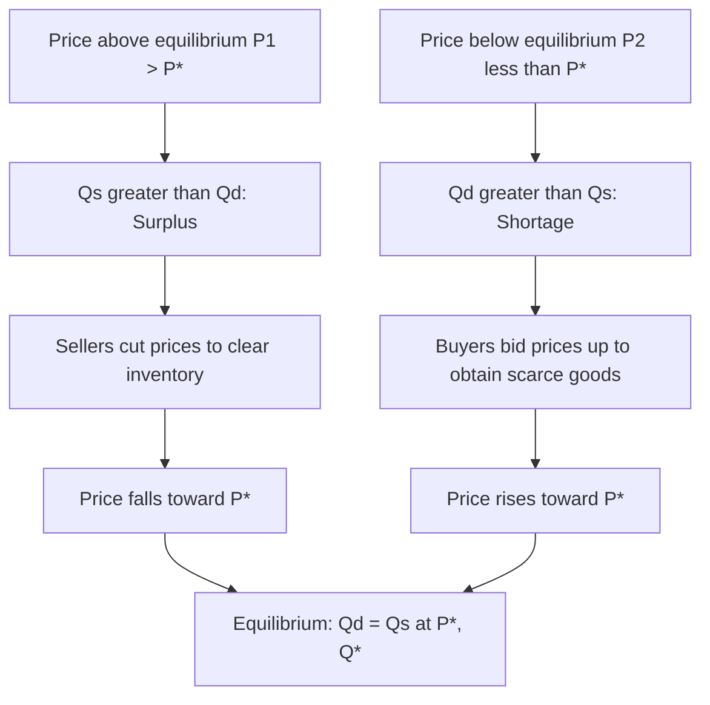

## Demand, Supply, and the Determination of Market Equilibrium

### Overview

Market equilibrium theory explains how the independent decisions of buyers (demand) and sellers (supply) interact through the price mechanism to determine the quantity and price at which a good or service is traded in a competitive market. This is the foundational model of price theory and underlies virtually all subsequent managerial economics analysis, from pricing strategy to policy impact assessment.

---

### The Demand Side

#### Law of Demand

The law of demand states that, ceteris paribus (all else held constant), the quantity demanded of a good is inversely related to its price. As price rises, quantity demanded falls; as price falls, quantity demanded rises.

**Reasons underlying the law of demand:**

- **Substitution effect**: As a good becomes relatively more expensive, consumers substitute toward cheaper alternatives.
- **Income effect**: A price increase reduces real purchasing power, leading consumers to buy less of the good (assuming it is a normal good).
- **Diminishing marginal utility**: Each additional unit of a good yields less additional satisfaction, so consumers are willing to pay progressively less for successive units.

#### The Demand Function and Demand Curve

A generalized demand function can be written as:

$$Q_d = f(P, P_s, P_c, Y, T, E, N)$$

where:

- $Q_d$ = quantity demanded
- $P$ = price of the good itself
- $P_s$ = price of substitute goods
- $P_c$ = price of complementary goods
- $Y$ = consumer income
- $T$ = consumer tastes/preferences
- $E$ = consumer expectations (about future prices or income)
- $N$ = number of buyers in the market

A simplified linear demand function isolating price:

$$Q_d = a - bP$$

where $a > 0$ is the intercept (quantity demanded at zero price) and $b > 0$ reflects the responsiveness of quantity demanded to price. The demand curve is the graphical representation of this function, plotted with price on the vertical axis and quantity on the horizontal axis (following the Marshallian convention, even though price is mathematically the independent variable), sloping downward.

#### Movement Along vs. Shift of the Demand Curve

**Key Points:**

- A **change in quantity demanded** (movement along the curve) occurs only due to a change in the good's own price.
- A **change in demand** (shift of the entire curve) occurs due to changes in any non-price determinant:
  - Increase in income → demand shifts right (for normal goods) or left (for inferior goods)
  - Increase in price of a substitute → demand shifts right
  - Increase in price of a complement → demand shifts left
  - Favorable shift in tastes → demand shifts right
  - Expectation of future price increases → current demand shifts right

---

### The Supply Side

#### Law of Supply

The law of supply states that, ceteris paribus, the quantity supplied of a good is directly (positively) related to its price. As price rises, producers are willing and able to supply more; as price falls, they supply less.

**Reasons underlying the law of supply:**

- Higher prices increase the profitability of production, incentivizing firms to expand output.
- Higher prices allow firms to justify higher marginal costs of production (e.g., overtime labor, less efficient capacity).
- New firms may be incentivized to enter the market at higher price levels.

#### The Supply Function and Supply Curve

$$Q_s = g(P, P_i, T_e, P_r, E_p, N_f)$$

where:

- $Q_s$ = quantity supplied
- $P$ = price of the good itself
- $P_i$ = prices of inputs/factors of production
- $T_e$ = state of technology
- $P_r$ = prices of related goods (in production, e.g., substitutes in production)
- $E_p$ = producer expectations
- $N_f$ = number of firms in the market

Simplified linear supply function:

$$Q_s = c + dP$$

where $c$ can be negative (representing a minimum price below which no supply occurs) and $d > 0$ reflects the responsiveness of quantity supplied to price.

#### Movement Along vs. Shift of the Supply Curve

**Key Points:**

- A **change in quantity supplied** (movement along the curve) occurs only due to a change in the good's own price.
- A **change in supply** (shift of the entire curve) occurs due to:
  - Decrease in input costs → supply shifts right
  - Technological improvement → supply shifts right
  - Increase in number of firms → supply shifts right
  - Negative supply shock (e.g., raw material shortage) → supply shifts left
  - Higher expected future prices → current supply may shift left (producers withhold supply to sell later)

---

### Market Equilibrium

#### Definition

Market equilibrium occurs at the price and quantity where quantity demanded equals quantity supplied — where the demand and supply curves intersect. At this point, there is no inherent tendency for price or quantity to change, absent an external shock.

$$Q_d = Q_s$$

#### Algebraic Determination

Given:

$$Q_d = a - bP \qquad Q_s = c + dP$$

Setting $Q_d = Q_s$:

$$a - bP^* = c + dP^*$$

$$a - c = bP^* + dP^*$$

$$P^* = \frac{a-c}{b+d}$$

Substituting back to find equilibrium quantity:

$$Q^* = a - bP^* = a - b\left(\frac{a-c}{b+d}\right)$$

#### Worked Numerical Example

Given:

$$Q_d = 100 - 4P \qquad Q_s = -20 + 6P$$

Setting equal:

$$100 - 4P = -20 + 6P$$

$$120 = 10P$$

$$P^* = 12$$

Substituting into either equation:

$$Q^* = 100 - 4(12) = 100 - 48 = 52$$

**Verification via supply:** $Q_s = -20 + 6(12) = -20 + 72 = 52$ ✓

**Equilibrium: $P^* = 12$, $Q^* = 52$ units.**

---

### Market Adjustment: Surplus and Shortage

#### Surplus (Excess Supply)

If the market price $P_1$ is set above equilibrium ($P_1 > P^*$), quantity supplied exceeds quantity demanded at that price, creating a **surplus**:

$$Q_s(P_1) > Q_d(P_1)$$

Sellers respond to unsold inventory by lowering prices, which increases quantity demanded and decreases quantity supplied, moving the market back toward $P^*$.

#### Shortage (Excess Demand)

If the market price $P_2$ is set below equilibrium ($P_2 < P^*$), quantity demanded exceeds quantity supplied, creating a **shortage**:

$$Q_d(P_2) > Q_s(P_2)$$

Buyers competing for scarce goods bid prices upward, which decreases quantity demanded and increases quantity supplied, moving the market back toward $P^*$.

**Example using the numerical model above:** At $P_1 = 15$ (above equilibrium): $Q_d = 100-4(15) = 40$; $Q_s = -20+6(15) = 70$. Surplus = $70 - 40 = 30$ units, exerting downward pressure on price.

At $P_2 = 10$ (below equilibrium): $Q_d = 100-4(10)=60$; $Q_s=-20+6(10)=40$. Shortage = $60-40=20$ units, exerting upward pressure on price.

#### Stability of Equilibrium

This self-correcting tendency (price gravitating toward $P^*$ from either direction) reflects what is often called the "invisible hand" mechanism, formalized in economics as Walrasian price adjustment: excess demand raises price, excess supply lowers price, until markets clear. [Inference] Whether real-world markets converge quickly, slowly, or exhibit cobweb-style oscillation depends on the relative elasticities of supply and demand and the speed of information transmission, which varies substantially by market structure and is not guaranteed by the basic model.

---

### Diagrammatic Representation

---

### Comparative Statics: Shifts in Demand and Supply

Comparative statics analyzes how equilibrium price and quantity change when the underlying determinants of demand or supply shift.

| Shift | Effect on $P^*$ | Effect on $Q^*$ |
| --- | --- | --- |
| Demand increases (shifts right), supply constant | Increases | Increases |
| Demand decreases (shifts left), supply constant | Decreases | Decreases |
| Supply increases (shifts right), demand constant | Decreases | Increases |
| Supply decreases (shifts left), demand constant | Increases | Decreases |
| Both demand and supply increase | Increases | Ambiguous (net effect on $P^*$ direction) |
| Demand increases, supply decreases | Increases | Ambiguous |

**Note:** When both curves shift simultaneously, the effect on one variable (price or quantity) is often determinable while the effect on the other is ambiguous without knowing the relative magnitudes of the shifts.

#### Worked Example: Demand Shock

Using the earlier model, suppose a favorable shift in consumer tastes increases demand to:

$$Q_d' = 130 - 4P$$

(intercept increased from 100 to 130, same slope). New equilibrium:

$$130 - 4P = -20 + 6P$$

$$150 = 10P \implies P^{*\prime} = 15$$

$$Q^{*\prime} = 130 - 4(15) = 70$$

Both equilibrium price (from 12 to 15) and equilibrium quantity (from 52 to 70) rise — consistent with the comparative statics table above.

---

### Illustration: Supply and Demand Equilibrium (svg_diagram)

<svg xmlns="http://www.w3.org/2000/svg" viewBox="0 0 500 400">
\<style\>
.axis-line { stroke: #333; stroke-width: 2; }
.demand-line { stroke: #2563eb; stroke-width: 2.5; fill: none; }
.supply-line { stroke: #dc2626; stroke-width: 2.5; fill: none; }
.dash { stroke: #888; stroke-width: 1; stroke-dasharray: 4,4; }
.lbl { font-family: sans-serif; font-size: 14px; fill: #222; }
.title { font-family: sans-serif; font-size: 16px; font-weight: bold; fill: #111; text-anchor: middle; }
.pt { fill: #16a34a; }
\</style\>
<text x="250" y="25" class="title">Demand and Supply Equilibrium (svg_diagram)</text>

<line x1="60" y1="350" x2="460" y2="350" class="axis-line" />
<line x1="60" y1="350" x2="60" y2="50" class="axis-line" />
<text x="470" y="355" class="lbl">Q</text>
<text x="45" y="45" class="lbl">P</text>

<path d="M 80 70 L 420 330" class="demand-line" />
<text x="415" y="345" class="lbl" fill="#2563eb">Demand (D)</text>

<path d="M 110 330 L 400 80" class="supply-line" />
<text x="405" y="75" class="lbl" fill="#dc2626">Supply (S)</text>

<circle cx="255" cy="205" r="5" class="pt" />
<line x1="255" y1="205" x2="255" y2="350" class="dash" />
<line x1="60" y1="205" x2="255" y2="205" class="dash" />
<text x="260" y="200" class="lbl" font-weight="bold">E</text>
<text x="235" y="370" class="lbl">Q*</text>
<text x="30" y="210" class="lbl">P*</text>
</svg>

---

### Elasticity's Role in Equilibrium Adjustment

The speed and magnitude of price/quantity adjustment following a shift depend on the price elasticity of demand and supply:

- **Inelastic demand or supply** (steep curves): A given shift produces a larger change in equilibrium price relative to quantity.
- **Elastic demand or supply** (flat curves): A given shift produces a larger change in equilibrium quantity relative to price.

[Inference] This relationship is a direct mathematical consequence of curve slope in the linear model but is frequently underemphasized in introductory treatments; the practical managerial implication is that firms operating in inelastic markets (e.g., necessities) should expect demand or supply shocks to translate primarily into price volatility, while firms in elastic markets should expect volume volatility.

---

### Government Intervention in Equilibrium (Brief Application)

Price controls prevent markets from reaching the natural equilibrium:

- **Price ceiling** (maximum legal price, set below $P^*$): Creates a persistent shortage, since the price cannot rise to clear the market. Common examples include rent control.
- **Price floor** (minimum legal price, set above $P^*$): Creates a persistent surplus, since the price cannot fall to clear the market. Common examples include minimum wage laws and agricultural price supports.

Both interventions prevent the self-correcting mechanism described earlier, and their sustained effects (shortages or surpluses) persist as long as the control remains binding.

---

### Common Pitfalls and Misconceptions

**Key Points:**

- Confusing "change in demand" with "change in quantity demanded" — a very common source of error in exam and applied settings.
- Assuming demand and supply curves are always linear — real-world curves are often nonlinear, and linear approximations are a simplifying pedagogical device valid mainly over a limited price range.
- Treating "ceteris paribus" as an unrealistic constraint rather than an analytical tool — it isolates one variable's effect at a time so multiple simultaneous changes can be decomposed and understood individually before being combined.
- Assuming equilibrium is a static, permanent outcome rather than a moving target that shifts continuously as underlying market conditions evolve.

---

**Related Topics**

- Price elasticity of demand and supply
- Consumer and producer surplus, and deadweight loss
- Market structures: perfect competition, monopoly, oligopoly, monopolistic competition
- Effects of taxes and subsidies on market equilibrium
- Price ceilings, price floors, and black markets
- General equilibrium vs. partial equilibrium analysis
- Dynamic equilibrium models (cobweb model)
- Demand and supply estimation using regression analysis